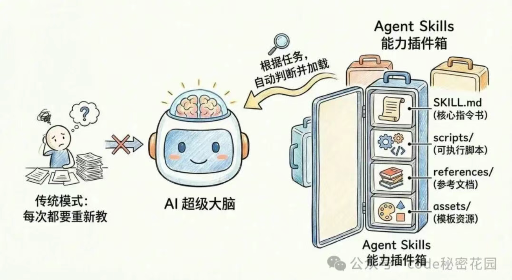
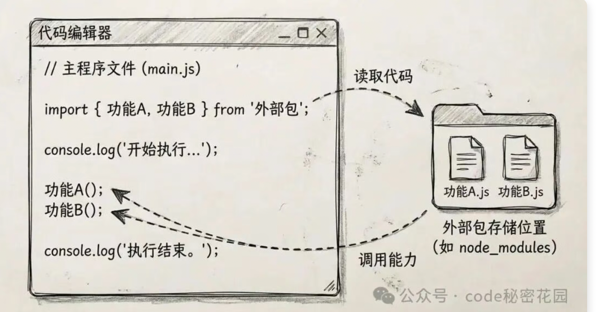
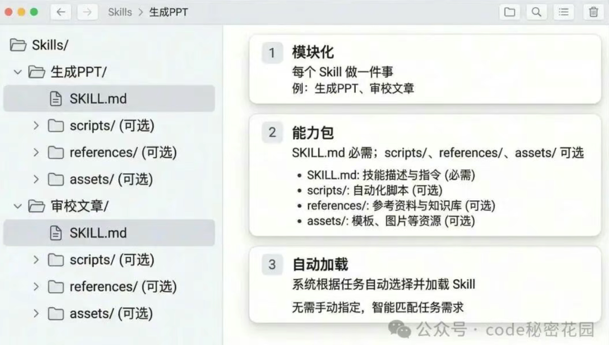
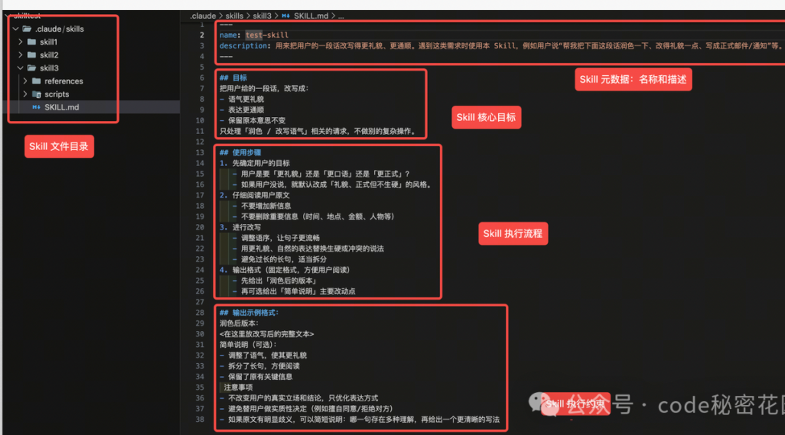
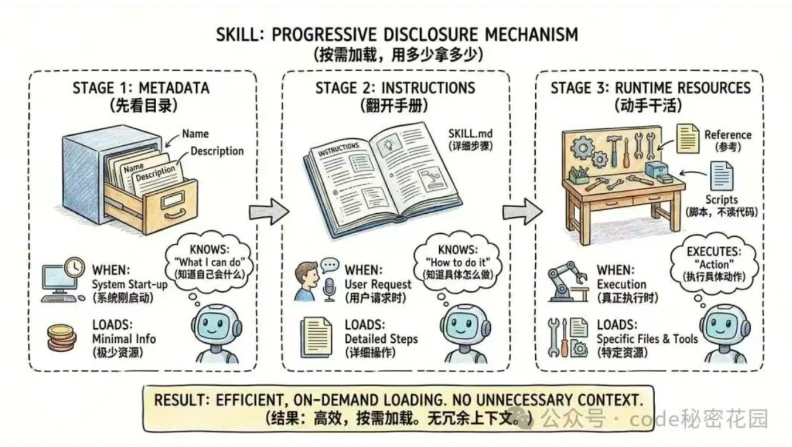
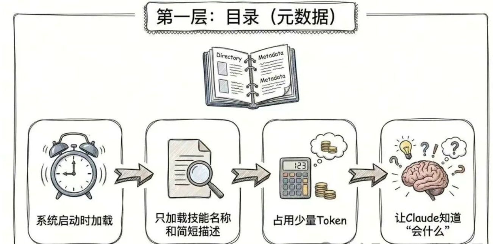
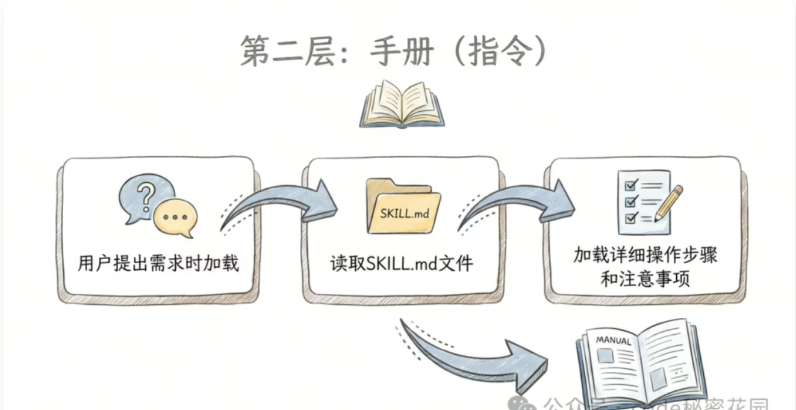
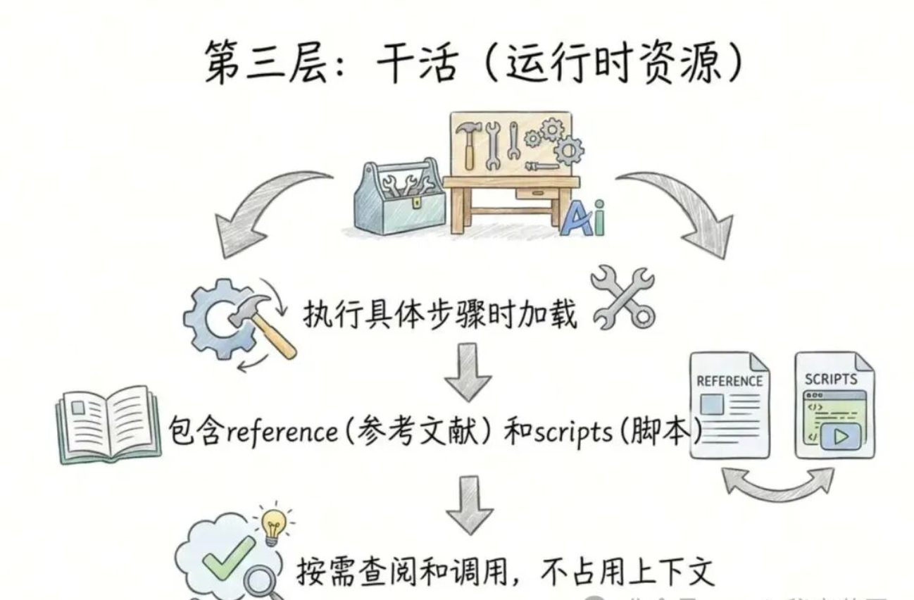

### Agent Skills 完全指南：从原理到实战彻底搞懂！

>> Agent Skills 最近非常的火，它是既 MCP 后 Anthropic 推出的又一个 Agent 领域的行业标准

>> 它的成长路线和 MCP 也非常像，25 年 10 月份发布时只有 Anthropic 自家产品支持，后来 Cursor、Codex、Opencode、Gemini CLI 等产品看到了 Skills 的优势于是纷纷开始支持。

> > 再后来社区开始涌现大量的开源 Skills 以及 Skills 开放市场，当下大家已经默认 Skills 成为了又一个扩展 Agent 能力的标准实践。简单来说，Skills 的作用就是将那些重复性的、专业的流程进行打包封装。当你需要使用某种能力时，不再需要像过去那样每次都去查阅手册或重新输入冗长的提示词，而是像调用工具一样直接使用。

> > 在本篇文章中，我们将从浅入深，和大家一起学习以下知识

>>  1.Skills 入门理解：Skills 到底是什么？长什么样？怎么工作的？

> > 2.Skills VS MCP：Skills 和 MCP 的区别是什么，MCP 会被淘汰吗？

> > 3.Skills 初步尝试：去哪里找 Skill？怎么使用 Skill？怎么自己创建一个 Skill？

> > 4.Skills 实战使用：如何用 Skills 实现外部知识检索？比传统 RAG 的优势在哪？

> > 5.Skills 安全分析：Skills 的安全性如何？使用它有哪些风险？

> 一、 Skills 入门理解
>> 1.1 Skills 到底是什么？

>> 在传统的 AI 聊天模式中，AI 的能力取决于：
> > >> 它原本学过什么（训练数据）

> > > > 你临时在对话框里告诉它什么（提示词、工具、记忆）

>> 这就像你招了个什么都懂一点的实习生，每次干活你都得重新教一遍。

> > 而 Agent Skills 带来了一种全新的玩法：模块化能力插件。

> > 你可以把 Claude（支持 Skills 的客户端）想象成一个超级大脑，而 Agent Skills 就是给这个大脑安装的外接工具箱

>> 这个工具箱里不仅有工具本身，还包含了详细的 “官方使用说明书”，大脑不需要理解具体有哪些工具以及工具的用法是什么，只需要在需要使用某个工具时查看工具说明书，再把工具拿出来用

>> 1.2 Skills 长什么样？

>> Agent Skills 的官方文档中强调了一个核心关键词：File-system based（基于文件系统）。

> > 如果你写过代码，可能很容易理解。要编写一个程序，并不一定所有代码都是我们自己写的

>> 我们可能会通过 import xxx 来引入一些外部包，这些包存放在固定的位置（如 node_modules）。

> > 当程序需要调用这些包的能力时，就会从指定文件夹取出对应的代码然后执行。

> > Agent Skills 也是类似的逻辑，每个 Skill 都是一个实实在在存在的文件夹，它存放在一个固定的位置（如 .claude/skills）这个文件夹里装着下面几样东西

>>>> 1.指令（SKILL.md）： 告诉 AI 怎么干活的 SOP。
> > > >
> > > > 2.参考（reference）： 更详细的参考文档（可选）。
> > > >
> > > > 3.脚本（scripts）： 比如 Python 代码，让 Skill 也能调用外部能力（可选）。
> > > >
> > > > 4.资源（assets）：图片、模版等可能使用到的资源（可选）。

>> 如果你在你的 Agent（如 Claude Code）执行目录（如你的项目代码目录）下放了这个文件夹，

>> 那下次和 Agent 对话的时候就能自动根据你的需求匹配到这个 Skill，不需要再进行任何额外的配置

>> 比如，你希望 Agent 帮你润色文章，就可以编写一个下面这样的 Skill：

>> 上面的三根短横线部分相当于 Skill 的「身份证」

>> name 是它的唯一标识，起个简单好记的英文名字就行
> >
> > description 则决定什么时候会触发这个 Skill，描述这个 Skills 是做什么的、遇到什么样的用户请求应该用它、提醒读者：描述越具体，越容易在正确场景被调用

>> 下面就是 Skill 的正文部分：
> >
> > 目标：简单描述清楚这个 Skill 要做的事情
> >
> > 使用步骤：列出 Skill 的操作流程（先搞清楚想要什么风格、再读原文、再改写、最后规定输出格式）
> >
> > 注意事项：告诉模型「什么不要做」（不要乱加内容、不要替用户做决定、有歧义要提醒）

>> 看起来挺普通的？似乎很多能力都可以做这件事？

>> 可以把这段文字和要润色的文章直接发给大模型？
> >
> > 可以把这段文字放到系统提示词？
> >
> > 可以把这段固定的流程封装为一个 Workflow？
> >
> > 可以把这段文字编写为一个 Agent.md 或者项目级的 Rules？

>> 这些方式看似不同，但本质上只是把提示词放在了不同的位置，你给 AI 的每次对话都会带上这些提示词

>> 在真实的业务场景中，一个 Agent 不可能只干一件这么简单的事。大家试想一下，如果你要给 AI 装 50 个技能，每个技能都有几千字的说明书，要是系统一启动就把这些全塞进 AI 的脑子（Context Window）里，那么就会

>> 成本爆炸，每次对话可能都会消耗几万 Token。

>> AI 的注意力也会被分散，变得“这也想干，那也想干”

>> Skill 的出现就是为了解决这种问题，它有一个非常核心的机制，叫渐进式披露（Progressive Disclosure）。说人话就是：按需加载，用多少拿多少。

>> 1.3 Skills 的核心机制

>> 这是我觉得 Agent Skills 设计得最聪明的地方。你可以把它想象成我们在图书馆查资料的三个步骤，非常直观：
> >
> > 第一层：先看目录（元数据 Metadata）

>> 什么时候加载？ 系统刚启动的时候。
> >
> > 加载什么？ 只加载每个技能的名字和一段简短的描述。
> >
> > 有什么用？ 这一层占用的资源极少，可能就几百个 Token。它的作用就是告诉 Claude：“嘿，你的工具箱里有‘查周报’、‘处理 Excel’ 这几个工具哦。”
> >
> > 结果： Claude 知道自己 “会什么”，但还不知道 “具体怎么做”

>> 第二层：翻开手册（指令 Instructions）

>> 什么时候加载？ 当你说 “帮我把这个 Excel 处理一下” 的时候。
> >
> > 加载什么？ Claude 发现这事儿归 “Excel 处理” 这个技能管，于是它才会通过后台命令，去读取那个文件夹里的 SKILL.md 文件。
> >
> > 有什么用？ 只有在这个时候，那些详细的操作步骤、注意事项才会进入 AI 的脑子

>> 第三层：动手干活（运行时资源 Runtime Resources）

>> 什么时候加载？ 真正执行具体步骤的时候。加载什么？

>> 参考（reference）： 用户下达的任务可能是分析 Excel，也可能是创建 Excel，这两个操作可能有完全不同的处理步骤，详细的步骤不一定都在 SKILL.md 中，可以分开放在不同的参考文献（reference）下，当 Claude 识别到你要做的是分析 Excel 时，才会去查阅分析 Excel 的 reference。
> >
> > 脚本（scripts）：Skill 中可以内置一些可执行的 Excel 处理脚本，在  SKILL.md 或者具体的参考文献（reference）下会告诉你应该调用以及如何调用这些脚本。还有最重要的一点，Claude 只需要按照指引执行脚本，而脚本本身的代码是不会塞给 AI 去读的，你完全不用担心一个超大代码文件会消耗 Token

>> 这意味着：一个 Skill 可以打包整套说明文档、大量的执行脚本，但只要任务不需要，这些内容就永远不会占用上下文。

