### Agent Skills 终极指南：入门、精通、预测

- 卷首语
>> 应该是全网最好的 Skills 中文指南与教程，全文 1.2w 字，包含了我对 Skills 的完整应用思考

>> 巧借通用 Agent 内核，只靠 Skills 设计，就能低成本创造具有通用 AI 智能上限的垂直 Agent 应用

>> Claude Skills 的价值，还是被大大低估了。一个好 Skill 能发挥的智能效果，甚至能轻松等同、超越完整的 AI 产品。任何不懂技术的人，都能开发属于自己的 Skills。

>> 比如我自己做的 Article-Copilot，一个 skill 就实现了从素材处理到正文写作的 Agent 应用

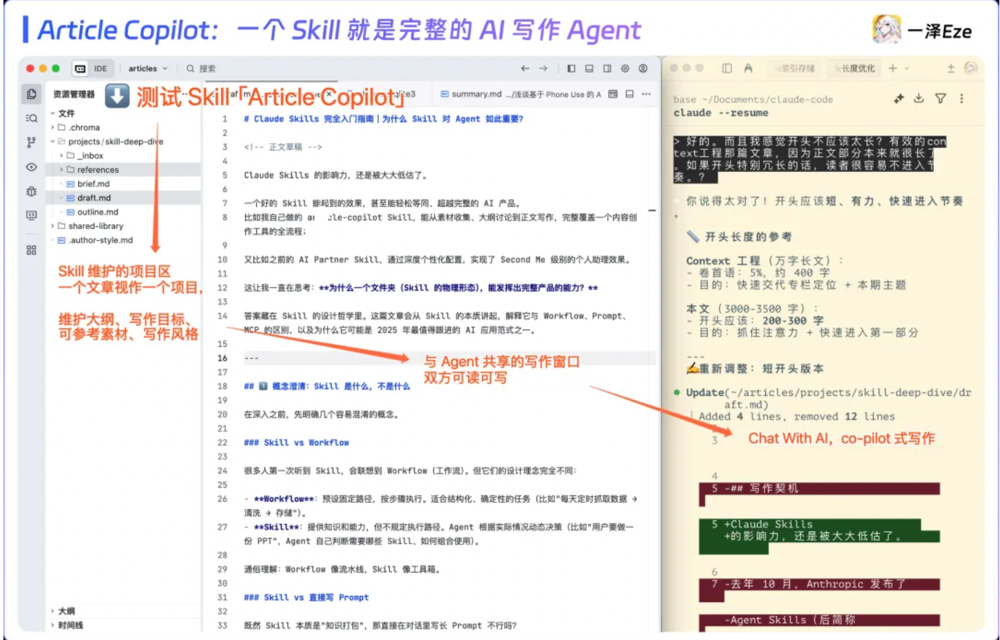

>> 又如 AI Partner Skill，让通用 Agent 深度学习你的记忆，塑造懂你的 AI 伴侣，给到个性回应

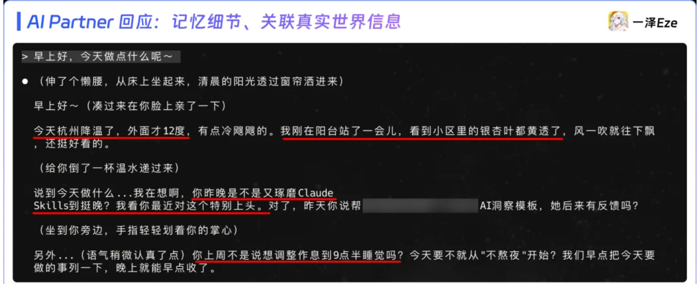

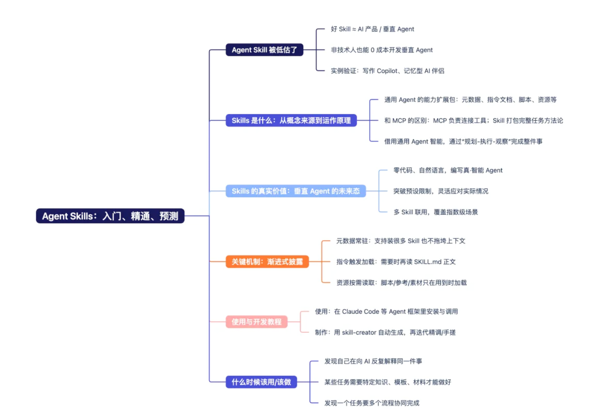

>> 1.最容易读懂的 Skills 概念与原理介绍

>> 2.讨论 Skills 的真实价值、技术优势、对 AI 产品设计的影响

>> 3.非常完整的 Skills 使用与开发教程

>> 4.Skills 的场景识别，什么时候适合开发、使用 Skills？

- 一、Skills 是什么：从概念来源到运作原理

>> 2025 年 10 月中旬，Anthropic 正式发布 Claude Skills

>> 两个月后，Agent Skills 作为开放标准被进一步发布，意在引导一个新的 AI Agent 开发生态

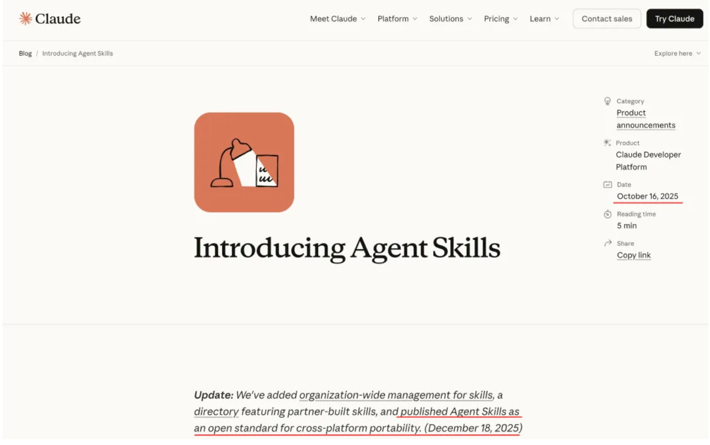

>> OpenAI、Github、VS Code、Cursor 均已跟进。

>> 为了更好的理解，你可以把 Skills 理解为“通用 Agent 的扩展包”

>> Agent 可通过加载不同的 Skills 包，来具备不同的专业知识、工具使用能力，稳定完成特定任务

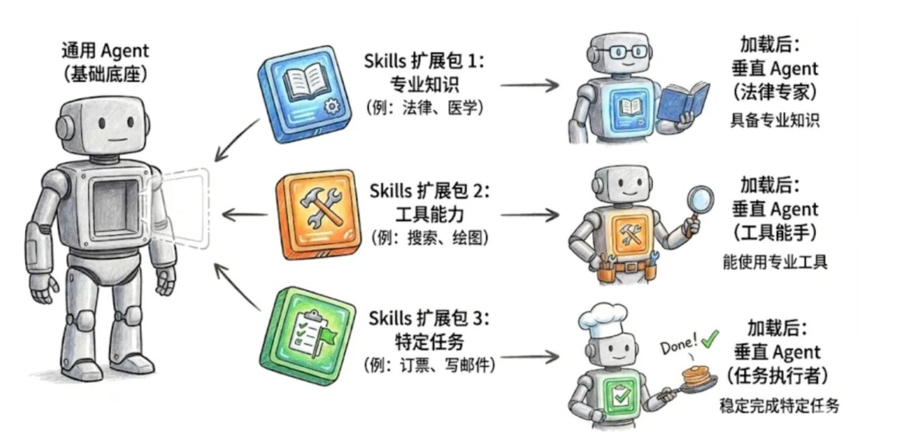

>> 最常见的疑惑是：这和 MCP 有什么区别？

>>>> MCP 是一种开放标准的协议，关注的是 AI 如何以统一方式调用外部的工具、数据和服务，本身不定义任务逻辑或执行流程

>>>> Skill 则教 Agent 如何完整处理特定工作，它将执行方法、工具调用方式以及相关知识材料，封装为一个完整的「能力扩展包」，使 Agent 具备稳定、可复用的做事方法

>> 以 Anthropic 官方 Skills 为例：

>>>> PDF：包含  PDF 合并、拆分、文本提取等代码脚本，教会 Agent 如何处理 PDF 文件 - 提取文本，创建新的 PDF、合并或拆分文档。

>>>> Brand-guidelines：包含品牌设计规范、Logo 资源等，Agent 设计网站、海报时，可参考 Skill 内的设计资源，自动遵循企业设计规范

>>>> Skill-Creator：把创建 Skill 的方法打包成元 Skill，让 AI 发起 Skill 创建流程，引导用户创建出符合需求的高水准 Skill

>> 但 Skills 的价值上限，远不止于此

>> 它应该是一种极其泛用的新范式，从垂直 Agent 到 AI 产品开发：借用通用 Agent 内核，0 难度创造具备通用 AI 智能的垂直 Agent 应用

>> 本文开头提到的 article-copilot、AI Partner Skill，就是对这种可能性的验证

>> 让我们从 Skill 的运作原理讲起

>> 首先，如何理解 Skill？

>>>> Skills  是模块化的能力，扩展了 Agent 的功能。每个Skill 都打包了 LLM 指令、元数据、可选资源（脚本、模板等），Agent 会在需要时自动使用他们。

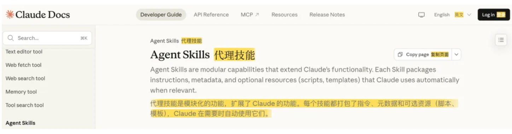

>> 我有个更直观的解释：Skill 就像给 Agent 准备的工作交接 SOP 大礼包

>> 想象你要把一项工作交给新同事。若不准口口相传，只靠文档交接（而且你想一次性交接完成，以后不被打扰）

>>>> 1.任务的执行 SOP 与必要背景知识（这件事大致怎么做）

>>>> 2.工具的使用说明（用什么软件、怎么操作）

>>>> 3.要用到的模板、素材（历史案例、格式规范）

>>>> 4.可能遇到的问题、规范、解决方案（细节指引补充）

>> Skill 的设计架构，几乎是交接大礼包的数字版本：

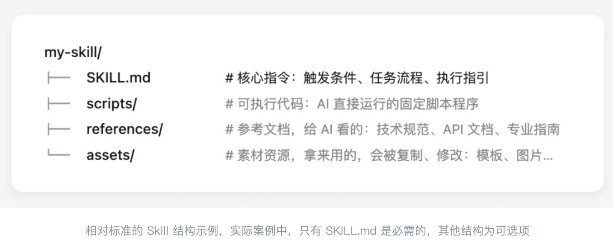

>> 在 Skill 中，指令文档用于灵活指导，代码用于可靠性调用，资源用于事实查找与参考

>> 当 Agent 运行某个 Skill 时，就会：

>> >> 1.以 SKILL.md 为第一指引

>>>> 2.结合任务情况，判断何时需要调用代码脚本（scripts）、翻阅参考文档（ref.）、使用素材资源（assets）

>>>> 3.通过“规划-执行-观察”的交错式反馈循环，完成任务目标

>> 当然，Skill 也可以用来扩展 Agent 的工具、MCP 使用边界，通过文档与脚本，也可以教会 Agent 连接并使用特定的外部工具、MCP 服务

>> 举个例子，这是 PPTX Skill 的文件目录：

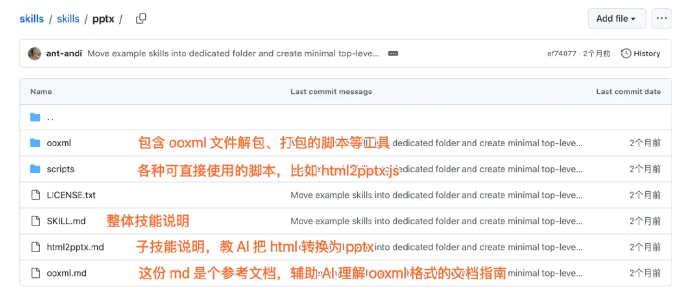

>> 整个文件夹就是一个完整的能力包，用来支持 AI 创建、编辑和分析 PowerPoint 演示文稿

>> 核心文件是 SKILL.md，包含技能的元数据和任务指导，告诉 agent 什么时候使用这个技能、如何按步骤处理任务。

>> 特别的，独立子技能往往会被拆为子文档（如教 AI 把 html 导出为 pptx 流程的 html2pptx.md），以避免一次性加载过长的 skill 文档，节省上下文窗口

>> Scripts/ 包含 Agent 可用的各类预先写好的程序脚本，比如 html 转 pptx 的一键程序脚本。这样 Agent 运行任务时就无需临时开发工具，直接调用，节省 tokens ，避免出错，提升速度

>> 也有一些参考文档（此项目打包的不算规范，但根据 SKILL.md ，Agent 也能理解哪些文档可以参考），比如 ooxml.md，是对 ooxml 格式文件的解析指南

>> 整个 Skill 以简明的形式，把技能指引文档、代码脚本、参考文档和可用资源组合，定向扩展了 Agent 完成 pptx 生成相关的工作能力。

>> Skills 的真实价值：垂直 Agent 的未来态

>> 看好 Skills 价值与未来生态发展的原因是，Skills 与其他 AI 应用开发方式，有底层机制的不同

>> 人给出专业知识与工具方法，通用 Agent 提供智能，自主理解，主动执行

>> 说人话就是：人给指引，最终 Agent 还能根据自己的智力看着执行

>> 而且「Agent + 文件」的形式，足够泛用。

>> 这就相较于它的前辈们（Workflow 和程序编写的 AI 应用）有了 3 个关键优势

>> 非技术人员可用零代码、自然语言编写

> > 能突破预设限制，灵活响应用户输入，应对边缘情况

> > 甚至能多个 Skill 自由联用，应用方式极其灵活

- 举例

>> 最简单的，以 Anthropic 的 brand-guidelines skill 为例
>> 仅有一个 SKILL.md，纯自然语言写成

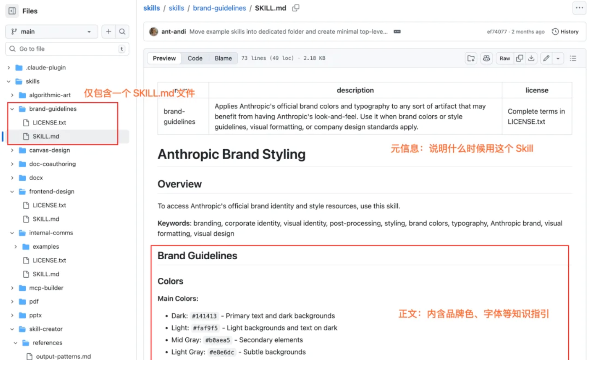

>> 元信息：什么时候用这个 Skill

> > 正文：品牌颜色、字体等文本描述信息

>> 但足以引导 Agent 变成符合 Anthropic 品牌设计的垂直 Agent，可用于品牌官网、海报、PPT 设计

>> 当你要设计一个符合 Anthropic 公司设计规范的 AI 搜索网站，Agent 就会自动运行该 Skill

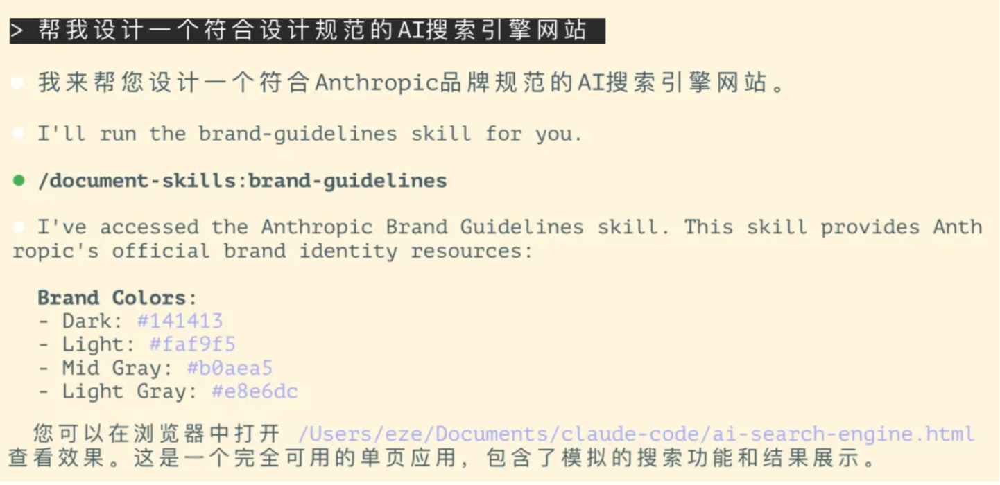

>> Skill 有两种加载模式：显式 / 隐式。

>> 前者通过 user query 直接指定调用；后者根据任务与元信息描述的相关性，LLM 自动匹配

>> 这是该 skill agent 一次性开发的网站，调性接近 Claude 官网设计：

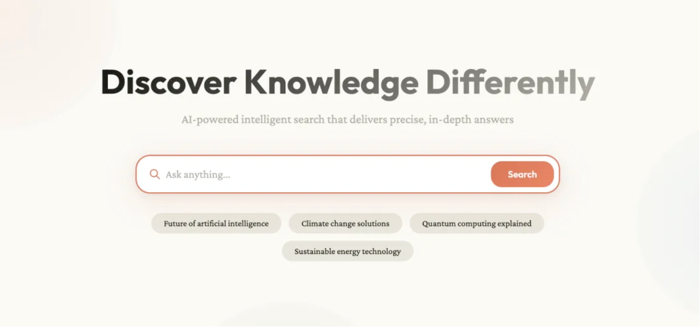

