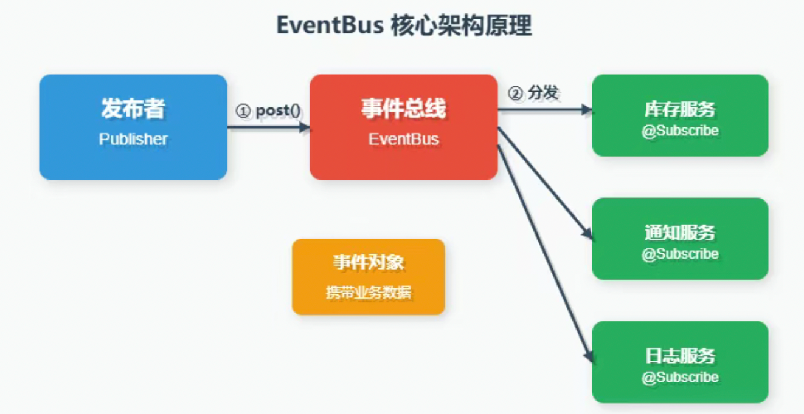
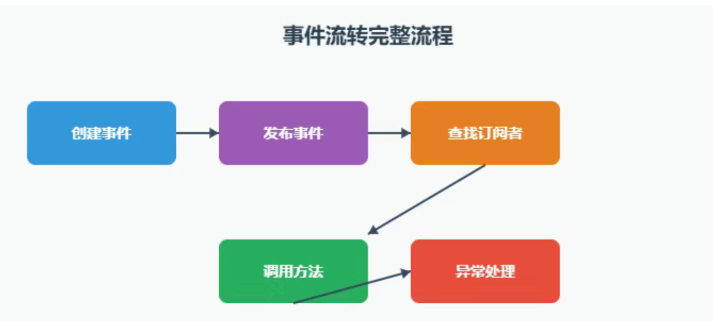
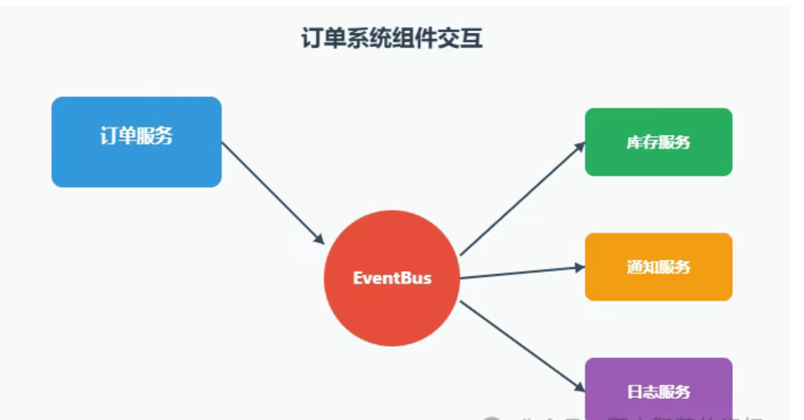
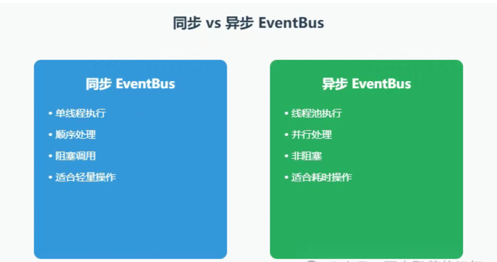
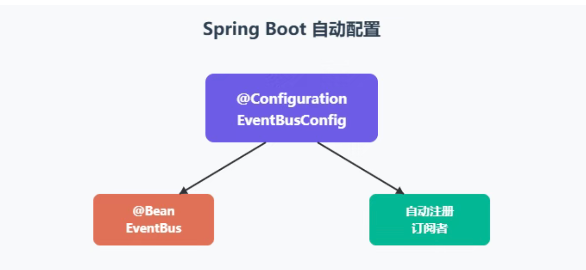
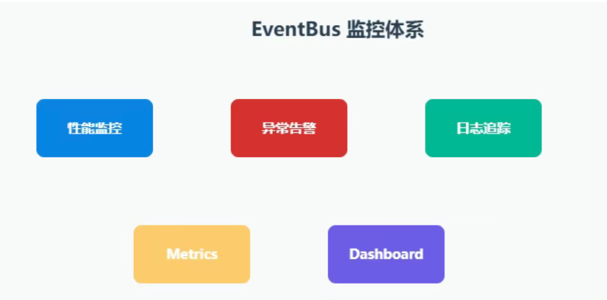

##  Guava EventBus：让你的系统解耦更优雅

### 1.什么是 EventBus?
> EventBus 是 Google Guava 库中的事件总线实现，它采用发布-订阅模式，允许组件之间通过事件进行松耦合通信。
> 与传统的观察者模式相比，EventBus 无需显式注册监听器，通过注解即可完成事件订阅

> 核心优势：
> > 解耦组件，降低系统复杂度基于注解
> > 代码更简洁  
> > 支持同步和异步事件处理  
> > 轻量级，无需引入额外中间件



### 2.核心概念解析
> 三大角色
> > 事件（Event）：普通的 Java 对象，作为消息载体在发布者和订阅者之间传递。  
> > 发布者（Publisher）：负责将事件发送到EventBus，通过 post() 方法完成。  
> > 订阅者（Subscriber）：通过 @Subscribe 注解标记方法，接收并处理特定类型的事件
> >


### 3.快速上手实战
> Maven依赖
```
<dependency>
    <groupId>com.google.guava</groupId>
    <artifactId>guava</artifactId>
    <version>32.1.3-jre</version>
</dependency>
```

> 定义事件
```
/**
 * 订单创建事件
 */
public class OrderCreatedEvent {
    private final String orderId;
    private final String userId;
    private final BigDecimal amount;
    private final LocalDateTime createTime;

    public OrderCreatedEvent(String orderId, String userId, BigDecimal amount) {
        this.orderId = orderId;
        this.userId = userId;
        this.amount = amount;
        this.createTime = LocalDateTime.now();
    }


    public String getOrderId() { return orderId; }
    public String getUserId() { return userId; }
    public BigDecimal getAmount() { return amount; }
    public LocalDateTime getCreateTime() { return createTime; }
}
```

> 创建订阅者
```
/**
 * 库存服务 - 监听订单事件并扣减库存
 */
@Component
public class InventoryService {
    private static final Logger log = LoggerFactory.getLogger(InventoryService.class);

    @Subscribe
    public void handleOrderCreated(OrderCreatedEvent event) {
        log.info("接收到订单创建事件，开始扣减库存: orderId={}", event.getOrderId());

        try {
            // 模拟库存扣减逻辑
            deductInventory(event.getOrderId());
            log.info("库存扣减成功: orderId={}", event.getOrderId());
        } catch (Exception e) {
            log.error("库存扣减失败: orderId={}", event.getOrderId(), e);
        }
    }

    private void deductInventory(String orderId) {
        // 实际业务逻辑
    }
}

/**
 * 通知服务 - 发送订单通知
 */
@Component
public class NotificationService {
    private static final Logger log = LoggerFactory.getLogger(NotificationService.class);

    @Subscribe
    public void handleOrderCreated(OrderCreatedEvent event) {
        log.info("发送订单创建通知: userId={}, orderId={}", 
                 event.getUserId(), event.getOrderId());

        // 发送短信/邮件通知
        sendNotification(event.getUserId(), event.getOrderId());
    }

    private void sendNotification(String userId, String orderId) {
        // 实际通知逻辑
    }
}
```



> 配置 EventBus（Spring 集成）
```
@Configuration
public class EventBusConfig {

    @Bean
    public EventBus eventBus() {
        return new EventBus("OrderEventBus");
    }

    @Bean
    public EventBusRegistrar eventBusRegistrar(EventBus eventBus,
                                               InventoryService inventoryService,
                                               NotificationService notificationService) {
        // 注册所有订阅者
        eventBus.register(inventoryService);
        eventBus.register(notificationService);
        return new EventBusRegistrar();
    }

    public static class EventBusRegistrar {
        // 标记类，确保订阅者已注册
    }
}
```

> 发布事件
```
@Service
public class OrderService {
    private static final Logger log = LoggerFactory.getLogger(OrderService.class);

    @Autowired
    private EventBus eventBus;

    public String createOrder(String userId, BigDecimal amount) {
        // 1. 创建订单
        String orderId = UUID.randomUUID().toString();
        log.info("创建订单: orderId={}, userId={}, amount={}", orderId, userId, amount);

        // 2. 保存订单到数据库
        saveOrderToDatabase(orderId, userId, amount);

        // 3. 发布订单创建事件
        OrderCreatedEvent event = new OrderCreatedEvent(orderId, userId, amount);
        eventBus.post(event);

        log.info("订单创建事件已发布: orderId={}", orderId);
        return orderId;
    }

    private void saveOrderToDatabase(String orderId, String userId, BigDecimal amount) {
        // 数据库保存逻辑
    }
}
```

> 进阶特性
>> 异步事件处理（AsyncEventBus）: 对于耗时操作，推荐使用 AsyncEventBus 避免阻塞主线程

```
@Configuration
public class AsyncEventBusConfig {

    @Bean
    public AsyncEventBus asyncEventBus() {
        // 创建线程池
        ThreadPoolExecutor executor = new ThreadPoolExecutor(
            4, 8, 60L, TimeUnit.SECONDS,
            new LinkedBlockingQueue<>(100),
            new ThreadFactoryBuilder()
                .setNameFormat("async-eventbus-%d")
                .build(),
            new ThreadPoolExecutor.CallerRunsPolicy()
        );

        return new AsyncEventBus("AsyncOrderEventBus", executor);
    }

    @Bean
    public AsyncEventBusRegistrar asyncEventBusRegistrar(
            AsyncEventBus asyncEventBus,
            EmailService emailService) {
        asyncEventBus.register(emailService);
        return new AsyncEventBusRegistrar();
    }

    public static class AsyncEventBusRegistrar {}
}

/**
 * 邮件服务 - 异步处理
 */
@Component
public class EmailService {

    @Subscribe
    public void sendOrderEmail(OrderCreatedEvent event) {
        // 模拟耗时操作
        try {
            Thread.sleep(2000);
            System.out.println("邮件发送成功: " + event.getOrderId());
        } catch (InterruptedException e) {
            Thread.currentThread().interrupt();
        }
    }
}
```


> 异常处理
> > 订阅者抛出异常时，EventBus 会捕获并传递给SubscriberExceptionHandler

```
public class CustomExceptionHandler implements SubscriberExceptionHandler {
    private static final Logger log = LoggerFactory.getLogger(CustomExceptionHandler.class);

    @Override
    public void handleException(Throwable exception, SubscriberExceptionContext context) {
        log.error("事件处理异常 - Event: {}, Subscriber: {}, Method: {}", 
                  context.getEvent().getClass().getSimpleName(),
                  context.getSubscriber().getClass().getSimpleName(),
                  context.getSubscriberMethod().getName(),
                  exception);

        // 可以在此进行告警、重试等操作
    }
}

// 使用自定义异常处理器
EventBus eventBus = new EventBus(new CustomExceptionHandler());
```

### 最佳实践
> Spring Boot Starter 封装

```
/**
 * EventBus 自动配置
 */
@Configuration
@ConditionalOnClass(EventBus.class)
@EnableConfigurationProperties(EventBusProperties.class)
public class EventBusAutoConfiguration implements ApplicationContextAware {

    private ApplicationContext applicationContext;

    @Override
    public void setApplicationContext(ApplicationContext applicationContext) {
        this.applicationContext = applicationContext;
    }

    @Bean
    @ConditionalOnMissingBean
    public EventBus eventBus(EventBusProperties properties) {
        EventBus eventBus = new EventBus(new CustomExceptionHandler());

        // 自动注册所有带 @EventSubscriber 注解的 Bean
        Mapsubscribers = applicationContext
            .getBeansWithAnnotation(EventSubscriber.class);
        subscribers.values().forEach(eventBus::register);

        return eventBus;
    }
}

/**
 * 自定义注解标记订阅者
 */
@Target(ElementType.TYPE)
@Retention(RetentionPolicy.RUNTIME)
@Component
public @interface EventSubscriber {
}
```



> 事件层次结构
>> 利用继承关系实现事件分组：

```
// 基础事件
public abstract class BaseOrderEvent {
    protected final String orderId;
    protected final LocalDateTime timestamp;

    public BaseOrderEvent(String orderId) {
        this.orderId = orderId;
        this.timestamp = LocalDateTime.now();
    }
}

// 具体事件
public class OrderPaidEvent extends BaseOrderEvent {
    private final BigDecimal paidAmount;

    public OrderPaidEvent(String orderId, BigDecimal paidAmount) {
        super(orderId);
        this.paidAmount = paidAmount;
    }
}

public class OrderShippedEvent extends BaseOrderEvent {
    private final String trackingNumber;

    public OrderShippedEvent(String orderId, String trackingNumber) {
        super(orderId);
        this.trackingNumber = trackingNumber;
    }
}

// 订阅者可以监听父类事件
@EventSubscriber
public class OrderAuditService {

    @Subscribe
    public void handleAllOrderEvents(BaseOrderEvent event) {
        // 记录所有订单相关事件
        auditLog(event);
    }
}
```

> 监控与日志
```
/**
 * EventBus 监控切面
 */
@Aspect
@Component
public class EventBusMonitorAspect {
    private static final Logger log = LoggerFactory.getLogger(EventBusMonitorAspect.class);

    @Around("execution(* com.google.common.eventbus.EventBus.post(..))")
    public Object monitorPost(ProceedingJoinPoint pjp) throws Throwable {
        Object event = pjp.getArgs()[0];
        String eventType = event.getClass().getSimpleName();

        long startTime = System.currentTimeMillis();
        try {
            Object result = pjp.proceed();
            long duration = System.currentTimeMillis() - startTime;

            log.info("事件发布成功: type={}, duration={}ms", eventType, duration);
            return result;
        } catch (Throwable e) {
            log.error("事件发布失败: type={}", eventType, e);
            throw e;
        }
    }
}
```


> 与开源框架对比
> > EventBus vs Spring Event：

- EventBus：
> 轻量级，独立于 Spring，适合纯 Java 项目  

- Spring Event：
> 深度集成 Spring，支持事务同步，适合 Spring 生态

- EventBus vs 消息队列（RabbitMQ/Kafka）：
> EventBus：进程内通信，无持久化，适合轻量场景  
> 消息队列：跨进程通信，支持持久化和高可用，适合分布式系统

### 选型建议
> 单体应用内部解耦 → EventBus  
> 微服务间通信 → 消息队列  
> Spring 项目且需事务支持 → Spring Event

### 总结
> Guava EventBus 以其简洁优雅的设计，为我们提供了一种轻量级的解耦方案。  
> 在电商订单系统、用户行为追踪、日志收集等场景中，EventBus 能有效降低模块间的耦合度，提升代码的可维护性

### 关键要点回顾：
> 使用 @Subscribe注解声明订阅者方法  
> 异步场景选用AsyncEventBus  
> 通过SubscriberExceptionHandler统一处理异常  
> 结合 Spring 实现自动注册和监控  
> 合理设计事件层次结构