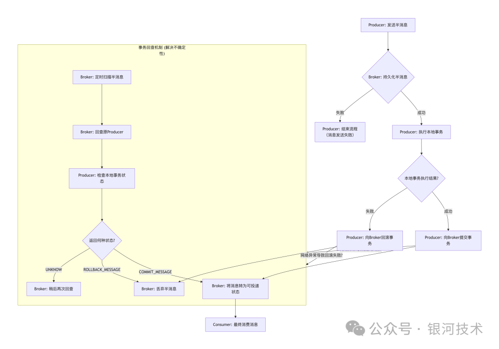

# Apache RocketMQ 事务消息全攻略：实现原理与生产级实践

>> 本文详细解析 RocketMQ 事务消息的实现原理、三阶段流程、回查机制，以及生产环境中需要关注的关键实践点，帮助你在分布式系统中实现高性能的最终一致性

# 一、核心思想：最终一致性
>> RocketMQ 事务消息并不追求强一致性，而是通过 “两阶段提交 + 事务状态回查” 机制，保证分布式系统的数据最终一致性。  
> > 核心思想是：将分布式事务拆解为两个独立的、本地顺序执行的操作

# 二、事务消息的生命周期与核心参与者
> 生产者（Producer）：发送事务消息的一方。

> Broker：RocketMQ 服务器，负责存储和转发消息。
>> 半消息（Half Message）
> > >> 事务消息的第一阶段形态，对消费者不可见
>> 消息回查（Transaction Check）
>>>> Broker 主动向生产者确认事务状态的机制

> 消费者（Consumer）：最终消费消息的一方

# 三、RocketMQ 事务消息三阶段流程



>> 阶段解析:

>> 1. 发送半消息（Prepare Phase）
>>>> 生产者发送半消息到 RMQ_SYS_TRANS_HALF_TOPIC，消费者不可见。

>>>> Broker 持久化半消息并返回发送成功响应。

>>>> 目的：确保消息落地安全，即使生产者宕机也能通过回查机制完成最终决策。

>> 2. 执行本地事务并提交（Commit/Rollback Phase）

> > >> 本地事务执行成功 → 提交事务消息（Broker 将半消息转为可投递）。

> > > > 本地事务执行失败 → 回滚事务消息（Broker 删除半消息）。

> > > > 必须先执行本地事务，再提交或回滚消息，保证数据一致性。

>> 3. 事务状态回查（Check Phase）

> > >> 解决生产者宕机或网络异常导致的不确定状态问题。

> > > > Broker 定时扫描半消息队列并发起回查请求。

> > > > Producer 实现 TransactionListener.checkLocalTransaction 方法，通过业务 Key 查询数据库确认事务最终状态。

> > > > Broker 根据返回结果执行提交或回滚。

# 四、关键实现细节与生产实践

>> 1. 消息 Key 的重要性
> > Key 应唯一，如订单号，用于回查时查询对应本地事务

```
Message msg = new Message("OrderTopic", "TagA", orderId, body.getBytes());
```

>> 2. 事务监听器实现
```

public class TransactionListenerImpl implements TransactionListener {
    @Override
    public LocalTransactionState executeLocalTransaction(Message msg, Object arg) {
        try {
            // 执行本地事务
            orderService.createOrder(msg.getKeys());
            return LocalTransactionState.COMMIT_MESSAGE;
        } catch (Exception e) {
            return LocalTransactionState.ROLLBACK_MESSAGE;
        }
    }
    @Override
    public LocalTransactionState checkLocalTransaction(MessageExt msg) {
        String orderId = msg.getKeys();
        Order order = orderService.getOrder(orderId);
        if (order == null) return LocalTransactionState.ROLLBACK_MESSAGE;
        if (order.getStatus() == OrderStatus.SUCCESS) return LocalTransactionState.COMMIT_MESSAGE;
        return LocalTransactionState.UNKNOW;
    }
}
```

>> 3. 双队列机制
>>>> 半消息队列：RMQ_SYS_TRANS_HALF_TOPIC

> > > > 操作队列：RMQ_SYS_TRANS_OP_HALF_TOPIC

> > > > Broker 通过比对两个队列，判断哪些消息需要回查。

>> 4. 回查机制调优

>> >>回查间隔：transactionCheckInterval（默认 1 分钟）

> > > > 最大回查次数：transactionCheckMax（默认 15 次）

> > > > 回查线程池：transactionCheckThreadPoolMinSize / MaxSize


>> 5. 高可用与幂等性
>>>> Producer 集群化，确保至少一个实例在线响应回查。

> > > > 本地事务和消息操作必须幂等，避免重复执行造成业务错误。


>> 6. 消费端注意事项
>>>> 消费者幂等设计，处理可能的重复消息。

> > > > 消费延迟容忍：事务消息最终可见存在回查周期延迟。

>> 7. 监控与运维
>>>> 半消息队列堆积监控 → 判断回查或事务执行是否异常。

> > > > 操作队列延迟监控 → 确保提交/回滚操作及时处理。

> > > > 告警策略 → 半消息长时间未被处理应触发告警。


# 五、优点

>> 最终一致性：实现跨系统事务数据一致性。

> > 异步化：避免同步阻塞的性能瓶颈，高性能。

> > 高可用：回查机制解决生产者宕机导致的不确定性问题。


# 六、局限性
>> 业务侵入性：Producer 需实现TransactionListener，业务逻辑需感知 MQ 事务。

> > 延迟：消息最终可见时间 ≥ 回查周期 + 本地事务执行时间。

> > 单向依赖：适用于“本地事务成功 → 消息发送成功”的场景，不适合“消费成功 → 本地事务执行”的场景。

# 七、总结
>> RocketMQ 事务消息本质上是对“消息表 + 本地事务”的高效封装，通过 半消息 + 二次确认 + 状态回查，在高性能与最终一致性之间取得平衡  
> >  掌握三阶段流程，特别是 回查机制，是理解和正确使用 RocketMQ 事务消息的关键。


