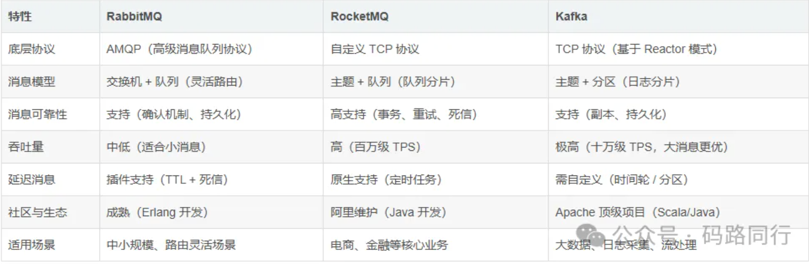
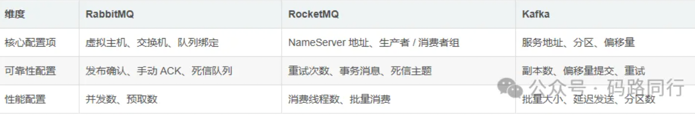
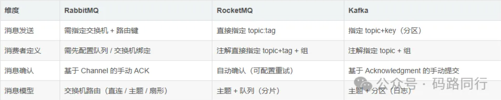

>> 在分布式系统中，消息队列（MQ）是实现异步通信、削峰填谷、解耦服务的核心组件。  
> > 目前主流的 MQ 有RabbitMQ、RocketMQ、Kafka，它们分别基于不同的设计理念和协议，适用于不同的业务场景。  
> > 本文将从配置、代码写法、核心差异三个维度，讲解 SpringBoot 如何整合这三大 MQ，并给出生产环境的最佳实践

# 1.三大 MQ 核心特性对比


# SpringBoot 整合 RabbitMQ
>> RabbitMQ 是基于 AMQP 协议的消息队列，以灵活的路由机制和丰富的特性著称，SpringBoot 通过spring-boot-starter-amqp提供整合支持

> 1. 依赖配置
```
<!-- SpringBoot整合RabbitMQ起步依赖 -->
<dependency>
    <groupId>org.springframework.boot</groupId>
    <artifactId>spring-boot-starter-amqp</artifactId>
</dependency>
```

> 2. 核心配置（application.yml）
```
spring:
  rabbitmq:
    host: localhost # 服务地址
    port: 5672 # 端口
    username: guest # 用户名
    password: guest # 密码
    virtual-host: / # 虚拟主机
    # 连接池配置
    connection-timeout: 10000
    # 消息确认配置（生产者）
    publisher-confirm-type: correlated # 开启确认机制
    publisher-returns: true # 开启返回机制
    # 消费者配置
    listener:
      simple:
        acknowledge-mode: manual # 手动确认消息
        concurrency: 1 # 最小并发数
        max-concurrency: 10 # 最大并发数
        prefetch: 1 # 每次预取1条消息
```

> 3. 代码实现
>> 配置队列、交换机、绑定
> > RabbitMQ 的核心是交换机与队列的绑定，需先定义这些组件

```
import org.springframework.amqp.core.*;
import org.springframework.context.annotation.Bean;
import org.springframework.context.annotation.Configuration;

@Configuration
public class RabbitMQConfig {
    // 队列名称
    public static final String TEST_QUEUE = "test_queue";
    // 交换机名称
    public static final String TEST_EXCHANGE = "test_exchange";
    // 路由键
    public static final String TEST_ROUTING_KEY = "test.routing.key";

    // 定义队列（持久化）
    @Bean
    public Queue testQueue() {
        return QueueBuilder.durable(TEST_QUEUE).build();
    }

    // 定义交换机（直连交换机）
    @Bean
    public DirectExchange testExchange() {
        return ExchangeBuilder.directExchange(TEST_EXCHANGE).durable(true).build();
    }

    // 绑定队列与交换机
    @Bean
    public Binding binding(Queue testQueue, DirectExchange testExchange) {
        return BindingBuilder.bind(testQueue).to(testExchange).with(TEST_ROUTING_KEY);
    }
}
```

> 生产者
```
import org.springframework.amqp.rabbit.core.RabbitTemplate;
import org.springframework.stereotype.Component;
import javax.annotation.Resource;

@Component
public class RabbitMQProducer {
    @Resource
    private RabbitTemplate rabbitTemplate;

    public void sendMessage(String message) {
        // 发送消息：交换机、路由键、消息内容
        rabbitTemplate.convertAndSend(RabbitMQConfig.TEST_EXCHANGE,
                RabbitMQConfig.TEST_ROUTING_KEY, message);
    }
}
```

> 消费者
```
import com.rabbitmq.client.Channel;
import org.springframework.amqp.core.Message;
import org.springframework.amqp.rabbit.annotation.RabbitListener;
import org.springframework.stereotype.Component;

@Component
public class RabbitMQConsumer {
    // 监听指定队列
    @RabbitListener(queues = RabbitMQConfig.TEST_QUEUE)
    public void receiveMessage(String message, Channel channel, Message msg) throws Exception {
        try {
            System.out.println("RabbitMQ消费者接收到消息：" + message);
            // 手动确认消息（单条确认）
            channel.basicAck(msg.getMessageProperties().getDeliveryTag(), false);
        } catch (Exception e) {
            // 拒绝消息并重新入队（根据业务场景选择是否重新入队）
            channel.basicNack(msg.getMessageProperties().getDeliveryTag(), false, true);
        }
    }
}
```

# SpringBoot 整合 RocketMQ
>> RocketMQ 是阿里开源的分布式消息队列，基于 Java 开发，高吞吐量、高可靠性，SpringBoot 通过rocketmq-spring-boot-starter整合

> 配置依赖
```

<!-- SpringBoot整合RocketMQ起步依赖 -->
<dependency>
    <groupId>org.apache.rocketmq</groupId>
    <artifactId>rocketmq-spring-boot-starter</artifactId>
    <version>2.2.3</version> <!-- 建议使用稳定版本 -->
</dependency>
```

> 核心配置（application.yml）
```

spring:
  application:
    name: rocketmq-demo
rocketmq:
  name-server: localhost:9876 # NameServer地址（多个用;分隔）
  producer:
    group: test-producer-group # 生产者组
    send-message-timeout: 3000 # 发送超时时间
    retry-times-when-send-failed: 2 # 同步发送重试次数
    retry-times-when-send-async-failed: 2 # 异步发送重试次数
  consumer:
    group: test-consumer-group # 消费者组
    consume-thread-max: 20 # 最大消费线程数
    consume-message-batch-max-size: 1 # 批量消费大小
```

> 代码实现
>> （1）生产者
```
import org.apache.rocketmq.spring.core.RocketMQTemplate;
import org.springframework.stereotype.Component;
import javax.annotation.Resource;
@Component
public class RocketMQProducer {
    @Resource
    private RocketMQTemplate rocketMQTemplate;
    // 发送普通消息：topic:tag
    public void sendMessage(String message) {
        rocketMQTemplate.convertAndSend("test_topic:test_tag", message);
    }
    // 发送同步消息（返回发送结果）
    public void sendSyncMessage(String message) {
        rocketMQTemplate.syncSend("test_topic:test_tag", message);
    }
}
```

>> （2）消费者
```
import org.apache.rocketmq.spring.annotation.RocketMQMessageListener;
import org.apache.rocketmq.spring.core.RocketMQListener;
import org.springframework.stereotype.Component;
@Component
// 监听topic和tag，指定消费者组
@RocketMQMessageListener(topic = "test_topic", selectorExpression = "test_tag", consumerGroup = "test-consumer-group")
public class RocketMQConsumer implements RocketMQListener<String> {
    @Override
    public void onMessage(String message) {
        System.out.println("RocketMQ消费者接收到消息：" + message);
    }
}
```

# SpringBoot 整合 Kafka
>> Kafka 是基于发布 - 订阅模式的分布式消息系统，专为大数据场景设计，SpringBoot 通过spring-boot-starter-kafka整合

```

<!-- SpringBoot整合Kafka起步依赖 -->
<dependency>
    <groupId>org.springframework.boot</groupId>
    <artifactId>spring-boot-starter-kafka</artifactId>
</dependency>
```

>  核心配置（application.yml）
```
spring:
  kafka:
    bootstrap-servers: localhost:9092 # Kafka服务地址（多个用,分隔）
    # 生产者配置
    producer:
      key-serializer: org.apache.kafka.common.serialization.StringSerializer
      value-serializer: org.apache.kafka.common.serialization.StringSerializer
      retries: 3 # 重试次数
      batch-size: 16384 # 批量大小
      linger-ms: 1 # 延迟发送时间
      buffer-memory: 33554432 # 缓冲区大小
    # 消费者配置
    consumer:
      group-id: test-consumer-group # 消费者组
      key-deserializer: org.apache.kafka.common.serialization.StringDeserializer
      value-deserializer: org.apache.kafka.common.serialization.StringDeserializer
      auto-offset-reset: earliest # 偏移量重置策略（earliest/latest/none）
      enable-auto-commit: false # 关闭自动提交偏移量
    # 监听配置
    listener:
      ack-mode: manual_immediate # 手动提交偏移量
```

> 3. 代码实现
>>（1）生产者

```

import org.springframework.kafka.core.KafkaTemplate;
import org.springframework.stereotype.Component;
import javax.annotation.Resource;
@Component
public class KafkaProducer {
    @Resource
    private KafkaTemplate<String, String> kafkaTemplate;
    // 发送消息：topic、消息内容
    public void sendMessage(String message) {
        kafkaTemplate.send("test_topic", message);
    }
    // 发送消息并指定key（key用于分区路由）
    public void sendMessageWithKey(String key, String message) {
        kafkaTemplate.send("test_topic", key, message);
    }
}
```

>> （2）消费者
```
import org.apache.kafka.clients.consumer.ConsumerRecord;
import org.springframework.kafka.annotation.KafkaListener;
import org.springframework.kafka.support.Acknowledgment;
import org.springframework.stereotype.Component;
@Component
public class KafkaConsumer {
    // 监听指定topic
    @KafkaListener(topics = "test_topic", groupId = "test-consumer-group")
    public void receiveMessage(ConsumerRecord<String, String> record, Acknowledgment ack) {
        try {
            String message = record.value();
            System.out.println("Kafka消费者接收到消息：" + message);
            // 手动提交偏移量
            ack.acknowledge();
        } catch (Exception e) {
            // 处理异常（根据业务场景选择重试或忽略）
            e.printStackTrace();
        }
    }
}
```


# 配置与代码写法的核心差异
> 1. 配置层面差异


> 2.代码写法差异


# 生产环境最佳实践
> 1. 通用实践
>> 消息序列化：避免使用 JDK 默认序列化，推荐使用 JSON、Protobuf、Avro 等跨语言序列化方式。

>> 消息幂等性：生产和消费端都要保证幂等（如使用消息唯一 ID、数据库唯一键、分布式锁）。

>>  消息持久化：开启所有 MQ 的持久化配置，防止消息丢失。

>> 监控告警：接入 Prometheus、Grafana 监控 MQ 的生产 / 消费速率、堆积量、延迟，设置告警阈值。

>> 异常处理：消费失败时避免无限重试，可引入死信队列存储失败消息，后续人工处理。


> 2. 针对 RabbitMQ 的实践
>> 合理选择交换机类型：直连交换机（精准路由）、主题交换机（模糊路由）、扇形交换机（广播）按需选择。

>> 控制队列数量：过多队列会占用 RabbitMQ 资源，建议按业务模块划分队列。

>> 使用连接池：配置合理的连接池大小，避免频繁创建连接。

>> 延迟消息优化：若需大量延迟消息，建议使用 RabbitMQ 的延迟插件，而非 TTL + 死信的组合（性能较差）

> 3. 针对 RocketMQ 的实践
>> 生产者组与消费者组命名规范：按业务模块命名，避免混用。

>> 批量发送消息：高并发场景下使用批量发送提升吞吐量。

>> 定时消息使用：RocketMQ 原生支持定时消息，可直接使用（支持固定级别延迟）。

>> 避免单主题消息过多：可按时间或业务拆分主题，提升消费性能

> 4. 针对 Kafka 的实践
>> 合理设置分区数：分区数决定了 Kafka 的并行度，建议按 broker 数量和消费线程数设置（如 broker 数 * 3）。

>> 偏移量管理：生产环境建议关闭自动提交，使用手动提交偏移量，避免消息重复消费。

>> 数据保留策略：根据业务需求设置消息保留时间（如 7 天），避免磁盘占满。

>> 使用压缩算法：开启 LZ4、Snappy 等压缩算法，减少网络传输和磁盘占用

> 5. MQ 选型建议
>> 小体量、路由灵活：选择 RabbitMQ（如电商订单通知、短信发送）。

>> 中大型业务、高可靠性：选择 RocketMQ（如电商交易、金融支付）。

>> 大数据、日志采集、流处理：选择 Kafka（如用户行为日志、实时计算）


