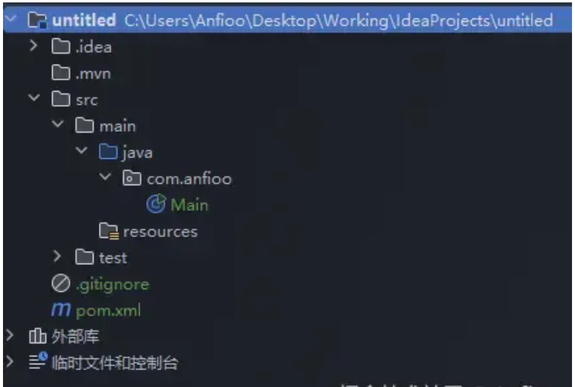
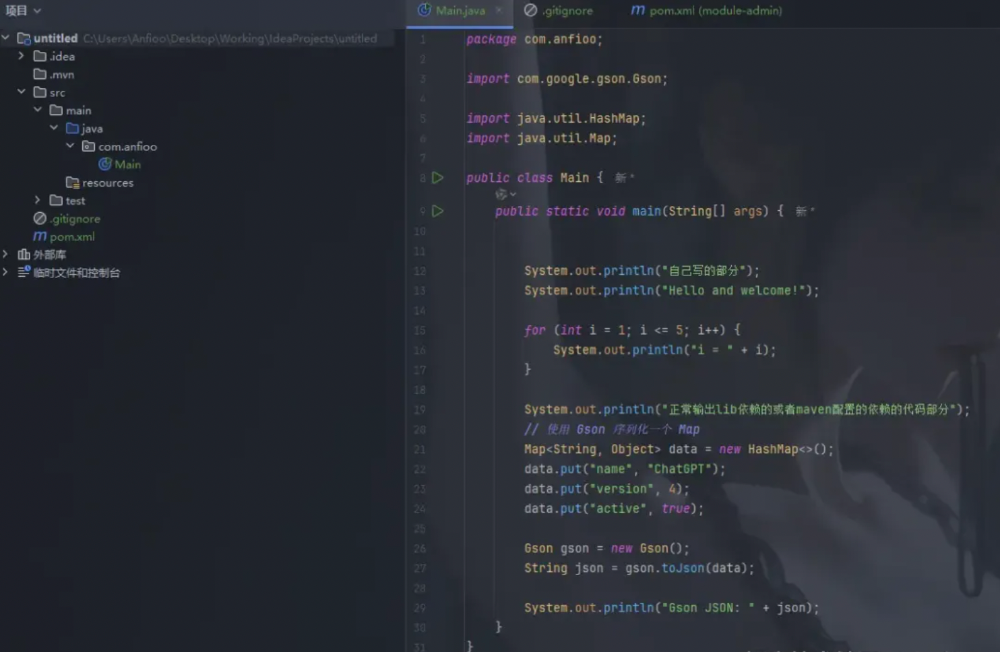
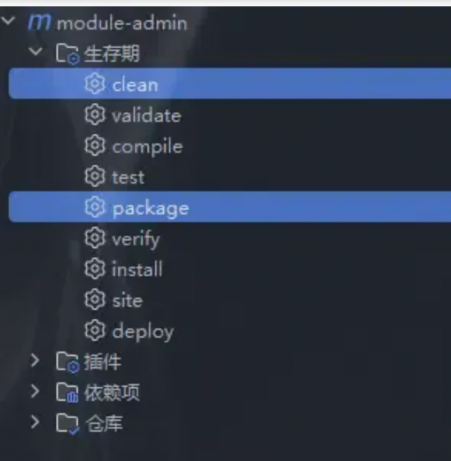
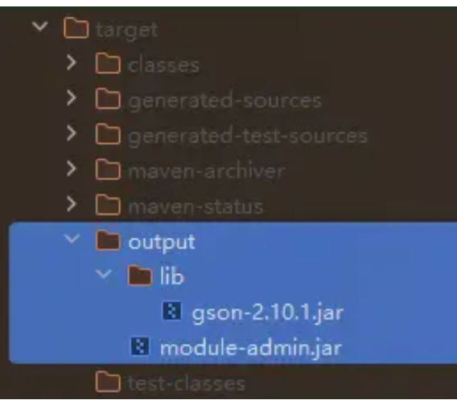
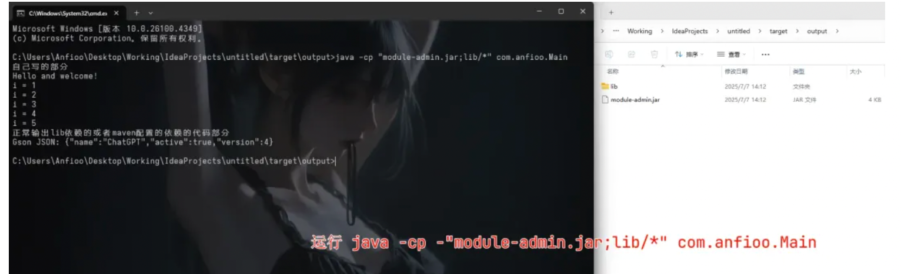

### Maven 项目打包：实现业务代码与第三方依赖分离

> 在实际项目部署中，我们有时不希望将所有代码打成一个 fat jar（大包） ，而是希望实现如下目标

>> 自己的业务代码 ：打包成一个干净的 xxx.jar（仅包含 .class、资源等，不含依赖）。

>> 第三方依赖库 ：打包输出到 lib/ 子目录中，便于管理、替换、升级。

>> 这种方式类似于 Java 应用的模块化部署结构，类似早期的 .jar + lib/ 结构，适合

>>>> 多环境部署（测试 / 生产）

>>>> 依赖版本替换



>> 我创建一个新的maven项目做演示

>> 自己写了一个类Main



>> Gson这个是第三方引入的库

>> 引入依赖

```
<dependencies>
  <dependency>
    <groupId>com.google.code.gson</groupId>
    <artifactId>gson</artifactId>
    <version>2.10.1</version>
  </dependency>
</dependencies>
```

>> 将自己写的代码 打包到module-admin.jar中，而第三方依赖库打包到module-admin.jar 文件的子目录 lib 下，配置

```
<project xmlns="http://maven.apache.org/POM/4.0.0"
         xmlns:xsi="http://www.w3.org/2001/XMLSchema-instance"
         xsi:schemaLocation="http://maven.apache.org/POM/4.0.0
                             http://maven.apache.org/xsd/maven-4.0.0.xsd">
    <modelVersion>4.0.0</modelVersion>
    <groupId>com.anfioo</groupId>
    <artifactId>module-admin</artifactId>
    <version>1.0.0</version>
    <build>
        <finalName>module-admin</finalName>
        <plugins>
            <!-- 让 JAR 知道主类是哪个 -->
            <plugin>
                <artifactId>maven-jar-plugin</artifactId>
                <version>3.2.0</version>
                <configuration>
                    <archive>
                        <manifest>
                            <mainClass>com.anfioo.Main</mainClass>
                        </manifest>
                    </archive>
                    <outputDirectory>${project.build.directory}/output</outputDirectory>
                </configuration>
            </plugin>
            <!--            配置了maven坐标，会把依赖放入project.build.directory的output/lib下-->
            <!-- 拷贝依赖到 lib 目录 -->
            <plugin>
                <groupId>org.apache.maven.plugins</groupId>
                <artifactId>maven-dependency-plugin</artifactId>
                <version>3.1.2</version>
                <executions>
                    <execution>
                        <id>copy-dependencies</id>
                        <phase>package</phase>
                        <goals>
                            <goal>copy-dependencies</goal>
                        </goals>
                        <configuration>
                            <outputDirectory>${project.build.directory}/output/lib</outputDirectory>
                        </configuration>
                    </execution>
                </executions>
            </plugin>
        </plugins>
    </build>

    <dependencies>
        <dependency>
            <groupId>com.google.code.gson</groupId>
            <artifactId>gson</artifactId>
            <version>2.10.1</version>
        </dependency>
    </dependencies>
</project>
```

>> 这个时候运行命令

```
mvn clean package
```



>> 可以看到



>> 输出中多了

```
module-admin.jar，lib
```

>> 在目标文件夹中运行

```
java -cp "module-admin.jar;lib/*" com.anfioo.Main
```

>> 可以看到正常运行




