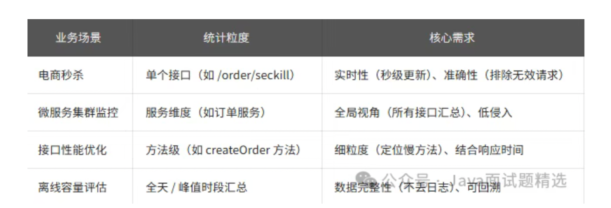

## QPS粒度


## 五种QPS统计方法
### 1.网关层统计（全局视角，适合分布式项目）
>> 适用场景：微服务集群，需要统计所有服务的总 QPS，或单个服务的入口 QPS（如 API 网关、Nginx）。  
> > 原理：所有请求都经过网关，在网关层拦截请求，记录请求数和时间，按秒计算 QPS

> 实战： Nginx 统计 QPS（中小项目首选）
> > Nginx 的access_log会记录每一次请求，配合ngx_http_stub_status_module模块，能快速统计 QPS

>> 1.1、配置 Nginx（nginx.conf）：
```
http {
    # 开启状态监控页面
    server {
        listen 8080;
        location /nginx-status {
            stub_status on;
            allow 192.168.0.0/24; # 只允许内网访问
            deny all;
        }
    }

    # 记录详细请求日志（用于离线分析）
    log_format main '$remote_addr [$time_local] "$request" $status $request_time';
    server {
        listen 80;
        server_name api.example.com;
        access_log /var/log/nginx/api-access.log main; # 日志路径

        # 转发到后端服务
        location / {
            proxy_pass http://backend-service;
        }
    }
}
```
>> 1.2、查看实时 QPS： 访问http://192.168.0.100:8080/nginx-status，会显示
```
Active connections: 200
server accepts handled requests
 10000  10000  80000
Reading: 0 Writing: 10 Waiting: 190
```
>> QPS 计算：requests/时间，比如 10 秒内请求 80000 次，QPS=8000。

>> 1.3 工具脚本：写个 Shell 脚本定时统计（每 1 秒执行一次）：
```
while true; do
    # 取当前请求数
    current=$(curl -s http://192.168.0.100:8080/nginx-status | awk 'NR==3 {print $3}')
    sleep 1
    # 取1秒后请求数
    next=$(curl -s http://192.168.0.100:8080/nginx-status | awk 'NR==3 {print $3}')
    qps=$((next - current))
    echo "当前QPS: $qps"
done
```

> 实战 2：Spring Cloud Gateway 统计 QPS（Java 微服务）
> > 如果用 Spring Cloud Gateway，可通过自定义过滤器统计 QPS：
```
@Component
publicclass QpsStatisticsFilter implements GlobalFilter, Ordered {
    // 存储接口QPS：key=接口路径，value=原子计数器
    privatefinal Map<String, AtomicLong> pathQpsMap = new ConcurrentHashMap<>();

    // 定时1秒清零计数器（避免数值过大）
    @PostConstruct
    public void init() {
        ScheduledExecutorService executor = Executors.newSingleThreadScheduledExecutor();
        executor.scheduleAtFixedRate(() -> {
            // 遍历所有接口，打印QPS后清零
            pathQpsMap.forEach((path, counter) -> {
                long qps = counter.getAndSet(0);
                log.info("接口[{}] QPS: {}", path, qps);
            });
        }, 0, 1, TimeUnit.SECONDS);
    }

    @Override
    public Mono<Void> filter(ServerWebExchange exchange, GatewayFilterChain chain) {
        // 获取请求路径（如/order/seckill）
        String path = exchange.getRequest().getPath().value();
        // 计数器自增（线程安全）
        pathQpsMap.computeIfAbsent(path, k -> new AtomicLong()).incrementAndGet();
        // 继续转发请求
        return chain.filter(exchange);
    }

    @Override
    public int getOrder() {
        return -1; // 过滤器优先级：数字越小越先执行
    }
}
```
>> 踩坑经验：网关统计会包含 “健康检查请求”（如 /actuator/health），需要过滤：在filter方法中加if (path.startsWith("/actuator")) return chain.filter(exchange);
> > 分布式网关（多节点）需汇总 QPS，可把数据推到 Prometheus，避免单节点统计不准

### 应用层埋点（细粒度，适合单服务接口统计）
>> 适用场景：需要统计单个服务的接口级 QPS（如订单服务的 /create 接口），或方法级 QPS（如 Service 层的 createOrder 方法）
>> 原理：用 AOP 或 Filter 拦截请求 / 方法，记录请求数，按秒计算 QPS（适合 Java 应用）

- 1、引入依赖（Spring Boot 项目）：
```
<dependency>
    <groupId>org.springframework.boot</groupId>
    <artifactId>spring-boot-starter-aop</artifactId>
</dependency>
```

- 2、自定义切面（统计 Controller 接口 QPS）：
```
@Aspect
@Component
@Slf4j
publicclass ApiQpsAspect {
    // 存储接口QPS：key=接口名（如com.example.OrderController.createOrder），value=计数器
    privatefinal Map<String, AtomicLong> apiQpsMap = new ConcurrentHashMap<>();

    // 定时1秒打印QPS并清零
    @PostConstruct
    public void scheduleQpsPrint() {
        Executors.newSingleThreadScheduledExecutor().scheduleAtFixedRate(() -> {
            apiQpsMap.forEach((api, counter) -> {
                long qps = counter.getAndSet(0);
                if (qps > 0) { // 只打印有请求的接口
                    log.info("[QPS统计] 接口: {}, QPS: {}", api, qps);
                }
            });
        }, 0, 1, TimeUnit.SECONDS);
    }

    // 切入点：拦截所有Controller方法
    @Pointcut("execution(* com.example.*.controller..*(..))")
    public void apiPointcut() {}

    // 环绕通知：统计请求数
    @Around("apiPointcut()")
    public Object countQps(ProceedingJoinPoint joinPoint) throws Throwable {
        // 获取接口名（类名+方法名）
        String apiName = joinPoint.getSignature().getDeclaringTypeName() + "." + joinPoint.getSignature().getName();
        // 计数器自增
        apiQpsMap.computeIfAbsent(apiName, k -> new AtomicLong()).incrementAndGet();
        // 执行原方法
        return joinPoint.proceed();
    }
}
```
>> 进阶优化：  
> > 过滤无效请求： 在countQps中判断响应状态码，只统计 200/300 的有效请求；  
> > 结合响应时间： 在环绕通知中记录方法执行时间，同时统计 “QPS + 平均响应时间”：
```
// 记录响应时间
long start = System.currentTimeMillis();
Object result = joinPoint.proceed();
long cost = System.currentTimeMillis() - start;
// 存储响应时间（key=接口名，value=时间列表）
timeMap.computeIfAbsent(apiName, k -> new CopyOnWriteArrayList<>()).add(cost);
// 计算平均响应时间
double avgTime = timeMap.get(apiName).stream().mapToLong(Long::longValue).average().orElse(0);
```

>> 踩坑经验：  
> > 并发安全： 必须用AtomicLong计数，避免long变量的线程安全问题；  
> > 性能影响： AOP 会增加微小开销（单请求约 0.1ms），生产环境可通过@Conditional控制只在非生产环境启用，或用 Java Agent 替代 AOP 减少侵入。


### 监控工具统计（实时可视化，适合运维监控）
>> 适用场景： 需要实时可视化 QPS、历史趋势分析、告警（如 QPS 超过阈值自动发告警），主流方案是Prometheus + Grafana
>> 原理： 应用埋点暴露指标（如 QPS、响应时间），Prometheus 定时拉取指标，Grafana 展示图表


> 实战： Spring Boot + Prometheus + Grafana 统计 QPS
```
<!-- Micrometer：对接Prometheus的工具 -->
<dependency>
    <groupId>io.micrometer</groupId>
    <artifactId>micrometer-registry-prometheus</artifactId>
</dependency>
<dependency>
    <groupId>org.springframework.boot</groupId>
    <artifactId>spring-boot-starter-actuator</artifactId>
</dependency>
```

> 配置 Prometheus（application.yml）：
```
spring:
  application:
    name:order-service# 服务名，用于Prometheus识别

management:
endpoints:
    web:
      exposure:
        include:prometheus# 暴露/prometheus端点
metrics:
    tags:
      application:${spring.application.name}# 给指标加服务名标签
    distribution:
      percentiles-histogram:
        http:
          server:
            requests:true# 开启响应时间分位数统计
```

>埋点统计 QPS（用 Micrometer 的MeterRegistry）：
```
@RestController
@RequestMapping("/order")
publicclass OrderController {
    // 注入MeterRegistry
    privatefinal MeterRegistry meterRegistry;

    @Autowired
    public OrderController(MeterRegistry meterRegistry) {
        this.meterRegistry = meterRegistry;
    }

    @PostMapping("/create")
    public String createOrder() {
        // 统计/create接口的QPS：meterRegistry会自动按秒聚合
        Counter.builder("order.create.qps") // 指标名
                .description("订单创建接口QPS") // 描述
                .register(meterRegistry)
                .increment(); // 计数器自增

        // 业务逻辑
        return"success";
    }
}
```

> 配置 Prometheus 拉取指标（prometheus.yml）：
```
scrape_configs:
  - job_name: 'order-service'
    scrape_interval: 1s # 每秒拉取一次（实时性高）
    static_configs:
      - targets: ['192.168.0.101:8080'] # 应用地址（暴露的actuator端口）
```

> Grafana 配置图表：
>> 导入 Prometheus 数据源，写 QPS 查询语句：sum(rate(order_create_qps_total[1m])) by (application)（1 分钟内的平均 QPS）；  
> > 配置告警：当 QPS>5000 时，发送邮件 / 钉钉告警

>> 踩坑经验：  
> > 拉取间隔：scrape_interval不要设太小（如 < 100ms），会增加应用和 Prometheus 的压力；  
> > 指标命名： 按 “业务 + 接口 + 指标类型” 命名（如order_create_qps），避免和其他指标冲突。

### 方法4：日志分析统计（离线，适合容量评估）
>> 适用场景：  
> > 需要离线统计 QPS（如分析昨天秒杀的峰值 QPS），或排查历史问题（如上周三 QPS 突增的原因）。  
> > 原理： 应用打印请求日志（包含时间、接口、状态码），用 ELK（Elasticsearch+Logstash+Kibana）或 Flink 分析日志，计算 QPS

> 4.1 实战：ELK 统计离线 QPS
>> 应用打印结构化日志（用 Logback）：
```
<!-- logback-spring.xml -->
<appender name="JSON_FILE" class="ch.qos.logback.core.rolling.RollingFileAppender">
    <file>/var/log/order-service/request.log</file>
    <rollingPolicy class="ch.qos.logback.core.rolling.TimeBasedRollingPolicy">
        <fileNamePattern>/var/log/order-service/request.%d{yyyy-MM-dd}.log</fileNamePattern>
    </rollingPolicy>
    <!-- 输出JSON格式日志 -->
    <encoder class="net.logstash.logback.encoder.LogstashEncoder">
        <includeMdcKeyName>requestPath</includeMdcKeyName>
        <includeMdcKeyName>requestTime</includeMdcKeyName>
    </encoder>
</appender>

<root level="INFO">
    <appender-ref ref="JSON_FILE" />
</root>
```

> MDC 埋点记录请求信息：
```
@Component
publicclass RequestLogFilter extends OncePerRequestFilter {
    @Override
    protected void doFilterInternal(HttpServletRequest request, HttpServletResponse response, FilterChain chain) throws ServletException, IOException {
        try {
            // 记录请求路径到MDC
            MDC.put("requestPath", request.getRequestURI());
            // 记录请求时间
            MDC.put("requestTime", String.valueOf(System.currentTimeMillis()));
            chain.doFilter(request, response);
        } finally {
            // 清除MDC，避免线程复用导致数据污染
            MDC.clear();
        }
    }
}
```

> Logstash 收集日志到 Elasticsearch（logstash.conf）：
```
input {
    file {
        path => "/var/log/order-service/request.*.log"# 日志路径
        start_position => "beginning"
        sincedb_path => "/dev/null"# 每次重启都重新读取所有日志
    }
}

filter {
    json {
        source => "message"# 解析JSON格式日志
    }
    # 提取时间字段（转为Elasticsearch时间格式）
    date {
        match => ["requestTime", "yyyy-MM-dd HH:mm:ss"]
        target => "@timestamp"
    }
}

output {
    elasticsearch {
        hosts => ["192.168.0.102:9200"] # Elasticsearch地址
        index => "order-request-%{+YYYY.MM.dd}"# 索引名
    }
}
```

>> Kibana 分析 QPS：  
> > 进入 Kibana 的 “Discover”，选择order-request-*索引；  
> > 用 “Visualize” 创建柱状图，X 轴选 “时间（1 秒间隔）”，Y 轴选 “文档数”（即每秒请求数），就是 QPS 趋势图。

>> 踩坑经验：
> > 日志切割： 按天切割日志，避免单个日志文件太大（如超过 10GB），导致 Logstash 读取缓慢；  
> > 字段清洗： 过滤掉无用日志（如 DEBUG 级别的日志），减少 Elasticsearch 的存储压力。