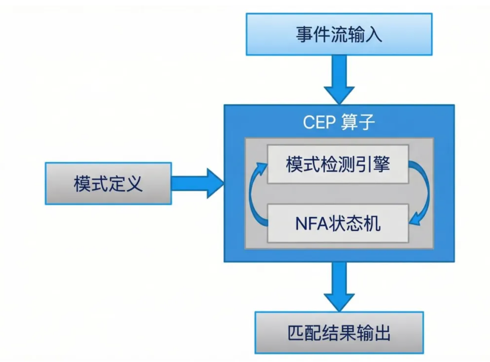
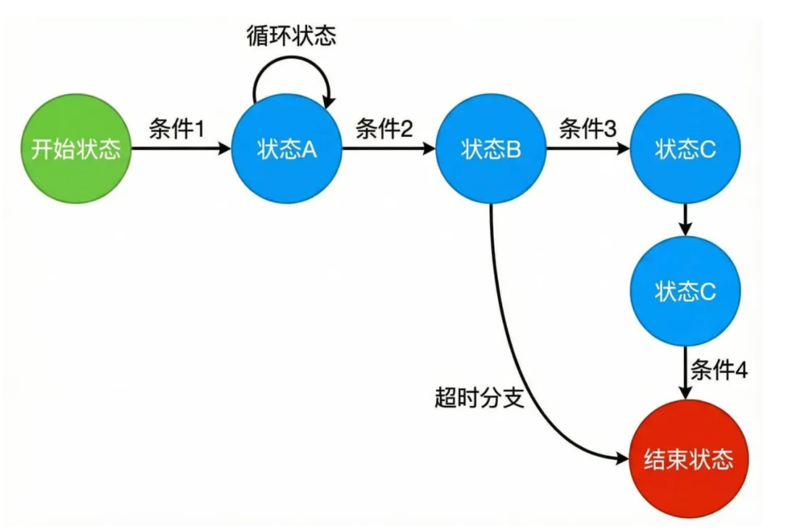
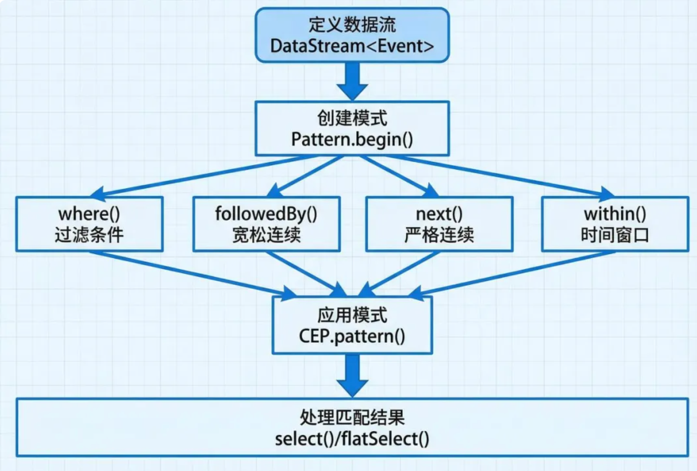
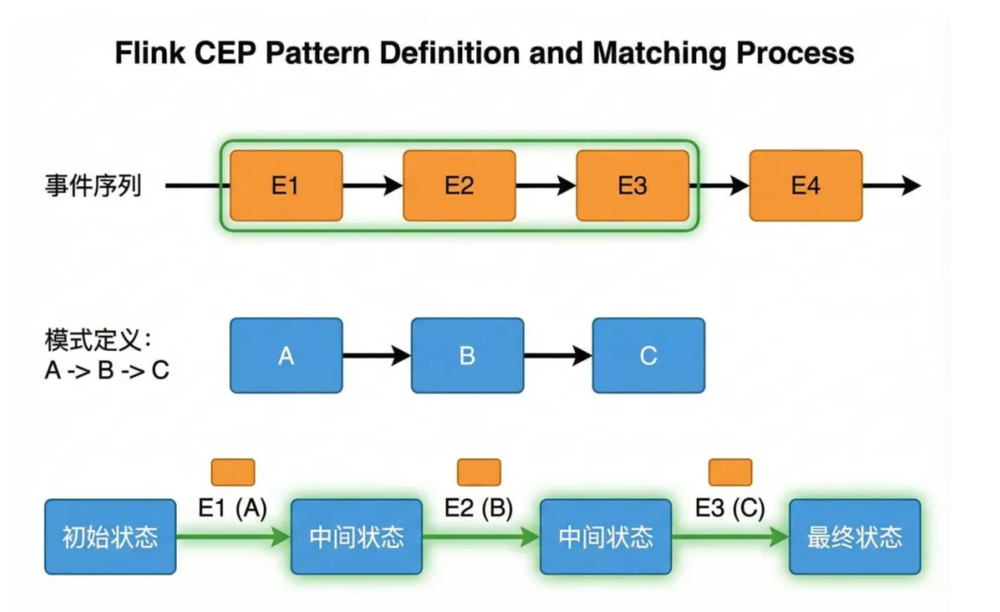
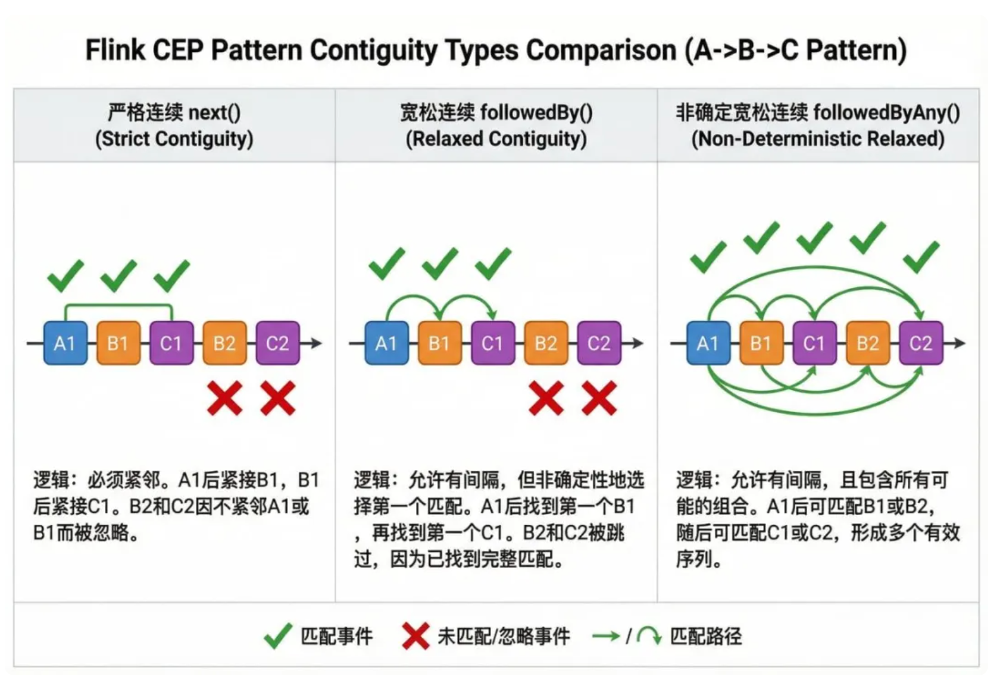

# 1.引言
>> Flink 作为业界领先的分布式流处理框架，其 CEP（Complex Event Processing，复杂事件处理）库为开发者提供了强大的模式检测和事件关联能力。  
> > Flink CEP 能够在海量的实时数据流中识别特定的事件模式，从而实现实时监控、异常检测、用户行为分析等关键业务场景

>> Flink CEP 的核心价值在于它能够从连续的事件流中发现有意义的事件序列模式。  
> > 与传统的基于规则的事件处理系统相比，Flink CEP 提供了更灵活、更高效的模式定义语言和匹配引擎，同时充分利用了 Flink 的分布式计算能力和容错机制，确保在大规模生产环境中的稳定运行

# 2.核心概念
> 2.1 事件流（Event Stream）
>> 在 Flink CEP 中，事件流是一系列按时间顺序到达的事件对象。每个事件都包含特定的属性和时间戳，这些属性用于模式匹配的条件判断。  
> > 事件流可以来自 Kafka、Kinesis 等消息队列，也可以是数据库变更日志或其他实时数据源

> 2.2 模式定义（Pattern Definition）
>> 模式是对事件序列特征的描述，定义了我们希望在事件流中检测的特定事件组合。  
> > Flink CEP 提供了丰富的 Pattern API，支持定义复杂的事件序列关系，包括顺序关系、时间约束、条件过滤等。


> 2.3 匹配逻辑（Matching Logic）
>> 匹配逻辑决定了如何从连续的事件流中识别符合模式定义的事件序列。  
> > Flink CEP 使用非确定性有限自动机（NFA）作为底层的匹配引擎，能够高效地处理复杂的模式匹配任务

# 3. 架构概览
>> Flink CEP 的整体架构设计充分体现了其作为流处理组件的特点，它无缝集成在 Flink 的 DataStream API 之上


> 如架构图所示，Flink CEP 的处理流程包含以下几个关键环节:

> > 1.事件流输入：来自上游 DataStream 的连续事件流

>> 2.模式定义：用户通过 Pattern API 定义的事件模式规则

>> 3.CEP 算子：核心处理单元，包含模式检测引擎和 NFA 状态机

>> 4.匹配结果输出：将检测到的匹配结果输出到下游处理逻辑

>> CEP 算子内部维护着复杂的状态信息，包括当前的匹配状态、部分匹配的事件序列、超时信息等。  
> > 这些状态由 Flink 的状态管理机制统一管理，确保在分布式环境下的一致性和容错能力

- NFA 状态机
>> 非确定性有限自动机（NFA）是 Flink CEP 模式匹配的核心引擎。NFA 通过状态转换的方式来追踪事件流中的模式匹配进度



- NFA 工作原理
> NFA 由以下几个关键组件构成：

>> 1.状态节点：代表模式匹配的不同阶段，包括开始状态、中间状态和结束状态

>> 2.转换边：定义了从一个状态到另一个状态的转换条件

>> 3.条件谓词：每条转换边上的过滤条件，决定事件是否满足转换要求

>> 4.超时分支：处理时间窗口约束，当事件在规定时间内未到达时触发

> > 当新事件到达时，NFA 会评估当前所有活跃状态，判断该事件是否满足任何状态的转换条件。如果满足，则创建新的状态实例并保存部分匹配的事件序列。这种非确定性的特点使得 NFA 可以同时追踪多个可能的匹配路径

- 状态管理
>> NFA 使用 Flink 的 KeyedState 来存储每个 key 的状态信息。这包括：

>> 当前活跃的状态集合

>> 每个状态对应的部分匹配事件序列

>> 时间窗口的超时信息

>> 版本号用于处理迟到事件

- Pattern API 详解
>> Flink CEP 提供了流式的 Pattern API，允许开发者以声明式的方式定义复杂的事件模式。



- 基本模式构建
>> Pattern API 的使用流程遵循构建者模式：

>> 1.定义数据流：首先获取 DataStream 对象

>> 2.创建模式：使用 Pattern.begin() 开始定义第一个模式

>> 3.添加条件：通过 where() 方法添加过滤条件

>> 4.定义序列关系：使用 next()、followedBy() 等方法定义事件间的关系

>> 5.设置时间窗口：通过 within() 方法限定时间范围

>> 6.应用模式：使用 CEP.pattern() 将模式应用到数据流

>> 7.处理结果：通过 select() 或 flatSelect() 提取匹配结果

- 常用 API 方法
> where()：定义事件的过滤条件

```
pattern.where(event -> event.getPrice() > 100) 
```

> or()：添加替代条件
```
pattern.where(event -> event.getType().equals("A")).or(event -> event.getType().equals("B")) 
```

> subtype()：基于子类型进行过滤
```
pattern.subtype(WarningEvent.class) 
```

> oneOrMore()：定义量词，表示一个或多个匹配
```
pattern.oneOrMore().optional() 

```

> times()：指定精确的重复次数
```
pattern.times(3)  // 精确匹配3次 
pattern.times(2, 4)  // 匹配2到4次 
```

- 模式匹配过程
> 理解模式匹配的执行过程对于优化 CEP 应用至关重要




- 匹配执行流程

>> 1.事件接收：当新事件 E1 到达时，CEP 算子首先检查该事件是否满足模式的初始状态条件

>> 2.状态转换：如果满足，创建一个新的 NFA 实例，进入第一个状态

>> 3.部分匹配存储：将 E1 存储为部分匹配的一部分，等待后续事件

>> 4.继续匹配：后续事件 E2、E3 依次到达，NFA 评估是否满足转换条件

>> 5.完整匹配：当事件序列完整匹配模式（如 A->B->C）时，触发匹配回调

>> 6.结果输出：将匹配的事件序列传递给 select 函数进行业务处理

>> 在这个过程中，NFA 可能同时维护多个处于不同匹配阶段的状态实例，这对应着不同的可能匹配路径


- 连续性策略
>> Flink CEP 提供了三种不同的连续性策略，用于定义模式中事件之间的关系。



- 严格连续（Strict Contiguity）
>> 使用 next() 方法定义严格连续关系，要求匹配的事件必须直接相邻，中间不能有任何其他事件

```
Pattern<event, ?=""> pattern = Pattern.<event>begin("first") 
    .where(event -> event.getType().equals("A")) 
    .next("second") 
    .where(event -> event.getType().equals("B")); 
</event></event,> 
```
>> 在严格连续模式下，如果事件序列为 A1, C1, B1，则不会产生匹配，因为 A1 和 B1 之间存在 C1

- 宽松连续（Relaxed Contiguity）
>> 使用 followedBy() 方法定义宽松连续关系，允许匹配的事件之间存在其他不相关的事件

```
Pattern<event, ?=""> pattern = Pattern.<event>begin("first") 
    .where(event -> event.getType().equals("A")) 
    .followedBy("second") 
    .where(event -> event.getType().equals("B")); 
</event></event,> 
```
>> 在宽松连续模式下，事件序列 A1, C1, B1 可以成功匹配，C1 会被忽略。

- 非确定宽松连续（Non-Deterministic Relaxed Contiguity）
>> 使用 followedByAny() 方法定义非确定宽松连续关系，这是最宽松的匹配策略，可以产生多个匹配结果。

```
Pattern<event, ?=""> pattern = Pattern.<event>begin("first") 
    .where(event -> event.getType().equals("A")) 
    .followedByAny("second") 
    .where(event -> event.getType().equals("B")); 
</event></event,> 
```

>> 对于事件序列 A1, B1, B2，非确定宽松连续会产生两个匹配：(A1, B1) 和 (A1, B2)

- 连续性策略选择
>> 选择合适的连续性策略需要根据具体业务场景：

>> 1. 严格连续适合需要精确事件顺序的场景，如协议解析

>> 2. 宽松连续适合一般的业务流程监控

>> 3. 非确定宽松连续适合需要发现所有可能匹配的场景，但要注意状态爆炸问题


- 时间约束
>> 时间约束是 CEP 模式的重要组成部分，用于限定事件序列必须在特定时间窗口内完成匹配。

- within() 时间窗口
>> within() 方法定义了从第一个事件到最后一个事件的最大时间跨度：

```
Pattern<event, ?=""> pattern = Pattern.<event>begin("first") 
    .where(event -> event.getType().equals("login")) 
    .followedBy("second") 
    .where(event -> event.getType().equals("purchase")) 
    .within(Time.minutes(10)); 
</event></event,> 
```

>> 上述模式要求 login 和 purchase 事件必须在 10 分钟内发生，否则该部分匹配会被丢弃

- 超时处理
>> Flink CEP 允许我们捕获超时的部分匹配，进行特殊处理
```
PatternStream<event> patternStream = CEP.pattern(input, pattern); 
OutputTag<string> timeoutTag = new OutputTag<string>("timeout"){}; 
SingleOutputStreamOperator<result> result = patternStream.select( 
    timeoutTag, 
    (pattern, timestamp) -> "Timeout: " + pattern.toString(), 
    pattern -> "Match: " + pattern.toString() 
); 
DataStream<string> timeoutStream = result.getSideOutput(timeoutTag); 
</string></result></string></string></event> 
```

>> 超时机制对于监控场景非常有用，例如检测用户在规定时间内未完成某个操作流程。

# 4.实际应用场景

- 4.1 欺诈检测
> 在金融行业，Flink CEP 可以实时检测可疑的交易模式：
```
Pattern<transaction, ?=""> fraudPattern = Pattern.<transaction>begin("first") 
    .where(txn -> txn.getAmount() < 1)  // 小额测试交易 
    .next("second") 
    .where(txn -> txn.getAmount() > 500)  // 紧接着大额交易 
    .within(Time.seconds(30)); 
</transaction></transaction,> 
```
>> 这个模式检测先进行小额测试交易、然后快速进行大额交易的欺诈行为

- 4.2 用户行为分析
> 电商平台可以分析用户的购物路径：
```
Pattern<userevent, ?=""> conversionPattern = Pattern.<userevent>begin("view") 
    .where(event -> event.getAction().equals("product_view")) 
    .followedBy("cart") 
    .where(event -> event.getAction().equals("add_to_cart")) 
    .followedBy("purchase") 
    .where(event -> event.getAction().equals("checkout")) 
    .within(Time.hours(24)); 
</userevent></userevent,> 
```
>> 通过这个模式，可以分析从浏览到购买的转化率，优化用户体验

- 4.3 系统监控
>> 监控分布式系统中的异常模式：

```
Pattern<logevent, ?=""> errorPattern = Pattern.<logevent>begin("warnings") 
    .where(log -> log.getLevel().equals("WARN")) 
    .times(3) 
    .followedBy("error") 
    .where(log -> log.getLevel().equals("ERROR")) 
    .within(Time.minutes(5)); 
</logevent></logevent,> 
```
>> 这个模式检测在 5 分钟内出现 3 次警告后紧跟错误的情况，可能预示着系统即将发生故障

# 代码示例

> 以下是一个完整的 Flink CEP 应用示例，监控温度传感器数据：

```
public class TemperatureMonitoring { 

    public static void main(String[] args) throws Exception { 

        StreamExecutionEnvironment env =  

            StreamExecutionEnvironment.getExecutionEnvironment(); 

         

        // 定义事件源 

        DataStream<temperatureevent> input = env 

            .addSource(new SensorSource()) 

            .keyBy(event -> event.getSensorId()); 

         

        // 定义模式：连续3次温度超过阈值 

        Pattern<temperatureevent, ?=""> warningPattern =  

            Pattern.<temperatureevent>begin("first") 

                .where(event -> event.getTemperature() > 80.0) 

                .next("second") 

                .where(event -> event.getTemperature() > 80.0) 

                .next("third") 

                .where(event -> event.getTemperature() > 80.0) 

                .within(Time.seconds(10)); 

         

        // 应用模式 

        PatternStream<temperatureevent> patternStream =  

            CEP.pattern(input, warningPattern); 

         

        // 处理匹配结果 

        DataStream<alert> alerts = patternStream.select( 

            (Map<string, list<temperatureevent="">> pattern) -> { 

                TemperatureEvent first = pattern.get("first").get(0); 

                return new Alert( 

                    first.getSensorId(), 

                    "Temperature too high!", 

                    System.currentTimeMillis() 

                ); 

            } 

        ); 

         

        // 输出告警 

        alerts.print(); 

         

        env.execute("Temperature Monitoring"); 

    } 

} 

</string,></alert></temperatureevent></temperatureevent></temperatureevent,></temperatureevent> 
```


# 最佳实践
- 1.性能优化
>> 1.1 合理设置并行度：CEP 算子的并行度直接影响处理能力，应根据事件流的 QPS 进行调整

>> 1.2 使用 KeyBy 分区：将相关事件路由到同一个并行实例，减少状态大小

>> 1.3 避免状态爆炸：谨慎使用 followedByAny() 和 oneOrMore()，这些操作可能产生大量中间状态

>> 1.4 设置合理的时间窗口：过长的时间窗口会导致状态累积，应根据业务需求设置合适的 within() 时间

- 2.状态管理
>> 2.1 启用 RocksDB 状态后端：对于大状态场景，使用 RocksDB 可以将状态存储到磁盘

>> 2.2 配置状态 TTL：为状态设置生存时间，自动清理过期数据

>> 2.3 监控状态大小：通过 Flink 的 Metrics 系统监控 CEP 算子的状态大小

>> 2.4 定期创建 Savepoint：在生产环境中定期保存检查点，确保可以从故障中恢复

- 3.模式设计
>> 3.1 先过滤后匹配：在模式的早期阶段使用 where() 过滤掉不相关的事件

>> 3.2 避免过于宽松的模式：宽松的模式会产生更多的中间状态和匹配结果

>> 3.3 合理使用量词：times() 和 oneOrMore() 会增加状态复杂度，应谨慎使用

>> 3.4 测试边界条件：充分测试超时、迟到事件等边界情况

# 结论
>> Apache Flink CEP 作为强大的复杂事件处理引擎，为实时流处理应用提供了丰富的模式匹配能力。  
> > 通过 NFA 状态机的高效实现、灵活的 Pattern API 设计以及与 Flink 生态的深度集成，CEP 能够在海量事件流中快速识别有意义的事件模式
