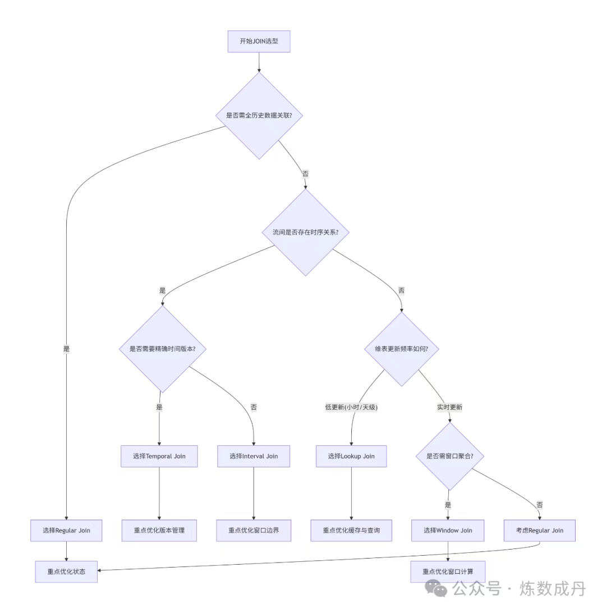
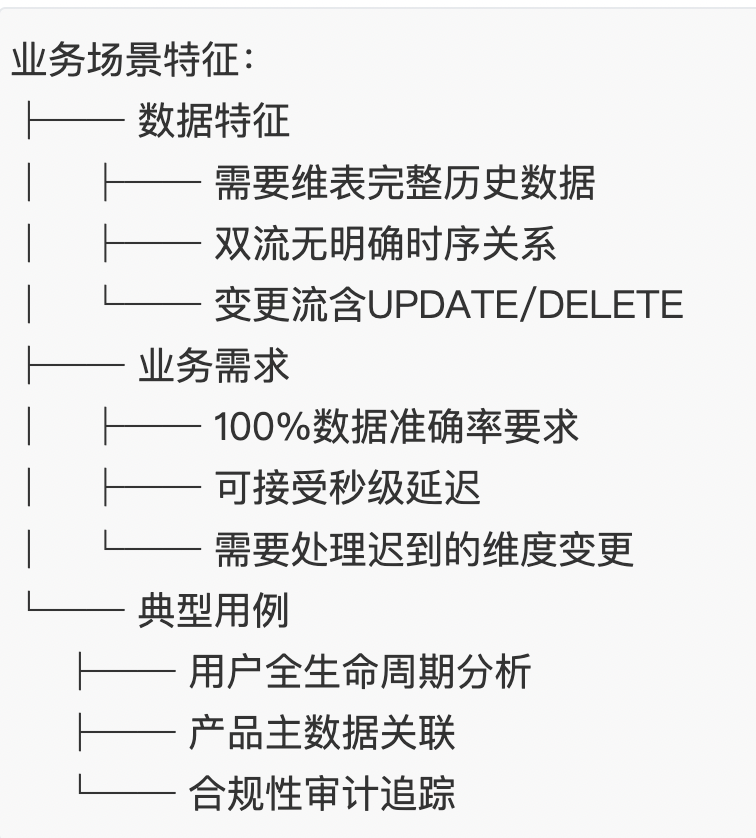
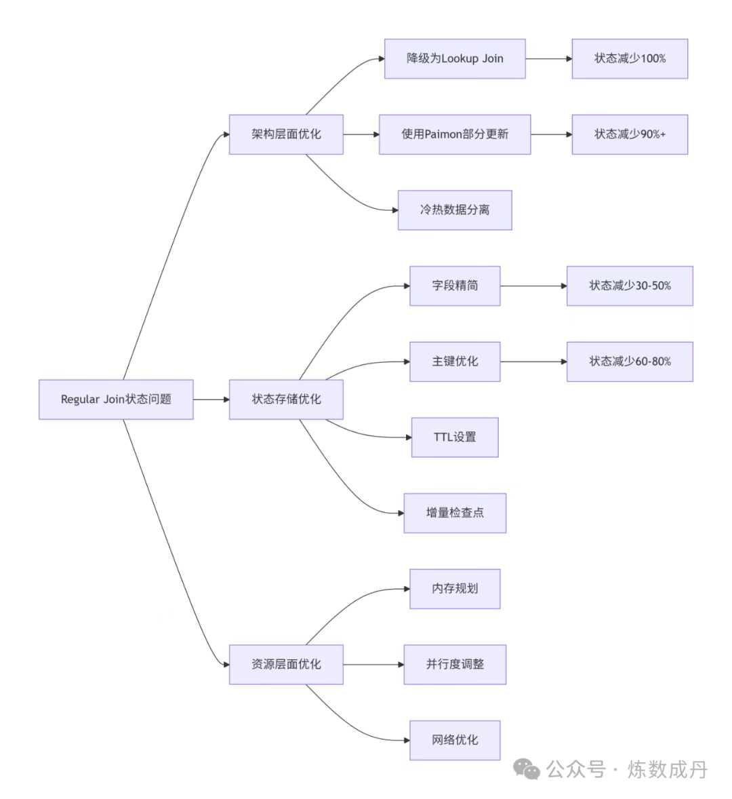
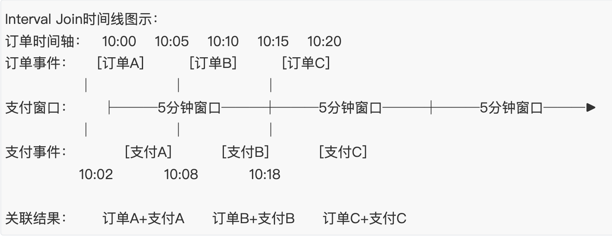
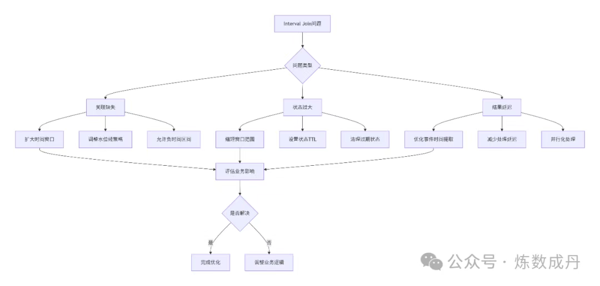
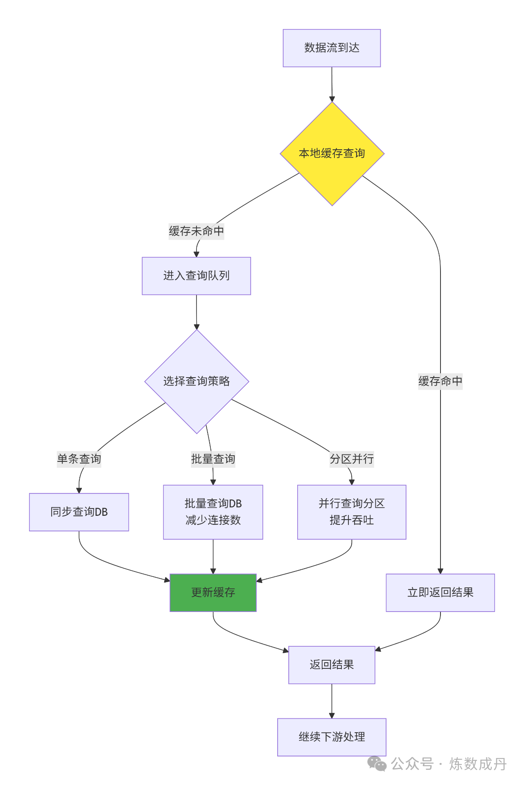

# 一、JOIN选型全景决策图

> 在实时数仓建设过程中，FlinkSQL的JOIN操作既是核心能力，也是性能瓶颈的主要来源。本文将深入剖析五大JOIN类型的适用场景、优化策略和监控体系，为您提供从开发到运维的完整SOP指南。



# 二、五大JOIN类型深度解析
> 1. Regular Join：全量关联的工程实践

> > 业务场景特征图



>> 状态优化路径



> > 生产配置示例

```
-- Regular Join生产优化配置
SET'table.exec.state.ttl' = '86400000'; -- 24小时TTL

-- RocksDB状态后端优化（可选）
SET'state.backend.rocksdb.block.cache-size' = '4g';
SET'state.backend.rocksdb.writebuffer.size' = '128mb';
SET'state.backend.rocksdb.level-compaction-dynamic-level-bytes' = 'true';
SET'state.backend.rocksdb.use-bloom-filter' = 'true';

-- 内存分配比例（针对8G TM）
SET'taskmanager.memory.task.heap.size' = '4096m';    -- 50%
SET'taskmanager.memory.managed.size' = '2048m';      -- 25%
SET'taskmanager.memory.network.min' = '512mb';       -- 6.25%
SET'taskmanager.memory.network.max' = '1024mb';      -- 12.5%
```

>> 监控指标体系

| 监控指标             | 正常范围 | 告警阈值 | 优化建议  |
|:--------------------|:-------|:--------|:--------|
| state.size          | < 50%可用内存       |  > 80%可用内存       |    启用压缩、调整TTL     |
| checkpoint.duration | < 1分钟       |   	> 3分钟      |  调整间隔、优化RocksDB       |
| lateRecords         |  	0-100/分钟      |  > 1000/分钟       |   调整水位线、放宽业务窗口      |
| backpressure                    |  0-20%      |   > 50%持续5分钟      |  	增加并行度、优化序列化       |

> 2.Interval Join：时序关联精准控制

>> 时间窗口管理


>> 关键配置与SQL模式

```
-- Interval Join最佳实践模板
SELECT
    o.order_id,
    o.order_time,
    p.payment_id,
    p.payment_time,
    -- 计算支付时长（秒）
    TIMESTAMPDIFF(SECOND, o.order_time, p.payment_time) as payment_duration,
    -- 业务状态判断
    CASE 
        WHEN TIMESTAMPDIFF(SECOND, o.order_time, p.payment_time) <= 300
            THEN 'normal_payment'
        ELSE 'delayed_payment'
    END as payment_status
FROM orders o
JOIN payments p ON o.order_id = p.order_id
AND p.payment_time BETWEEN
    o.order_time - INTERVAL '1' MINUTE  -- 允许支付稍早
    AND o.order_time + INTERVAL '10' MINUTE -- 10分钟支付窗口

-- 水位线与乱序处理配置
SET 'pipeline.auto-watermark-interval' = '200ms';
SET 'table.exec.source.idle-timeout' = '30s';  -- 防止空闲分区阻塞水位线
```

>> 窗口边界优化策略



>> 监控重点

```
Interval Join监控重点:
  time_window:
    metrics:
      - window_size_seconds: 实际窗口大小
      - matched_rate: 关联匹配率（目标>95%）
      - late_event_rate: 迟到事件比例（目标<5%）
    alerts:
      - 匹配率低于90%持续10分钟
      - 迟到事件超过20%

  state_management:
    metrics:
      - interval_state_size: 窗口状态大小
      - ttl_cleanup_count: TTL清理次数
    optimization:
      - 动态调整窗口边界
      - 智能TTL设置
```

> 3.Temporal Join：版本化维度关联

>> 版本管理架构


>> 双时间模式对比

```
-- 模式1：事件时间版本（精确但延迟）
SELECT
    o.order_id,
    o.order_timeas event_time,
    r.rateas historical_rate,
    r.update_timeas rate_effective_time
FROM orders o
LEFT JOIN currency_rates 
    FOR SYSTEM_TIME AS OF o.order_timeAS r
ON o.currency = r.currency;

-- 模式2：处理时间版本（低延迟但可能不准）
SELECT
    o.order_id,
    PROCTIME() as process_time,
    r.rateas current_rate,
    r.update_timeas rate_update_time
FROM orders o
LEFT JOIN currency_rates 
    FOR SYSTEM_TIME AS OF PROCTIME() AS r
ON o.currency = r.currency;

-- 模式3：混合模式（业务决策）
SELECT
    o.order_id,
    o.order_time,
    COALESCE(
        historical.rate,    -- 先尝试历史版本
        current.rate,       -- 再尝试当前版本
        1.0                 -- 默认值兜底
    ) as final_rate
FROM orders o
LEFT JOIN currency_rates 
    FOR SYSTEM_TIME AS OF o.order_timeAS historical
    ON o.currency = historical.currency
LEFT JOIN currency_rates 
    FOR SYSTEM_TIME AS OF PROCTIME() AS current
    ON o.currency = current.currency;
```

>> Hive维表情景优化
```
-- Hive分区表Temporal Join配置
SELECT
    o.*,
    d.*
FROM orders o
LEFT JOIN hive_catalog.db.dimension_table
/*+ OPTIONS(
    'streaming-source.enable'='true',
    'streaming-source.monitor-interval'='5min',
    'streaming-source.partition.include'='latest',
    'partition.time-extractor.timestamp-pattern'='$dt $hour:00:00',
    'streaming-source.partition-order'='create-time'
) */
FOR SYSTEM_TIME AS OF o.proc_timeAS d
ON o.dim_key = d.dim_key;
```

> 4. Lookup Join：外部维表高性能查询



>> 多级缓存配置

```
-- Lookup Join多级缓存配置模板
CREATE TABLE user_dimension (
    user_id BIGINT,
    attributes STRING,
    last_updated TIMESTAMP
) WITH (
    'connector' = 'jdbc',
    'url' = 'jdbc:mysql://mysql:3306/dim_db',
    'table-name' = 'user_info',
    
    -- 一级缓存：本地LRU缓存
    'lookup.cache.type' = 'LRU',
    'lookup.cache.max-rows' = '100000',     -- 10万条本地缓存
    'lookup.cache.ttl' = '10min',           -- 10分钟本地有效期
    
    -- 二级缓存：外部Redis缓存（如使用）
    'lookup.cache.external.enable' = 'true',
    'lookup.cache.external.type' = 'redis',
    'lookup.cache.external.ttl' = '1h',
    
    -- 查询优化
    'lookup.async' = 'true',                -- 异步查询
    'lookup.async.timeout' = '30s',         -- 异步超时
    'lookup.max-retries' = '3',             -- 最大重试
    'lookup.retry.interval' = '1s',         -- 重试间隔
    
    -- 批量查询优化
    'lookup.batch.size' = '1000',           -- 批量大小
    'lookup.batch.interval' = '100ms',      -- 批量间隔
    
    -- 连接池配置
    'connection.pool.size' = '20',
    'connection.max-retry-timeout' = '60s'
);
```

>> 数据倾斜解决方案
```
-- 方案1：随机后缀分散热点
SELECT
    t1.id,
    t1.data,
    t2.attribute
FROM source_table t1
JOIN dimension_table t2 
ON CONCAT(t1.key, '_', MOD(t1.key, 10)) = t2.key  -- 添加随机后缀

-- 方案2：小表广播
SELECT /*+ BROADCAST(small_table) */
    large_table.*,
    small_table.*
FROM large_table
JOIN small_table ON large_table.key = small_table.key

-- 方案3：预聚合热点数据
WITH hot_keys AS (
    SELECT key, COUNT(*) as freq
    FROM source_table
    WHERE processing_time > NOW() - INTERVAL '5' MINUTE
    GROUPBY key
    HAVINGCOUNT(*) > 1000  -- 定义热点阈值
)
SELECT
    s.*,
    CASE 
        WHEN h.keyISNOTNULL
            THEN d_hot.attribute  -- 热点走专用查询
        ELSE d_normal.attribute   -- 普通走正常查询
    END as attribute
FROM source_table s
LEFT JOIN hot_keys h ON s.key = h.key
LEFT JOIN dimension_hot d_hot ON s.key = d_hot.key
LEFT JOIN dimension_normal d_normal ON s.key = d_normal.key;
```

> 5. Window Join：时间窗口聚合关联
>> 窗口类型对比表

| 窗口类型 | 适用场景 | 状态大小 | 输出频率 | 典型SQL |
|:-------|:--------|:-------|:--------|:-------|
| 滚动窗口 | 固定时间段统计       |   中等      |  每个窗口结束时      |   TUMBLE(TABLE, INTERVAL '5' MINUTES)      |
| 滑动窗口 |  滑动时间统计      |   较大      |   滑动间隔     |   HOP(TABLE, INTERVAL '1' MINUTE, INTERVAL '5' MINUTES)      |
| 会话窗口 |  用户会话分析      |   不确定      |  会话结束时      |   SESSION(TABLE, INTERVAL '10' MINUTES)      |

> 生产级Window Join示例

```
-- 双流滑动窗口Join：5分钟窗口，每分钟滑动
SELECT
    L.user_id,
    L.window_start,
    L.window_end,
    COUNT(DISTINCT L.page_id) as browse_pages,
    COUNT(DISTINCT R.product_id) as cart_products,
    -- 转化率计算
    CASE 
        WHEN COUNT(DISTINCT L.page_id) > 0
            THEN COUNT(DISTINCT R.product_id) * 1.0 / COUNT(DISTINCT L.page_id)
        ELSE 0
    END as conversion_rate
FROM (
    SELECT
        user_id,
        page_id,
        event_time,
        window_start,
        window_end
    FROM TABLE(
        HOP(
            TABLE browse_logs,
            DESCRIPTOR(event_time),
            INTERVAL '1' MINUTE,   -- 滑动间隔
            INTERVAL '5' MINUTE    -- 窗口大小
        )
    )
) L
FULL JOIN (
    SELECT
        user_id,
        product_id,
        event_time,
        window_start,
        window_end
    FROM TABLE(
        HOP(
            TABLE cart_logs,
            DESCRIPTOR(event_time),
            INTERVAL '1' MINUTE,
            INTERVAL '5' MINUTE
        )
    )
) R
ON L.user_id = R.user_id
AND L.window_start = R.window_start
AND L.window_end = R.window_end
GROUP BY L.user_id, L.window_start, L.window_end;
```

> 窗口优化策略
```
Window Join优化配置:
  window_strategy:
    allowed_lateness: 30s        # 允许迟到数据
    early_fire_delay: 10s        # 提前触发（近似结果）
    late_fire_delay: 5s          # 迟到数据触发

  state_optimization:
    window_state_ttl: 1h         # 窗口状态保留
    cleanup_mode: incremental    # 增量清理
    compression: lz4             # 状态压缩

  performance_tuning:
    window_parallelism: auto     # 自动并行度
    pane_pre_aggregation: true   # 窗格预聚合
    watermark_idle_timeout: 30s  # 水位线空闲超时
```


# 全链路监控指标体系
> 1. 核心性能指标监控
```
实时任务健康度监控大盘：
===================================================
【任务状态】 Running (持续12小时)
【检查点】 成功率: 99.8% | 时长: 45s | 间隔: 30s
【吞吐】 输入: 12.5K/s | 输出: 11.8K/s | 延迟: 150ms
【资源】 CPU: 65% | 内存: 70% | 网络: 45%
【背压】 High: 0% | Low: 100%
===================================================

关键指标详情：
1. 输入吞吐监控
   numRecordsInPerSecond: 12,500 records/s
   numBytesInPerSecond: 8.2 MB/s
   currentInputWatermark: 2024-01-15 14:30:45

2. 处理延迟监控
   process_latency_p50: 120ms
   process_latency_p95: 250ms
   process_latency_p99: 450ms

3. 状态健康度
   total_state_size: 4.2GB
   checkpointed_size: 3.8GB
   state_ttl_cleanup: 1,250 records/min
```

> 2. JOIN专用监控指标
```
Regular Join监控:
  state_metrics:
    - join_state_size: JOIN状态总大小
    - left_state_size: 左流状态大小
    - right_state_size: 右流状态大小
    - state_growth_rate: 状态增长率（MB/小时）

  performance_metrics:
    - join_matched_rate: 关联匹配率
    - join_latency_p95: JOIN延迟P95
    - late_record_count: 迟到记录数

Interval Join监控:
  window_metrics:
    - window_effective_ratio: 窗口有效利用率
    - out_of_window_count: 超窗口事件数
    - early_event_count: 提前事件数

  accuracy_metrics:
    - interval_match_rate: 时间区间匹配率
    - missed_match_rate: 遗漏匹配率

Lookup Join监控:
  cache_metrics:
    - cache_hit_rate: 缓存命中率（目标>85%）
    - cache_eviction_count: 缓存淘汰数
    - cache_load_time_p95: 缓存加载时间

  external_metrics:
    - db_query_latency: 数据库查询延迟
    - db_error_rate: 数据库错误率
    - connection_pool_usage: 连接池使用率
```

> 3. 故障排查决策树


# 四、SOP执行清单
> 1. 开发阶段检查清单

>>JOIN选型符合业务场景需求

> > 状态大小预估并配置合理TTL

> > 资源需求评估完成

> > 异常处理逻辑完备

> > 监控指标埋点完成

> 2. 测试阶段验证清单

>>功能测试：关联准确性验证

> > 性能测试：吞吐量、延迟达标

> > 压力测试：峰值流量处理能力

> > 容错测试：故障恢复验证

> > 数据一致性测试：Exactly-Once语义验证


> 3. 上线阶段部署清单
>> 配置文件评审完成

> > 监控告警配置完成

> > 容灾方案准备就绪

> > 回滚方案准备就绪

> > 上线计划通知相关方


> 4.运维阶段巡检清单
>> 每周：状态大小分析、性能趋势分析

> > 每月：资源使用评估、配置优化回顾

> > 每季度：架构评审、技术债务清理


# 总结：FlinkSQL实时数仓开发的三大原则

>> 1.场景驱动原则：没有最好的JOIN，只有最适合场景的JOIN

>> 2.状态管理原则：状态是实时计算的灵魂，也是性能的瓶颈

>> 3.全链路监控原则：可观测性比高性能更重要


