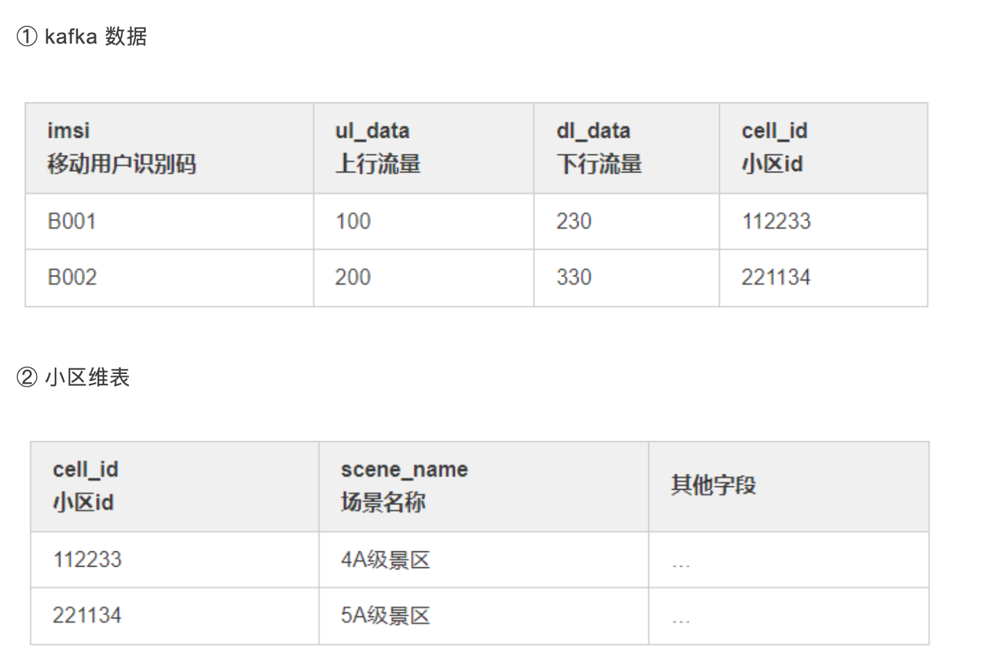
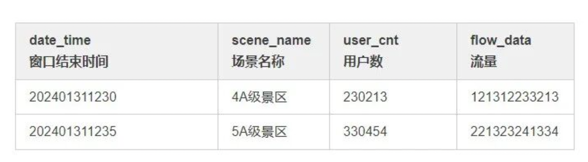

# 1.本文内容
>>  EventTime 和 ProcessTime 的使用、WaterMark 的使用、大数据量（一秒300MB）下维表 Join 的方案、定时器的使用、Flink DataStream 和 Flink Sql 的使用、Flink 任务调优

# 2.场景分析
> 2.1 数据来源
>> 主数据来源于 kafka
> > 维度数据来自于 Hive

> 2.2 数据格式


> 2.3 输出结果
>> 要求每5分钟统计一次用户数和流量（上行流量 + 下行流量），维度为scene_name，要求结果如下表:


> 2.4 需求解读
>> 从以上信息可以得出，这个需求的意图是：用 kafka 数据作为主流，关联小区维表，根据场景维度分组，计算 uv 和 flow_data
>> 需要注意的一点是维表会不定期更新，并不是一成不变的

# 3.实现过程
>> 拿到这个需求，首先想到的就是使用 look up join 维表，直接一个 SQL 就完事，然而过程并不像我们预料的这么简单
> > 由于项目历史问题，本次使用的Flink 版本为1.10，本次将分别使用 EventTime 和 ProcessingTime 两种时间语义来完成这个需求

> 3.1 使用异步 Join
>> 首先考虑使用 Flink SQL 基于 EventTime 来做这个需求，由于维表存在于 Hive 中，这里直接查询 Presto，效率会比较高，  
> > 维表关联使用的是 AsyncDataStream.unorderedWait 异步 join，用 Redis 做缓存，大体代码如下

```
public static void main(String[] args) throws Exception {     
    // 设置时间语义为processTime     
    env.setStreamTimeCharacteristic(TimeCharacteristic.ProcessingTime);     
    FlinkKafkaConsumer<String> fkc = KafkaUtil.getKafkaSource(source_topic, "source_group");     
    // 读取kafka数据流     
    SingleOutputStreamOperator<String> sourceDs = env.addSource(fkc).name(source_topic + "_source");     
    // 解析kafka数据     
    SingleOutputStreamOperator<SourceDpiHttp> mapDs = sourceDs.flatMap(new MultipleMessageParser(net_type)).name("multiple_message_parser");     
    // 关联小区场景维度表   
    SingleOutputStreamOperator<SourceDpiHttp> cellDimDs = AsyncDataStream.unorderedWait(mapDs, new DimAsyncFunction<SourceDpiHttp>(DataSourceType.PRESTO.name(), DIM_GZDP_XUNQI_CELL) {
        @SuppressWarnings("unchecked")        
        @Override        
        public Tuple2<String, String>[] getJoinCondition(SourceDpiHttp obj) {            
            Tuple2<String, String> tuple2 = Tuple2.of("id", String.valueOf(obj.getCellId()));           
             return new Tuple2[]{tuple2};        
        }
        
        @Override        
        public void join(SourceDpiHttp model, JSONObject dimInfo) {            
            model.setSceneName(dimInfo.getString("scene_name"));            
            model.setCellName(dimInfo.getString("cell_name"));            
            model.setCellType(dimInfo.getString("cell_type"));       
            }    
        }, 60, TimeUnit.SECONDS).name("cell_dim_join");    
        // 设置waterMark时间字段和窗口大小    
        // 此处使用当前时间作为eventTime   
         SingleOutputStreamOperator<SourceDpiHttp> wmStream = cellDimDs.assignTimestampsAndWatermarks(new AssignerWithPeriodicWatermarks<SourceDpiHttp>() {                
                private Long currentMaxTimestamp = 0L;
                @Override               
                public Watermark getCurrentWatermark() {                    
                    // 最大允许的消息延迟是0秒                    
                    Long maxOutOfOrderNess = 0L;                    
                    return new Watermark(currentMaxTimestamp - maxOutOfOrderNess);                
                }
                
                @Override                
                public long extractTimestamp(SourceDpiHttp item, long l) {                    
                    long timestamp = 0;                    
                    currentMaxTimestamp = Math.max(item.getEndTime(), currentMaxTimestamp);                    
                    return timestamp;                
                }            
                }).name("window_setting");    
                // 将流转换为table    
                Table table = tableEnv.fromDataStream(wmStream, "imsi,ulData,dlData,localCity,roamingType,cellId,cellName,sceneName,cellType,regionName,netType,rowtime.rowtime");    
                // 计算场景维度    
                String scene_sql = "select \n" +            
                     "    TUMBLE_START(rowtime, INTERVAL '" + window_size + "' SECOND) AS windowStart, \n" + 
                     "    netType, " +            
                     "    '' as dateTime,\n" +            
                     "    sceneName,\n" +            
                     "    count(distinct imsi) as userCnt,\n" +            
                     "    (sum(dlData)+sum(ulData)) as flowData\n" +            
                     "from " + table + "\n" +            "GROUP BY \n" +            
                     "    TUMBLE(rowtime, INTERVAL '" + window_size + "' SECOND), \n" +            
                     "    netType,\n" +            "    sceneName\n";    
                Table result_scene = tableEnv.sqlQuery(scene_sql);    
                // 类型转换映射    
                TypeInformation<CaSceneResult> sceneTypes = new TypeHint<CaSceneResult>() {    }.getTypeInfo();    
                // 将table转换为流并输出结果到kafka    
                SingleOutputStreamOperator<String> sceneMapDs = tableEnv.toAppendStream(result_scene, sceneTypes).map(new SceneDateTimeParser()).name(sinkTopic_scene + "_transfer");    
                sceneMapDs.addSink(KafkaUtil.getKafkaSink(sinkTopic_scene)).name(sinkTopic_cell + "_sink");    
                env.execute("main_cell_job");
             }
```

>> 这种方案看似很合理，其实存在一些问题
>>>> 1.由于是异步 join，需要数据源支持异步操作，如果不支持需要用使用多线程模拟异步操作，如果操作不当会出现并发问题以及对资源的滥用
> > > > 2.会对 presto 造成很大的压力
> > > > 3.上线会发现时区有问题

> 3.2 使用 DataStream
>> 为了解决时区问题，放弃了 Flink SQL 的写法，而是改用 DataStream，自己写代码来实现聚合指标，这次仍然使用的是 EventTime
```
public static void main(String[] args) throws Exception {    
    // 设置时间语义为eventTime    
    env.setStreamTimeCharacteristic(TimeCharacteristic.EventTime);
    FlinkKafkaConsumer<String> fkc = KafkaUtil.getKafkaSource(source_topic, consumerGroup);    
    // 读取kafka数据流    
    SingleOutputStreamOperator<String> sourceDs = env.addSource(fkc).name(source_topic + "_source").setParallelism(parallelism);    
    // 解析kafka数据    
    SingleOutputStreamOperator<SourceDpiHttp> mapDs = sourceDs.flatMap(new MultipleMessageParser()).setParallelism(parallelism).name("multiple_message_parser");    
    // 设置waterMark时间字段和窗口大小    
    SingleOutputStreamOperator<SourceDpiHttp> wmStream = mapDs.assignTimestampsAndWatermarks(new AssignerWithPeriodicWatermarks<SourceDpiHttp>() {                
                private Long currentMaxTimestamp = 0L;
                @Override                
                public Watermark getCurrentWatermark() {                    
                    // 最大允许的消息延迟是0秒                    
                    Long maxOutOfOrderNess = waterMark * 1000;                   
                    return new Watermark(currentMaxTimestamp - maxOutOfOrderNess);               
                }
                @Override                
                public long extractTimestamp(SourceDpiHttp item, long l) {                    
                    long timestamp = item.getEndTime();                    
                    currentMaxTimestamp = Math.max(timestamp, currentMaxTimestamp);                    
                    return timestamp;                
                }}).name("water_mark");    
                // 计算场景维度    
                SingleOutputStreamOperator<String> sceneResultStream = wmStream.keyBy((KeySelector<SourceDpiHttp, String>) SourceDpiHttp::getSceneName)
                    .window(TumblingEventTimeWindows.of(Time.minutes(5)))
                    .process(new ProcessWindowFunction<SourceDpiHttp, String, String, TimeWindow>() {                
                        @Override                
                        public void process(String sceneKey, ProcessWindowFunction<SourceDpiHttp, String, String, TimeWindow>.Context context, Iterable<SourceDpiHttp> iterable, Collector<String> collector) throws Exception {                    
                        try {                        
                            long flowData = 0;                        
                            Set<String> uvSet = new HashSet<>();                        
                            long windowEnd = context.window().getEnd();                        
                            for (SourceDpiHttp sourceDpiHttp : iterable) {                            
                                flowData += (sourceDpiHttp.getDlData() + sourceDpiHttp.getUlData());                            
                                uvSet.add(sourceDpiHttp.getImsi());                        
                            }                        
                            CaSceneResult result = new CaSceneResult();                        
                            result.setDateTime(new SimpleDateFormat("yyyyMMddHHmm").format(windowEnd));                        
                            result.setNetType(netType);                        
                            result.setSceneName(sceneKey);                        
                            result.setUserCnt((long) uvSet.size());                        
                            result.setFlowData(flowData);                        
                            collector.collect(JSON.toJSONString(result));                    
                        } catch (Exception e) {                        
                            logger.error("场景维度计算出错：", e);                    
                        }                
                    }});
                        sceneResultStream.addSink(KafkaUtil.getKafkaSink(sinkTopic)).name(sinkTopic + "_sink").setParallelism(sinkParallelism);    
                        env.execute("main_cell_job");
                    }
```


# 4.调优过程
> 4.1 checkpoint 调优
>> 由于数据量比较大，1秒钟 300MB 左右的数据，所以直接禁用了 checkpoint，因为数据源是 kafka，所以任务异常重启时会继续消费上次的 offset，所以去掉会提升一部分性能


> 4.2 设置合适的重试策略
> > 当网络原因等异常因素参与进来时，我们很难保障自己的程序能够稳定运行，万一程序异常重启了，不能让他直接挂掉，除非你有很强的监控，挂了立马能感知到，所以设置合理的任务重启策略是很重要的

> 4.3 调整并行度
>> 针对不同的算子，设置不同的并行度，比如开窗，做ETL都是比较耗时的操作，可以将并行度设置大一点，  
> > source并行度可以设置和kafka分区数一致或者一半，sink并行度可以设置小一点，因为聚合之后，数据量会很小，不需要太大的并行度

> 4.4  调整 task manager 的内存
> > 适当的增加 task manager 内存是很有必要的，不然可能数据量大的时候很容易造成 OOM，同时也要调整 slot 的数量，充分利用 task manager 的并行能力


> 4.5 调整 WaterMark
> > 如果使用了 EventTime，可以适当的调整乱序大小，防止数据丢失

> 4.5 调整 kafka 参数
>> 适当的调整 kafka consumer 参数，比如拉取的批次大小，拉取的数据量大小
