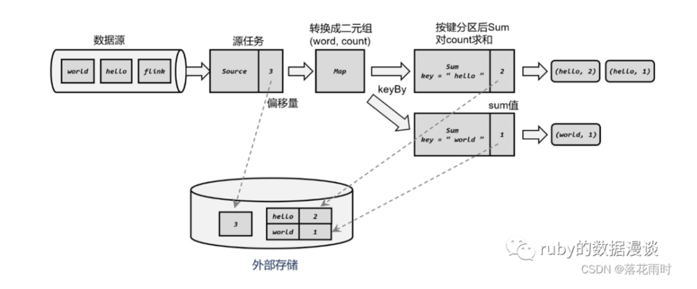
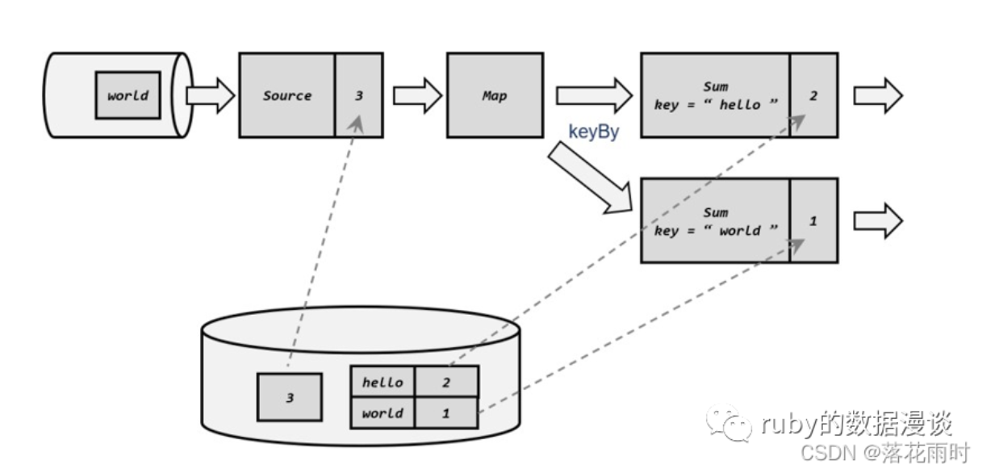
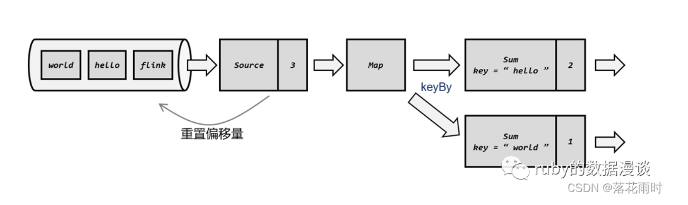
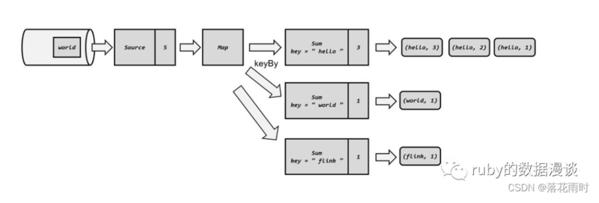

# Flink如何做容错

## 一、检查点（Checkpoint）
>> 在流处理中，我们可以用存档读档的思路，把之前的计算结果做个保存，这样重启之后就可以继续处理新数据、而不需要重新计算了。  
> > 进一步地，我们知道在有状态的流处理中， 任务继续处理新数据，并不需要“之前的计算结果”，而是需要任务“之前的状态”。  
> > 所以我们最终的选择，就是将之前某个时间点所有的状态保存下来，这份“存档”就是所谓的“检查点”（checkpoint）。  
> > 遇到故障重启的时候，我们可以从检查点中“读档”，恢复出之前的状态，这样就可以回到当时保存的一刻接着处理数据了。  
> > 检查点是 Flink 容错机制的核心。这里所谓的“检查”，其实是针对故障恢复的结果而言的：故障恢复之后继续处理的结果，  
> > 应该与发生故障前完全一致，我们需要“检查”结果的正确性。所以，有时又会把 checkpoint 叫作“一致性检查点”

## 二、Flink 利用检查点实现容错的流程
>> 1、源（Source）任务从外部数据源读取数据，并记录当前的偏移量，作为算子状态（Operator State）保存下来。  
> > 然后将数据发给下游的 Map 任务，它会将一个单词转换成(word, count)二元组，初始 count 都是 1，也就是(“hello”, 1)、(“world”, 1)这样的形式；  
> > 这是一个无状态的算子任务。进而以word 作为键（key）进行分区，调用.sum()方法就可以对 count 值进行求和统计了； Sum 算子会把当前求和的结果作为按键分区状态（Keyed State）保存下来。  
> > 最后得到的就是当前单词的频次统计(word, count)，如图所示

>> 1.当我们需要保存检查点（checkpoint）时，就是在所有任务处理完同一条数据后，对状态做个快照保存下来。  
> > 例如上图中，已经处理了 3 条数据：“hello”“world”“hello”，所以我们会看到 Source 算子的偏移量为 3；  
> > 后面的 Sum 算子处理完第三条数据“hello”之后，此时已经有 2 个“hello”和 1 个“world”，所以对应的状态为“hello”-> 2，“world”-> 1  
> > （这里 KeyedState底层会以 key-value 形式存储）。此时所有任务都已经处理完了前三个数据，所以我们可以把当前的状态保存成一个检查点，  
> > 写入外部存储中。至于具体保存到哪里，这是由状态后端的配置项“ 检查点存储 ”（ CheckpointStorage ）来决定的，  
> > 可以有作业管理器的堆内存（JobManagerCheckpointStorage）和文件系统（FileSystemCheckpointStorage）两种选择。  
> > 一般情况下，我们会将检查点写入持久化的分布式文件系统

>> 2.从检查点恢复状态
> > 遇到故障之后，第一步当然就是重启。我们将应用重新启动后，所有任务的状态会清空。  
> > 找到最近一次保存的检查点，从中读出每个算子任务状态的快照，分别填充到对应的状态中。  
> > 这样，Flink 内部所有任务的状态，就恢复到了保存检查点的那一时刻，也就是刚好处理完第三个数据的时候，  
> > 如图所示。这里 key 为“flink”并没有数据到来，所以初始为 0

>> 3、 重放数据
> > 从检查点恢复状态后还有一个问题：如果直接继续处理数据，那么保存检查点之后、到发生故障这段时间内的数据，  
> > 也就是第 4、5 个数据（“flink”“hello”）就相当于丢掉了；这会造成计算结果的错误
>> 为了不丢数据，我们应该从保存检查点后开始重新读取数据，这可以通过 Source 任务向外部数据源重新提交偏移量（offset）来实现，如图所示

接下来，我们就可以正常处理数据了。首先是重放第 4、5 个数据，然后继续读取后面的数据，如图所示

## 三、检查点配置说明
> 1、启用检查点
>> 默认情况下，Flink 程序是禁用检查点的。如果想要为 Flink 应用开启自动保存快照的功能，需要在代码中显式地调用执行环境的.enableCheckpointing()方法：  
> > 这里需要传入一个长整型的毫秒数，表示周期性保存检查点的间隔时间。如果不传参数直接启用检查点，默认的间隔周期为 500 毫秒，这种方式已经被弃用
>> 检查点的间隔时间是对处理性能和故障恢复速度的一个权衡。如果我们希望对性能的影响更小，  
> > 可以调大间隔时间；而如果希望故障重启后迅速赶上实时的数据处理，就需要将间隔时间设小一些

> 2、检查点存储（Checkpoint Storage）
> > 检查点具体的持久化存储位置，取决于“检查点存储”（CheckpointStorage）的设置。  
> > 默认情况下，检查点存储在 JobManager 的堆（heap）内存中。而对于大状态的持久化保存，Flink 也提供了在其他存储位置进行保存的接口，这就是CheckpointStorage
>> 具体可以通过调用检查点配置的.setCheckpointStorage() 来配置， 需要传入一个CheckpointStorage 的实现类。  
> > Flink 主要提供了两种 CheckpointStorage：作业管理器的堆（JobManagerCheckpointStorage）和文件系统（FileSystemCheckpointStorage）。  
> > 对于实际生产应用，我们一般会将 CheckpointStorage 配置为高可用的分布式文件系统（HDFS，S3 等）

> 3、检查点模式（CheckpointingMode）
> > 设置检查点一致性的保证级别，有“精确一次”（exactly-once）和“至少一次”（at-least-once）两个选项。  
> > 默认级别为exactly-once，而对于大多数低延迟的流处理程序，at-least-once 就够用了，而且处理效率会更高

> 4、超时时间（checkpointTimeout）
> > 用于指定检查点保存的超时时间，超时没完成就会被丢弃掉。传入一个长整型毫秒数作为参数，表示超时时间

> 5、最小间隔时间（minPauseBetweenCheckpoints）
> > 用于指定在上一个检查点完成之后，检查点协调器（checkpoint coordinator）最快等多久可以出发保存下一个检查点的指令。  
> > 这就意味着即使已经达到了周期触发的时间点，只要距离上一个检查点完成的间隔不够，就依然不能开启下一次检查点的保存。  
> > 这就为正常处理数据留下了充足的间隙。当指定这个参数时，maxConcurrentCheckpoints 的值强制为 1

> 6.最大并发检查点数量（maxConcurrentCheckpoints）
> > 用于指定运行中的检查点最多可以有多少个。由于每个任务的处理进度不同，完全可能出现后面的任务还没完成前一个检查点的保存、前面任务已经开始保存下一个检查点了。这个参数就是限制同时进行的最大数量

> 7.检查点异常时是否让整个任务失败（failOnCheckpointingErrors）
> > 用于指定在检查点发生异常的时候，是否应该让任务直接失败退出。默认为 true，如果设置为 false，则任务会丢弃掉检查点然后继续运行

