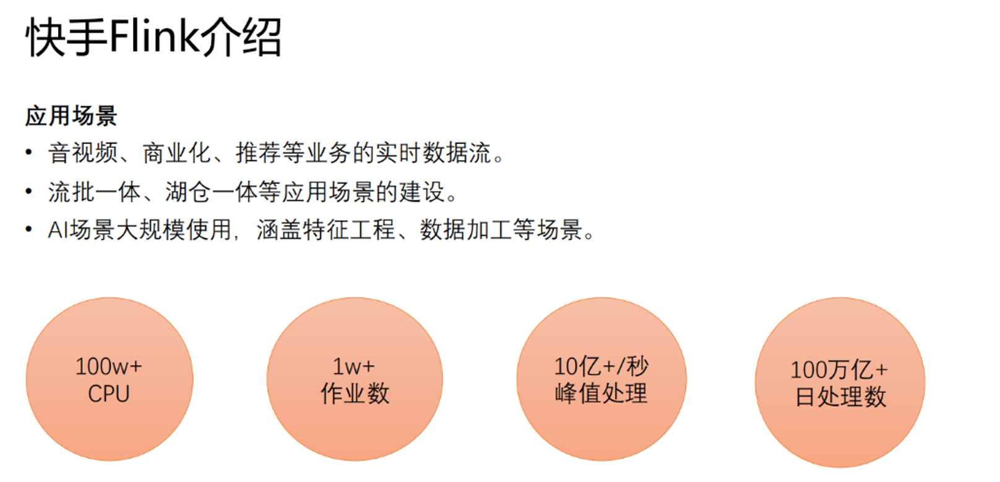
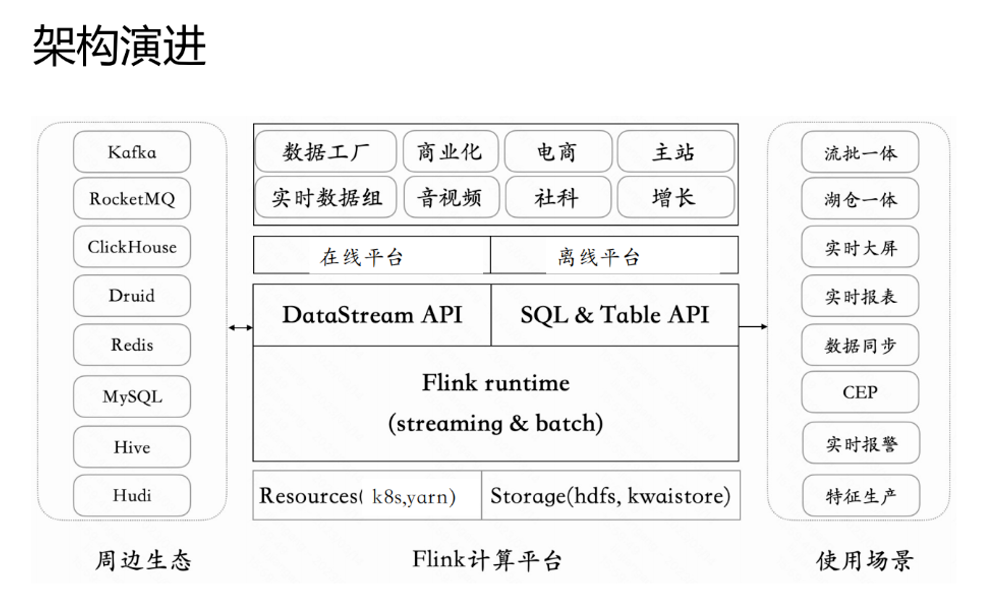
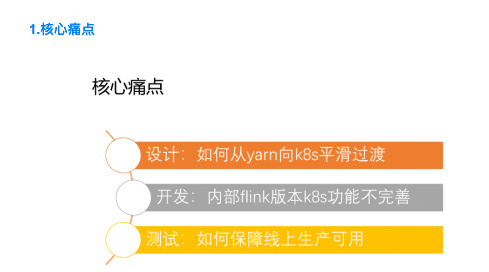
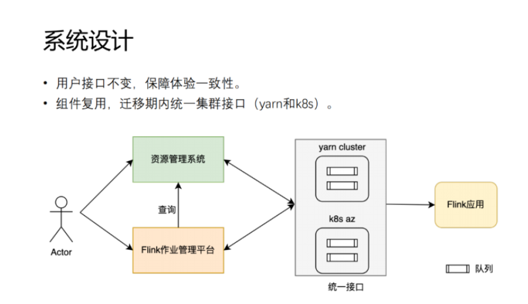
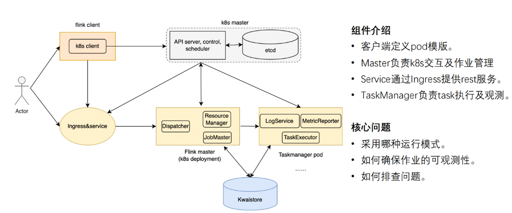
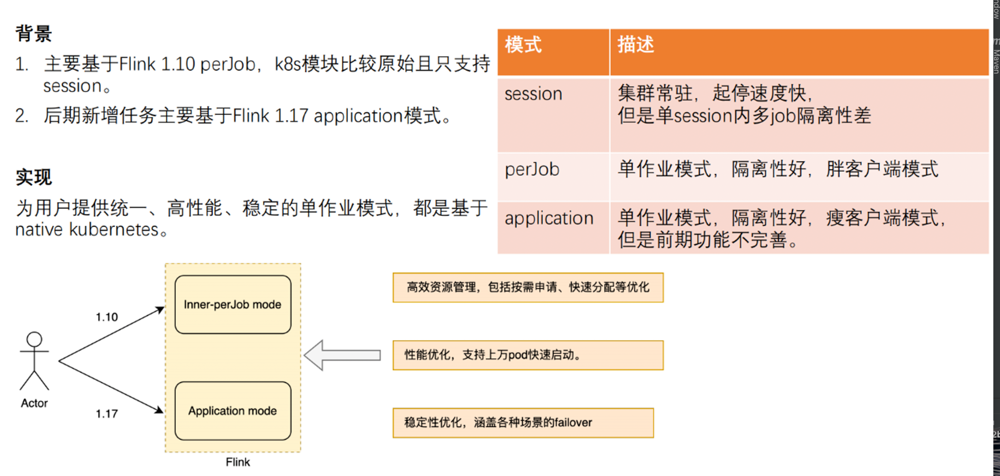
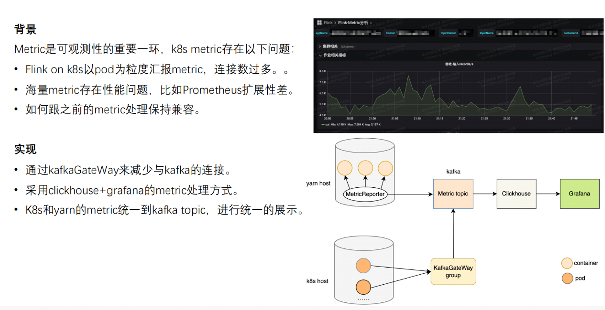
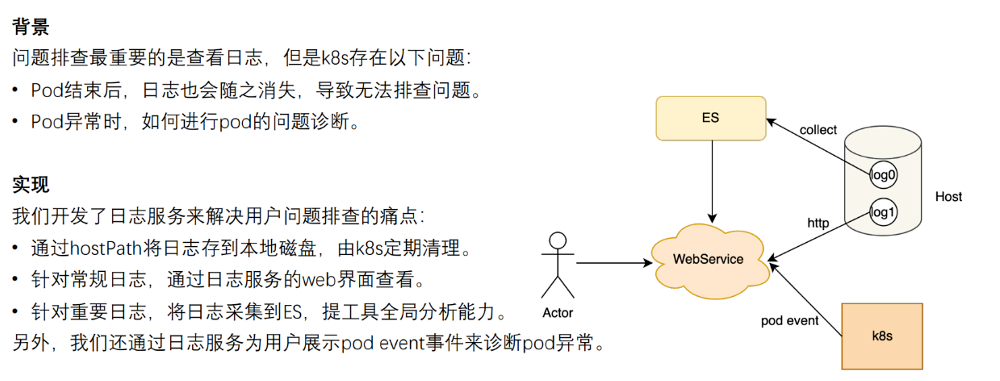

# 1.Flink 在快手的应用场景
>> 在实时数据流方面有广泛的应用，涵盖音视频、商业化推荐等核心业务；  
> > 基于Flink引擎进行流批一体、湖仓一体的建设；  
> > 在AI场景的大规模应用，涵盖特征工程，数据加工等场景；  
> > 当前Flink应用的规模，公司总的 CPU 核数是一百多万，Flink 作业数大概在1万到2 万之间，峰值处理能力超过 10 亿每秒，每天处理的数据量远远超过 100 万亿

# 2.Flink 架构演进

>> 2018年到2021年，Flink 主要使用 Yarn。主要原因是，在初期 Yarn 和 Flink 结合的比较好，Yarn 的调度性能较好，可以支撑上万节点的调度，而 K8s 在早期不能支持这么大的节点。另外 Yarn 可以有效的整合 Hadoop 生态，方便使用 HDFS 和 Hive。  
> > 2022到2023年，Flink 切换到 K8s。主要因为 K8s 是一个统一的云生态，有丰富的应用，是云生态基础架构发展的大趋势；另外在 K8s 上可以做统一的资源管理、统一的应用管理以及在离线混部等架构规划；最后，K8s 有很好的隔离性，能够提供更稳定的生产保障

# 当前整体架构

>>整体分为以下几层：  
> > 最底层是资源层和存储层，资源层使用 K8s 和 Yarn，存储采用 HDFS 和 Kwaistore；  
> > 计算层，基于 Flink Streaming&Batch 来提供统一的 runtime 层支持；  
> > 应用层，分为在线平台和离线平台；  
> > 最上层为业务层，涵盖公司的各大部门
> >

# 生产改造
>> 为了适应云原生的大趋势，我们进行了 Flink on k8s 的开发和迁移

>> 设计：如何从 Yarn 平滑过渡到 K8s，兼顾用户体验和系统设计。在用户层面做最小改动，避免用户造成额外学习的成本。在系统层面，资源层做统一抽象，确保平滑过渡。  
> > 开发：快手当前使用的 Flink 是1.10版本，该版本下的 K8s 有较多的功能和 bug 需要重构和完善

# 系统设计

>> 用户接口层，核心交互分为 Flink 作业管理平台和资源管理系统，接口对用户不变，客户只需要在使用的时候选择 yarn 或者 k8s 集群，就可以使用对应的平台。在底层的实现上，通过将 K8s 和 Yarn 做统一的封装，将 K8s 中的 AZ 和 Cluster 对齐，在 K8s 通过 CRD 自定义队列，映射到 Yarn 的队列，从而将 K8s 和 Yarn 做完全的映射。通过以上方式，实现了 Yarn 和 K8s 组件最大程度的复用，以此实现统一接口

# 功能开发

>> 整体架构分为3个部分：
> > 1.Flink client:主要负责定义 pod 模板，定义作业执行拓扑图，将作业提交到 K8s master 节点
> > 2.K8s master：分为控制和存储；控制层启动 Flink 任务 APP，做任务持久化操作，存储将信息存储到 ETCD，最终启动 Flink 的主节点
> > 3.Flink：
> > >> 3.1 Dispatcher：提交作业，实现 rest 服务；
> > > > 3.2 Resource Manager：作为统一资源调度，分为 Yarn 的 Resoure Manager 和 K8s 的 Resource Manager，负责实现不同资源的调度管理
> > > > 3.3 JobMaster：负责 job 的具体执行，同时向 Resource Manager 申请资源，并将作业部署到 Flink 的 task Manager上，然后通过 task Executor 执行节点任务
> > > > 3.4 LogService: 提供日志采集与查询服务
> > > > 3.5 MeticReporter：系统指标实时监控；
> > > > 3.6 Ingress&service: 对外提供 Flink 服务；
> > > > 3.7 Kwaistore：负责存储作业状态和数据。

> 运行模式

>> 运行模式分为三种：  
> > 1.session 模式：常驻集群，做长轮询监听新任务，执行新任务。这种模式下一个session 会有多个作业，会存在隔离性安全问题.  
> > 2.perJob 模式：单作业模式，胖客户端模式，隔离性较好。在快手中，主要以这种模式为主。  
> > 3.application 模式：单作业模式，瘦客户端模式，将启动压力分散到集群上，客户端压力较小。在项目前期，功能不完善，比如一些自定义 UDF 和 jar 包的加载出现问题，后期逐渐完善

>> 可观察测性

>> 可观测性对系统至关重要: Flink 通过 metric 获取 Flink 吞吐量、内存、CPU 和checkpoint 等信息，但是 K8s metric 存在以下问题：  
> > 1.Flink on K8s 以 pod 为粒度汇报 metric 资源，连接数过多，容易把 metric 系统打爆。  
> > 2.K8s Prometheus 监控在海量 metric 存在性能问题，扩展性差。  
> > 3.另外还需要考虑如何跟之前的 metric 处理保持兼容。在当前的系统中既有 Yarn 又有 K8s，在为用户提供统一视图的情况下，保持两者兼容

>> 具体实现
> > Flink on k8s 通过 KafkaGateWay 服务来进行局部的 metric 汇总，从而减少与 Kafka 的连接总数。  
> > 那么 yarn 和 k8s 这二者的 metric 是如何做到统一的呢？Yarn 的监控视图是以机器为粒度做了 local 的聚合，  
> > 然后发到 Kafka。K8s 在 kafka 和 flink 之间做了一层缓冲和聚合，然后再将 metric 发送给 Kafka。至此，metric 都统一汇总到了kafka，  
> > 后面再去接统一的 OLAP 引擎和 grafana 进行分析和展示

> >

>> 问题排查最重要的一环是查看日志，在 K8s 中，存在以下几个问题：  
> > 1.pod 结束之后，日志也会随着 pod 消失，导致作业结束之后无法查看日志；  
> > 2.pod 自身问题的诊断，比如 pod 没有启动起来。  
> > 我们的解决方法为：在每台机器上面部署一个日志服务，将日志和 pod 解绑，将日志写到 hostPath，  
> > 然后由 K8s 统一进行管理。通过搭建的 webservice 访问机器上的日志。对于用户高优或者个性化的需求，采集到 ES 上。  
> > 另外对 K8s 的 event 进行简化，通过日志服务暴露给用户。通过以上方式，用户自己可以查看日志，定位问题

