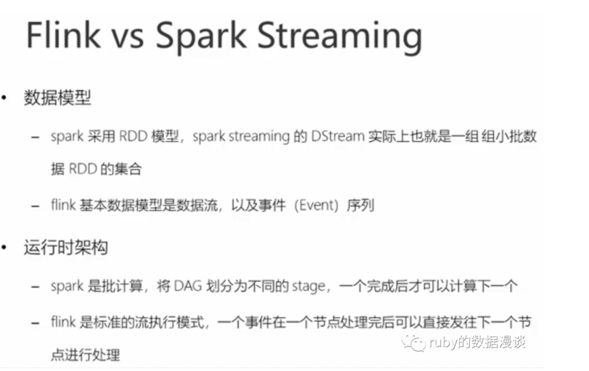

# 流处理
>> 流式处理（stream processing）是一种处理数据的方式，它允许连续不断地处理数据流，即时处理数据的每个输入。  
> > 流式处理通常在实时性要求较高的场景中使用，比如实时监控、实时分析等

# 批处理
>> 批处理（batch processing）是一种以固定大小的数据块（批量）为单位进行处理的方式。批处理通常在对数据有一定延迟要求且处理大量数据的场景中使用，例如离线分析、批量计算等。  
> > 批处理将数据分成批次进行处理，一次性处理一批数据，当所有数据处理完成后，批处理过程才会结束

## 区别
>> 1.数据结构不同，批处理采用的是rdd 模型即内存数据集结构，也是也是一个集合。而流式处理是一个事件序列结构
> > 2.处理的架构不同，主要的区别即架构层面的设计，spark  streaming 是微批处理，也不能算做是流式处理，批处理是必须等到一个状态完成之后才能发送给下一个节点执行，即中间有等待时间，而流式处理则不需要等待，一条数据也是可以处理的。这里面的处理包含统计和字符切分等等这种处理
> >

## flink引擎特点
>>  1. 低延迟：Flink针对实时处理场景进行优化，提供了低延迟的处理能力。它能够在毫秒级别的延迟下对数据流进行处理，适用于实时监控、实时分析等需要快速响应的场景
> > 2. 容错性：Flink具备高可靠性和容错性，能够自动处理故障和恢复。它通过数据重放和状态恢复机制来处理节点故障，并保证数据处理的准确性和一致性
> > 3. Exactly-once语义：Flink采用了精确一次处理（exactly-once）语义来保证数据处理的准确性。它能够确保每个事件只被处理一次，且状态始终保持一致，避免了重复处理和丢失处理的问题
> > 4. 支持非限定窗口：Flink支持基于事件时间（Event Time）的窗口操作，并且可以处理乱序事件。它能够对无界数据流进行窗口化操作，实现基于时间和事件的数据分析和处理
> > 5. 可扩展性：Flink能够水平扩展，支持在集群中添加更多的计算资源以应对处理的需求增长。它能够自动进行任务分配和负载均衡，充分利用可用资源

> 而Flink 可以作为流批一体的处理引擎主要是基于它的高级API ，Table API 和SQL 实现的，基本原理是

>> Flink的动态表可以存储在多种存储系统中， 在Flink中，动态表可以使用多种数据源，包括但不限于Kafka、HDFS、数据库（如MySQL、PostgreSQL等）以及其他支持SQL查询的存储系统。  
> > 使用Kafka作为动态表的存储介质有一些优势:
> > Kafka作为一个分布式流处理平台，提供了高吞吐量、持久性、可扩展性和容错性等特点。  
> > 它可以作为Flink动态表的输入源和输出目标，实现数据的实时传输和持久性存储。  
> > 同时，Flink提供了与Kafka的集成，能够方便地读取和写入Kafka主题（topic）中的数据。 然而，如何选择动态表的存储介质要根据具体的业务需求和系统架构进行综合考虑。根据数据规模、可用性、数据一致性和性能要求等因素，可以选择适合的存储介质来存储动态表数据