## Flink ClickHouse Sink：生产级高可用写入方案

[Flink ClickHouse Sink 生产级高可用写入方案](https://mp.weixin.qq.com/s/DLFf7Z4DYPHV0PSXaA023g)

### 目录
一、背景与痛点

    1.业务场景

    2.开源 Flink ClickHouse Sink 的痛点

    3.生产级方案的核心改进

    4.技术方案概览

二、核心架构设计

    1.架构图

    2.核心组件

    3.核心流程

三、本地表 vs 分布式表写入

    1.ClickHouse 表结构说明

    2.HikariCP 连接池配置

    3.ClickHouseLocalWriter：动态节点发现

    4.集群节点动态发现（ClusterIpsUtils）

    5.负载均衡优化

四、支持分表策略

    1.分片策略抽象

    2.日志分片实现

    3.按表（应用）维度的缓冲区

五、攒批与内存控制

    1.双触发机制

    2.批次大小计算

    3.带随机抖动的超时

    4.配置示例

六、写入限流与流量控制

    1.有界队列设计

    2.线程池并发控制

    3.WriterTask 消费逻辑

    4.配置参数

七、重试机制与超时控制

    1.Future 超时控制

    2.重试逻辑

    3.重试控制逻辑

    4.异常节点剔除

    5.重试流程图

八、异常处理模式

    1.两种 Sink 模式

    2.UnexceptionableSink（忽略异常 - At-Most-Once）

    3.ExceptionsThrowableSink（抛出异常 - At-Least-Once）

    4.Future 清理策略与并发控制

九、Checkpoint 语义保证

    1.为什么 Checkpoint 时必须 Flush？

    2.Flush 实现与并发协调

    3.等待所有 Future 完成

    4.三种 Flush 触发方式对比

    5. Checkpoint 参数配置

    6.语义保证

十、最佳实践与调优

    1.生产配置

    2.性能调优

    3.故障排查

十一、总结

    1.技术亮点

    2.Checkpoint 语义

    3.生产建议


> 一 背景与痛点
- 1.1 业务场景

>> 在实时大数据处理场景中，Flink + ClickHouse 的组合被广泛应用于：

>> 日志处理：海量应用日志实时写入分析库。

>> 监控分析：业务指标、APM 数据的实时聚合。


>> 这些场景的共同特点：

>> 数据量大：百万级 TPS，峰值可达千万级。

>> 写入延迟敏感：需要秒级可见。

>> 数据准确性要求高：不允许数据丢失。

>> 多表写入：不同数据根据分表策略写入不同的表。

- 1.2 开源 Flink ClickHouse Sink 的痛点:

>> Flink 官方提供的 ClickHouse Sink（flink-connector-jdbc）在生产环境中存在以下严重问题
> >
> > 痛点一：缺乏基于数据量的攒批机制
```

// Flink 官方 JDBC Sink 的实现
public class JdbcSink<T> extends RichSinkFunction<T> {
    private final int batchSize;  // 固定批次大小
    @Override
    public void invoke(T value, Context context) {
        bufferedValues.add(value);
        if (bufferedValues.size() >= batchSize) {
            // 只能基于记录数攒批，无法基于数据量
            flush();
        }
    }

```

>> 带来的问题：
> >
> > 1.内存占用不可控：100 条 1KB 的日志和 100 条 10MB 的日志占用内存差距 100 倍
> >
> > 2.OOM 风险高：大日志记录（如堆栈转储）会迅速撑爆内存
> >
> > 3.写入性能差：无法根据记录大小动态调整批次，导致小记录批次过大浪费网络开销

>> 痛点二：无法支持动态表结构
> >
> > 问题表现：
> >
```

// Flink 官方 Sink 只能写入固定表
public class JdbcSink {
    private final String sql;  // 固定的 INSERT SQL
    public JdbcSink(String jdbcUrl, String sql, ...) {
        this.sql = sql;  // 硬编码的表结构
    }
}
```
>> 带来的问题：
> >
> > 1.多应用无法隔离：所有应用的数据写入同一张表，通过特定分表策略区分
> >
> > 2.扩展性差：新增应用需要手动建表，无法动态路由
> >
> > 3.性能瓶颈：单表数据量过大（百亿级），查询和写入性能急剧下降

>> 痛点三：分布式表写入性能问题
>> 问题表现：
> >
```
// 大多数生产实现直接写入分布式表
INSERT INTO distributed_table_all VALUES (...)
```
>> ClickHouse 分布式表的工作原理：

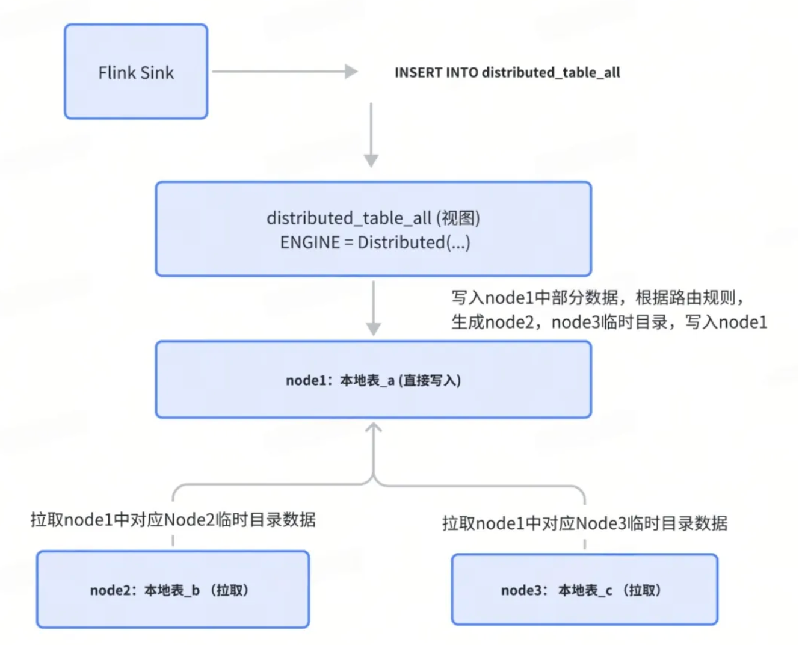

>>带来的问题：
> >
> > 1.网络开销大：数据需要经过分布式表层转发，延迟增加
> >
> > 2.写入性能差：分布式表增加了路由和转发逻辑，吞吐量降低
> >
> > 3.热点问题：所有数据先到分布式表节点，再转发，造成单点瓶颈

>> 生产级方案的核心改进
> >
> > 针对以上痛点，本方案提供了以下核心改进：
> >
> > 改进一：基于数据量的攒批机制
> >
```
public class ClickHouseSinkCounter {
    private Long metaSize;  // 累计数据量（字节）
    public void add(LogModel value) {
        this.values.add(value);
        this.metaSize += value.getMetaSize();  // 累加数据量
    }
}
// 触发条件
private boolean flushCondition(String application) {
    return checkMetaSize(application)  // metaSize >= 10000 字节
        || checkTime(application);     // 或超时 30 秒
}
```

>> 优势：
> >
> > 内存可控：根据数据量而非记录数攒批。
> >
> > 精确控制：1KB 的记录攒 10000 条 = 10MB，1MB 的记录攒 10 条 = 10MB
> >
> > 避免OOM：大日志记录不会撑爆内存
> >

>> 改进二：动态表结构与分片策略
```

public abstract class ClickHouseShardStrategy<T> {
    public abstract String getTableName(T data);
}
//日志侧实现为应用级分表
public class LogClickHouseShardStrategy extends ClickHouseShardStrategy<String> {
    @Override
    public String getTableName(String application) {
        // 动态路由：order-service → tb_logs_order_service
        return String.format("tb_logs_%s", application);
    }
}
```

>> 优势：
> > 应用隔离：日志侧内置应用级分表，每个应用独立分表
> >
> > 动态路由：根据 application 自动路由到目标表
> >
> > 扩展性强：新增应用无需手动建表（配合 ClickHouse 自动建表）

>> 改进三：本地表写入 + 动态节点发现
```
public class ClickHouseLocalWriter extends ClickHouseWriter {
    // 直接写本地表，避免分布式表转发
    private final ConcurrentMap<String, HikariDataSource> dataSourceMap;
    @Override
    public HikariDataSource getNextDataSource(Set<String> exceptionHosts) {
        // 1. 动态获取集群节点列表
        List<String> healthyHosts = getHealthyHosts(exceptionHosts);
        // 2. 随机选择健康节点
        return dataSourceMap.get(healthyHosts.get(random.nextInt(size)));
    }
}
```
>> 优势：
> >
> > 性能提升：直接写本地表，避免网络转发。
> >
> > 高可用：动态节点发现 + 故障节点剔除。
> >
> > 负载均衡：随机选择 + Shuffle 初始化。

- 技术方案概览
>> 基于以上改进，本方案提供了以下核心能力：
> >
> > 1.本地表/分布式表写入：性能优化与高可用平衡
> >
> > 2.分片策略：按应用维度路由与隔离
> >
> > 3.攒批与内存控制：双触发机制（数据量 + 超时）
> >
> > 4.流量控制与限流：有界队列 + 连接池
> >
> > 5.健壮的重试机制：递归重试 + 故障节点剔除
> >
> > 6.Checkpoint 语义保证：At-Least-Once 数据一致性。

- 核心架构设计

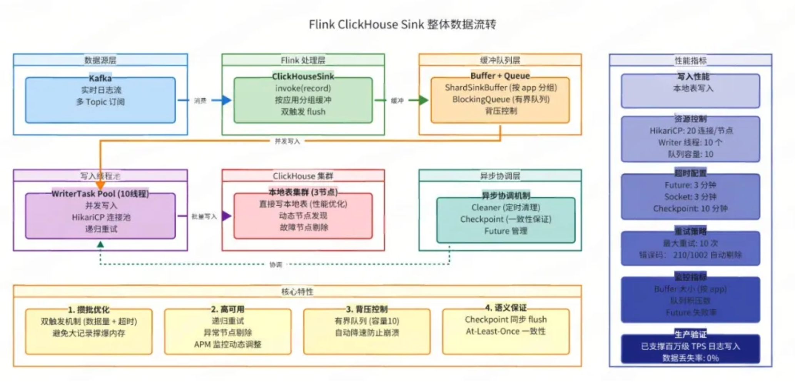

>> 核心组件
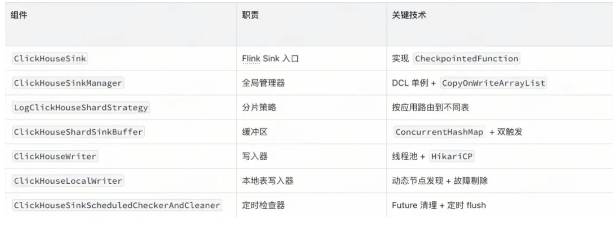

>> 核心流程

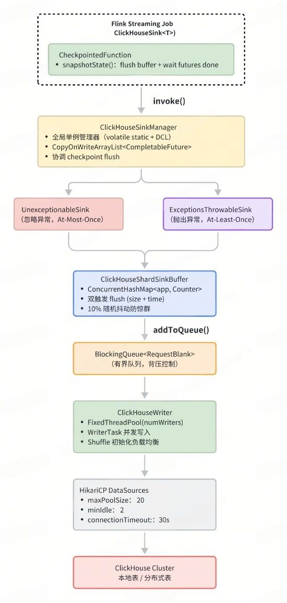

> 本地表 vs 分布式表写入
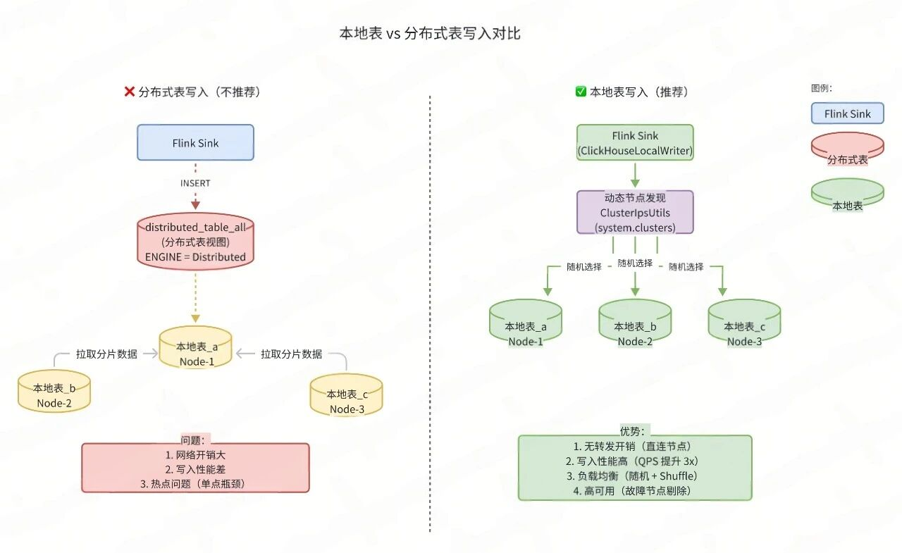

>> ClickHouse 表结构说明
>>
>> ClickHouse 推荐直接写本地表，原因：
> >
> > 1.写入性能：避免分布式表的网络分发。
> >
> > 2.数据一致性：直接写入目标节点，减少中间环节故障点，比分布式表写入更安全，利于工程化
> >
> > 3.负载均衡：客户端路由实现负载分散

```

-- 本地表（实际存储数据）
CREATE TABLE tb_logs_local ON CLUSTER 'default' (
    application String,
    environment String,
    message String,
    log_time DateTime
) ENGINE = MergeTree()
PARTITION BY toYYYYMM(log_time)
ORDER BY (application, log_time);
-- 分布式表（逻辑视图，不存储数据）
CREATE TABLE tb_logs_all ON CLUSTER 'default' AS tb_logs_local
ENGINE = Distributed('default', dw_log, tb_logs_local, cityHash64(application));
```

- HikariCP 连接池配置
```

// HikariCP 连接池配置
public class ClickHouseDataSourceUtils {
    private static HikariConfig getHikariConfig(DataSourceImpl dataSource) {
        HikariConfig config = new HikariConfig();
        config.setConnectionTimeout(30000L);    // 连接超时 30s
        config.setMaximumPoolSize(20);          // 最大连接数 20
        config.setMinimumIdle(2);               // 最小空闲 2
        config.setDataSource(dataSource);
        return config;
    }
    private static Properties getClickHouseProperties(ClickHouseSinkCommonParams params) {
        Properties props = new Properties();
        props.setProperty("user", params.getUser());
        props.setProperty("password", params.getPassword());
        props.setProperty("database", params.getDatabase());
        props.setProperty("socket_timeout", "180000");      // Socket 超时 3 分钟
        props.setProperty("socket_keepalive", "true");      // 保持连接
        props.setProperty("http_connection_provider", "APACHE_HTTP_CLIENT");
        return props;
    }
}
```

>> 配置说明：
> >
> > maxPoolSize=20：每个 ClickHouse 节点最多 20 个连接
> >
> > minIdle=2：保持 2 个空闲连接，避免频繁创建
> >
> > socket_timeout=180s：Socket 超时 3 分钟，防止长时间查询阻塞。

> ClickHouseLocalWriter：动态节点发现
```
public class ClickHouseLocalWriter extends ClickHouseWriter {
    // 本地节点缓存，按 IP 维护
    private final ConcurrentMap<String, HikariDataSource> dataSourceMap;
    // 动态获取集群本地表节点
    private final ClusterIpsUtils clusterIpsUtils;
    // IP 变更标志（CAS 锁，避免并发更新）
    private static final AtomicBoolean IP_CHANGING = new AtomicBoolean(false);
    @Override
    public HikariDataSource getNextDataSource(Set<String> exceptionHosts) {
        // 1️⃣ 检测集群节点变化（通过 CAS 避免并发更新）
        if (clusterIpsChanged() && IP_CHANGING.compareAndSet(false, true)) {
            try {
                ipChanged(); // 动态更新 dataSourceMap
            } finally {
                IP_CHANGING.set(false);
            }
        }
        // 2️⃣ 获取异常节点列表（从 Redis + APM 实时查询）
        Set<String> exceptIps = clusterIpsUtils.getExceptIps();
        exceptIps.addAll(exceptionHosts);
        // 3️⃣ 过滤健康节点，随机选择
        List<String> healthyHosts = dataSourceMap.keySet().stream()
            .filter(host -> !exceptIps.contains(host))
            .collect(Collectors.toList());
        if (CollectionUtils.isEmpty(healthyHosts)) {
            throw new RuntimeException("Can't get datasource from local cache");
        }
        return dataSourceMap.get(healthyHosts.get(random.nextInt(healthyHosts.size())));
    }
    private void ipChanged() {
        List<String> clusterIps = clusterIpsUtils.getClusterIps();
        // 新增节点：自动创建连接池
        clusterIps.forEach(ip ->
            dataSourceMap.computeIfAbsent(ip, v ->
                createHikariDataSource(ip, port)
            )
        );
        // 移除下线节点：关闭连接池
        dataSourceMap.forEach((ip, ds) -> {
            if (!clusterIps.contains(ip)) {
                dataSourceMap.remove(ip);
                ds.close();
            }
        });
    }
}
```

>> 核心逻辑：
> > 1.动态节点发现：从 system.clusters 查询所有节点
> >
> > 2.自动扩缩容：节点上线自动加入，下线自动剔除
> >
> > 3.故障节点剔除：通过 APM 监控，自动剔除异常节点
> >
> > 4.负载均衡：随机选择健康节点，避免热点

- 集群节点动态发现（ClusterIpsUtils）
```
public class ClusterIpsUtils {
    // 从 system.clusters 查询所有节点
    private static final String QUERY_CLUSTER_IPS =
        "select host_address from system.clusters where cluster = 'default'";
    // LoadingCache：定时刷新节点列表（1 小时）
    private final LoadingCache<String, List<String>> clusterIpsCache =
        CacheBuilder.newBuilder()
            .expireAfterAccess(10, TimeUnit.HOURS)
            .refreshAfterWrite(1, TimeUnit.HOURS)
            .build(CacheLoader.asyncReloading(new CacheLoader<>() {
                @Override
                public List<String> load(String dbName) {
                    return queryClusterIps();  // 定时刷新节点列表
                }
            }));
    // 异常节点缓存（1 分钟刷新）
    private final LoadingCache<String, FlinkExceptIpModel> exceptIpsCache =
        CacheBuilder.newBuilder()
            .refreshAfterWrite(1, TimeUnit.MINUTES)
            .build(CacheLoader.asyncReloading(new CacheLoader<>() {
                @Override
                public FlinkExceptIpModel load(String dbName) {
                    return queryExceptIp();  // 从 Redis + APM 查询异常节点
                }
            }));
}
```
>> 异常节点监控策略：
> >
> > 磁盘使用率 >= 90%：从 APM 查询 Prometheus 指标，自动加入黑名单
> >
> > HTTP 连接数 >= 50：连接数过多说明节点压力大，自动加入黑名单
> >
> > 人工配置：通过 Redis 配置手动剔除节点

>> 数据来源：
> > 1.ClickHouse system.clusters 表：获取所有集群节点
> >
> > 2.APM Prometheus 接口：监控节点健康状态
> >
> > 3.Redis 缓存：人工配置的异常节点

- 负载均衡优化
```
public class ClickHouseWriter {
    public <T> ClickHouseWriter(...) {
        // Shuffle：随机打乱数据源顺序
        Collections.shuffle(clickHouseDataSources);
        this.clickHouseDataSources = clickHouseDataSources;
    }
    public HikariDataSource getNextDataSource(Set<String> exceptionHosts) {
        // 轮询 + 随机选择（已 shuffle，避免热点）
        int current = this.currentRandom.getAndIncrement();
        if (current >= clickHouseDataSources.size()) {
            this.currentRandom.set(0);
        }
        return clickHouseDataSources.get(currentRandom.get());
    }
}
```

>> 优势：
> >
> > 初始化时 shuffle，避免所有 writer 同时从第一个节点开始
> >
> > 轮询 + 随机选择，负载分散更均匀
> >
> > 故障节点自动剔除

- 支持分表策略
>> 分片策略抽象:
```

public abstract class ClickHouseShardStrategy<T> {
    private String tableName;      // 表名模板，如 "tb_log_%s"
    private Integer tableCount;    // 分表数量
    // 根据数据决定目标表名
    public abstract String getTableName(T data);
}
```

>> 日志分片实现

```
public class LogClickHouseShardStrategy extends ClickHouseShardStrategy<String> {
    @Override
    public String getTableName(String application) {
        // 表名格式：tb_log_{application}
        // 例如：application = "order-service" -> table = "tb_log_order_service"
        return String.format(
            this.getTableName(),
            application.replace("-", "_").toLowerCase()
        );
    }
}
```

- 按表（应用）维度的缓冲区

>> 日志侧维度降级为应用名称维度缓冲区，实则因为按照应用分表，
>> 业务方可使用自身分表策略携带表名元数据，进行表维度缓冲

```
public class ClickHouseShardSinkBuffer {
    // 按 application 分组的缓冲区（ConcurrentHashMap 保证并发安全）
    private final ConcurrentHashMap<String, ClickHouseSinkCounter> localValues;
    public void put(LogModel value) {
        String application = value.getApplication();
        // 1️⃣ 检查是否需要 flush
        if (flushCondition(application)) {
            addToQueue(application); // 触发写入
        }
        // 2️⃣ 添加到缓冲区（线程安全的 compute 操作）
        localValues.compute(application, (k, v) -> {
            if (v == null) v = new ClickHouseSinkCounter();
            v.add(value);
            return v;
        });
    }
    private void addToQueue(String application) {
        localValues.computeIfPresent(application, (k, v) -> {
            // 深拷贝并清空（避免并发修改异常）
            List<LogModel> deepCopy = v.copyValuesAndClear();
            // 构造请求 Blank：application + targetTable + values
            String targetTable = shardStrategy.getTableName(application);
            ClickHouseRequestBlank blank = new ClickHouseRequestBlank(deepCopy, application, targetTable);
            // 放入队列
            writer.put(blank);
            return v;
        });
    }
}
```

>> 核心设计：
> >
> > 1.应用隔离：每个表（应用）独立的 buffer，互不影响。
> >
> > 2.线程安全：使用 ConcurrentHashMap.compute()保证并发安全
> >
> > 3.深拷贝：List.copyOf() 创建不可变副本，避免并发修改
> >
> > 4.批量清空：一次性取出所有数据，清空计数器

- 攒批与内存控制
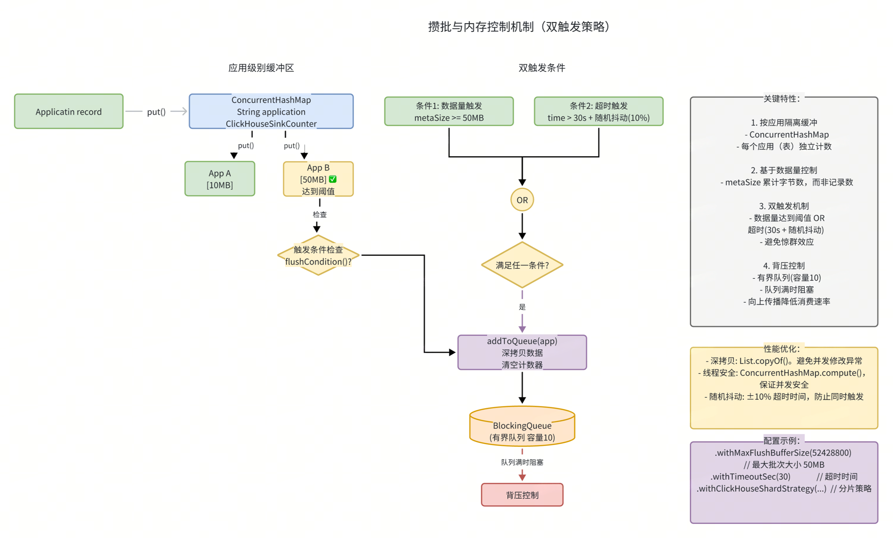

>> 双触发机制
```

public class ClickHouseShardSinkBuffer {
    private final int maxFlushBufferSize;  // 最大批次大小（如 10000）
    private final long timeoutMillis;      // 超时时间（如 30s）
    // 触发条件检查（满足任一即触发）
    private boolean flushCondition(String application) {
        return localValues.get(application) != null
            && (checkMetaSize(application) || checkTime(application));
    }
    // 条件1：达到批次大小
    private boolean checkMetaSize(String application) {
        return localValues.get(application).getMetaSize() >= maxFlushBufferSize;
    }
    // 条件2：超时
    private boolean checkTime(String application) {
        long current = System.currentTimeMillis();
        return current - localValues.get(application).getInsertTime() > timeoutMillis;
    }
}
```

>> 批次大小计算
```
public class ClickHouseSinkCounter {
    private final List<LogModel> values;
    private Long metaSize; // 累计的 metaSize（字节）
    public void add(LogModel value) {
        this.values.add(value);
        this.metaSize += value.getMetaSize(); // 累加 metaSize
    }
    public List<LogModel> copyValuesAndClear() {
        List<LogModel> logModels = List.copyOf(this.values); // 深拷贝（不可变）
        this.values.clear();
        this.metaSize = 0L;
        this.insertTime = System.currentTimeMillis();
        return logModels;
    }
}
```

>> 关键点：
> >
> > 使用 metaSize（字节数）而非记录数控制批次，内存控制更精确
> >
> > List.copyOf() 创建不可变副本，避免并发修改
> >
> > 清空后重置 insertTime，保证超时触发准确性

- 带随机抖动的超时

```

private final long timeoutMillis;
public ClickHouseShardSinkBuffer(..., int timeoutSec, ...) {
    // 基础超时 + 10% 随机抖动（避免惊群效应）
    this.timeoutMillis = TimeUnit.SECONDS.toMillis(timeoutSec)
                      + new SecureRandom().nextInt((int) (timeoutSec * 0.1 * 1000));
}
```

>> 目的：避免多个TM 同时触发 flush，造成写入流量峰值

>> 配置示例:
```

ClickHouseShardSinkBuffer.Builder
    .aClickHouseSinkBuffer()
    .withTargetTable("single_table")  //单表时，可直接使用指定表名
    .withMaxFlushBufferSize(10000)  // 对应字节数
    .withTimeoutSec(30)              // 30 秒超时
    .withClickHouseShardStrategy(new LogClickHouseShardStrategy("table_prefix_%s", 8))  //分表策略时，使用
    // 分表策略可根据业务实际情况进行扩展
    .build(clickHouseWriter);
```

- 写入限流与流量控制
>> 有界队列设计
```

public class ClickHouseWriter {
    // 有界阻塞队列
    private final BlockingQueue<ClickHouseRequestBlank> commonQueue;
    public ClickHouseWriter(ClickHouseSinkCommonParams sinkParams, ...) {
        // 队列最大容量配置（默认 10）
        this.commonQueue = new LinkedBlockingQueue<>(sinkParams.getQueueMaxCapacity());
    }
    public void put(ClickHouseRequestBlank params) {
        unProcessedCounter.incrementAndGet();
        // put() 方法在队列满时会阻塞，实现背压
        commonQueue.put(params);
    }
}
```

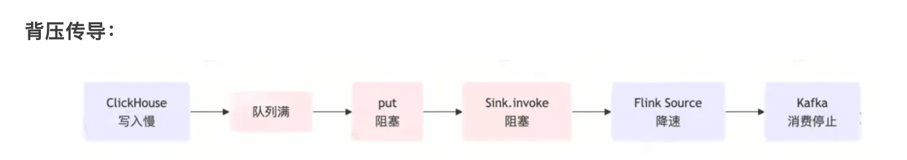

>> 线程池并发控制
```

public class ClickHouseWriter {
    private final int numWriters; // 写入线程数
    private ExecutorService service;
    private void buildComponents() {
        ThreadFactory threadFactory = ThreadUtil.threadFactory("clickhouse-writer");
        service = Executors.newFixedThreadPool(numWriters, threadFactory);
        // 创建多个 WriterTask 并提交
        for (int i = 0; i < numWriters; i++) {
            WriterTask task = new WriterTask(i, commonQueue, sinkParams, futures, unProcessedCounter);
            service.submit(task);
        }
    }
}
```

>> WriterTask 消费逻辑
```

class WriterTask implements Runnable {
    @Override
    public void run() {
        isWorking = true;
        while (isWorking || !queue.isEmpty()) {
            // poll() 超时返回（100ms），避免无限等待
            ClickHouseRequestBlank blank = queue.poll(100, TimeUnit.MILLISECONDS);
            if (blank != null) {
                // 创建 Future 并设置超时（3 分钟）
                CompletableFuture<Boolean> future = new CompletableFuture<>();
                future.orTimeout(3, TimeUnit.MINUTES);
                futures.add(future);
                try {
                    send(blank, future, new HashSet<>());
                } finally {
                    // final 进行未知异常兜底，防止为捕获异常造成future状态不完成，永久阻塞
                    if (!future.isDone()) {
                        future.completeExceptionally(new RuntimeException("Unknown exception"));
                    }
                    queueCounter.decrementAndGet();
                }
            }
        }
    }
}
```

>> 配置参数
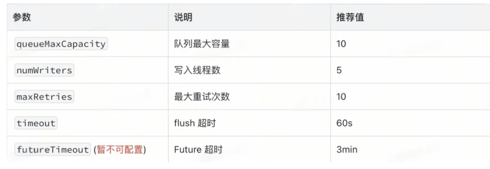

- 重试机制与超时控制
>> Future 超时控制

```
class WriterTask implements Runnable {
    @Override
    public void run() {
        while (isWorking || !queue.isEmpty()) {
            ClickHouseRequestBlank blank = queue.poll(100, TimeUnit.MILLISECONDS);
            if (blank != null) {
                // 创建 Future 并设置 3 分钟超时
                CompletableFuture<Boolean> future = new CompletableFuture<>();
                future.orTimeout(3, TimeUnit.MINUTES); // 防止永久阻塞
                futures.add(future);
                try {
                    send(blank, future, new HashSet<>());
                } finally {
                    if (!future.isDone()) {
                        future.completeExceptionally(new RuntimeException("Timeout"));
                    }
                    queueCounter.decrementAndGet();
                }
            }
        }
    }
}
```

>> 超时策略：
> >
> > Future 超时：3 分钟（orTimeout）。
> >
> > Socket 超时：3 分钟（socket_timeout=180000）
> >
> > 连接超时：30 秒（connectionTimeout=30000）

- 重试逻辑
```

private void send(ClickHouseRequestBlank requestBlank,
                  CompletableFuture<Boolean> future,
                  Set<String> exceptHosts) {
    try {
        // 1. 选择数据源（排除异常节点）
        HikariDataSource dataSource = getNextDataSource(exceptHosts);
        // 2. 显式获取连接
        connection = dataSource.getConnection();
        preparedStatement = connection.prepareStatement(insertSql);
        // 3. 批量写入
        for (LogModel value : requestBlank.getValues()) {
            sinkConverter.setParameters(preparedStatement, value);
            preparedStatement.addBatch();
        }
        boolean executed = preparedStatement.executeBatch()[0] > 0;
        if (!executed) {
            handleUnsuccessfulResponse(...);
        } else {
            future.complete(true);
        }
    } catch (Throwable e) {
        handleUnsuccessfulResponse(...); // 递归重试
    } finally {
        // 显式关闭资源（防止连接泄漏）
        close(preparedStatement, connection);
    }
}
```

-  重试控制逻辑
```
private void handleUnsuccessfulResponse(..., Set<String> exceptHosts) {
    // 检查 Future 是否已完成（避免重复完成）
    if (future.isDone()) {
        return;
    }
    if (attemptCounter >= maxRetries) {
        // 达到最大重试次数，标记失败
        future.completeExceptionally(new RuntimeException("Max retries exceeded"));
    } else {
        // 递归重试
        requestBlank.incrementCounter();
        send(requestBlank, future, exceptHosts); // 递归调用，排除失败节点
    }
}
```

>> 重试策略：
> >
> > 1.递归重试：失败后递归调用，直到成功或达到最大次数
> >
> > 2.异常节点隔离：每次重试时排除失败的节点（exceptHosts）
> >
> > 3.超时控制：Future 超时（3 分钟）防止永久阻塞

>> 为什么递归重试是更好的选择

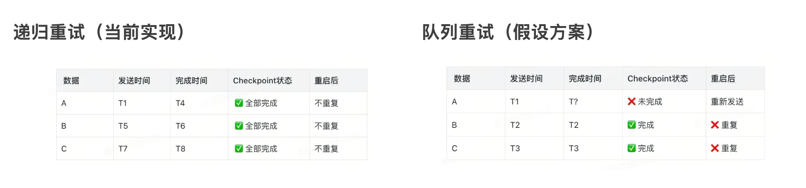

>保证一致性

```
 // ClickHouseWriter.java:139-158
  while (!futures.isEmpty() || unProcessedCounter.get() > 0) {
      CompletableFuture<Void> future = FutureUtil.allOf(futures);
      future.get(3, TimeUnit.MINUTES);  // 阻塞直到全部完成
  }
```

>> Checkpoint 时所有数据要么全部成功，要么全部失败
> >
> > 重启后不会有部分数据重复的问题。

> 简单可靠
>> 代码逻辑清晰。
> >
> > 对于队列重试且不重复，需要复杂的二阶段提交（这里暂不展开），大幅增加代码复杂度


> 性能可接受
```
// ClickHouseWriter.java:235
  future.orTimeout(3, TimeUnit.MINUTES);  // 3分钟超时
```

>> 虽然阻塞，但有超时保护。
> >
> > ClickHouse 写入通常很快（秒级）。
> >
> > 网络故障时重试也合理

> 避开故障节点
```
// ClickHouseWriter.java:259-260
  HikariDataSource dataSource = getNextDataSource(exceptHosts);
```

>> 递归时可以传递 exceptHosts
> >
> > 自动避开失败的节点。
> >
> > 提高成功率

- 异常节点剔除
```
// 特殊错误码列表（自动加入黑名单）
private final List<Integer> ignoreHostCodes = Arrays.asList(210, 1002);
public HikariDataSource getNextDataSource(Set<String> exceptionHosts) {
    if (CollectionUtils.isNotEmpty(exceptionHosts)) {
        // 过滤异常节点
        List<HikariDataSource> healthyHosts = clickHouseDataSources.stream()
            .filter(ds -> !exceptionHosts.contains(getHostFromUrl(ds)))
            .collect(Collectors.toList());
        if (CollectionUtils.isEmpty(healthyHosts)) {
            return null; // 所有节点都异常
        }
        return healthyHosts.get(random.nextInt(healthyHosts.size()));
    }
    // 正常轮询（已 shuffle，避免热点）
    return clickHouseDataSources.get(currentRandom.getAndIncrement() % size);
}
```

>> 故障节点剔除策略：
> >
> > 1.错误码 210（网络异常）：自动加入黑名单。
> >
> > 2.错误码 1002（连接池异常）：自动加入黑名单
> >
> > 3.APM 监控：磁盘 >= 90%、HTTP 连接 >= 50 的节点
> >
> > 4.手动配置：通过 Redis 配置剔除

>> 恢复机制：
> >
> > LoadingCache 定时刷新（1 分钟）。
> >
> > 节点恢复健康后自动从黑名单移除。

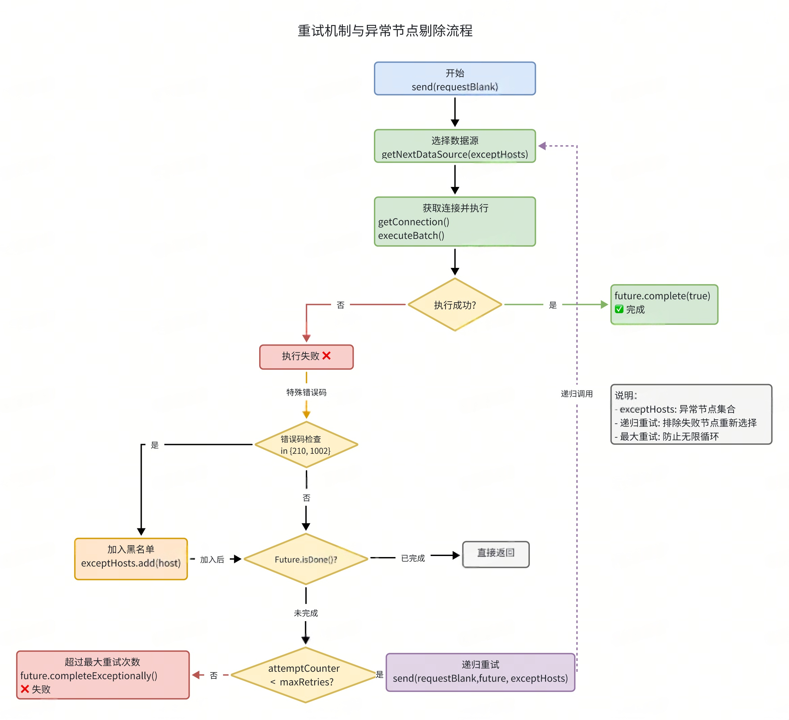


- 异常处理模式
>> 两种 Sink 模式
```
public Sink buildSink(String targetTable, String targetCount, int maxBufferSize) {
    IClickHouseSinkBuffer buffer = ClickHouseShardSinkBuffer.Builder
        .aClickHouseSinkBuffer()
        .withTargetTable(targetTable)
        .withMaxFlushBufferSize(maxBufferSize)
        .withClickHouseShardStrategy(new LogClickHouseShardStrategy(targetTable, count))
        .build(clickHouseWriter);
    // 根据配置选择模式
    if (ignoringClickHouseSendingExceptionEnabled) {
        return new UnexceptionableSink(buffer);  // 忽略异常
    } else {
        return new ExceptionsThrowableSink(buffer); // 抛出异常
    }
}
```

>> UnexceptionableSink（忽略异常 - At-Most-Once）

```

public class UnexceptionableSink implements Sink<LogModel> {
    private final IClickHouseSinkBuffer<LogModel> buffer;
    @Override
    public void put(LogModel message) {
        buffer.put(message);  // 不检查 Future 状态
    }
    @Override
    public void flush() {
        buffer.flush();
    }
}
```

>> 适用场景：
>> 允许部分数据丢失。
>>
>>不希望因写入异常导致任务失败。
>>
>>对数据准确性要求不高（如日志统计）。
>>
>>语义保证：At-Most-Once（最多一次）

>> ExceptionsThrowableSink（抛出异常 - At-Least-Once）

```

public class ExceptionsThrowableSink implements Sink<LogModel> {
    private final IClickHouseSinkBuffer<LogModel> buffer;
    @Override
    public void put(LogModel message) throws ExecutionException, InterruptedException {
        buffer.put(message);
        // 每次写入都检查 Future 状态
        buffer.assertFuturesNotFailedYet();
    }
    @Override
    public void flush() throws ExecutionException, InterruptedException {
        buffer.flush();
    }
}
```

>> Future 状态检查：
```

public void assertFuturesNotFailedYet() throws ExecutionException, InterruptedException {
    CompletableFuture<Void> future = FutureUtil.allOf(futures);
    // 非阻塞检查
    if (future.isCompletedExceptionally()) {
        logger.error("There is something wrong with the future. exist sink now");
        future.get(); // 抛出异常，导致 Flink 任务失败
    }
}
```

>> 适用场景：

数据准确性要求高。

需要保证所有数据写入成功。

异常时希望 Flink 任务失败并重启。

语义保证：At-Least-Once（至少一次）

> Future 清理策略与并发控制
>> 定时检查器
```
public class ClickHouseSinkScheduledCheckerAndCleaner {
    private final ScheduledExecutorService scheduledExecutorService;
    private final List<CompletableFuture<Boolean>> futures;
    // ⚠️ volatile 保证多线程可见性（关键并发控制点）
    private volatile boolean isFlushing = false;
    public ClickHouseSinkScheduledCheckerAndCleaner(...) {
        // 单线程定时执行器
        scheduledExecutorService = Executors.newSingleThreadScheduledExecutor(factory);
        // 定时执行清理任务（每隔 checkTimeout 秒，默认 30 秒）
        scheduledExecutorService.scheduleWithFixedDelay(getTask(), ...);
    }
    private Runnable getTask() {
        return () -> {
            synchronized (this) {
                // 🔒 关键：检查是否正在 flush，避免并发冲突
                if (isFlushing) {
                    return; // Checkpoint 期间暂停清理
                }
                // 1️⃣ 清理已完成的 Future
                futures.removeIf(filter);
                // 2️⃣ 触发所有 Buffer 的 flush（检查是否需要写入）
                clickHouseSinkBuffers.forEach(IClickHouseSinkBuffer::tryAddToQueue);
            }
        };
    }
    // Checkpoint flush 前调用（暂停 cleaner）
    public synchronized void beforeFlush() {
        isFlushing = true;
    }
    // Checkpoint flush 后调用（恢复 cleaner）
    public synchronized void afterFlush() {
        isFlushing = false;
    }
}
```
>> 核心设计：

volatile boolean isFlushing：标志位，协调 cleaner 与 checkpoint 线程。

synchronized (this)：保证原子性，避免并发冲突。

单线程执行器：避免 cleaner 内部并发问题。


> 并发控制机制
>> 问题场景：
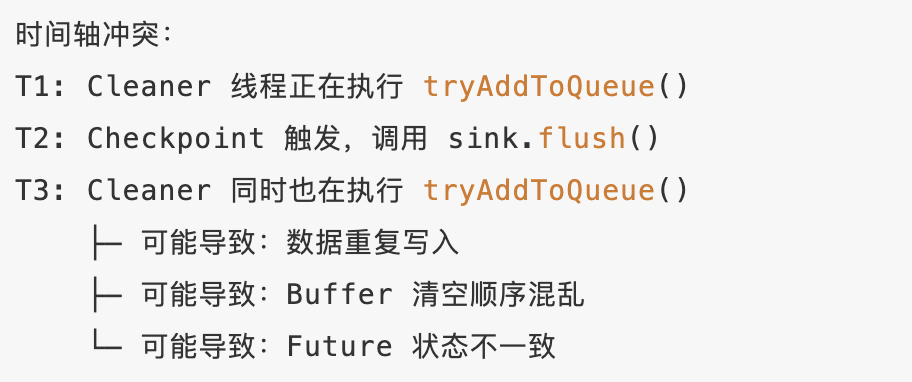

>> 关键设计点：

volatile 保证可见性：isFlushing 使用 volatile，确保多线程间的可见性。

synchronized 保证原子性：getTask() 整个方法体使用 synchronized (this)。

标志位协调：通过 isFlushing 标志实现两个线程间的协调。

finally 确保恢复：即使 waitUntilAllFuturesDone() 异常，也会在 finally 中恢复 cleaner。

>>避免的并发问题：

数据重复写入：Cleaner 和 Checkpoint 同时 flush。

Buffer 状态不一致：一边清空一边写入。

Future 清理冲突：正在使用的 Future 被清理。

>> 性能影响：

Checkpoint flush 期间，cleaner 暂停执行（通常 1-3 秒）。

Cleaner 跳过的周期会在下次正常执行时补偿。

对整体吞吐影响极小（cleaner 间隔通常 30 秒）。

> Checkpoint 语义保证

>> 为什么 Checkpoint 时必须 Flush？
>> 不 Flush 的后果:
>> 不Flush导致数据永久丢失:
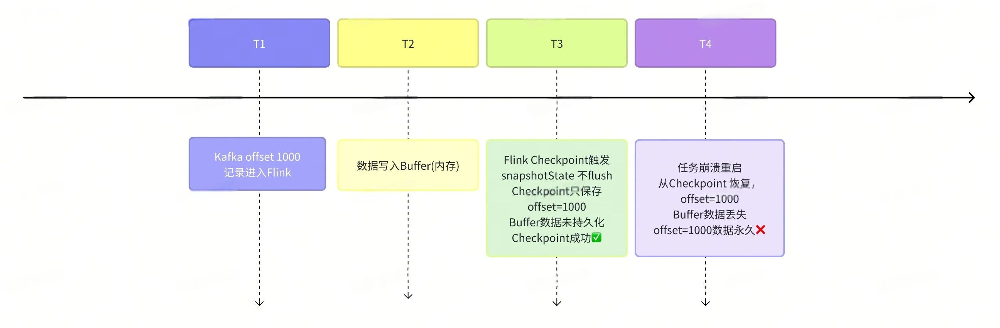

>> 正确做法
```

@Override
public void snapshotState(FunctionSnapshotContext context) throws Exception {
    logger.info("start doing snapshot. flush sink to ck");
    // 1. 先 flush buffer（将内存数据写入 ClickHouse）
    if (sink != null) {
        sink.flush();
    }
    // 2. 等待所有写入完成
    if (sinkManager != null && !sinkManager.isClosed()) {
        sinkManager.flush();
    }
    // 此时 Checkpoint 才能标记为成功
    logger.info("doing snapshot. flush sink to ck");
}
```

>> Flush 实现与并发协调

```

public class ClickHouseSinkManager {
    public void flush() {
        // 🔄 步骤1：暂停定时清理任务
        clickHouseSinkScheduledCheckerAndCleaner.beforeFlush(); // isFlushing = true
        try {
            // 🔄 步骤2：执行 buffer flush + 等待所有写入完成
            clickHouseWriter.waitUntilAllFuturesDone(false, false);
        } finally {
            // 🔄 步骤3：恢复定时清理任务（finally 确保执行）
            clickHouseSinkScheduledCheckerAndCleaner.afterFlush(); // isFlushing = false
        }
    }
}
```

>> 并发协调详解：
```

// cleaner 线程执行流程
synchronized (this) {
    if (isFlushing) {
        return; // Checkpoint 期间跳过本次执行
    }
    // 正常执行：清理已完成的 Future + 触发 Buffer flush
    futures.removeIf(filter);
    buffers.forEach(Buffer::tryAddToQueue);
}
```

>> 关键点：

volatile 可见性：isFlushing 使用 volatile 确保 cleaner 线程立即看到状态变化。

synchronized互斥：getTask()方法体使用 synchronized (this) 确保原子性。

标志位协调：通过 beforeFlush() / afterFlush() 管理标志位。

finally 保证恢复：即使 flush 异常，也会在 finally 中恢复 cleaner。

>> 等待所有 Future 完成
```
public synchronized void waitUntilAllFuturesDone(boolean stopWriters, boolean clearFutures) {
    try {
        // 循环等待：直到所有 Future 完成 + 队列清空
        while (!futures.isEmpty() || unProcessedCounter.get() > 0) {
            CompletableFuture<Void> all = FutureUtil.allOf(futures);
            // 最多等待 3 分钟（与 Future 超时一致）
            all.get(3, TimeUnit.MINUTES);
            // 移除已完成的 Future（非异常）
            futures.removeIf(f -> f.isDone() && !f.isCompletedExceptionally());
            // 检查是否有异常 Future
            if (anyFutureFailed()) {
                break; // 有异常则退出
            }
        }
    } finally {
        if (stopWriters) stopWriters();
        if (clearFutures) futures.clear();
    }
}
```
>> 关键逻辑：

循环等待直到所有 Future 完成 + 队列清空。

超时 3 分钟（与 Future 超时一致）。

移除已完成的非异常 Future。

有异常时退出循环。

>> 三种 Flush 触发方式对比:


>> Checkpoint 参数配置
```
// Checkpoint 配置建议
StreamExecutionEnvironment env = StreamExecutionEnvironment.getExecutionEnvironment();
// 启用 Checkpoint（间隔 1 分钟）
env.enableCheckpointing(60000);
// Checkpoint 超时（必须大于 Future 超时 + 重试时间）
// 建议：CheckpointTimeout > FutureTimeout * MaxRetries
env.getCheckpointConfig().setCheckpointTimeout(600000); // 10 分钟
// 一致性模式
env.getCheckpointConfig().setCheckpointingMode(CheckpointingMode.EXACTLY_ONCE);
// 最小间隔（避免过于频繁）
env.getCheckpointConfig().setMinPauseBetweenCheckpoints(30000); // 30 秒
// 最大并发 Checkpoint 数
env.getCheckpointConfig().setMaxConcurrentCheckpoints(1);
```

- 语义保证
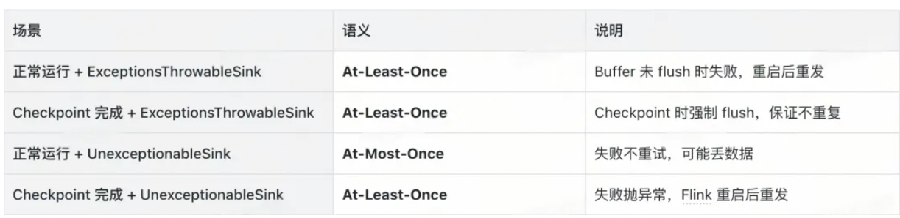

>> 推荐配置：

生产环境：使用 ExceptionsThrowableSink + Checkpoint。

允许部分丢失：使用 UnexceptionableSink。


- 最佳实践与调优
>> 生产配置

```
// ========== ClickHouse 连接参数 ==========
clickhouse.sink.target-table = tb_logs_local
clickhouse.sink.max-buffer-size = 104857600        // 批次大小
clickhouse.sink.table-count = 0                // 0 表示不分表
// ========== 写入性能参数 ==========
clickhouse.sink.num-writers = 10               // 写入线程数
clickhouse.sink.queue-max-capacity = 10        // 队列容量
clickhouse.sink.timeout-sec = 30               // flush 超时
clickhouse.sink.retries = 10                   // 最大重试次数
clickhouse.sink.check.timeout-sec = 30         // 定时检查间隔
// ========== 异常处理参数 ==========
clickhouse.sink.ignoring-clickhouse-sending-exception-enabled = false
clickhouse.sink.local-address-enabled = true   // 启用本地表写入
// ========== ClickHouse 集群配置 ==========
clickhouse.access.hosts = 192.168.1.1:8123,192.168.1.2:8123,192.168.1.3:8123
clickhouse.access.user = default
clickhouse.access.password = ***
clickhouse.access.database = dw_xx_xx
clickhouse.access.cluster = default
// ========== HikariCP 连接池配置 ==========
connectionTimeout = 30000                      // 连接超时 30s
maximumPoolSize = 20                           // 最大连接数 20
minimumIdle = 2                                // 最小空闲 2
socket_timeout = 180000                        // Socket 超时 3mi
```

>> 性能调优
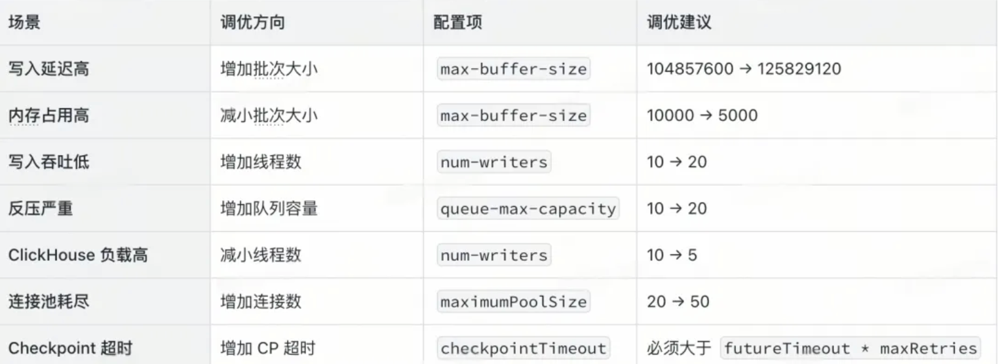

>> 故障排查
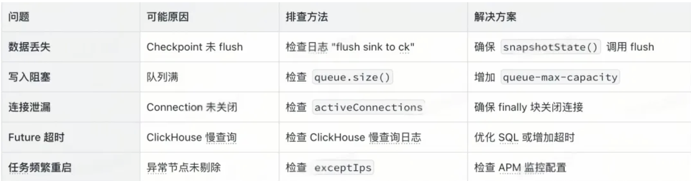

- 总结

>> 本文深入分析了 Flink ClickHouse Sink 的实现方案，核心亮点包括:
>> 1.连接池选型：使用 HikariCP，性能优异，连接管理可靠。
>>
>> 2.Future 超时控制：orTimeout(3min) 防止永久阻塞。
>>
>> 3.显式资源管理：Connection 和 PreparedStatement 显式关闭，防止连接泄漏。
>>
>> 4.负载均衡优化：Shuffle 初始化 + 轮询选择，避免热点。
>>
>> 5.异常处理增强：future.isDone() 检查，避免重复完成。
>>
>> 6.本地表写入：动态节点发现 + 故障剔除，写入性能提升。
>>
>> 7.分片策略：按表（应用）维度路由，独立缓冲和隔离。
>>
>> 8.攒批优化：双触发机制（大小 + 超时）+ 随机抖动。
>>
>> 9.流量控制：有界队列 + 线程池，实现背压。
>>
>> 10.健壮重试：递归重试 + 异常节点剔除 + 最大重试限制

- Checkpoint 语义
>> At-Least-Once：ExceptionsThrowableSink + Checkpoint。
>>
>>At-Most-Once：UnexceptionableSink。
>>
>>Exactly-Once：需要配合 ClickHouse 事务（未实现）。

- 生产建议
>> 1.必须：Checkpoint 时 flush，否则会丢数据。
>>
>>2.推荐：使用 HikariCP + 本地表写入。
>>
>> 3.推荐：配置合理的超时（Future < Socket < Checkpoint）。
>>
>> 4.推荐：监控队列大小、Future 失败率、重试次数。
>>
>> 5.该方案已在生产环境大规模验证，能够稳定支撑百万级 TPS 的日志写入场景。


