# 常用命令

> 1.stash
>> 描述
>> 官方解释：当您想记录工作目录和索引的当前状态，但又想返回一个干净的工作目录时，请使用git stash。  
> > 该命令将保存本地修改，并恢复工作目录以匹配头部提交

>> stash 命令能够将还未 commit 的代码存起来，让你的工作目录变得干净

>> 相关命令
```
# 保存当前未commit的代码
git stash

# 保存当前未commit的代码并添加备注
git stash save "备注的内容"

# 列出stash的所有记录
git stash list

# 删除stash的所有记录
git stash clear

# 应用最近一次的stash
git stash apply

# 应用最近一次的stash，随后删除该记录
git stash pop

# 删除最近的一次stash
git stash drop

#当有多条 stash，可以指定操作stash，首先使用stash list 列出所有记录
$ git stash list
stash@{0}: WIP on ...
stash@{1}: WIP on ...
stash@{2}: On ...

应用第二条记录：
$ git stash apply stash@{1}
pop，drop 同理
```


> 2.reset --soft
>> 描述： 回退你已提交的 commit，并将 commit 的修改内容放回到暂存区

>> git reset --hard  让 commit 记录强制回溯到某一个节点

>> git reset --soft  除了回溯节点外，还会保留节点的修改内容

- 场景1: 手滑不小心把不该提交的内容 commit 了，这时想改回来，只能再 commit 一次，又多一条“黑历史”

- 场景2: 规范些的团队，一般对于 commit 的内容要求职责明确，颗粒度要细，便于后续出现问题排查。本来属于两块不同功能的修改，一起 commit 上去，这种就属于不规范。这次恰好又手滑了，一次性 commit 上去

>> 命令使用
```
# 恢复最近一次 commit
git reset --soft HEAD^
```

>> reset --soft相当于后悔药，给你重新改过的机会。对于上面的场景，就可以再次修改重新提交，保持干净的 commit 记录

- 场景3： 对于已经push 的commit
```
由于远程分支和本地分支有差异，需要强制推送
git push -f 
来覆盖被 reset 的 commit
```

>> 注意： reset --soft指定 commit 号时，会将该 commit 到最近一次 commit 的所有修改内容全部恢复，而不是只针对该 commit
>> 举个例子：

>> commit 记录有 c、b、a

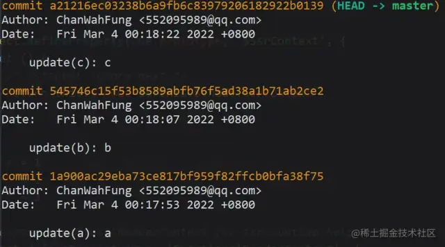

>> reset 到 a

```
git reset --soft 1a900ac29eba73ce817bf959f82ffcb0bfa38f75
```
>> 此时的 HEAD 到了 a，而 b、c 的修改内容都回到了暂存区

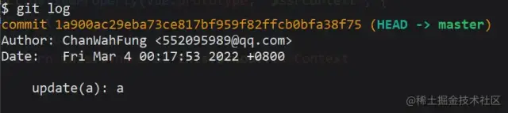


> 3.cherry-pick

>> 描述：给定一个或多个现有提交，应用每个提交引入的更改，为每个提交记录一个新的提交
> > 将已经提交的 commit，复制出新的 commit 应用到分支里

>> 复制单个commit
```
git  cherry-pick  commitHash
```

>> 复制多个
```
git  cherry-pick  commit1  commit2

# 多个连续的commit，也可区间复制：
git cherry-pick commit1^..commit2
```

- cherry-pick 代码冲突解决
>> 在cherry-pick多个commit时，可能会遇到代码冲突，这时cherry-pick会停下来，让用户决定如何继续操作。下面看看怎么解决这种场景

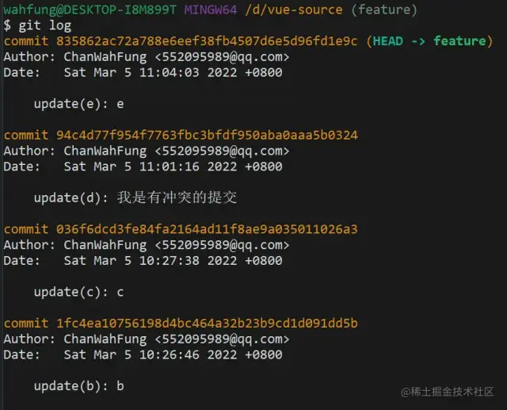

>> 还是 feature 分支，现在需要把 c、d、e 都复制到 master 分支上。先把起点c和终点e的 commitHash 记下来

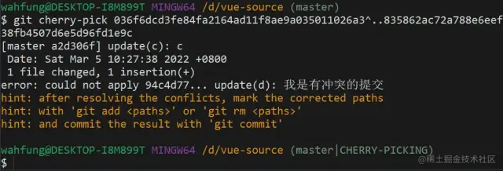

>> 切到 master 分支，使用区间的cherry-pick。  
> > 可以看到 c 被成功复制，当进行到 d 时，发现代码冲突，cherry-pick中断了。这时需要解决代码冲突，重新提交到暂存区

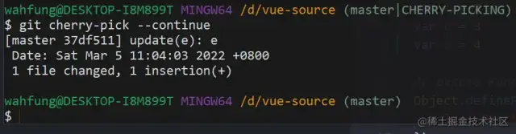

>> 然后使用cherry-pick --continue让cherry-pick继续进行下去。最后 e 也被复制进来，整个流程就完成了

>> 以上是完整的流程，但有时候可能需要在代码冲突后，放弃或者退出流程

- 放弃 cherry-pick：回到操作前的样子，就像什么都没发生过

```
git cherry-pick --abort
```

- 退出 cherry-pick：不回到操作前的样子。即保留已经cherry-pick成功的 commit，并退出cherry-pick流程

```
git cherry-pick --quit
```

> 4.revert
>> 描述: 一个或多个现有提交，恢复相关提交引入的更改，并记录这些更改的新提交
>> 将现有的提交还原，恢复提交的内容，并生成一条还原记录

- 应用场景:
>> 有一天测试突然跟你说，你开发上线的功能有问题，需要马上撤回，否则会影响到系统使用。  
> > 这时可能会想到用 reset 回退，可是你看了看分支上最新的提交还有其他同事的代码，用 reset 会把这部分代码也撤回了。  
> > 由于情况紧急，又想不到好方法，还是任性的使用 reset，然后再让同事把他的代码合一遍（同事听到想打人），于是你的技术形象在同事眼里一落千丈


- 命令使用
>> 1. revert 普通提交

>> 现在 master 记录如下：

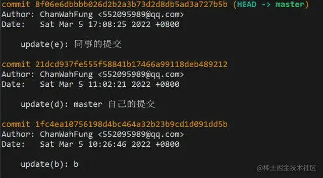

```
# revert 掉自己提交的 commit
git revert 21dcd937fe555f58841b17466a99118deb489212
```

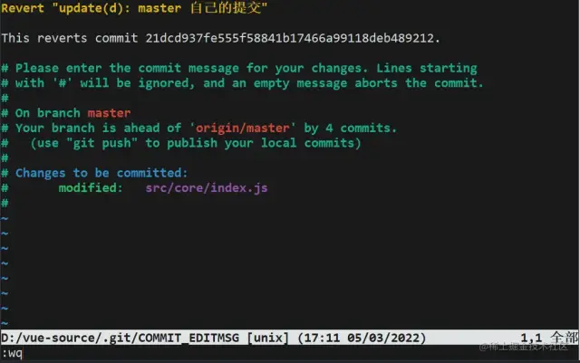

>> 因为 revert 会生成一条新的提交记录，这时会让你编辑提交信息，编辑完后 :wq 保存退出就好了


>> 再来看下最新的 log，生成了一条 revert 记录，虽然自己之前的提交记录还是会保留着，但你修改的代码内容已经被撤回了


>> 2. revert 普通提交

>> 在 git 的 commit 记录里，还有一种类型是合并提交，想要 revert 合并提交，使用上会有些不一样

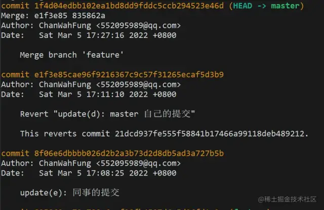

> 5. reflog
>> 描述： 此命令管理重录中记录的信息
>> 如果说reset --soft是后悔药，那 reflog 就是强力后悔药。它记录了所有的 commit 操作记录，便于错误操作后找回记录

- 应用场景:
>> 某天你眼花，发现自己在其他人分支提交了代码还推到远程分支，这时因为分支只有你的最新提交，  
> > 就想着使用reset --hard，结果紧张不小心记错了 commitHash，reset 过头，把同事的 commit 搞没了。  
> > 没办法，reset --hard是强制回退的，找不到 commitHash 了，只能让同事从本地分支再推一次（同事瞬间拳头就硬了，怎么又是你）。  
> > 于是，你的技术形象又一落千丈


>> 分支记录如上，想要 reset 到 b

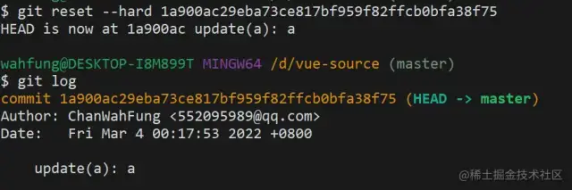

>> 误操作 reset 过头，b 没了，最新的只剩下 a。

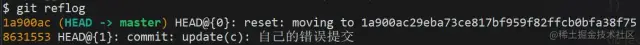

>> 这时用git reflog查看历史记录，把错误提交的那次 commitHash 记下

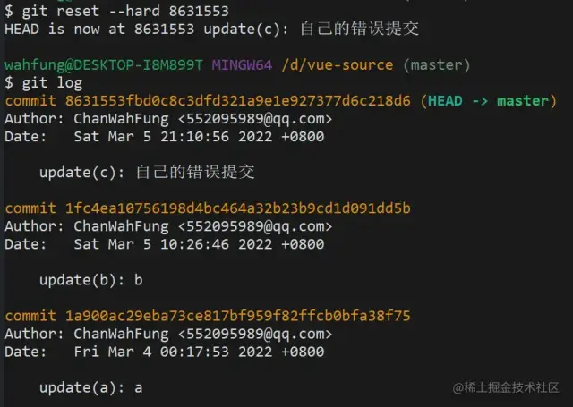

>> 再次 reset 回去，就会发现 b 回来了


> 6. merge
>> 描述：通常我们会将拥有最新代码的一个版本merge到较老的一个版本，实现版本同步


>> Merge命令会将前面featrue分支所有的commit提交全部合并为一个新的commit提交。⚠️这里只有会在产生冲突的时候，才能产生新的commit记录

```
git merge master
```

>> 可以理解为git pull = git fetch + git merge，拉取最新的远程分支，然后将这个分支合并到另一个分支


> 7.rebase
>> 描述： rebase这个命令，核心理念就是“变基”

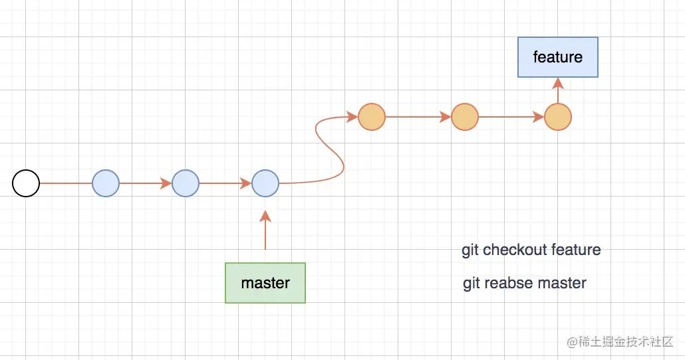

>> 1. 由上图可看见，通过reabse命令将feature分支延续到了master分支后面

>> 2. 在多人开发过程中，如果其他人在master进行commit，这个时候你在feature分支提交了几个commit，  
> > 这时候你使用rebase命令，会将你的commit提交记录放在master的commit记录的后面，  
> > 而merge就会将不同分支的commit合并成一个新的commit记录，这就是merge和rebase的不同点

>> 3. 本地feature分支和远端的master分支如果是同一条分支的话，可以使用rebase，保证commit的记录的清晰性，这个很关键

>> 注意： 不要在公共分支使用rebase命令，这样会污染公共分支，这样公共分支就会存在你的commit记录，别人拉取的时候会存在你的最新的commit记录


