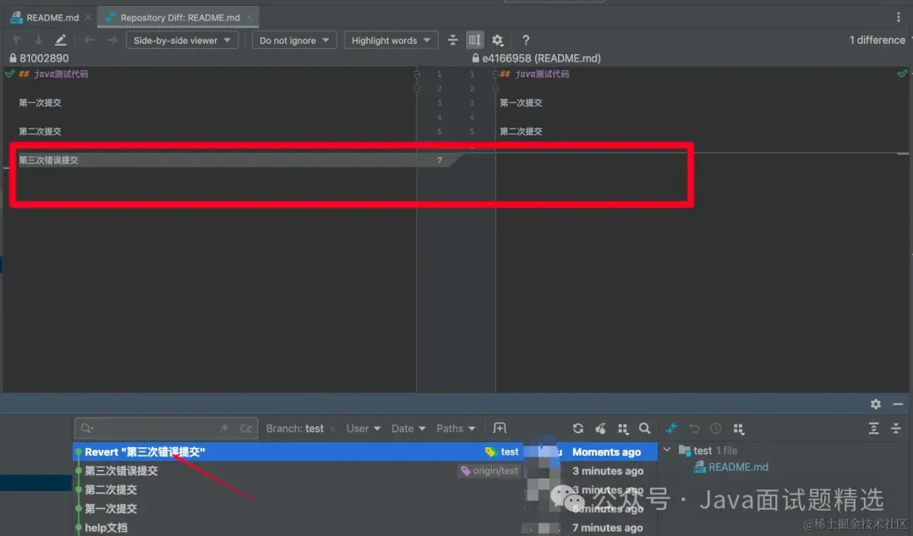
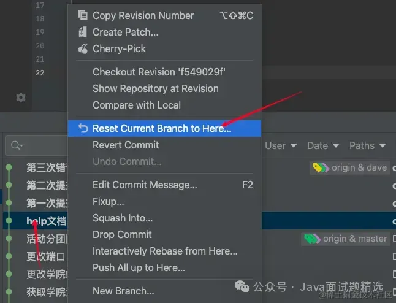

> 1. git Revert Commit（推荐）

>> git自动产生一个Revert记录，然后我们会看到git自动将我第三次错误提交代码回退了，这个其实就相当于git帮我们手动回退了代码

>> 后续，只需要我们将本次改动push到远程，即可完成一次这次回退操作

>> revert相当于自动帮我们进行版本回退操作，并且留下改动记录，非常安全

> 2. Reset Current Branch 到你想要恢复的commit记录

>> 这个时候会跳出四个选项供你选择
>>>> 1.Soft：你之前写的不会改变，你之前暂存过的文件还在暂存

>>>> 2.Mixed：你之前写的不会改变，你之前暂存过的文件不会暂存

>>>> 3.Hard：文件恢复到所选提交状态，任何更改都会丢失。  
> > > > 你已经提交了，然后你又在本地更改了，如果你选hard，那么提交的内容和你提交后又本地修改未提交的内容都会丢失

>>>> 4.keep：任何本地更改都将丢失，文件将恢复到所选提交的状态，但本地更改将保持不变。  
> > > > 你已经提交了，然后你又在本地更改了，如果你选keep，那么提交的内容会丢失，你提交后又本地修改未提交的内容不会丢失

