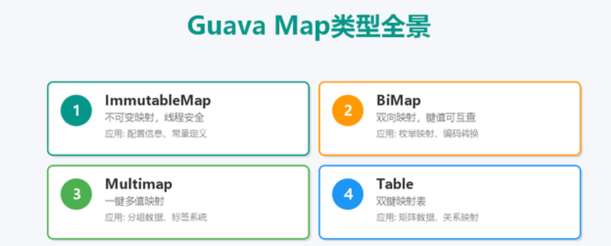
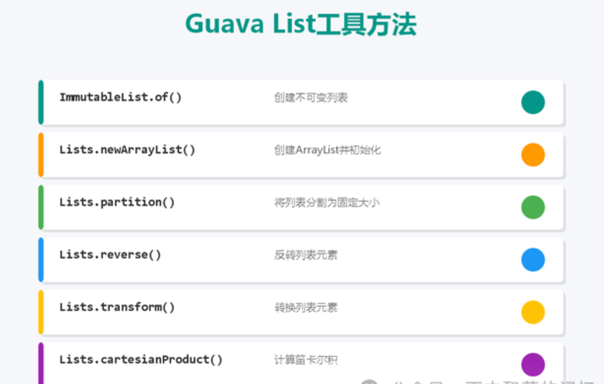
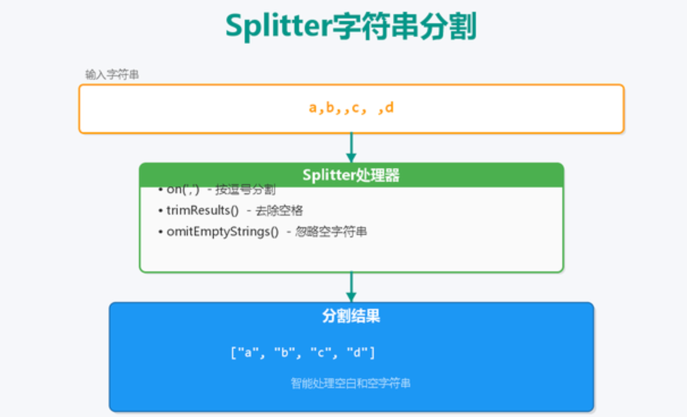
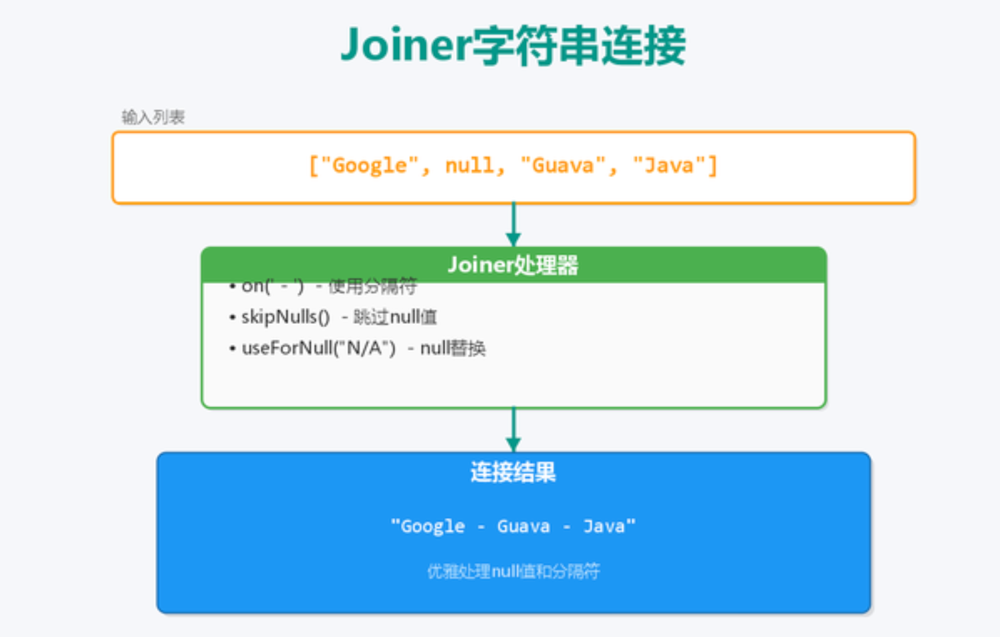
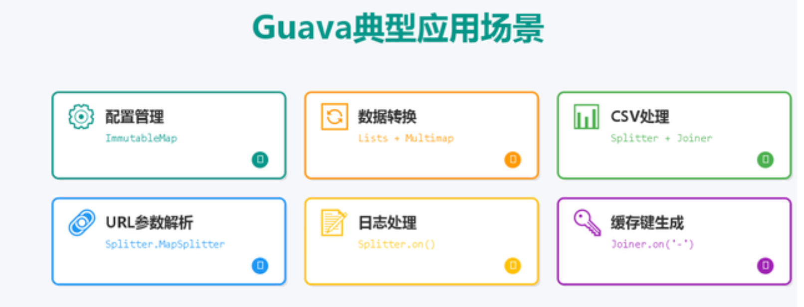
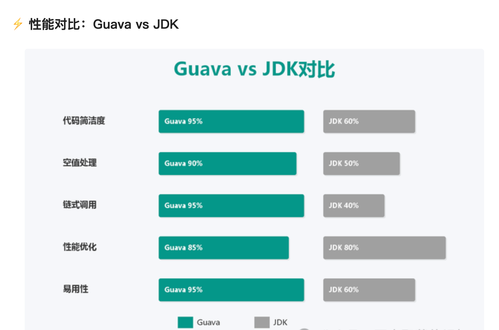
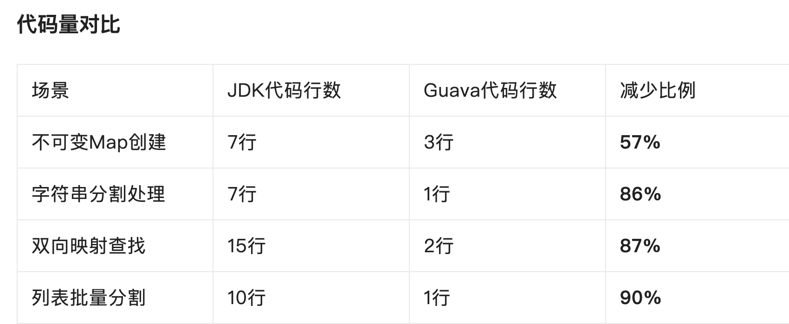
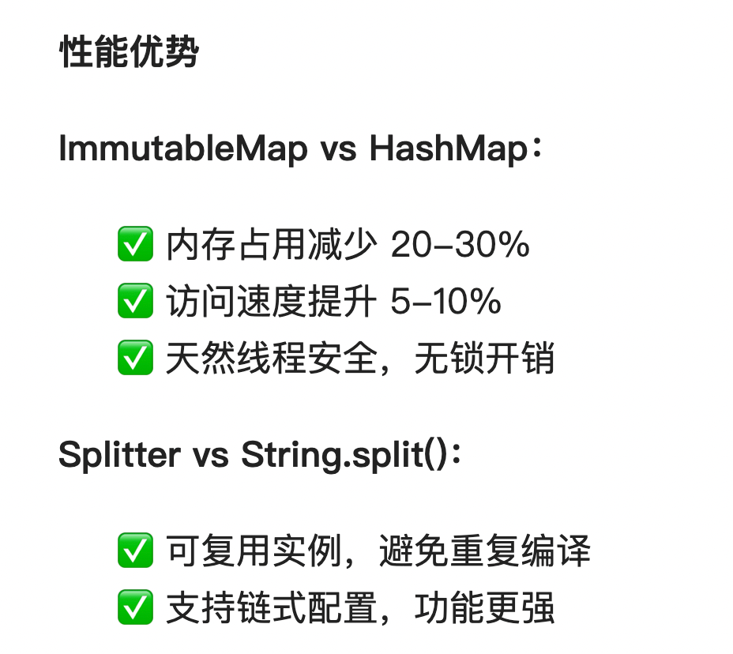

# 1. 痛点场景分析
> 1.1 场景一：创建配置映射

```
// 传统写法：7行代码
Map<String, String> config = new HashMap<>();
config.put("dev", "jdbc:mysql://dev-db:3306/app");
config.put("test", "jdbc:mysql://test-db:3306/app");
config.put("prod", "jdbc:mysql://prod-db:3306/app");
Map<String, String> finalConfig = Collections.unmodifiableMap(config);
// Guava写法：3行搞定！
ImmutableMap<String, String> config = ImmutableMap.of(
"dev", "jdbc:mysql://dev-db:3306/app",
"test", "jdbc:mysql://test-db:3306/app",
"prod", "jdbc:mysql://prod-db:3306/app"
);
```

> 1.2 场景二：字符串分割处理
```
// 传统写法：7行代码处理空白
Stringstr = "a,b,,c, ,d";
String[] parts = str.split(",");
List<String> result = new ArrayList<>();
for (String part : parts) {
  String trimmed = part.trim();
  if (!trimmed.isEmpty()) result.add(trimmed);
}
```

```
// Guava写法：1行解决！
List<String> result = Splitter.on(',')
    .trimResults()
    .omitEmptyStrings()
    .splitToList(str);
```

# 2. Guava 景点应用场景

>> Guava是Google开源的Java核心库，被Spring、Hibernate、MyBatis等顶级框架广泛使用。它的强大之处在于
> > ✅ 代码减少70% - 一行代码完成复杂操作
> >  ✅ 告别null噩梦 - 内置优雅的空值处理
> >  ✅ 性能经过实战验证 - Google生产环境背书
> > ✅ API设计精妙 - 链式调用，流畅自然

> 2.1 Map工具 - 映射集合的进阶玩法



>> 2.1.1 ImmutableMap：不可变映射的力量

> > 为什么要用不可变集合？
>> 天然线程安全，无需加锁
>> 防止意外修改，避免bug
>>  内存占用更少，性能更好

- 实战案例：HTTP状态码管理

```
publicclassHttpStatusManager {
// 线程安全的状态码映射
private static final ImmutableMap<Integer, String> STATUS_MAP =
        ImmutableMap.<Integer, String>builder()
            .put(200, "OK")
            .put(201, "Created")
            .put(400, "Bad Request")
            .put(401, "Unauthorized")
            .put(404, "Not Found")
            .put(500, "Internal Server Error")
            .build();
            
public static String getMessage(int code){
        return STATUS_MAP.getOrDefault(code, "Unknown Status");
    }
}
```

- 三种创建方式任你选：

```
// 方式1：适合5个以内键值对
ImmutableMap<String, Integer> map = ImmutableMap.of(
    "Java", 1, "Python", 2, "Go", 3
);

// 方式2：Builder模式（推荐）
ImmutableMap<String, String> configMap = ImmutableMap.<String, String>builder()
    .put("db.host", "localhost")
    .put("db.port", "3306")
    .build();
    
// 方式3：从现有Map复制
ImmutableMap<String, Integer> copyMap = ImmutableMap.copyOf(existingMap);
```


>> 2.1.2 BiMap：双向查找的神器

> > >> 痛点：你是否经常需要根据value反查key？传统Map需要遍历，效率低下

- BiMap的魔法：
```
BiMap<String, Integer> userMap = HashBiMap.create();
userMap.put("Alice", 10001);
userMap.put("Bob", 10002);
// 正向查找
Integer id = userMap.get("Alice");  // 10001
// 反向查找（重点来了！）
String name = userMap.inverse().get(10002);  // "Bob"
```

- 生产案例：错误码双向映射
```
public class ErrorCodeManager {
  private static final BiMap<String, Integer> ERROR_CODES = HashBiMap.create();

  static {
        ERROR_CODES.put("USER_NOT_FOUND", 2000);
        ERROR_CODES.put("INVALID_PASSWORD", 2001);
        ERROR_CODES.put("PERMISSION_DENIED", 2002);
    }

// 根据错误名获取错误码
public static Integer getCode(String errorName) {
    return ERROR_CODES.get(errorName);
}

// 根据错误码获取错误名（传统Map做不到！）
public static String getName(Integer errorCode) {
      return ERROR_CODES.inverse().get(errorCode);
   }
}
```
>> 2.1.3 Multimap：告别Map<K, List<V>>的繁琐

- 传统做法的痛苦：
```
Map<String, List<String>> tagMap = new HashMap<>();
// 添加标签需要判空
if (!tagMap.containsKey("Java")) {
    tagMap.put("Java", new ArrayList<>());
}
tagMap.get("Java").add("Spring");
```

- Multimap的优雅：
```
Multimap<String, String> tagMap = ArrayListMultimap.create();
// 直接添加，无需判空！
tagMap.put("Java", "Spring");
tagMap.put("Java", "MyBatis");
tagMap.put("Java", "Guava");
```

- 真实场景：文章标签系统

```
public class ArticleTagService{
    private Multimap<Long, String> articleTags = ArrayListMultimap.create();

    // 添加标签
    public void addTags(Long articleId, String... tags) {
    for (String tag : tags) {
            articleTags.put(articleId, tag);
        }
    }

    // 获取所有标签
    public Collection<String> getTags(Long articleId) {
       return articleTags.get(articleId);
    }

    // 查找所有包含某标签的文章
    public List<Long> findByTag(String tag) {
        return articleTags.entries().stream()
            .filter(e -> e.getValue().equals(tag))
            .map(Map.Entry::getKey)
            .collect(Collectors.toList());
    }
}

    // 使用示例
    service.addTags(1001L, "Java", "Spring", "后端");
    Collection<String> tags = service.getTags(1001L);
    // 结果：["Java", "Spring", "后端"]
```

>> 2.1.4 Table：二维表的完美实现
>>>> 适用场景：需要两个键才能定位值的场景（比如学生成绩表、权限矩阵）
```
Table<String, String, Integer> scores = HashBasedTable.create();
// 添加数据：学生-科目-分数
scores.put("Alice", "Math", 98);
scores.put("Alice", "English", 89);
scores.put("Bob", "Math", 81);
// 获取某个单元格
Integer aliceMath = scores.get("Alice", "Math");  // 98
// 获取整行（Alice的所有成绩）
Map<String, Integer> aliceScores = scores.row("Alice");
// 获取整列（所有人的数学成绩）
Map<String, Integer> mathScores = scores.column("Math");
```

- 生产案例：权限控制矩阵

```
public class PermissionMatrix {
    // 角色-资源-权限列表
    private Table<String, String, Set<String>> permissions = HashBasedTable.create();

    public void init() {
       // 管理员权限
        permissions.put("ADMIN", "USER", Sets.newHashSet("CREATE", "READ", "UPDATE", "DELETE"));

       // 普通用户权限
        permissions.put("USER", "ORDER", Sets.newHashSet("CREATE", "READ"));
    }

      // 检查权限
      public boolean hasPermission(String role, String resource, String action) {
        Set<String> perms = permissions.get(role, resource);
        return perms != null && perms.contains(action);
    }
}
```

# 2. List工具 - 列表操作的艺术



>  2.1 Lists.partition：批量处理的利器

>> 场景：需要将10000条数据分批插入数据库，每批100条

```
public class BatchProcessor{
    private static final int BATCH_SIZE = 100;

    public void batchInsert(List<User> users) {
        // 自动分割为每批100条
        List<List<User>> batches = Lists.partition(users, BATCH_SIZE);
        for (List<User> batch : batches) {
            userDao.batchInsert(batch);
            // 控制插入速度，避免数据库压力
            sleep(100);
        }
    }
}
```

> 2.2 Lists.cartesianProduct：笛卡尔积生成器

>> 场景：电商商品SKU生成（颜色×尺寸×材质的所有组合）

```
public class SkuGenerator{
    publicList<ProductSku> generateSkus(Product product) {
        List<String> colors = Arrays.asList("黑色", "白色");
        List<String> sizes = Arrays.asList("S", "M", "L");
        List<String> materials = Arrays.asList("棉质", "涤纶");
        // 自动计算所有组合
        List<List<String>> combinations = Lists.cartesianProduct(colors, sizes, materials);
        // 生成SKU
        return combinations.stream()
            .map(combo -> new ProductSku(
                combo.get(0),  // 颜色
                combo.get(1),  // 尺寸
                combo.get(2)   // 材质
            ))
            .collect(Collectors.toList());
    }
}
```

>> 其他实用方法

```
// 创建ArrayList
List<String> list = Lists.newArrayList("a", "b", "c");
// 列表反转
List<String> reversed = Lists.reverse(list);
// 结果：["c", "b", "a"]
// 列表转换（返回视图）
List<String> upper = Lists.transform(list, String::toUpperCase);
// 结果：["A", "B", "C"]
// 创建不可变列表
ImmutableList<String> immutable = ImmutableList.of("a", "b", "c");
```

# 3. 第三部分：Splitter - 字符串分割的正确姿势



- 为什么String.split()不够用？

>> 问题一：无法处理空字符串

```
"a,,b".split(",")  // 结果：["a", "", "b"] - 包含空字符串
```

>> 问题二：无法去除空格
```
"a, b , c".split(",")  // 结果：["a", " b ", " c "] - 保留空格
```

>> Guava的完美解决：
```
Splitter.on(',')
.trimResults()        // 自动去除空格
.omitEmptyStrings()   // 自动忽略空字符串
.splitToList("a, ,b,,c");
// 结果：["a", "b", "c"] - 完美！
```

> 实战案例一：URL参数解析
```
public class UrlParamParser{
    private static final Splitter.MapSplitter PARSER =  Splitter.on('&') .trimResults().withKeyValueSeparator('=');

    public Map<String, String> parse(String url) {
        int index = url.indexOf('?');
        if (index == -1) return Collections.emptyMap();
        String query = url.substring(index + 1);
        return PARSER.split(query);
    }
}
```

```
// 使用
String url = "https://api.com/search?keyword=guava&page=1&size=20";
Map<String, String> params = parser.parse(url);
// 结果：{keyword=guava, page=1, size=20}
```

> 实战案例二：日志解析
```
public class LogParser {
    private static final Splitter SPLITTER = Splitter.onPattern("\\s+").limit(4);

    public LogEntry parse(String log) {
        // "2025-11-15 12:33:17 ERROR User not found"
        List<String> parts = SPLITTER.splitToList(log);
        return new LogEntry(
            parts.get(0),  // 日期
            parts.get(1),  // 时间
            parts.get(2),  // 级别
            parts.get(3)   // 消息（剩余部分）
        );
    }
}
```

> 更多强大功能

>> 限制分割次数：

```
Stringstr = "key:value:extra:data";
List<String> parts = Splitter.on(':').limit(2).splitToList(str);
// 结果：["key", "value:extra:data"]
```

>> 固定长度分割：

```
String str = "123456789012";
List<String> parts = Splitter.fixedLength(3).splitToList(str);
// 结果：["123", "456", "789", "012"]
```

>> 正则表达式分割

```
String log = "2024-01-15   10:30:45   ERROR";
List<String> parts = Splitter.onPattern("\\s+").splitToList(log);
// 结果：["2024-01-15", "10:30:45", "ERROR"]
```

# 4. 第四部分：Joiner - 字符串连接的艺术



> 4.1基础用法：告别StringBuilder
>> 传统做法：

```
StringBuilder sb = new StringBuilder();
for (int i = 0; i < list.size(); i++) {
    sb.append(list.get(i));
if (i < list.size() - 1) sb.append(", ");
}
String result = sb.toString();
```

>> Guava做法：

```
String result = Joiner.on(", ").join(list);  // 一行搞定！
```

>> 处理null值的两种策略
>>>> 策略一：跳过null

```
List<String> list = Arrays.asList("A", null, "B", "C");
String result = Joiner.on(", ").skipNulls().join(list);
// 结果："A, B, C"
```

>>>> 策略二：替换null

```
String result = Joiner.on(", ").useForNull("N/A").join(list);
// 结果："A, N/A, B, C"
```

- 实战案例一：生成Redis缓存Key
```
public class CacheKeyGenerator {
    private static final Joiner JOINER = Joiner.on(':').skipNulls();

    // 用户缓存键
    public String userKey(Long userId) {
        return JOINER.join("user", userId);
       // "user:12345"
    }

    // 订单缓存键
    public String orderKey(String userId, String orderId) {
         return JOINER.join("order", userId, orderId);
         // "order:user123:order456"
    }

    // 商品缓存键
    public String productKey(String category, String productId) {
        return JOINER.join("product", category, productId);
        // "product:electronics:prod789"
    }
}
```

- 实战案例二：动态SQL生成

```
public class SqlBuilder{
    private static final Joiner COMMA_JOINER = Joiner.on(", ");

    public String buildInsert(String table, Map<String, Object> data) {
        List<String> columns = new ArrayList<>(data.keySet());
        List<String> placeholders = Collections.nCopies(columns.size(), "?");
        return String.format(
           "INSERT INTO %s (%s) VALUES (%s)",
            table,
            COMMA_JOINER.join(columns),
            COMMA_JOINER.join(placeholders)
        );
    }
}

// 使用
Map<String, Object> data = new LinkedHashMap<>();
data.put("name", "Alice");
data.put("age", 25);
data.put("email", "alice@example.com");
String sql = builder.buildInsert("users", data);
// INSERT INTO users (name, age, email) VALUES (?, ?, ?)
```

- 实战案例三：构建URL
```
public class UrlBuilder {
    private static final Joiner.MapJoiner QUERY_JOINER =Joiner.on('&').withKeyValueSeparator('=');

    private String baseUrl;
    private Map<String, String> params = new LinkedHashMap<>();

    public UrlBuilder(String baseUrl) {
        this.baseUrl = baseUrl;
    }

    public UrlBuilder addParam(String key, String value) {
        if (value != null) {
           params.put(key, value);
        }
        return this;
    }

    public String build() {
        if (params.isEmpty()) return baseUrl;
        return baseUrl + "?" + QUERY_JOINER.join(params);
    }
}

// 使用
String url = new UrlBuilder("https://api.example.com/search")
    .addParam("q", "guava")
    .addParam("page", "1")
    .addParam("size", "20")
    .build();
// https://api.example.com/search?q=guava&page=1&size=20
```

#  实战综合案例


> 案例一：CSV文件处理

```
public class CsvProcessor {
    private static final Splitter CSV_SPLITTER = Splitter.on(',').trimResults().omitEmptyStrings();
    private static final Joiner CSV_JOINER = Joiner.on(',').useForNull("");
    
    // 解析CSV行
   public List<String> parseLine(String line) {
       return CSV_SPLITTER.splitToList(line);
    }
    
    // 生成CSV行
    public String buildLine(List<String> fields) {
        return CSV_JOINER.join(fields);
    }
}
```

> 案例二：配置文件管理

```
public class ConfigManager {
    private static final Splitter.MapSplitter CONFIG_SPLITTER =
        Splitter.on('\n').trimResults() .omitEmptyStrings()
            .withKeyValueSeparator('=');
            
    public ImmutableMap<String, String> loadConfig(String content) {
        // 过滤注释行
        String cleaned = Splitter.on('\n')
            .splitToStream(content)
            .filter(line -> !line.trim().startsWith("#"))
            .collect(Collectors.joining("\n"));
        return ImmutableMap.copyOf(CONFIG_SPLITTER.split(cleaned));
    }
}
```

> 案例三：批量任务处理
```
public class TaskProcessor {
    private static final int BATCH_SIZE =100;
    public void processTasks(List<Task> tasks) {
        // 分批处理
        Lists.partition(tasks, BATCH_SIZE).forEach(batch -> {
        // 生成批次ID
        String batchId = Joiner.on("-").join("batch",
                System.currentTimeMillis(),
                batch.size()
            );
          // 处理每批任务
          processBatch(batchId, batch);
        });
    }
}
```







# 最佳实践与注意事项
> 推荐做法

> > 1. 复用Splitter和Joiner实例

```
//  推荐：声明为静态常量
private static final Splitter COMMA_SPLITTER = Splitter.on(',').trimResults().omitEmptyStrings();

//  不推荐：每次创建新实例
public void parse(String str) {
    List<String> parts = Splitter.on(',').splitToList(str);
}
```

>> 2. ImmutableMap超过5个键值对用Builder

```
// 正确
ImmutableMap<String, Integer> map = ImmutableMap.<String, Integer>builder()
    .put("A", 1)
    .put("B", 2)
// ... 更多键值对
    .build();
    
//  错误：of()最多支持5个
ImmutableMap.of("A",1, "B",2, "C",3, "D",4, "E",5, "F",6);  // 编译错误
```

>> 3. 注意Lists.transform()返回视图

```
List<String> original = Lists.newArrayList("a", "b", "c");
List<String> transformed = Lists.transform(original, String::toUpperCase);
// 修改原列表会影响视图
original.set(0, "x");
System.out.println(transformed.get(0));  // "X"
// 如需独立列表，应该复制
List<String> independent = new ArrayList<>(transformed);
```

> 常见陷阱
>> 1. BiMap值必须唯一
```
BiMap<String, Integer> map = HashBiMap.create();
map.put("A", 1);
map.put("B", 1);  //  抛出IllegalArgumentException
// 使用forcePut强制替换
map.forcePut("B", 1);  // A被移除，B映射到1
```

>> 2. Multimap不是线程安全的
```
// 多线程环境直接使用
Multimap<String, String> map = ArrayListMultimap.create();
// 需要同步包装
Multimap<String, String> syncMap = Multimaps.synchronizedMultimap(ArrayListMultimap.create());
```


