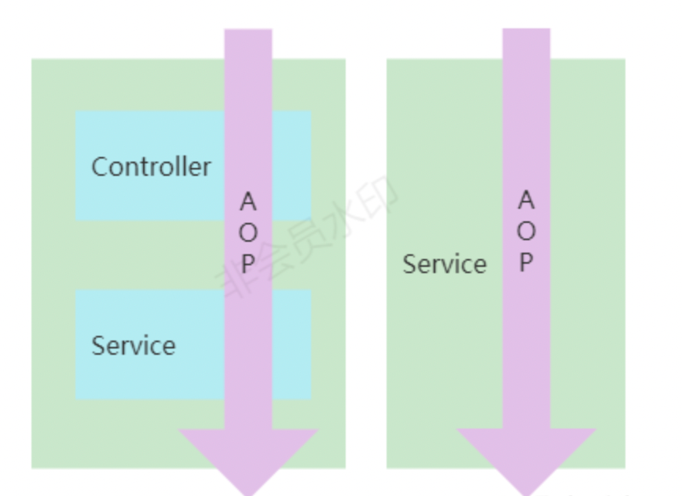
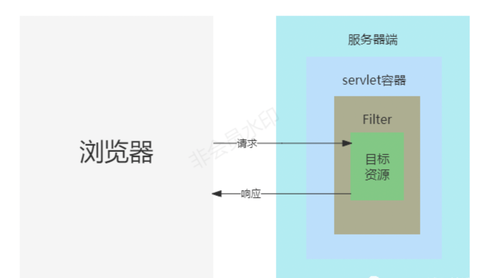
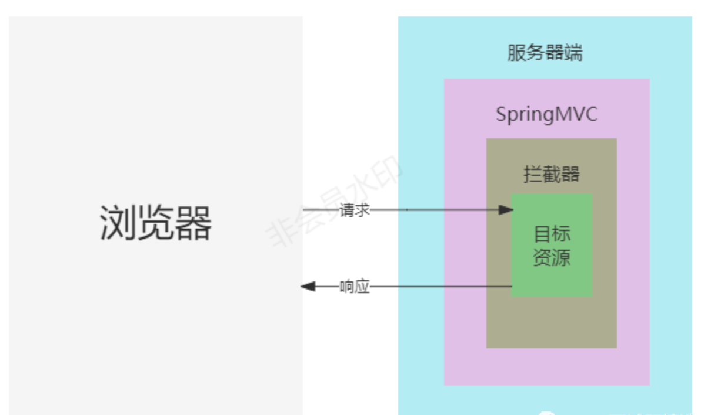

# 需求描述与分析
> 客户侧提出需求很简单：要对几个关键的业务功能进行操作日志记录，即什么人在什么时间操作了哪个功能，操作前的数据报文是什么、操作后的数据报文是什么，必要的时候可以一键回退
> 日志在业务系统中是必不可少的一个功能，常见的有系统日志、操作日志等
>
## 系统日志
> 这里的系统日志是指的是程序执行过程中的关键步骤，根据实际场景输出的debug、info、warn、error等不同级别的程序执行记录信息，这些一般是给程序员或运维看的，一般在出现异常问题的时候，可以通过系统日志中记录的关键参数信息和异常提示，快速排除故障

## 操作日志
> 操作日志，是用户实际业务操作行为的记录，这些信息一般存储在数据库里，如什么时间哪个用户点了某个菜单、修改了哪个配置等这类业务操作行为，这些日志信息是给普通用户或系统管理员看到。  
> 通过对需求的分析，客户想要是一个业务操作日志管理的功能：
> > 记录用户的业务操作行为，记录的字段有：操作人、操作时间、操作功能、日志类型、操作内容描述、操作内容报文、操作前内容报文
> > 提供一个可视化的页面，可以查询用户的业务操作行为，对重要操作回溯；
> > 提供一定的管理功能，必要的时候可以对用户的误操作回滚；
> >

### 反面实现
> 明确需求后，就是怎么实现的问题了，这里先上一个反面的实现案例，也是因为这一个反面案例，才让我对这个简单的需求印象深刻。  
> 这里我以一个人员管理的功能为例还原一下，当时的具体实现：
> >1、每个接口里都加一段记录业务操作日志的记录；  
> > 2、每个接口里都要捕获一下异常，记录异常业务操作日志；  
> > 下面是伪代码：
```
@RestController
@Slf4j
@BusLog(name = "人员管理")
@RequestMapping("/person")
public class PersonController2 {
    @Autowired
    private IPersonService personService;
    @Autowired
    private IBusLogService busLogService;
    //添加人员信息
    @PostMapping
    public Person add(@RequestBody Person person) {
       try{
           //添加信息信息
        Person result = this.personService.registe(person);
        //保存业务日志
        this.saveLog(person);
        log.info("//增加person执行完成");        
       }catch(Exception e){
           //保存异常操作日志
           this.saveExceptionLog(e);       
       }
        return result;
    }
}
```
> 这种通过硬编码实现的业务操作日志管理功能，最大的问题就是业务操作日志收集与业务逻辑耦合严重，和代码重复，新开发的接口在完成业务逻辑后要织入一段业务操作日志保存的逻辑，已开发上线的接口，还要重新再修改织入业务操作日志保存的逻辑并测试，且每个接口需要织入的业务操作日志保存的逻辑是一样的
>

### 设计思路
> 如果对AOP有一些印象的话，最好的方法就是使用aop实现：
> > 1、定义业务操作日志注解，注解内可以定义一些属性，如操作功能名称、功能的描述等；  
> > 2、把业务操作日志注解标记在需要进行业务操作记录的方法上（在实际业务中，一些简单的业务查询行为通常没有必要记录）；  
> > 3、定义切入点，编写切面：切入点就是标记了业务操作日志注解的目标方法；切面的主要逻辑就是保存业务操作日志信息；

#### Spring AOP
> 1.AOP （Aspect Orient Programming）,直译过来就是 面向切面编程,AOP 是一种编程思想，是面向对象编程（OOP）的一种补充。

> 2.面向切面编程，实现在不修改源代码的情况下给程序动态统一添加额外功能的一种技术，AOP可以拦截指定的方法并且对方法增强，而且无需侵入到业务代码中，使业务与非业务处理逻辑分离；

> 3.而SpringAOP，则是AOP的一种具体实现，Spring内部对SpringAOP的应用最经典的场景就是Spring的事务，通过事务注解的配置，Spring会自动在业务方法中开启、提交业务，并且在业务处理失败时，执行相应的回滚策略；  
> 与过滤器、拦截器相比，更加重要的是其适用范围不再局限于SpringMVC项目，可以在任意一层定义一个切点，织入相应的操作，并且还可以改变返回值；


#### Filter和HandlerInterceptor
> 之所以没有选择Filter和HandlerInterceptor，而是AOP来实现业务操作日志功能，是因为Filter和HandlerInterceptor自身的一些局限性：

> 过滤器
> > 过滤器（Filter）是与servlet相关联的一个接口，主要适用于java web项目中，依赖于Servlet容器，是利用java的回调机制来实现过滤拦截来自浏览器端的http请求，可以拦截到访问URL对应的方法的请求和响应（ServletRequest request, ServletResponse response），但是不能对请求和响应信息中的值进行修改；一般用于设置字符编码、鉴权操作等

>> 如果想要做到更细一点的类和方法或者是在非servlet环境中使用，则是做不到的；所以凡是依赖Servlet容器的环境，过滤器都可以使用，如Struts2、SpringMVC;



> 拦截器
> > 拦截器的（HandlerInterceptor）使用范围以及功能和过滤器很类似，但是也是有区别的。首先，拦截器（HandlerInterceptor）适用于SpringMVC中，因为HandlerInterceptor接口是SpringMVC相关的一个接口，而实现java Web项目，SpringMVC是目前的首选选项，但不是唯一选项，还有struts2等；因此，如果是非SpingMVC的项目，HandlerInterceptor无法使用的

> > 其次，和过滤器一样，拦截器可以拦截到访问URL对应的方法的请求和响应（ServletRequest request, ServletResponse response），但是不能对请求和响应信息中的值进行修改；一般用于设置字符编码、鉴权操作等；如果想要做到更细一点的类和方法或者是在非servlet环境中使用，则也是是做不到的

> > 总之，过滤器和拦截器的功能很类似，但是拦截器的适用范围比过滤器更小



#### SpringAOP、过滤器、拦截器对比
> 在匹配中同一目标时，过滤器、拦截器、SpringAOP的执行优先级是：过滤器>拦截器>SpringAOP，执行顺序是先进后出，具体的不同则体现在以下几个方面
> > 1、作用域不同
> > > > 过滤器依赖于servlet容器，只能在 servlet容器，web环境下使用，对请求-响应入口处进行过滤拦截；

> > > >拦截器依赖于springMVC，可以在SpringMVC项目中使用，而SpringMVC的核心是DispatcherServlet，而DispatcherServlet又属于Servlet的子类，因此作用域和过滤器类似；

> > > > SpringAOP对作用域没有限制，只要定义好切点，可以在请求-响应的入口层（controller层）拦截处理，也可以在请求的业务处理层（service层）拦截处理；

> > 2.颗粒度的不同
> > > > 过滤器的控制颗粒度比较粗，只能在doFilter()中对请求和响应进行过虑和拦截处理；

> > > > 拦截器提供更精细颗粒度的控制，有preHandle()、postHandle()、afterCompletion()，可以在controller对请求处理之前、请求处理后、请求响应完毕织入一些业务操作

> > > > SpringAOP，提供了前置通知、后置通知、返回后通知、异常通知、环绕通知，比拦截器更加精细化的颗粒度控制，甚至可以修改返回值；

## 实现方案
> 环境配置jdk版本:1.8开发工具：Intellij iDEA 2020.1 springboot:2.3.9.RELEASE mybatis-spring-boot-starter：2.1.4

> 依赖
```
<dependency>
    <groupId>org.springframework.boot</groupId>
    <artifactId>spring-boot-starter-aop</artifactId>
</dependency>
```

> 表结构设计
```
create table if not exists bus_log
(
   id bigint auto_increment comment '自增id'
      primary key,
   bus_name varchar(100) null comment '业务名称',
   bus_descrip varchar(255) null comment '业务操作描述',
   oper_person varchar(100) null comment '操作人',
   oper_time datetime null comment '操作时间',
   ip_from varchar(50) null comment '操作来源ip',
   param_file varchar(255) null comment '操作参数报文文件'
)
comment '业务操作日志' default charset ='utf8';
```

> 代码实现
>> 1.定义业务日志注解@BusLog，可以作用在控制器或其他业务类上，用于描述当前类的功能；也可以用于方法上，用于描述当前方法的作用；

```
/**
 * 业务日志注解
 * 可以作用在控制器或其他业务类上，用于描述当前类的功能；
 * 也可以用于方法上，用于描述当前方法的作用；
 */
@Target({ElementType.METHOD,ElementType.TYPE})
@Retention(RetentionPolicy.RUNTIME)
public @interface BusLog {
 
 
    /**
     * 功能名称
     * @return
     */
    String name() default "";
 
    /**
     * 功能描述
     * @return
     */
    String descrip() default "";
 
}
```

> > 2.把业务操作日志注解BusLog标记在PersonController类和方法上；

```
@RestController
@Slf4j
@BusLog(name = "人员管理")
@RequestMapping("/person")
public class PersonController {
    @Autowired
    private IPersonService personService;
    private Integer maxCount=100;
 
    @PostMapping
    @NeedEncrypt
    @BusLog(descrip = "添加单条人员信息")
    public Person add(@RequestBody Person person) {
        Person result = this.personService.registe(person);
        log.info("//增加person执行完成");
        return result;
    }
    @PostMapping("/batch")
    @BusLog(descrip = "批量添加人员信息")
    public String addBatch(@RequestBody List<Person> personList){
        this.personService.addBatch(personList);
        return String.valueOf(System.currentTimeMillis());
    }
 
    @GetMapping
    @NeedDecrypt
    @BusLog(descrip = "人员信息列表查询")
    public PageInfo<Person> list(Integer page, Integer limit, String searchValue) {
       PageInfo<Person> pageInfo = this.personService.getPersonList(page,limit,searchValue);
        log.info("//查询person列表执行完成");
        return pageInfo;
    }
    @GetMapping("/{loginNo}")
    @NeedDecrypt
    @BusLog(descrip = "人员信息详情查询")
    public Person info(@PathVariable String loginNo,String phoneVal) {
        Person person= this.personService.get(loginNo);
        log.info("//查询person详情执行完成");
        return person;
    }
    @PutMapping
    @NeedEncrypt
    @BusLog(descrip = "修改人员信息")
    public String edit(@RequestBody Person person) {
         this.personService.update(person);
        log.info("//查询person详情执行完成");
        return String.valueOf(System.currentTimeMillis());
    }
    @DeleteMapping
    @BusLog(descrip = "删除人员信息")
    public String edit(@PathVariable(name = "id") Integer id) {
         this.personService.delete(id);
        log.info("//查询person详情执行完成");
        return String.valueOf(System.currentTimeMillis());
    }
}
```

> > 3.编写切面类BusLogAop，并使用@BusLog定义切入点，在环绕通知内执行过目标方法后，获取目标类、目标方法上的业务日志注解上的功能名称和功能描述， 把方法的参数报文写入到文件中，最后保存业务操作日志信息
```
@Component
@Aspect
@Slf4j
public class BusLogAop implements Ordered {
    @Autowired
    private BusLogDao busLogDao;
 
    /**
     * 定义BusLogAop的切入点为标记@BusLog注解的方法
     */
    @Pointcut(value = "@annotation(com.fanfu.anno.BusLog)")
    public void pointcut() {
    }
 
    /**
     * 业务操作环绕通知
     *
     * @param proceedingJoinPoint
     * @retur
     */
    @Around("pointcut()")
    public Object around(ProceedingJoinPoint proceedingJoinPoint) {
        log.info("----BusAop 环绕通知 start");
        //执行目标方法
        Object result = null;
        try {
            result = proceedingJoinPoint.proceed();
        } catch (Throwable throwable) {
            throwable.printStackTrace();
        }
        //目标方法执行完成后，获取目标类、目标方法上的业务日志注解上的功能名称和功能描述
        Object target = proceedingJoinPoint.getTarget();
        Object[] args = proceedingJoinPoint.getArgs();
        MethodSignature signature = (MethodSignature) proceedingJoinPoint.getSignature();
        BusLog anno1 = target.getClass().getAnnotation(BusLog.class);
        BusLog anno2 = signature.getMethod().getAnnotation(BusLog.class);
        BusLogBean busLogBean = new BusLogBean();
        String logName = anno1.name();
        String logDescrip = anno2.descrip();
        busLogBean.setBusName(logName);
        busLogBean.setBusDescrip(logDescrip);
        busLogBean.setOperPerson("fanfu");
        busLogBean.setOperTime(new Date());
        JsonMapper jsonMapper = new JsonMapper();
        String json = null;
        try {
            json = jsonMapper.writeValueAsString(args);
        } catch (JsonProcessingException e) {
            e.printStackTrace();
        }
        //把参数报文写入到文件中
        OutputStream outputStream = null;
        try {
            String paramFilePath = System.getProperty("user.dir") + File.separator + DateUtil.format(new Date(), DatePattern.PURE_DATETIME_MS_PATTERN) + ".log";
            outputStream = new FileOutputStream(paramFilePath);
            outputStream.write(json.getBytes(StandardCharsets.UTF_8));
            busLogBean.setParamFile(paramFilePath);
        } catch (FileNotFoundException e) {
            e.printStackTrace();
        } catch (IOException e) {
            e.printStackTrace();
        } finally {
            if (outputStream != null) {
                try {
                    outputStream.flush();
                    outputStream.close();
                } catch (IOException e) {
                    e.printStackTrace();
                }
 
            }
        }
        //保存业务操作日志信息
        this.busLogDao.insert(busLogBean);
        log.info("----BusAop 环绕通知 end");
        return result;
    }
 
    @Override
    public int getOrder() {
        return 1;
    }
}
```