# TLog简介
> TLog提供了一种最简单的方式来解决日志追踪问题，TLog会自动的对你的日志进行打标签，帮你自动生成traceId贯穿你微服务的一整条链路，在排查日志的时候，可以根据traceId来快速定位请求处理的链路

> TLog不收集日志，只在对你原来打印的日志上增强，将请求链路信息traceId绑定到你打印的日志上。当出现微服务中那么多节点的情况，官方推荐使用TLog+日志收集方案来解决。  
> 当然分布式追踪系统其实是链路追踪一个最终的解决方案，如果项目中已经上了分布式追踪系统，那TLog并不适用

## TLog接入
```
<dependency>
    <groupId>com.yomahub</groupId>
    <artifactId>tlog-all-spring-boot-starter</artifactId>
    <version>1.5.0</version>
</dependency>
```

### 替换logback配置项
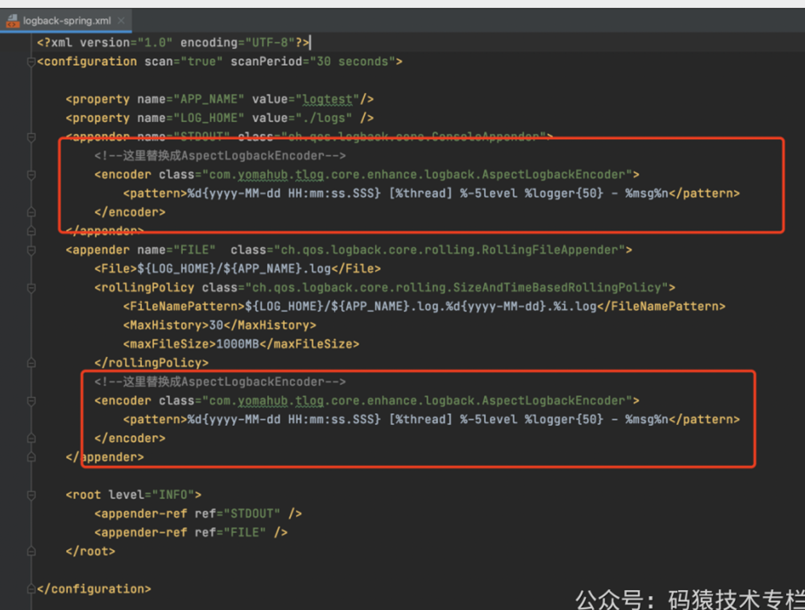


> 测试
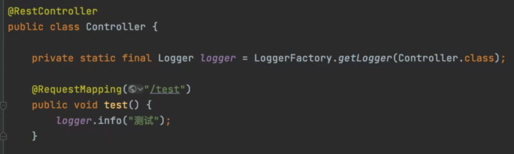

> 这里是通过slf4j的LoggerFactory获取Logger对象，因为logback适配了slf4j，最终会通过logback来输出日志

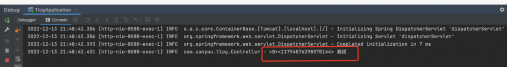
> 从这可以看出，11794076298070144 就是本次日志输出的时候生成的一个请求的traceId，在排查日志的时候就可以通过这个traceId去搜索出整个请求的链路日志。Java指南：https://java-family.cn

### TLog接入方式
> TLog总共提供了三种方式接入项目
> > 1.Javaagent接入方式

> > 2.字节码注入方式

> > 3.日志框架适配器方式

> 上面案例的接入方式其实是属于日志框架适配器方式，并且是对于Logback框架的适配。TLog除了适配了Logback框架，还适配了Log4j框架和Log4j2框架

>Javaagent接入方式和字节码注入方式相比与日志框架适配器方式对代码的入侵性更小，但是这两种方式仅仅只支持SpringBoot项目，并且相较于日志框架适配器的方式
> MDC和异步日志功能并不支持，所以要想完整体验TLog的功能，还是建议选择日志框架适配器方式，日志框架适配器方式其实接入也很快，其实也就是修改一下配置文件的事
>
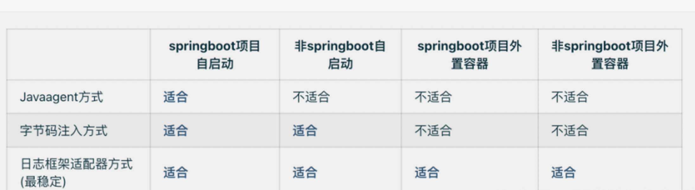

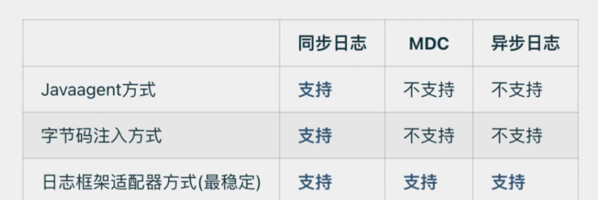

### TLog的基本原理
#### 1、日志标签
> 前面在介绍TLog的时候，提到TLog会自动的对你的日志进行打标签，这个标签就是日志标签，一个日志标签最多可以包含如下信息
> > preApp：接口调用方服务名

> > preHost：接口调用方Host

> > preIp：接口调用方ip

> > currIp：当前服务ip

> > traceId：链路id，调用方如果传递就是传递的值，不传递就会重新生成

> > spanId：链路spanId

> 默认是按照如下labelPattern进行数据拼接生成日志标签，所以默认只打出spanId和traceId
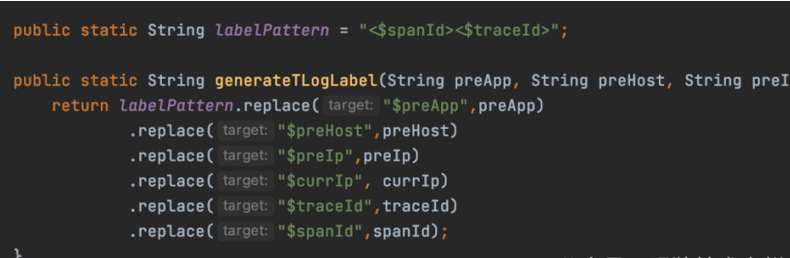

> 这也就是上面为什么示例中会输出 <0><11794076298070144> 这种格式的原因，前面的0其实就是spanId。
> 如果你想改变日志标签输出其它信息或者输出的顺序，只需要在SpringBoot配置文件中配置日志标签的生成样式就行

```
tlog.pattern=[$preApp][$preIp][$spanId][$traceId]
```

#### 2.TLogContext
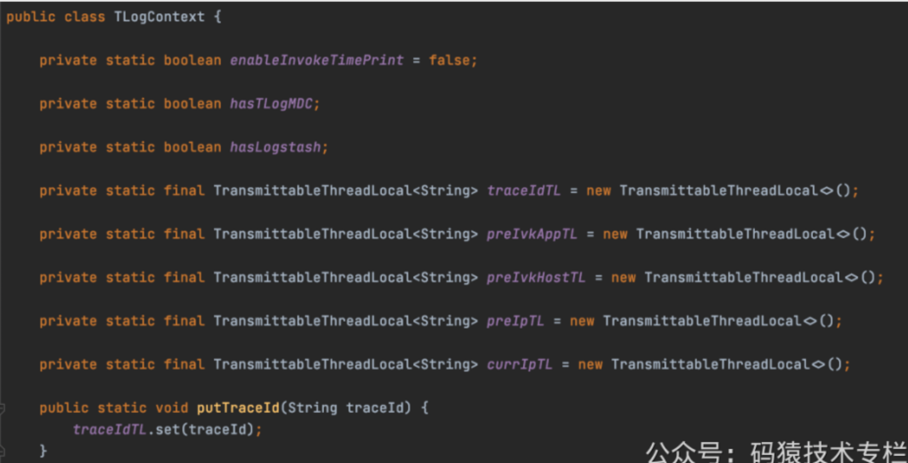

> TLogContext是TLog是一个核心的组件，这个组件内部是使用了TransmittableThreadLocal来传递traceId、preApp等信息

> 当有一个请求过来的时候，会从解析出traceId、preApp等信息，然后设置到TransmittableThreadLocal中，之后就可以在整个调用链路中从TLogContext中获取到traceId等信息

### 3、TLogRPCHandler
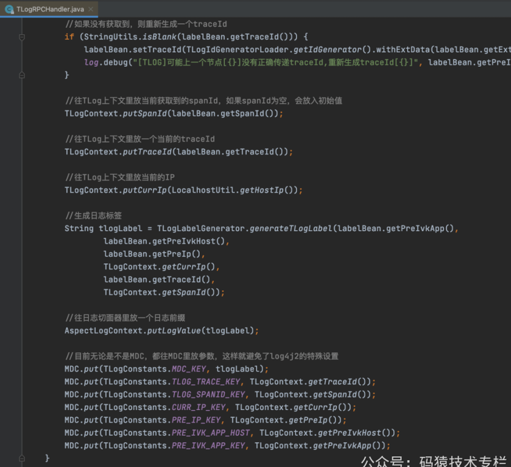

> 这个组件是用来处理调用方传递的traceId、preApp等信息，设置到TLogContext和MDC中，同时根据日志标签的格式生成日志标签

#### 第三方框架的适配
> 在实际项目中，一个请求处理过程可能会出现以下情况
> > 1.异步线程处理

> > 2.跨服务调用

> > 3.MQ调用

> 那么对于这些情况来说，traceId应该需要在异步线程、跨服务、MQ等中传递，以便更好地排查一个请求的处理链路
> 而TLog对于以上可能出现的情况都做了大量的适配，保证traceId能够在异步线程、微服务间、MQ等中能够正确传递

- 1、异步线程
> 1.1 一般异步线程
> 所谓的一般异步线程就是指直接通过new Thread的方法来创建异步线程，然后来执行，这种方式TLog是天然支持携带traceId的

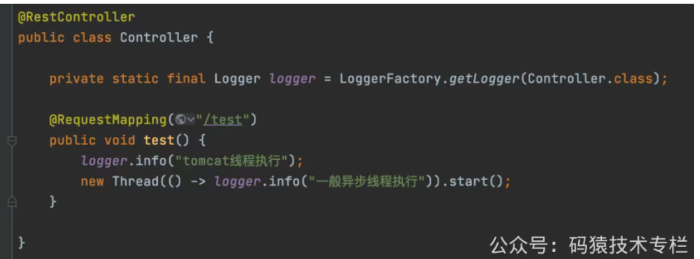

> 执行结果
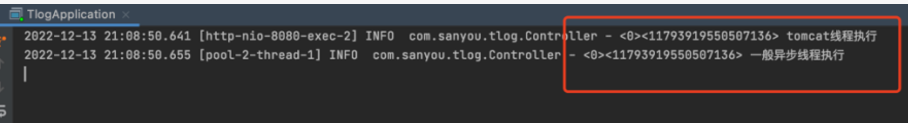

> 从这可以看出这种异步方式的确成功传递了traceId。

> 1.2 线程池
> 对于线程池来说，其实默认也是支持传递traceId，但是由于线程池中的线程是可以复用了，为了保证线程间的数据互不干扰，需要使用TLogInheritableTask将提交的任务进行包装
```
ThreadPoolExecutor pool =
        new ThreadPoolExecutor(1, 2, 1, TimeUnit.SECONDS, new LinkedBlockingQueue<>(10));
pool.execute(new TLogInheritableTask() {
    @Override
    public void runTask() {
      logger.info("异步执行");
    }
});
```

> 上述代码的写法会有点耦合，每次提交任务都需要创建一个TLogInheritableTask，比较麻烦，可以按如下写法进行简化
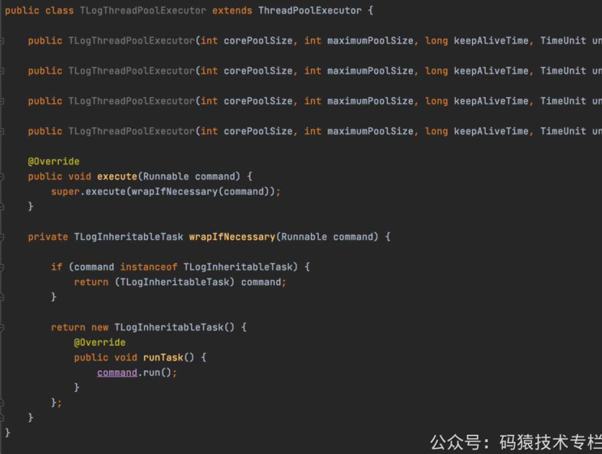
>
> 自己写个TLogThreadPoolExecutor继承ThreadPoolExecutor，重写execute方法(submit最终也会调用execute方法执行)，然后将提交的任务统一包装成TLogInheritableTask，这样需要使用线程池的地方直接创建TLogThreadPoolExecutor就可以了，就不需要在提交任务的时候创建TLogInheritableTask了

> 对RPC框架的支持
> 除了对异步线程的支持，TLog也支持常见的Dubbo，Dubbox，OpenFeign三大RPC框架，在SpringBoot项目中不需要任何配置，只需要引入依赖就可以实现traceId在服务之间的传递

> 对Dubbo和Dubbox的支持
> 对于Dubbo和Dubbox的支持是基于Dubbo的Filter扩展点来的
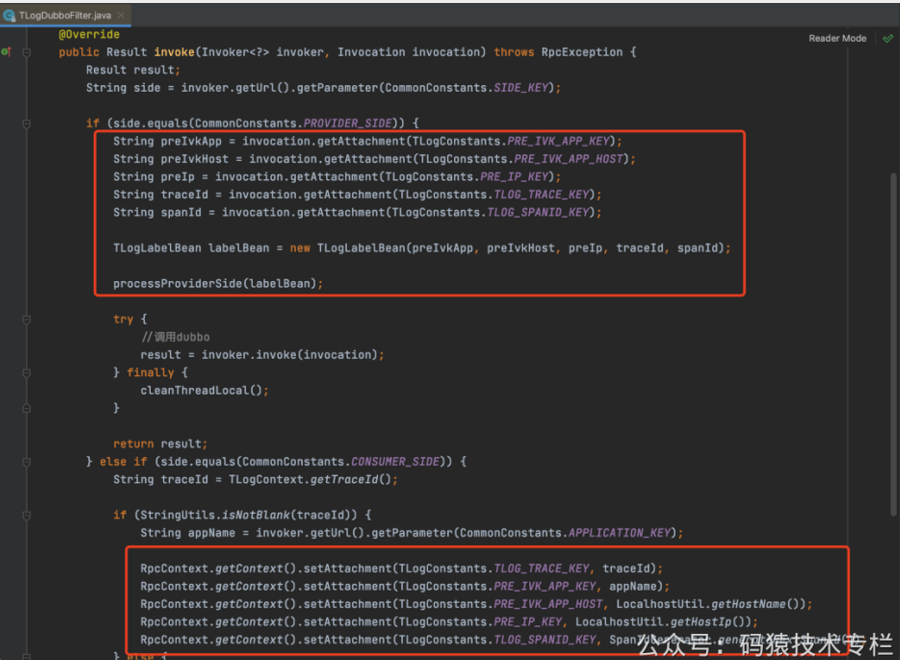
>
>TLog通过SPI机制扩展Filter，在消费者发送请求前从TLogContext获取到traceId，然后将traceId和其它调用者数据设置请求数据中，服务提供者在处理请求的时候，也会经过Filter，  
> 从请求中获取到traceId等信息，然后设置到TLogContext中，从而实现了traceId在dubbo的消费者和提供者之间的传递


> 对OpenFeign的支持
> 对于OpenFeign的支持其实也是通过Feign提供的扩展点RequestInterceptor来实现的
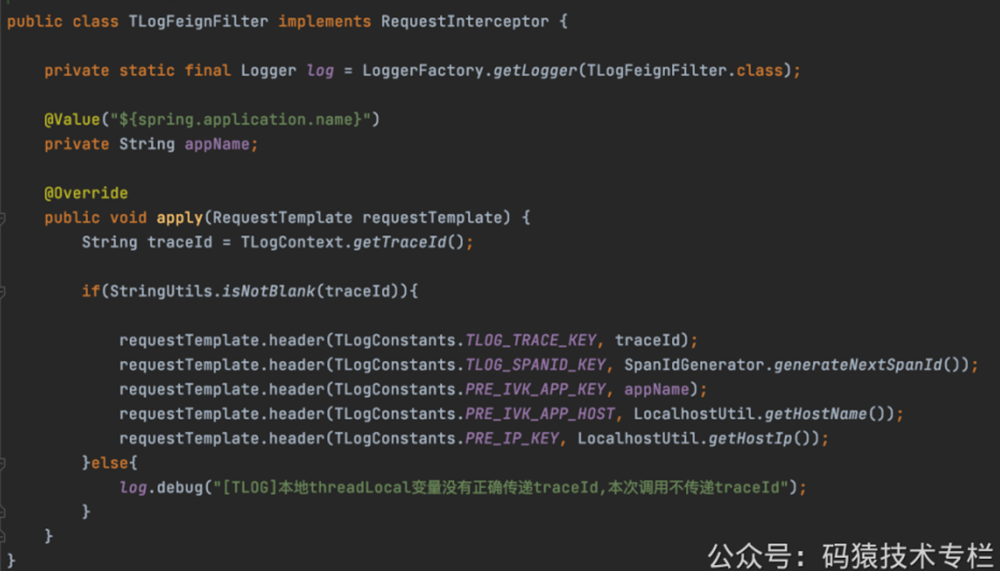
>
> 发送请求之前，从TLogContext获取到traceId，将traceId等信息添加到请求头中，然后就可以通过Http请求将traceId等信息传递
> 当被调用方接收到请求之后，会经过TLogWebInterceptor这个拦截器进行拦截，从请求头中获取到这些参数，设置到TLogContext中
>
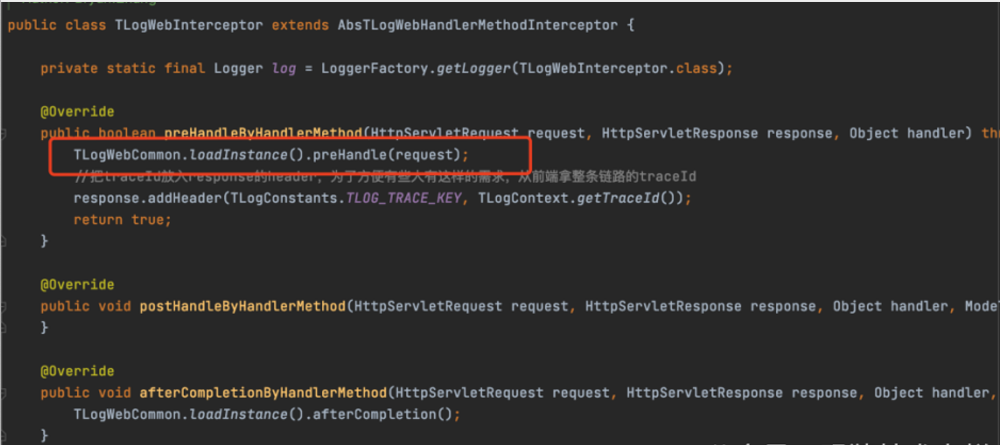

- 对常用Http框架的支持
> > HttpClient

> > Okhttp

> > hutool-http

> > RestTemplate

> > forest
> >

> 使用这些Http框架也可以实现traceId的传递
> 其实这些框架的适配跟Feign的适配都是大同小异，都是基于这些Http框架各自提供的扩展点进行适配的，将traceId等信息放到请求头中，这里都不举例了

> 对SpringCloud Gateway的支持
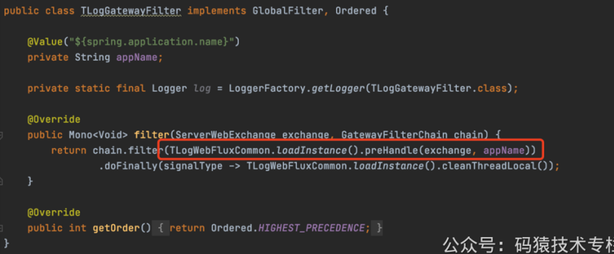

> 原理也是一样的，就是适配了Gateway的GlobalFilter，从请求头中获取traceId等信息


对MQ的支持

> 对于MQ的支持跟异步线程差不多，需要将你发送的消息包装成TLogMqWrapBean对象
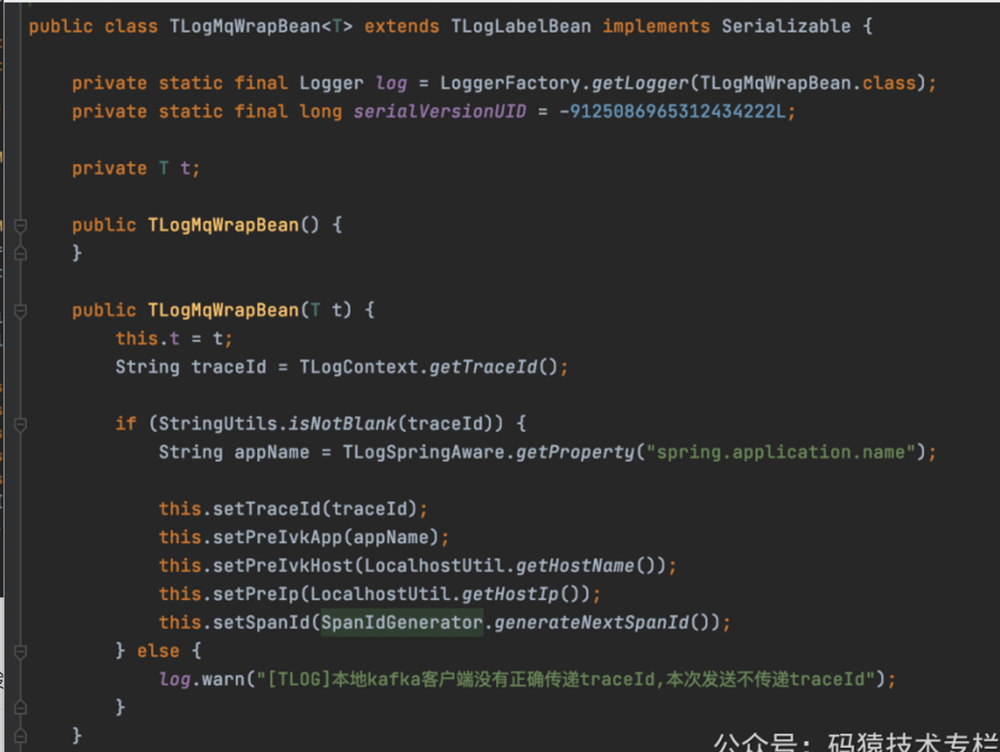

> 发送的时候直接发送TLogMqWrapBean对象过去
```
TLogMqWrapBean<BizBean> tLogMqWrap = new TLogMqWrapBean(bizBean);
mqClient.send(tLogMqWrap);
```

> TLogMqWrapBean会将traceId等信息携带，消费者接受到TLogMqWrapBean，然后通过TLogMqConsumerProcessor处理业务消息
```
TLogMqConsumerProcessor.process(tLogMqWrapBean, new TLogMqRunner<BizBean>() {
    @Override
    public void mqConsume(BizBean o) {
     //业务操作
    }
});
```
> 如此就实现了traceId通过MQ传递。
> 在实际使用中，根据不同的MQ的类型，可以将消息包装成TLogMqWrapBean对象的过程和处理消息的过程做统一的封装处理，以减少发送消息和处理消息对于TLog的耦合

- 对任务框架的支持
>1.TLog主要是支持一下四种任务框架
>> JDK Timer
> >
>> Quartz框架
> >
> > spring-scheduled
> >
> > XXL-JOB框架

> 其中，spring-scheduled和XXL-JOB在SpringBoot环境底下是无需任务配置的，只需要引入依赖即可
> Timer在使用的时候需要将任务包装成TLogTimerTask，Quartz需要把QuartzJobBean替换成TLogQuartzJobBean就可以了

- 总结
> 其实从上面的各种适配可以看出，其实本质都是一样的，就是根据具体框架的扩展点，在发送请求之前从TLogContext获取到traceId，将traceId等调用者的信息在请求中携带，然后被调用方解析请求，取出traceId和调用者信息，设置到被调用方服务中的TLogContext中
>
> 总的来说，TLog是一款非常优秀的日志追踪的框架，很适合中小公司使用。这里来总结一下TLog的特性
> > 通过对日志打标签完成轻量级微服务日志追踪  
> > 提供三种接入方式：javaagent完全无侵入接入，字节码一行代码接入，基于配置文件的接入  
> > 对业务代码无侵入式设计，使用简单，10分钟即可接入支持常见的log4j，log4j2，logback三大日志框架，并提供自动检测，完成适配  
> > 支持dubbo，dubbox，feign三大RPC框架  
> > 支持Spring Cloud Gateway和Soul网关  
> > 支持HttpClient和Okhttp等http调用框架标签传递  
> > 支持多种任务框架，JDK的TimerTask，Quartz，XXL-JOB，spring-scheduled  
> > 支持日志标签的自定义模板的配置，提供多个系统级埋点标签的选择  
> > 支持异步线程的追踪，包括线程池，多级异步线程等场景  
> > 几乎无性能损耗，快速稳定，经过压测，损耗在0.01%
>
