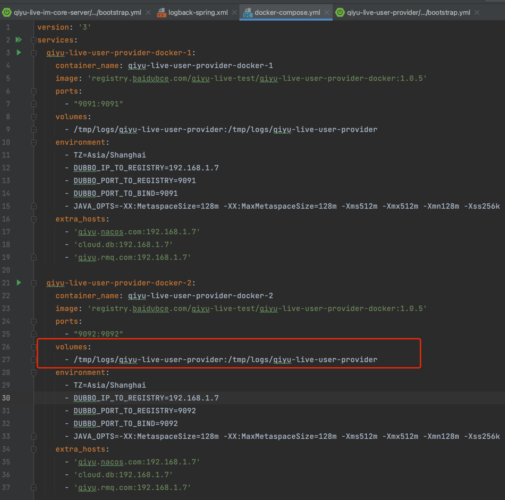
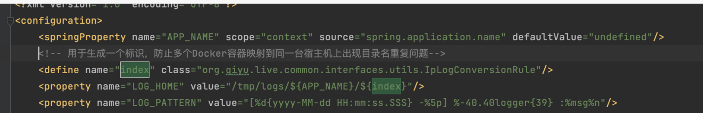
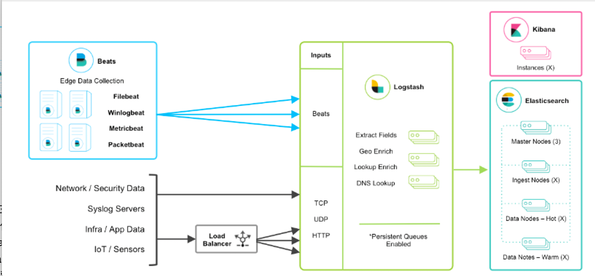

## 容器日志的打印管理
> 我们以springboot服务类型为案例，梳理下日志打印的配置文件应该如何设计，首先我们来看以下日志配置内容

```
<?xml version="1.0" encoding="utf-8"?>

<configuration> 
  <springProperty name="APP_NAME" scope="context" source="spring.application.name" defaultValue="undefined"/>  
  <!-- 用于生成一个标识，防止多个Docker容器映射到同一台宿主机上出现目录名重复问题-->  
  <define name="index" class="org.qiyu.live.common.interfaces.utils.IpLogConversionRule"/>  
  <property name="LOG_HOME" value="/tmp/logs/${APP_NAME}/${index}"/>  
  <property name="LOG_PATTERN" value="[%d{yyyy-MM-dd HH:mm:ss.SSS} -%5p] %-40.40logger{39} :%msg%n"/>  
  <!--  控制台标准继续输出内容  -->  
  <appender name="CONSOLE" class="ch.qos.logback.core.ConsoleAppender"> 
    <!-- 日志输出的格式  -->  
    <layout class="ch.qos.logback.classic.PatternLayout"> 
      <pattern>${LOG_PATTERN}</pattern> 
    </layout> 
  </appender>  
  <!--   info级别的日志，记录到对应的文件内 -->  
  <appender name="INFO_FILE" class="ch.qos.logback.core.rolling.RollingFileAppender"> 
    <file>${LOG_HOME}/${APP_NAME}.log</file>  
    <!-- 滚动策略，日志生成的时候会按照时间来进行分类，例如2023-05-11日的日志，后缀就会有2023-05-11，每天的日志归档后的名字都不一样      -->  
    <rollingPolicy class="ch.qos.logback.core.rolling.TimeBasedRollingPolicy"> 
      <fileNamePattern>${LOG_HOME}/${APP_NAME}.log.%d{yyyy-MM-dd}</fileNamePattern>  
      <!--  日志只保留1个月 -->  
      <maxHistory>1</maxHistory> 
    </rollingPolicy>  
    <!-- 日志输出的格式  -->  
    <layout class="ch.qos.logback.classic.PatternLayout"> 
      <pattern>${LOG_PATTERN}</pattern> 
    </layout> 
  </appender>  
  <!--  error级别的日志，记录到对应的文件内  -->  
  <appender name="ERROR_FILE" class="ch.qos.logback.core.rolling.RollingFileAppender"> 
    <file>${LOG_HOME}/${APP_NAME}_error.log</file>  
    <!-- 滚动策略，日志生成的时候会按照时间来进行分类，例如2023-05-11日的日志，后缀就会有2023-05-11，每天的日志归档后的名字都不一样      -->  
    <rollingPolicy class="ch.qos.logback.core.rolling.TimeBasedRollingPolicy"> 
      <fileNamePattern>${LOG_HOME}/${APP_NAME}_error.log.%d{yyyy-MM-dd}</fileNamePattern>  
      <!--  日志只保留1个月 -->  
      <maxHistory>1</maxHistory> 
    </rollingPolicy>  
    <!-- 日志输出的格式  -->  
    <layout class="ch.qos.logback.classic.PatternLayout"> 
      <pattern>${LOG_PATTERN}</pattern> 
    </layout>  
    <!--   值记录error级别的日志 -->  
    <filter class="ch.qos.logback.classic.filter.LevelFilter"> 
      <level>error</level>  
      <onMismatch>DENY</onMismatch> 
    </filter> 
  </appender>  
  <!-- 根输出级别为INFO，控制台中将出现包含info及以上级别的日志-->  
  <!-- 日志输出级别 -->  
  <root level="INFO"> 
    <!-- ref值与上面的appender标签的name相对应 -->  
    <appender-ref ref="CONSOLE"/>  
    <appender-ref ref="INFO_FILE"/>  
    <appender-ref ref="ERROR_FILE"/> 
  </root>
</configuration>

```

> 这份配置中有几个关键的点需要注意下：
> 1.如何保证服务输出日志的内容，同时也会在控制台上输出？
> > 这里我们需要配置一个 ch.qos.logback.core.ConsoleAppender ，这个类底层会通过System.out.println类型的方式来将日志的内容同样输出到控制台，确保我们启动服务的时候观测起来更加快捷

> 2.如何避免日志文件体积过大？
> > 通常来说，日志文件体积太过庞大，会导致磁盘空间不足，所以一般的做法是按照日期分割，只保留最近一段时间的日志内容(RollingFileAppender)

> 3.容器内的日志路径，如何挂载到宿主机？
> > 这个问题我们需要分场景来区别，如果只是单机服务，那么在启动脚本中，做好磁盘路径映射即可，例如在docker-compose.yml文件中设置好volumes参数，做好容器内的路径映射到宿主机的指定路径


>> 但是如果是集群部署的话，这样还会存在一个问题，就是各个容器的名称都是一样的，如何区别日志的来源。  
> > 所以这里我们可以在创建log文件的时候，注入一个ip的因子，用于标识当前日志是哪个容器产生的


>这里我们可以在Java中自定义一个对象，用于返还当前docker容器的ip地址，具体代码如下：
```
package org.qiyu.live.common.interfaces.utils;
import ch.qos.logback.core.PropertyDefinerBase;
import java.net.InetAddress;i
mport java.net.UnknownHostException;
import java.util.concurrent.ThreadLocalRandom;

/** 
* 保证每个docker容器的日志挂载目录唯一性 
* 
* @Author idea 
* @Date: Created in 15:57 2023/6/3 
* @Description 
*/
public class IpLogConversionRule extends PropertyDefinerBase {

    @Override    
    public String getPropertyValue() {
            return this.getLogIndex();    
    }

    private String getLogIndex() {        
        try {            
            return InetAddress.getLocalHost().getHostAddress();        
        } catch (UnknownHostException e) {
            e.printStackTrace();
        }
        return String.valueOf(ThreadLocalRandom.current().nextInt(100000));    
        }
    }
```

> 每次查看日志都要到宿主机操作，如何简化
> 上边我们介绍的日志管理方式，还是一种很粗暴的方式，但是其实如今很多中小型公司都会这么做，  
> 但是随着服务种类的增加，假设有上百种微服务，不同服务的日志散落在不通的机器上，如果我们需要查看一条长链路请求的日志行为，那么将会是一件非常痛苦的事情。
> 于是日志记录的治理方案也开始逐渐产生。如果需要将日志治理做成系统化，那么这套系统需要具备哪些功能特性呢？我总结了下，具体特点可以分为以下几类
> > 收集：能够采集多种来源的日志数据  
> > 传输：能够稳定的把日志数据解析过滤并传输到存储系统  
> > 存储：存储日志数据  
> > 分析：支持UI分析  
> > 警告：能够提供错误报告，监控机制
> >

> 相信看到这里，你应该能想到ELK这个名词了吧。是的，ELK在日志采集和日志搜索，以及日志监控这块都做的比较成熟，因此该架构一直被各大互联网公司所采用。下边这张图是一张ELK的整体架构图


> ELK是三个开源软件的缩写，分别表示：Elasticsearch , Logstash, Kibana , 它们都是开源软件。  
> 新增了一个FileBeat，它是一个轻量级的日志收集处理工具(Agent)，Filebeat占用资源少，适合于在各个服务器上搜集日志后传输给Logstash。  
> 最后由Logstash将日志以规定的格式输出写入到ES中，写入完成后，用户就可以在Kibana平台上搜索到新泻入的日志了