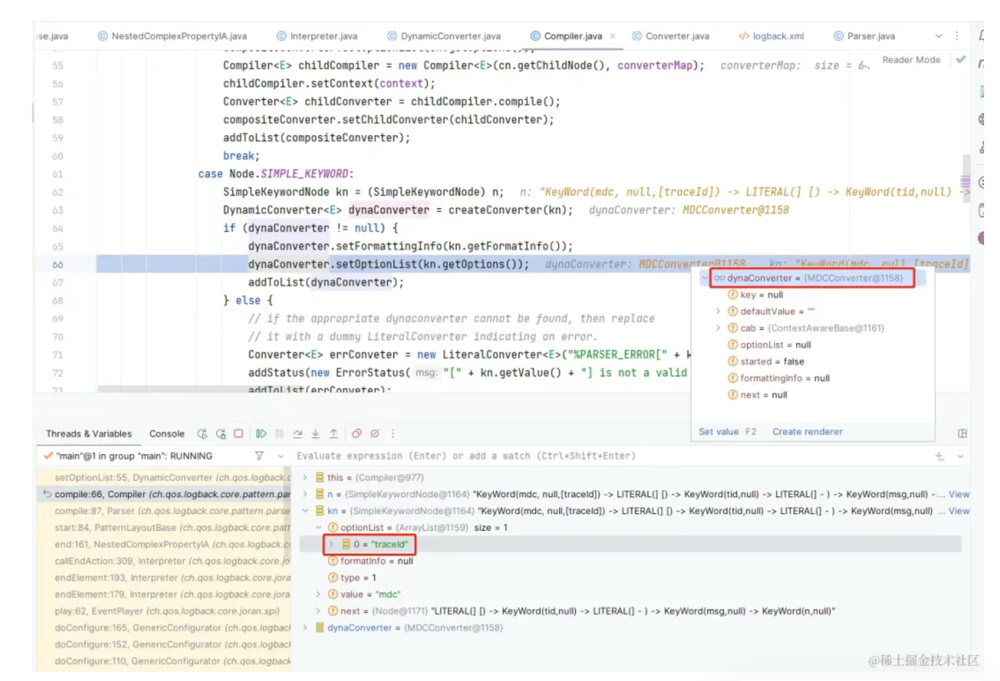
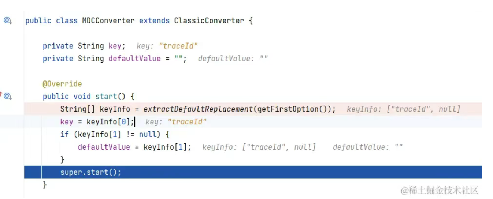

# 分布式链路追踪：TraceIdFilter + MDC + Skywalking

> 痛点: 查线上日志时，同一个 Pod 内多线程日志交错，很难追踪每个请求对应的日志信息。日志收集工具将多个 Pod 的日志收集到同一个数据库中后，情况就更加混乱不堪了

> 解决： TraceId + MDC （MDC： https://logback.qos.ch/manual/mdc.html）
> > 1.前端每次请求时，添加 X-App-Trace-Id 请求头，X-App-Trace-Id 值的生成方式可以选择【时间戳 + UUID】，保证 traceId 的唯一性

> >  2.后端在 TraceIdFilter 中取出 X-App-Trace-Id 的值：String traceId = httpServletRequest.getHeader(TRACE_ID_HEADER_KEY)。  
> > 如果请求没有携带 X-App-Trace-Id 请求头，后端服务可以使用 UUID 或者 Snowflake 算法生成一个 traceId

> > 3.将 traceId 塞到 slf4j MDC 中：MDC.put(MDC_TRACE_ID_KEY, traceId)，在 logback pattern 中使用 %X{traceId} 占位符打印 traceId

```
public void doFilter(ServletRequest request, ServletResponse response, FilterChain chain)
        throws IOException, ServletException {
    HttpServletRequest httpServletRequest = (HttpServletRequest) request;
    String traceId = httpServletRequest.getHeader(TRACE_ID_HEADER_KEY);
    if (StrUtil.isBlank(traceId)) {
        traceId = UUID.randomUUID().toString();
    }
    MDC.put(MDC_TRACE_ID_KEY, traceId);
    try {
        chain.doFilter(request, response);
    } finally {
        MDC.remove(MDC_TRACE_ID_KEY);
    }
}
```

```
<?xml version="1.0" encoding="UTF-8"?>
<configuration debug="false">
    <property name="pattern" value="[%d{yyyy-MM-dd HH:mm:ss.SSS}] %-5level [%thread] %logger %line [%X{traceId}] [%tid] - %msg%n"/>
```

> 整合 Feign
> > 发起服务间调用时，需要将 MDC 中的 traceId 传递到被调用服务。
> > 我们项目中统一使用 Feign Client，实现服务间的 HTTP 远程调用，在 Feign RequestInterceptor 中，
> > 取出 MDC 中的 traceId，塞到请求头中：requestTemplate.header(TRACE_ID_HEADER_KEY, MDC.get(MDC_TRACE_ID_KEY))

```
@Override
public void apply(RequestTemplate template) {
    template.header(TRACE_ID_HEADER_KEY, MDC.get(MDC_TRACE_ID_KEY));
}
```

> 多线程适配
> > 在子线程执行任务前，将父线程的 MDC 内容设置到子线程的 MDC 中；在子线程任务执行完成后，清除子线程 MDC 中的内容

```
public class MdcAwareThreadPoolExecutor extends ThreadPoolExecutor {

    @Override
    public void execute(Runnable command) {
        Map<String, String> parentThreadContextMap = MDC.getCopyOfContextMap();
        super.execute(MdcTaskUtils.adaptMdcRunnable(command, parentThreadContextMap));
    }
}
```

> 适配 Spring TaskDecorator：
```
@Component
public class MdcAwareTaskDecorator implements TaskDecorator {

    @Override
    public Runnable decorate(Runnable runnable) {
        Map<String, String> parentThreadContextMap = MDC.getCopyOfContextMap();
        return MdcTaskUtils.adaptMdcRunnable(runnable, parentThreadContextMap);
    }
}
```

MdcTaskUtils#adaptMdcRunnable()：采用装饰者模式，装饰原生的 Runnable runnable 对象，在原生 Runnable 对象执行前，将父线程的 MDC 设置到子线程中，在原生 Runnable 对象执行结束后，清除子线程 MDC 中的内容

```
@Slf4j
public abstract class MdcTaskUtils {

    public static Runnable adaptMdcRunnable(Runnable runnable, Map<String, String> parentThreadContextMap) {
        return () -> {
            log.debug("parentThreadContextMap: {}, currentThreadContextMap: {}", parentThreadContextMap,
                    MDC.getCopyOfContextMap());
            if (MapUtils.isEmpty(parentThreadContextMap) || !parentThreadContextMap.containsKey(MDC_TRACE_ID_KEY)) {
                log.debug("can not find a parentThreadContextMap, maybe task is fired using async or schedule task.");
                MDC.put(MDC_TRACE_ID_KEY, UUID.randomUUID().toString());
            } else {
                MDC.put(MDC_TRACE_ID_KEY, parentThreadContextMap.get(MDC_TRACE_ID_KEY));
            }
            try {
                runnable.run();
            } finally {
                MDC.remove(MDC_TRACE_ID_KEY);
            }
        };
    }

}
```

> 整合 Skywalking
> > Skywalking 官方提供了对 logback 1.x 版本的适配：apm-toolkit-logback-1.x，可以在 logback 中打印 skywalking traceId，可以将 X-App-Trace-Id 和 skywalking traceId 结合起来，方便接口业务和性能问题的排查
> > layout 具体实现类选择 TraceIdPatternLogbackLayout
> > 在 logback pattern 中使用 %tid 打印 skywalking traceId

```
<?xml version="1.0" encoding="UTF-8"?>
<configuration debug="false">
    <property name="pattern" value="[%d{yyyy-MM-dd HH:mm:ss.SSS}] %-5level [%thread] %logger %line [%X{traceId}] [%tid] - %msg%n"/>

    <appender name="STDOUT" class="ch.qos.logback.core.ConsoleAppender">
        <encoder class="ch.qos.logback.core.encoder.LayoutWrappingEncoder">
            <layout class="org.apache.skywalking.apm.toolkit.log.logback.v1.x.TraceIdPatternLogbackLayout">
                <pattern>${pattern}</pattern>
            </layout>
        </encoder>
    </appender>
```

>> TraceIdPatternLogbackLayout 类初始化时，添加了两个 PatternConverter：
>> tid：使用 LogbackPatternConverter，将 %tid 占位符转换为 skywalking traceId
> > sw_ctx：使用 LogbackSkyWalkingContextPatternConverter，将 %sw_ctx 占位符转换为 skywalking context
```
public class TraceIdPatternLogbackLayout extends PatternLayout {
    public TraceIdPatternLogbackLayout() {
    }

    static {
        defaultConverterMap.put("tid", LogbackPatternConverter.class.getName());
        defaultConverterMap.put("sw_ctx", LogbackSkyWalkingContextPatternConverter.class.getName());
    }
}
```

>> LogbackPatternConverter#convert() 方法写死了返回 "TID: N/A"，这是怎么回事呢？
```
public class LogbackPatternConverter extends ClassicConverter {
    public LogbackPatternConverter() {
    }

    public String convert(ILoggingEvent iLoggingEvent) {
        return "TID: N/A";
    }
}
```
>> 启动 Java 应用时，指定 java agent 启动参数 -javaagent:-javaagent:/opt/tools/skywalking-agent.jar。  
> > skywalking agent 会代理 LogbackPatternConverter 类，重写 convert() 方法的逻辑

```
package org.apache.skywalking.apm.toolkit.log.logback.v1.x;

import ch.qos.logback.classic.pattern.ClassicConverter;
import ch.qos.logback.classic.spi.ILoggingEvent;
import java.lang.reflect.Method;
import org.apache.skywalking.apm.agent.core.plugin.interceptor.enhance.EnhancedInstance;
import org.apache.skywalking.apm.agent.core.plugin.interceptor.enhance.InstMethodsInter;
import org.apache.skywalking.apm.toolkit.log.logback.v1.x.LogbackPatternConverter$auxiliary$pJ6Zrqzi;

public class LogbackPatternConverter
extends ClassicConverter
implements EnhancedInstance {
   private volatile Object _$EnhancedClassField_ws;
   public static volatile /* synthetic */ InstMethodsInter delegate$mo3but1;
   private static final /* synthetic */ Method cachedValue$oeLgRjrq$u5j8qu3;

   public String convert(ILoggingEvent iLoggingEvent) {
       return (String)delegate$mo3but1.intercept(this, new Object[]{iLoggingEvent}, new LogbackPatternConverter$auxiliary$pJ6Zrqzi(this, iLoggingEvent), cachedValue$oeLgRjrq$u5j8qu3);
   }

   private /* synthetic */ String convert$original$T8InTdln(ILoggingEvent iLoggingEvent) {
/*34*/         return "TID: N/A";
   }

   @Override
   public void setSkyWalkingDynamicField(Object object) {
       this._$EnhancedClassField_ws = object;
   }

   @Override
   public Object getSkyWalkingDynamicField() {
       return this._$EnhancedClassField_ws;
   }

   static {
       ClassLoader.getSystemClassLoader().loadClass("org.apache.skywalking.apm.dependencies.net.bytebuddy.dynamic.Nexus").getMethod("initialize", Class.class, Integer.TYPE).invoke(null, LogbackPatternConverter.class, -1942176692);
       cachedValue$oeLgRjrq$u5j8qu3 = LogbackPatternConverter.class.getMethod("convert", ILoggingEvent.class);
   }

   final /* synthetic */ String convert$original$T8InTdln$accessor$oeLgRjrq(ILoggingEvent iLoggingEvent) {
       return this.convert$original$T8InTdln(iLoggingEvent);
   }
}
```

### MDC 原理
> MDC 在 slf4j-api jar 包中，MDC 是 slf4j 的规范，对 MDC 的所有操作都会落到 MDCAdapter 接口的方法上

```
public class MDC {

    static final String NULL_MDCA_URL = "http://www.slf4j.org/codes.html#null_MDCA";
    static final String NO_STATIC_MDC_BINDER_URL = "http://www.slf4j.org/codes.html#no_static_mdc_binder";
    static MDCAdapter mdcAdapter;
    
    public static void put(String key, String val) throws IllegalArgumentException {
        if (key == null) {
            throw new IllegalArgumentException("key parameter cannot be null");
        }
        if (mdcAdapter == null) {
            throw new IllegalStateException("MDCAdapter cannot be null. See also " + NULL_MDCA_URL);
        }
        mdcAdapter.put(key, val);
    }
}
```

> MDCAdapter 是 slf4j 提供的 MDC 适配器接口，也就是 MDC 的规范。任何日志框架想要使用 MDC 功能，需要遵守 MDCAdapter 接口接口规范，实现接口中的方法

```
// This interface abstracts the service offered by various MDC implementations.
public interface MDCAdapter {

    public void put(String key, String val);

    public String get(String key);
}
```

> Logback 日志框架提供了对 MDCAdapter 的适配：LogbackMDCAdapter，底层采用 ThreadLocal 实现
```
public class LogbackMDCAdapter implements MDCAdapter {

    // The internal map is copied so as

    // We wish to avoid unnecessarily copying of the map. To ensure
    // efficient/timely copying, we have a variable keeping track of the last
    // operation. A copy is necessary on 'put' or 'remove' but only if the last
    // operation was a 'get'. Get operations never necessitate a copy nor
    // successive 'put/remove' operations, only a get followed by a 'put/remove'
    // requires copying the map.
    // See http://jira.qos.ch/browse/LOGBACK-620 for the original discussion.

    // We no longer use CopyOnInheritThreadLocal in order to solve LBCLASSIC-183
    // Initially the contents of the thread local in parent and child threads
    // reference the same map. However, as soon as a thread invokes the put()
    // method, the maps diverge as they should.
    final ThreadLocal<Map<String, String>> copyOnThreadLocal = new ThreadLocal<Map<String, String>>();

    private static final int WRITE_OPERATION = 1;
    private static final int MAP_COPY_OPERATION = 2;

    // keeps track of the last operation performed
    final ThreadLocal<Integer> lastOperation = new ThreadLocal<Integer>();


    public void put(String key, String val) throws IllegalArgumentException {
        if (key == null) {
            throw new IllegalArgumentException("key cannot be null");
        }

        Map<String, String> oldMap = copyOnThreadLocal.get();
        Integer lastOp = getAndSetLastOperation(WRITE_OPERATION);

        if (wasLastOpReadOrNull(lastOp) || oldMap == null) {
            Map<String, String> newMap = duplicateAndInsertNewMap(oldMap);
            newMap.put(key, val);
        } else {
            oldMap.put(key, val);
        }
    }
    
    public String get(String key) {
        final Map<String, String> map = copyOnThreadLocal.get();
        if ((map != null) && (key != null)) {
            return map.get(key);
        } else {
            return null;
        }
    }
}
```

> Logback 占位符
> > PatternLayout 类初始化时，设置了 logback 常用占位符对应的 Converter

```
public class PatternLayout extends PatternLayoutBase<ILoggingEvent> {

    public static final Map<String, String> DEFAULT_CONVERTER_MAP = new HashMap<String, String>();
    public static final Map<String, String> CONVERTER_CLASS_TO_KEY_MAP = new HashMap<String, String>();
    
    /**
     * @deprecated replaced by DEFAULT_CONVERTER_MAP
     */
    public static final Map<String, String> defaultConverterMap = DEFAULT_CONVERTER_MAP;
    
    public static final String HEADER_PREFIX = "#logback.classic pattern: ";

    static {
        DEFAULT_CONVERTER_MAP.putAll(Parser.DEFAULT_COMPOSITE_CONVERTER_MAP);

        DEFAULT_CONVERTER_MAP.put("d", DateConverter.class.getName());
        DEFAULT_CONVERTER_MAP.put("date", DateConverter.class.getName());
        CONVERTER_CLASS_TO_KEY_MAP.put(DateConverter.class.getName(), "date");
        
        DEFAULT_CONVERTER_MAP.put("r", RelativeTimeConverter.class.getName());
        DEFAULT_CONVERTER_MAP.put("relative", RelativeTimeConverter.class.getName());
        CONVERTER_CLASS_TO_KEY_MAP.put(RelativeTimeConverter.class.getName(), "relative");
        
        DEFAULT_CONVERTER_MAP.put("level", LevelConverter.class.getName());
        DEFAULT_CONVERTER_MAP.put("le", LevelConverter.class.getName());
        DEFAULT_CONVERTER_MAP.put("p", LevelConverter.class.getName());
        CONVERTER_CLASS_TO_KEY_MAP.put(LevelConverter.class.getName(), "level");
        
        
        DEFAULT_CONVERTER_MAP.put("t", ThreadConverter.class.getName());
        DEFAULT_CONVERTER_MAP.put("thread", ThreadConverter.class.getName());
        CONVERTER_CLASS_TO_KEY_MAP.put(ThreadConverter.class.getName(), "thread");
        
        DEFAULT_CONVERTER_MAP.put("lo", LoggerConverter.class.getName());
        DEFAULT_CONVERTER_MAP.put("logger", LoggerConverter.class.getName());
        DEFAULT_CONVERTER_MAP.put("c", LoggerConverter.class.getName());
        CONVERTER_CLASS_TO_KEY_MAP.put(LoggerConverter.class.getName(), "logger");
        
        DEFAULT_CONVERTER_MAP.put("m", MessageConverter.class.getName());
        DEFAULT_CONVERTER_MAP.put("msg", MessageConverter.class.getName());
        DEFAULT_CONVERTER_MAP.put("message", MessageConverter.class.getName());
        CONVERTER_CLASS_TO_KEY_MAP.put(MessageConverter.class.getName(), "message");
        
        DEFAULT_CONVERTER_MAP.put("C", ClassOfCallerConverter.class.getName());
        DEFAULT_CONVERTER_MAP.put("class", ClassOfCallerConverter.class.getName());
        CONVERTER_CLASS_TO_KEY_MAP.put(ClassOfCallerConverter.class.getName(), "class");
        
        DEFAULT_CONVERTER_MAP.put("M", MethodOfCallerConverter.class.getName());
        DEFAULT_CONVERTER_MAP.put("method", MethodOfCallerConverter.class.getName());
        CONVERTER_CLASS_TO_KEY_MAP.put(MethodOfCallerConverter.class.getName(), "method");
        
        DEFAULT_CONVERTER_MAP.put("L", LineOfCallerConverter.class.getName());
        DEFAULT_CONVERTER_MAP.put("line", LineOfCallerConverter.class.getName());
        CONVERTER_CLASS_TO_KEY_MAP.put(LineOfCallerConverter.class.getName(), "line");
        
        DEFAULT_CONVERTER_MAP.put("F", FileOfCallerConverter.class.getName());
        DEFAULT_CONVERTER_MAP.put("file", FileOfCallerConverter.class.getName());
        CONVERTER_CLASS_TO_KEY_MAP.put(FileOfCallerConverter.class.getName(), "file");
        
        DEFAULT_CONVERTER_MAP.put("X", MDCConverter.class.getName());
        DEFAULT_CONVERTER_MAP.put("mdc", MDCConverter.class.getName());

        DEFAULT_CONVERTER_MAP.put("ex", ThrowableProxyConverter.class.getName());
        DEFAULT_CONVERTER_MAP.put("exception", ThrowableProxyConverter.class.getName());
        DEFAULT_CONVERTER_MAP.put("rEx", RootCauseFirstThrowableProxyConverter.class.getName());
        DEFAULT_CONVERTER_MAP.put("rootException", RootCauseFirstThrowableProxyConverter.class.getName());
        DEFAULT_CONVERTER_MAP.put("throwable", ThrowableProxyConverter.class.getName());

        DEFAULT_CONVERTER_MAP.put("xEx", ExtendedThrowableProxyConverter.class.getName());
        DEFAULT_CONVERTER_MAP.put("xException", ExtendedThrowableProxyConverter.class.getName());
        DEFAULT_CONVERTER_MAP.put("xThrowable", ExtendedThrowableProxyConverter.class.getName());

        DEFAULT_CONVERTER_MAP.put("nopex", NopThrowableInformationConverter.class.getName());
        DEFAULT_CONVERTER_MAP.put("nopexception", NopThrowableInformationConverter.class.getName());

        DEFAULT_CONVERTER_MAP.put("cn", ContextNameConverter.class.getName());
        DEFAULT_CONVERTER_MAP.put("contextName", ContextNameConverter.class.getName());
        CONVERTER_CLASS_TO_KEY_MAP.put(ContextNameConverter.class.getName(), "contextName");
        
        DEFAULT_CONVERTER_MAP.put("caller", CallerDataConverter.class.getName());
        CONVERTER_CLASS_TO_KEY_MAP.put(CallerDataConverter.class.getName(), "caller");
        
        DEFAULT_CONVERTER_MAP.put("marker", MarkerConverter.class.getName());
        CONVERTER_CLASS_TO_KEY_MAP.put(MarkerConverter.class.getName(), "marker");
        
        DEFAULT_CONVERTER_MAP.put("property", PropertyConverter.class.getName());

        DEFAULT_CONVERTER_MAP.put("n", LineSeparatorConverter.class.getName());

        DEFAULT_CONVERTER_MAP.put("black", BlackCompositeConverter.class.getName());
        DEFAULT_CONVERTER_MAP.put("red", RedCompositeConverter.class.getName());
        DEFAULT_CONVERTER_MAP.put("green", GreenCompositeConverter.class.getName());
        DEFAULT_CONVERTER_MAP.put("yellow", YellowCompositeConverter.class.getName());
        DEFAULT_CONVERTER_MAP.put("blue", BlueCompositeConverter.class.getName());
        DEFAULT_CONVERTER_MAP.put("magenta", MagentaCompositeConverter.class.getName());
        DEFAULT_CONVERTER_MAP.put("cyan", CyanCompositeConverter.class.getName());
        DEFAULT_CONVERTER_MAP.put("white", WhiteCompositeConverter.class.getName());
        DEFAULT_CONVERTER_MAP.put("gray", GrayCompositeConverter.class.getName());
        DEFAULT_CONVERTER_MAP.put("boldRed", BoldRedCompositeConverter.class.getName());
        DEFAULT_CONVERTER_MAP.put("boldGreen", BoldGreenCompositeConverter.class.getName());
        DEFAULT_CONVERTER_MAP.put("boldYellow", BoldYellowCompositeConverter.class.getName());
        DEFAULT_CONVERTER_MAP.put("boldBlue", BoldBlueCompositeConverter.class.getName());
        DEFAULT_CONVERTER_MAP.put("boldMagenta", BoldMagentaCompositeConverter.class.getName());
        DEFAULT_CONVERTER_MAP.put("boldCyan", BoldCyanCompositeConverter.class.getName());
        DEFAULT_CONVERTER_MAP.put("boldWhite", BoldWhiteCompositeConverter.class.getName());
        DEFAULT_CONVERTER_MAP.put("highlight", HighlightingCompositeConverter.class.getName());

        DEFAULT_CONVERTER_MAP.put("lsn", LocalSequenceNumberConverter.class.getName());
        CONVERTER_CLASS_TO_KEY_MAP.put(LocalSequenceNumberConverter.class.getName(), "lsn");
        
        DEFAULT_CONVERTER_MAP.put("prefix", PrefixCompositeConverter.class.getName());
    }
}
```

> ThreadConverter：将 %thread 占位符转换为 logger 线程。

```
public class ThreadConverter extends ClassicConverter {

    public String convert(ILoggingEvent event) {
        return event.getThreadName();
    }
)
```

> 在 PatternLayout 中，默认添加了对 MDC 的支持，可以将 %X{key} 或者 %mdc{key} 占位符转换为 MDC.get(key)

```
DEFAULT_CONVERTER_MAP.put("X", MDCConverter.class.getName());
DEFAULT_CONVERTER_MAP.put("mdc", MDCConverter.class.getName());
```

> MDCConverter 为何可以将 %X{traceId} 或者 %mdc{traceId} 占位符转换为 MDC.get("traceId")

>> 在程序启动时，ch.qos.logback.core.pattern.parser.Compiler#compile() 会解析用户配置的 pattern 表达式，得到 pattern 中需要动态解析的占位符，比如 %d{yyyy-MM-dd HH:mm:ss.SSS}，%X{traceId}。将这些动态占位符传递给 DynamicConverter#optionList 字段（MDCConverter 本质就是 DynamicConverter），optionList 字段包含程序要处理的占位符名称，比如 traceId



>> 程序启动时，logback 进行 Convert 初始化，会调用 MDCConverter#start() 方法，将成员变量 private String key 的值设置为 traceId（MDCConverter#getFirstOption() 返回用户配置的 traceId）



> > 在 MDCConverter#convert() 方法中，将 traceId 占位符转换为 MDC.get(key)：String value = mdcPropertyMap.get(key)
```
public class MDCConverter extends ClassicConverter {

    private String key;
    private String defaultValue = "";

    @Override
    public void start() {
        String[] keyInfo = extractDefaultReplacement(getFirstOption());
        key = keyInfo[0];
        if (keyInfo[1] != null) {
            defaultValue = keyInfo[1];
        }
        super.start();
    }

    @Override
    public String convert(ILoggingEvent event) {
        Map<String, String> mdcPropertyMap = event.getMDCPropertyMap();

        if (mdcPropertyMap == null) {
            return defaultValue;
        }

        if (key == null) {
            return outputMDCForAllKeys(mdcPropertyMap);
        } else {

            String value = mdcPropertyMap.get(key);
            if (value != null) {
                return value;
            } else {
                return defaultValue;
            }
        }
    }
}
```

>> ILoggingEvent 接口的实现类 LoggingEvent 中，对 MDCAdapter 做了适配：

```
public class LoggingEvent implements ILoggingEvent {

    public Map<String, String> getMDCPropertyMap() {
        // populate mdcPropertyMap if null
        if (mdcPropertyMap == null) {
            MDCAdapter mdc = MDC.getMDCAdapter();
            if (mdc instanceof LogbackMDCAdapter)
                mdcPropertyMap = ((LogbackMDCAdapter) mdc).getPropertyMap();
            else
                mdcPropertyMap = mdc.getCopyOfContextMap();
        }
        // mdcPropertyMap still null, use emptyMap()
        if (mdcPropertyMap == null)
            mdcPropertyMap = Collections.emptyMap();

        return mdcPropertyMap;
    }
}
```