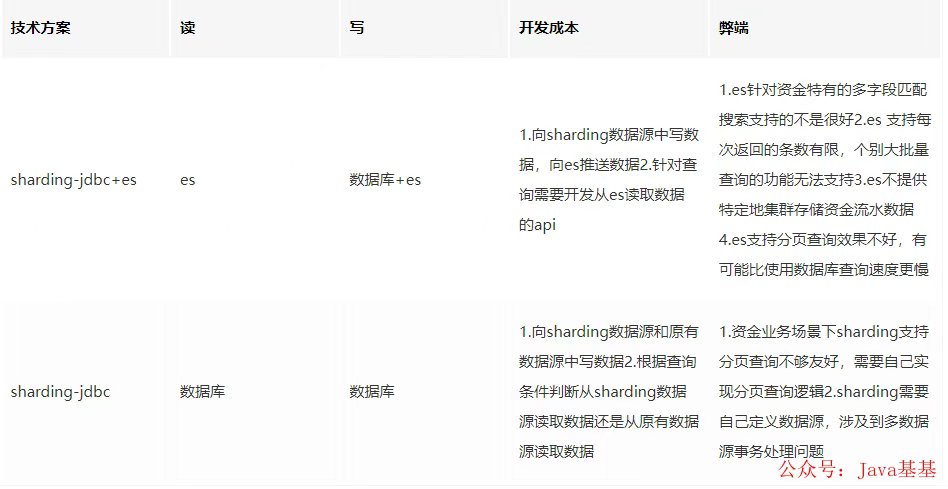
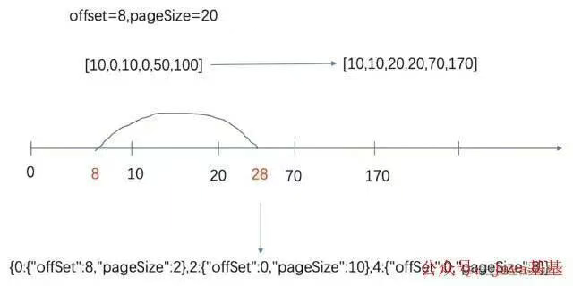

# 5000w+ 的大表如何拆？亿级别大表拆分实战复盘

- 1.前言
>> 笔者是在两年前接手公司的财务系统的开发和维护工作。在系统移交的初期，笔者和团队就发现，系统内有一张5000W+的大表。  
> > 跟踪代码发现，该表是用于存储资金流水的表格，关联着众多功能点，同时也有众多的下游系统在使用这张表的数据。  
> > 进一步的观察发现，这张表还在以每月600W+的数据持续增长，也就是说，不超过半年，这张表会增长到1个亿

> 拆表前系统状态

>> 1.涉及到流水表流水的接口超时频发，部分接口基本不可用

> > 2.每日新增流水缓慢，主要是插入数据库的时候非常慢

> > 3.单表占用空间过大，DBA的数据库监控经常报警

> > 无法对表进行变更，任何alter操作都会引起主从的高延迟和长时间锁表

> 拆表的目标

>> 将流水大表数据拆分至各个分表，保证每张分表数据在1000W左右（经验上看单表1000W的量对mysql来说没啥压力）

> > 在拆表的前提下，针对不同接口的查询条件进行优化，保证各个对外、对内接口的可用性。彻底杀死mysql慢查询

> 难点分析

>> 1.该表的数据可以说是整个财务系统最基础的数据，相关功能和下游系统非常多。这要求开发、测试和上线流程必须极其严密，任何小失误都会引起大问题

>> 2.涉及的场景非常多。统计下来，一共有26个场景，需要改造32个mapper方法，具体需要改造的方法就更加无计其数了

>> 3.数据量非常大，迁移数据的过程必须保证系统稳定

>> 4.用户较多且功能重要。分表功能上线时，必须尽量压缩系统无法使用时长，同时需要保证系统可用性。这要求团队必须设计完整可靠的上线流程、数据迁移方案、回滚方案、降级策略

>> 5.上文提到，表的拆分势必带来部分接口的变化，接口的变化又会带来其他系统的改造。如何推动其他系统进行改造，如何协调多方合作的开发、测试和上线是另一个难点

# 具体细节

> 分表中间件调研

>> 分表插件：采用sharding-jdbc作为分表插件

>> 其优势如下：
> > 1、支持多种分片策略，自动识别=或in判断具体在哪张分表里

>> 2、轻量级，作为maven依赖引入即可，对业务的侵入性极低

>> 为提升查询速度，在整个项目的初期，团队成员考虑引入ES存储流水以提升查询速度
>> 经过与ES维护团队的两轮讨论，发现公司提供的ES服务对于我们的业务场景并不匹配（见表），经过反复考量，最终我们放弃了引入ES的计划，直接从数据库查询数据，采用每张表设置一个查询线程的方式提升查询效率

> 分表依据的选择

>> 分表的方式有很多种，有纵向分表，有横向分表，有分为固定的几个表存储然后取模进行表拆分等等。总的来说，适合我们具体业务的分表方式只有横向分表

>> 因为对于资金流水这种特殊数据来说，是不能清理数据的，那么纵向分表和拆成固定的几个表都不能解决单表数据无限膨胀的问题。而横向分表，可以把每张表的数据量恒定，到一定时间后可以进行财务数据归档

>> 分表的依据一般都是根据表的某个或者某几个字段进行拆分，最终其实是对数据和业务分析综合出来的结果。总的来说，原则有这几个
>> 1.尽可能选择查询条件里最常出现的字段，这样能够减少方法改造的工程

>> 2.需要考虑根据某个字段拆分数据是否能够均匀分布，是否能够满足单表1000W左右的要求

>> 3.该字段必须是必现字段，不允许出现空值

>> 综合分析我们的数据以及业务需要，“交易时间”这个分表依据就呼之欲出了

>> 1.首先，这个字段作为流水最重要的字段之一一定会出现

>> 2.第二，如果按照交易月份进行拆表，每张表大概也就是600W-700W的数据

>> 3.最后，有70%的查询都附带“交易时间”作为查询条件

> 技术难点

>> 1.多数据源事务问题
>>>> sharding-jdbc在使用的时候是需要用自己的独立数据源的，那么就难免出现多数据源事务问题

>>>> 这个我们通过自定义注解，自定义切面开启事务，通过方法栈逐层回滚or提交的方式解决的。出于保密原则，具体代码细节不再展开

>> 2.多表的分页问题

>>>> 拆表一定会引起分页查询的难度增加。由于各个表查出来的数据量不等，原始的sql语句limit不再适用，需要设计一个新方法便捷的获取分页信息

>>>> 综合考虑业务实际与开发的复杂程度，项目团队决定在出现跨表查询的情况下，每一张表采用一个线程进行查询，以提高查询效率

>>>> 这个方案的难点在于分页规则的转换。例如，页面传入的offset和pageSize分别为8和20。各分表中符合条件的数量分别为10,10,50。那么我们需要将总的分页条件转化为三个分表各自的分页条件，如图

>>>> 通过上图可以看到，大分页条件(offset=8,pageSize=20)，转换为(offset=8,pageSize=2)，(offset=0.pageSize=10)，(offset=0,pageSize=8)三个条件

>> 整个计算过程如下：

>> 1.多线程查询各个分表中满足条件的数据数量

>> 2.将各个表数量按照分表的先后顺序累加，形成图 8的数轴

>> 3.判断第一条数据和最后一条数据所在的表

>> 4.除第一条和最后一条数据所在表外，其他表offset=0，pageSize=总数量

>> 5.计算第一条数据的offset，pageSize

>> 计算最后一条数据的pageSize，同时将该表查询条件的offset设置为0

