# 1. 搭建项目架构

>> Apache ShardingSphere-JDBC 可以通过 Java 编码和 YAML 属性文件这 2 种方式进行配置，开发者可根据场景选择适合的配置方式

> 引入Maven依赖
>> 单独引入shardingsphere-jdbc-core依赖
```
<!-- https://mvnrepository.com/artifact/org.apache.shardingsphere/shardingsphere-jdbc-core -->
<dependency>
    <groupId>org.apache.shardingsphere</groupId>
    <artifactId>shardingsphere-jdbc-core</artifactId>
    <version>5.4.0</version>
</dependency>
```

>> 或者，通过 Spring Boot Starter 引入相关依赖

```
<!-- https://mvnrepository.com/artifact/org.apache.shardingsphere/shardingsphere-jdbc-core-spring-boot-starter -->
<dependency>
    <groupId>org.apache.shardingsphere</groupId>
    <artifactId>shardingsphere-jdbc-core-spring-boot-starter</artifactId>
    <version>5.2.1</version>
</dependency>
<dependency>
    <groupId>org.yaml</groupId>
    <artifactId>snakeyaml</artifactId>
    <version>1.33</version>
</dependency>
```

>> 注意：如果这里报错 The following method did not exist: org.apache.shardingsphere.infra.util.yaml.constructor.ShardingSphereYamlConstructor$1.setCodePointLimit(I)V，可以降低shardingsphere版本号或调整高版本snakeyaml版本

> 创建YAML配置文件
```
# JDBC 逻辑库名称。在集群模式中，使用该参数来联通 ShardingSphere-JDBC 与 ShardingSphere-Proxy。
# 默认值：logic_db
databaseName (?):

mode:

dataSources:

rules:
- !FOO_XXX
    ...
- !BAR_XXX
    ...

props:
  key_1: value_1
  key_2: value_2
```

>> Spring Boot配置使用ShardingSphere JDBC驱动

```
# 配置 DataSource Driver
spring.datasource.driver-class-name=org.apache.shardingsphere.driver.ShardingSphereDriver
# 指定 YAML 配置文件
spring.datasource.url=jdbc:shardingsphere:classpath:xxx.yaml
```

> 数据库准备
>> 创建两个数据库 db_test_01 和 db_test_02，用于分库分表演示；  
> > 并且在这两个数据库中都创建相同的表 user_info，production，order，order_item_00，order_item_01

> SQL 脚本如下
```
# 分别创建两个数据库
CREATE DATABASE `db_test_01` DEFAULT CHARACTER SET utf8mb4 COLLATE utf8mb4_general_ci;
CREATE DATABASE `db_test_02` DEFAULT CHARACTER SET utf8mb4 COLLATE utf8mb4_general_ci;

# 在两个数据库中都创建以下表
# 创建单表：用户表
create table `user_info`  (
    `user_id` bigint not null comment '用戶id',
    `user_name` varchar(255) comment '用戶姓名',
    `user_sex` varchar(255) comment '用戶性別',
    `user_age` int(8) not null comment '用戶年齡',
    primary key (`user_id`) using btree
) engine = InnoDB character set = utf8mb4 collate = utf8mb4_general_ci row_format = compact;

# 创建单表：商品表
create table `production`  (
    `production_id` bigint not null comment '商品id',
    `production_name` varchar(255) comment '商品名称',
    `production_price` int(8) not null comment '商品价格',
    primary key (`production_id`) using btree
) engine = InnoDB character set = utf8mb4 collate = utf8mb4_general_ci row_format = compact;

# 创建单表：订单表
create table `order`  (
    `order_id` bigint not null comment  '订单号',
    `order_price` int(8) not null comment '订单总金额',
    `user_id` bigint not null comment '用戶id',
    primary key (`order_id`) using btree
) engine = InnoDB character set = utf8mb4 collate = utf8mb4_general_ci row_format = compact;

# 创建分表：订单项表1
create table `order_item_00`  (
    `order_info_id` bigint not null comment  '订单详情号',
    `order_id`  bigint not null comment '订单号',
    `production_name` varchar(255)  comment '商品名称',
    `production_price` int(8) not null comment '商品价格',
    primary key (`order_info_id`) using btree,
    index `key_order_id`(`order_id`) using btree
) engine = InnoDB character set = utf8mb4 collate = utf8mb4_general_ci row_format = compact;

# 创建分表：订单项表2
create table `order_item_01`  (
    `order_info_id` bigint not null comment  '订单详情号',
    `order_id`  bigint not null comment '订单号',
    `production_name` varchar(255)  comment '商品名称',
    `production_price` int(8) not null comment '商品价格',
    primary key (`order_info_id`) using btree,
    index `key_order_id`(`order_id`) using btree
) engine = InnoDB character set = utf8mb4 collate = utf8mb4_general_ci row_format = compact;
```

> 创建数据库用户
```
create user 'sharding'@'%' identified by 'sharding123!@#';
grant all privileges on db_test_01.* to 'sharding'@'%' with grant option;
grant all privileges on db_test_02.* to 'sharding'@'%' with grant option;
flush privileges;
```

> 生成代码
>> 通过MyBatis-Plus代码生成service、mapper、entity

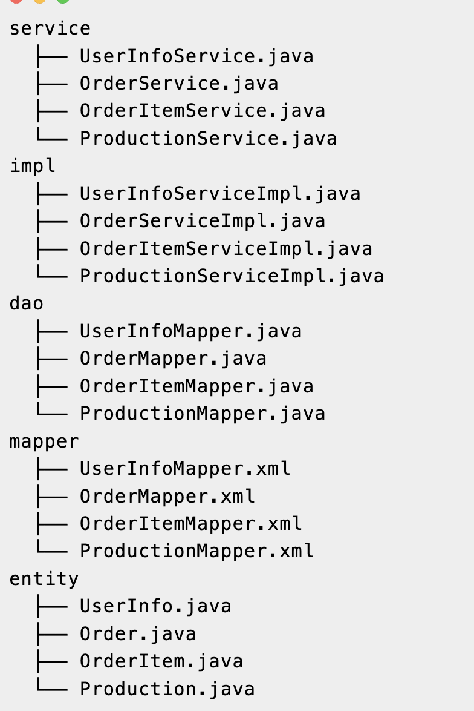

> 分库分表配置

>> 配置多数据源
>> 如果是使用 Spring Boot 引入 shardingsphere-jdbc-core-spring-boot-starter依赖的，作如下配置

```
spring:
  shardingsphere:
    mode: # 不配置则默认单机模式
      type: Standalone # 运行模式类型。可选配置：Standalone、Cluster
      repository: # 持久化仓库配置
        type: JDBC
    datasource: # 配置多个数据源
      names: ds0,ds1,ds2
      # 配置第一个数据源
      ds0:
        url: jdbc:mysql://localhost:3306/db_test_01?serverTimezone=Asia/Shanghai&useUnicode=true&characterEncoding=utf8&useSSL=true&tinyInt1isBit=false&allowMultiQueries=true
        username: sharding
        password: sharding123!@#
        driver-class-name: com.mysql.cj.jdbc.Driver
        type: com.alibaba.druid.pool.DruidDataSource
      # 配置第二个数据源
      ds1:
        url: jdbc:mysql://localhost:3306/db_test_02?serverTimezone=Asia/Shanghai&useUnicode=true&characterEncoding=utf8&useSSL=true&tinyInt1isBit=false&allowMultiQueries=true
        username: sharding
        password: sharding123!@#
        driver-class-name: com.mysql.cj.jdbc.Driver
        type: com.alibaba.druid.pool.DruidDataSource
```

> 多数据源可用性测试
>> 配置分片规则

```
spring:  
  shardingsphere:
    rules: # 规则配置
      sharding: # 数据分片规则
        tables: # 配置所有分片表
          order_item: # 逻辑表
            actual-data-nodes: ds0.order_item_00 # 声明商品表所在的真实数据节点（这里先显式声明一个节点测试）
    props: # 
      sql-show: true # 日志显示具体的SQL
```

>> 编写测试代码，并调用测试接口
```
@RestController
@RequestMapping("/admin-service")
public class AdminTestController {

    @Resource
    private OrderItemService orderItemService;

    @PostMapping("/test")
    public void test() {
        OrderItem orderItem = new OrderItem();
        orderItem.setOrderInfoId(1L);
        orderItem.setOrderId(1L);
        orderItem.setProductionName("商品1");
        orderItem.setProductionPrice(9);
        orderItemService.save(orderItem);
    }
}
```

>> 查看打印 SQL 日志，可以分别看到逻辑上的Logic SQL，和实际执行的Actual SQL

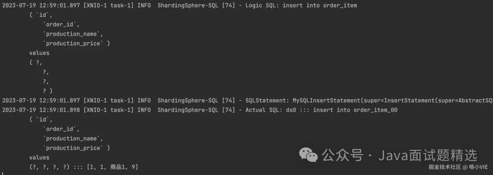

>> 在 db_test_01.order_item_00 表中查看数据，如此验证了分库分表已应用成功了

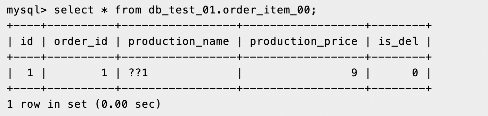

> 配置分库规则

>> 编写分片算法，也就是数据入库的规则，这里按id奇数或偶数入不同的数据库

```
spring:
  shardingsphere:
    rules: # 规则配置
      sharding: # 数据分片规则
        tables: # 配置所有分片表
          order_item: # 逻辑表
            actual-data-nodes: ds$->{0..1}.order_item_00 # 声明表所在的真实数据节点（这里先显式声明一个节点测试）
            database-strategy: # 分库策略
              standard:
                sharding-column: id # 分片列名称
                sharding-algorithm-name: db-inline-mod # 分片算法名称
        # 分片算法配置
        sharding-algorithms:
          db-inline-mod: # 分片算法名称
            type: INLINE # 分片算法类型
            props: # 分片算法属性配置
              algorithm-expression: ds$->{id % 2}
```

>> 编写测试代码，这里循环插入总共10个商品，用于后面验证分片算法的实际效果

```
@RestController
@RequestMapping("/admin-service")
public class AdminTestController {

    @Resource
    private OrderItemService orderItemService;

    @PostMapping("/test")
    public void test() {

        for(long i = 10; i < 20; i++) {
            OrderItem orderItem = new OrderItem();
            orderItem.setId(i);
            orderItem.setOrderId(1L);
            orderItem.setProductionName("商品" + i);
            orderItem.setProductionPrice(9);
            orderItemService.save(orderItem);
        }
    }
}
```

>> 查看 db_test_01.order_item_00 数据，新增了5条数据，id 从 10-18，为偶数

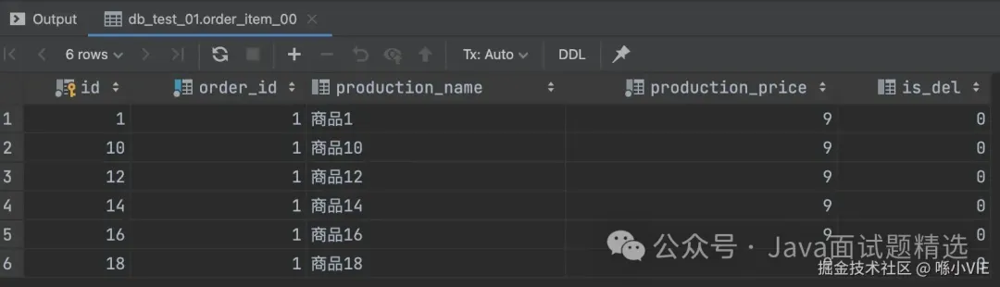

>> 查看 db_test_02.order_item_00 数据，新增了5条数据，id 从 11-19，为奇数

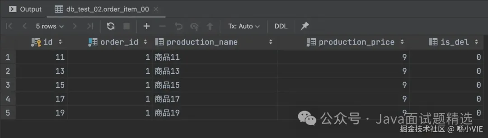

>> 也可以使用内置的分片算法

```
# 分片算法配置
sharding-algorithms:
  db-inline-mod: # 分片算法名称
    type: MOD # 分片算法类型
      props: # 分片算法属性配置
        sharding-count: 2
```

> 配置分表规则
>> 现在在分库的基础上，增加分表规则
>> 这里以production_name作为分片键，由于它是字符类型，所以应用HASH_MOD，先计算HASH再取模

```
spring:
  shardingsphere:
    rules: # 规则配置
      sharding: # 数据分片规则
        tables: # 配置所有分片表
          order_item: # 逻辑表
            actual-data-nodes: ds$->{0..1}.order_item_0$->{0..1} # 声明表所在的真实数据节点（这里先显式声明一个节点测试）
            database-strategy: # 分库策略
              standard:
                sharding-column: id # 分片列名称
                sharding-algorithm-name: db-inline # 分片算法名称
            table-strategy: # 分表策略
              standard:
                sharding-column: production_name
                sharding-algorithm-name: tb-key-hash
        # 分片算法配置
        sharding-algorithms:
          db-inline: # 分片算法名称
            type: INLINE # 分片算法类型
            props: # 分片算法属性配置
              algorithm-expression: ds$->{id % 2}
          tb-key-hash:
            type: HASH_MOD
            props:
              sharding-count: 2
```

>> 编写测试代码，这里循环插入共 20 条数据

```
@RestController
@RequestMapping("/admin-service")
public class AdminTestController {

    @Resource
    private OrderItemService orderItemService;

    @PostMapping("/test")
    public void test() {

        for(long i = 1; i <= 20; i++) {
            OrderItem orderItem = new OrderItem();
            orderItem.setId(i);
            orderItem.setOrderId(1L);
            orderItem.setProductionName("商品" + i + "abc");
            orderItem.setProductionPrice(9);
            orderItemService.save(orderItem);
        }
    }
}
```

>> 查看 db_test_01.order_item_00 数据，id 为偶数，新增 5 条数据

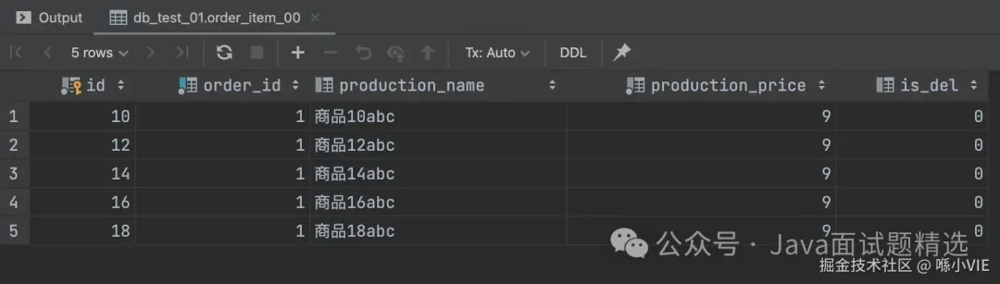

>> 查看 db_test_01.order_item_01 数据，id 为偶数，新增 5 条数据

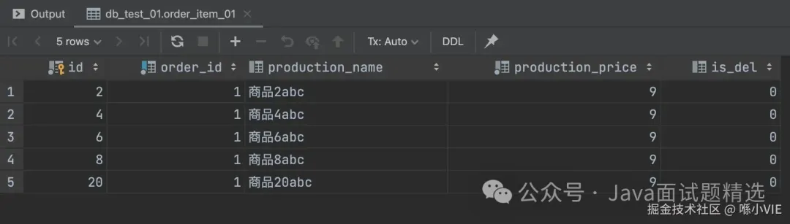

>> 查看 db_test_02.order_item_00 数据，id 为奇数，新增 5 条数据

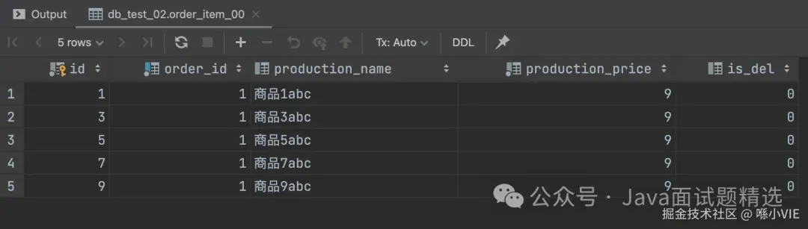

> 分库分表中的关键点

>> 分表策略的分片键
>> 在前面的例子中，对order_item的分表策略使用了production_name作为分片键，假设我们要以order_item.id作为查询条件，如下

```
@RestController
@RequestMapping("/admin-service")
public class AdminTestController {

    @Resource
    private OrderItemService orderItemService;

    @PostMapping("/test")
    public void test() {

        orderItemService.findById(1L);
    }
}
```

>> 查看SQL日志会发现，实际查询语句用了UNION ALL，这是因为使用的production_name作为分片键，  
> > 当使用非分片键查询时，由于没有配置相关的规则，也就无法知道要从哪张表查询。因此，选择合适的分片键是十分重要的

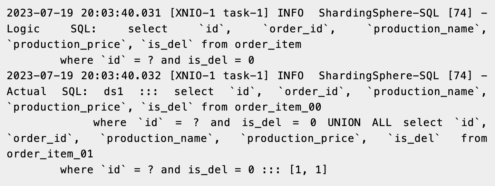

> 分布式序列算法
>> 前面的例子中，我们都是手动设置的主键ID的值，大多数业务中都是使用自增主键ID。  
> > 然而在分布式系统中，使用自增主键ID会导致唯一ID冲突。解决唯一ID冲突可以设置不同表应用不同的增长步长，  
> > 不过这对后续扩容不太友好，因此大多数是使用具有全局唯一性、递增性的分布式ID，例如 Snowflake 算法生成ID

>> 配置雪花算法
```
spring:
  shardingsphere:
    rules: # 规则配置
      sharding: # 数据分片规则
        tables: # 配置所有分片表
          order_item: # 逻辑表
            actual-data-nodes: ds$->{0..1}.order_item_0$->{0..1} # 声明表所在的真实数据节点（这里先显式声明一个节点测试）
            key-generate-strategy: # 分布式序列策略
              column: id # 自增列名称，缺省表示不使用自增主键生成器
              keyGeneratorName: global-id # 分布式序列算法名称
            database-strategy: # 分库策略
              standard:
                sharding-column: id # 分片列名称
                sharding-algorithm-name: db-inline # 分片算法名称
            table-strategy:
              standard:
                sharding-column: production_name
                sharding-algorithm-name: tb-key-hash
        # 分片算法配置
        sharding-algorithms:
          db-inline: # 分片算法名称
            type: INLINE # 分片算法类型
            props: # 分片算法属性配置
              algorithm-expression: ds$->{id % 2}
          tb-key-hash:
            type: HASH_MOD
            props:
              sharding-count: 2
        # 分布式序列算法配置
        key-generators:
          global-id:
            type: SNOWFLAKE # 分布式序列算法类型
            props: # 分布式序列算法属性配置
              worker-id: 1 # 工作机器唯一标识
```

>> 编写测试代码
```
@RestController
@RequestMapping("/admin-service")
public class AdminTestController {

    @Resource
    private OrderItemService orderItemService;

    @PostMapping("/test")
    public void test() {

        for(long i = 1; i <= 20; i++) {
            OrderItem orderItem = new OrderItem();
            orderItem.setOrderId(1L);
            orderItem.setProductionName("商品" + i + "abc");
            orderItem.setProductionPrice(9);
            orderItemService.save(orderItem);
        }
    }
}
```

>> 查看 db_test_01.order_item_00 数据，id 不再是简单自增了，不过还是可以从production_name 看出商品的插入顺序


>> 查看 db_test_01.order_item_01 数据

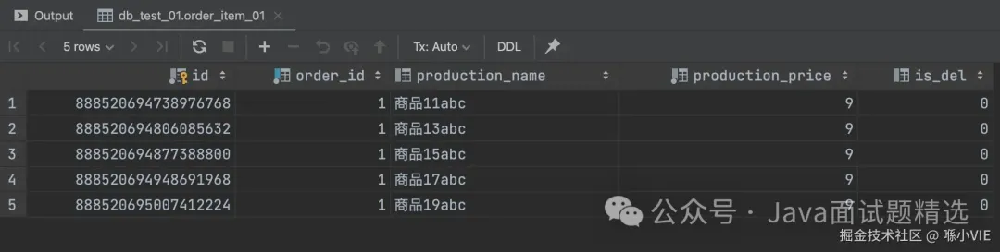

>> 查看 db_test_02.order_item_00 数据

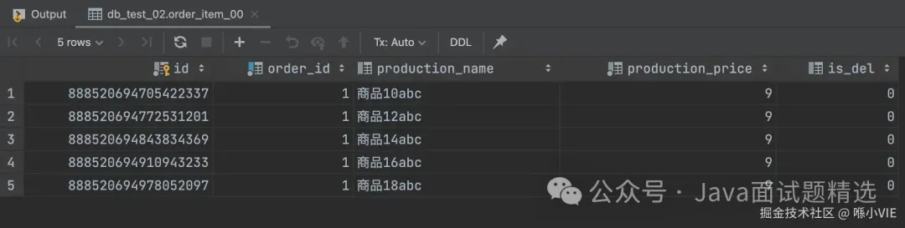

>> 查看 db_test_02.order_item_01 数据


> 绑定表配置
>> 在我们设计的表中，order 与 order_item 存在一对多的关系，它们以 order.id 和 order_item.order_id 建立逻辑上的主外键关系。  
> > 因此在分库后，要求数据分片时，将 order_item.order_id 与 order.id 有关联的数据存在相同数据库中

>> ShardingSphere 要求绑定表的分库策略和分表策略一致

```
spring:
  shardingsphere:  
    rules: # 规则配置
      sharding: # 数据分片规则
        tables: # 配置所有分片表
          base_order: # 逻辑表
            actual-data-nodes: ds_$->{0..1}.base_order # 声明表所在的真实数据节点（这里先显式声明一个节点测试）
            key-generate-strategy: # 分布式序列策略
              column: id # 自增列名称，缺省表示不使用自增主键生成器
              keyGeneratorName: snowflake # 分布式序列算法名称
            database-strategy: # 分库策略
              standard:
                sharding-column: id # 分片列名称
                sharding-algorithm-name: db-mod # 分片算法名称
          order_item: # 逻辑表
            actual-data-nodes: ds_$->{0..1}.order_item # 声明表所在的真实数据节点（这里先显式声明一个节点测试）
            key-generate-strategy: # 分布式序列策略
              column: id # 自增列名称，缺省表示不使用自增主键生成器
              keyGeneratorName: snowflake # 分布式序列算法名称
            database-strategy: # 分库策略
              standard:
                sharding-column: order_id # 分片列名称
                sharding-algorithm-name: db-mod # 分片算法名称
#            table-strategy:
#              standard:
#                sharding-column: id
#                sharding-algorithm-name: tb-mod
        binding-tables:
          - base_order,order_item
        # 分片算法配置
        sharding-algorithms:
          db-mod: # 分片算法名称
            type: MOD # 分片算法类型
            props: # 分片算法属性配置
              sharding-count: 2
          tb-mod:
            type: MOD
            props:
              sharding-count: 2
        # 分布式序列算法配置
        key-generators:
          snowflake:
            type: SNOWFLAKE # 分布式序列算法类型
            props: # 分布式序列算法属性配置
              worker-id: 1 # 工作机器唯一标识
```

> 总结
>> 至此，我们就完成 Spring Boot + ShardingSphere 的 MySQL 分库分表实践。商品订单的分库分表是一个很典型的案例，也是工作中遇到的常见场景。  
> > 当然，实际业务也可能遇到不同的分库分表策略，比如按照日期分库分表的，不过这些都可以编写分片算法来解决


