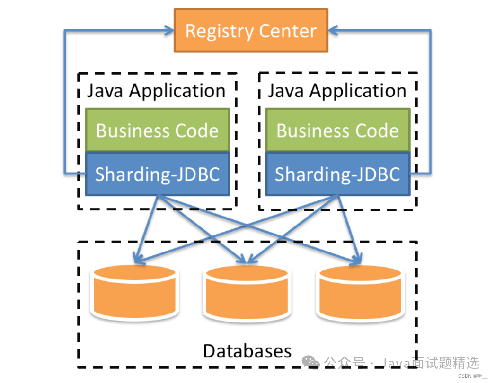
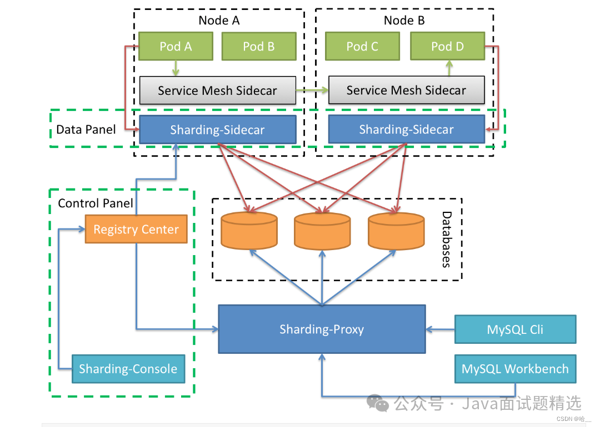
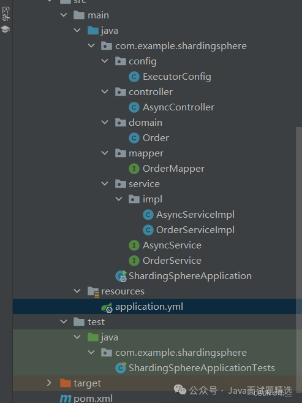
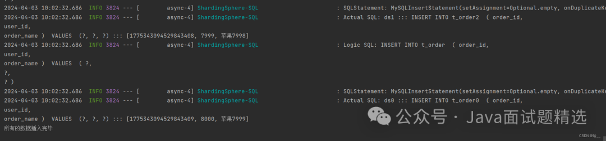
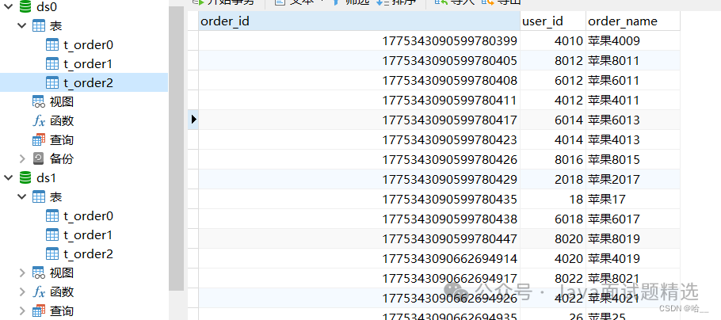

# SpringBoot+ShardingSphere实现多线程批量插入10000条数据

> 一、ShardingSphere简介
>> ShardingSphere是一套开源的分布式数据库中间件解决方案组成的生态圈，它由Sharding-JDBC、Sharding-Proxy和Sharding-Sidecar（计划中）这3款相互独立的产品组成。  
> > 他们均提供标准化的数据分片、分布式事务和数据库治理功能，可适用于如Java同构、异构语言、容器、云原生等各种多样化的应用场景

>> ShardingSphere定位为关系型数据库中间件，旨在充分合理地在分布式的场景下利用关系型数据库的计算和存储能力，而并非实现一个全新的关系型数据库。它与NoSQL和NewSQL是并存而非互斥的关系


> 1.Sharding-JDBC
>> 定位为轻量级Java框架，在Java的JDBC层提供的额外服务。它使用客户端直连数据库，以jar包形式提供服务，无需额外部署和依赖，可理解为增强版的JDBC驱动，完全兼容JDBC和各种ORM框架。

>> 1.适用于任何基于Java的ORM框架，如：JPA, Hibernate, Mybatis, Spring JDBC Template或直接使用JDBC。

>> 2.基于任何第三方的数据库连接池，如：DBCP, C3P0, BoneCP, Druid, HikariCP等

>> 3.支持任意实现JDBC规范的数据库。目前支持MySQL，Oracle，SQLServer和PostgreSQL



> 2.Sharding-Proxy

>> 定位为透明化的数据库代理端，提供封装了数据库二进制协议的服务端版本，用于完成对异构语言的支持

>> 目前先提供MySQL版本，它可以使用任何兼容MySQL协议的访问客户端(如：MySQL Command Client, MySQL Workbench等)操作数据，对DBA更加友好

>> 向应用程序完全透明，可直接当做MySQL使用

>> 适用于任何兼容MySQL协议的客户端


> 3.Sharding-Sidecar（TBD）
>> 定位为Kubernetes或Mesos的云原生数据库代理，以DaemonSet的形式代理所有对数据库的访问。通过无中心、零侵入的方案提供与数据库交互的的啮合层，即Database Mesh，又可称数据网格

>> Database Mesh的关注重点在于如何将分布式的数据访问应用与数据库有机串联起来，它更加关注的是交互，是将杂乱无章的应用与数据库之间的交互有效的梳理。使用Database Mesh，访问数据库的应用和数据库终将形成一个巨大的网格体系，应用和数据库只需在网格体系中对号入座即可，它们都是被啮合层所治理的对象



> 二、为什么用到ShardingSphere
>> 从性能方面来说，由于关系型数据库大多采用B+树类型的索引，在数据量超过阈值的情况下，索引深度的增加也将使得磁盘访问的IO次数增加，进而导致查询性能的下降；同时，高并发访问请求也使得集中式数据库成为系统的最大瓶颈

>> 从可用性的方面来讲，服务化的无状态型，能够达到较小成本的随意扩容，这必然导致系统的最终压力都落在数据库之上。而单一的数据节点，或者简单的主从架构，已经越来越难以承担。数据库的可用性，已成为整个系统的关键

>> 从运维成本方面考虑，当一个数据库实例中的数据达到阈值以上，对于DBA的运维压力就会增大。数据备份和恢复的时间成本都将随着数据量的大小而愈发不可控。一般来讲，单一数据库实例的数据的阈值在1TB之内，是比较合理的范围

>> 在传统的关系型数据库无法满足互联网场景需要的情况下，将数据存储至原生支持分布式的NoSQL的尝试越来越多。但NoSQL对SQL的不兼容性以及生态圈的不完善，使得它们在与关系型数据库的博弈中始终无法完成致命一击，而关系型数据库的地位却依然不可撼动

> 三、数据分片

>> 水平分片又称为横向拆分。它不再将数据根据业务逻辑分类，而是通过某个字段（或某几个字段），根据某种规则将数据分散至多个库或表中，每个分片仅包含数据的一部分。例如：根据主键分片，偶数主键的记录放入0库（或表），奇数主键的记录放入1库（或表），如下图所示


> 四、SpringBoot整合ShardingSphere
>> 1.创建我们的数据库ds0和ds1。分别创建我们的表格order0，order1，order2。（两个数据库都运行一下）

```
SET NAMES utf8mb4;
SET FOREIGN_KEY_CHECKS = 0;
 
-- ----------------------------
-- Table structure for t_order0
-- ----------------------------
DROP TABLE IF EXISTS `t_order0`;
CREATE TABLE `t_order0`  (
  `order_id` bigint(20) NOT NULL AUTO_INCREMENT,
  `user_id` int(11) NOT NULL,
  `order_name` varchar(100) CHARACTER SET utf8 COLLATE utf8_bin NOT NULL,
  PRIMARY KEY (`order_id`) USING BTREE
) ENGINE = InnoDB  CHARACTER SET = utf8 COLLATE = utf8_bin ROW_FORMAT = Compact;
 
-- ----------------------------
-- Table structure for t_order1
-- ----------------------------
DROP TABLE IF EXISTS `t_order1`;
CREATE TABLE `t_order1`  (
  `order_id` bigint(20) NOT NULL AUTO_INCREMENT,
  `user_id` int(11) NOT NULL,
  `order_name` varchar(100) CHARACTER SET utf8 COLLATE utf8_bin NOT NULL,
  PRIMARY KEY (`order_id`) USING BTREE
) ENGINE = InnoDB  CHARACTER SET = utf8 COLLATE = utf8_bin ROW_FORMAT = Compact;
 
-- ----------------------------
-- Table structure for t_order2
-- ----------------------------
DROP TABLE IF EXISTS `t_order2`;
CREATE TABLE `t_order2`  (
  `order_id` bigint(20) NOT NULL AUTO_INCREMENT,
  `user_id` int(11) NOT NULL,
  `order_name` varchar(100) CHARACTER SET utf8 COLLATE utf8_bin NOT NULL,
  PRIMARY KEY (`order_id`) USING BTREE
) ENGINE = InnoDB  CHARACTER SET = utf8 COLLATE = utf8_bin ROW_FORMAT = Compact;
 
SET FOREIGN_KEY_CHECKS = 1;
```

>> 2.引入依赖

>> 这里的依赖是为了实现我的们的目标，进行多线程分库分表插入。

```
<dependency>
    <groupId>org.apache.shardingsphere</groupId>
    <artifactId>shardingsphere-jdbc-core-spring-boot-starter</artifactId>
    <version>5.0.0</version>
</dependency>
<dependency>
    <groupId>com.baomidou</groupId>
    <artifactId>mybatis-plus-boot-starter</artifactId>
    <version>3.5.2</version>
</dependency>
<dependency>
    <groupId>com.mysql</groupId>
    <artifactId>mysql-connector-j</artifactId>
</dependency>
<dependency>
    <groupId>org.projectlombok</groupId>
    <artifactId>lombok</artifactId>
</dependency>
<dependency>
    <groupId>log4j</groupId>
    <artifactId>log4j</artifactId>
    <version>1.2.17</version>
</dependency>
<dependency>
    <groupId>cn.hutool</groupId>
    <artifactId>hutool-all</artifactId>
    <version>5.8.18</version>
</dependency>
```

>> 3.添加配置文件。创建application.yml

>> 我来讲解一下这些配置文件都是干啥的，都写到注释了

```
spring:
  shardingsphere:
    props:
      #d打印Sql语句
      sql-show: true
    datasource:
      #创建我们的ds0数据源
      ds0:
        #下边这些都是老套路了
        driver-class-name: com.mysql.cj.jdbc.Driver
        jdbc-url: jdbc:mysql://localhost:3306/ds0?useUnicode=true&characterEncoding=utf-8&useSSL=false&serverTimezone=GMT&allowPublicKeyRetrieval=true
        password: 2020
        type: com.zaxxer.hikari.HikariDataSource
        username: root
      #创建我们的ds1数据源
      ds1:
        #一样的老套路
        driver-class-name: com.mysql.cj.jdbc.Driver
        jdbc-url: jdbc:mysql://localhost:3306/ds1?useUnicode=true&characterEncoding=utf-8&useSSL=false&serverTimezone=GMT&allowPublicKeyRetrieval=true
        password: 2020
        type: com.zaxxer.hikari.HikariDataSource
        username: root
      names: ds0,ds1
    #这里就比较重要了，这里是定义我们的分库分表的规则
    rules:
      sharding:
        #分片算法
        sharding-algorithms:
          #为分库定义一个算法 到底是如何分的库
          custom-db-inline:
            props:
              # 这里是具体的算法，我们根据userId取余进行分库，余数是几就分到ds几
              algorithm-expression: ds$->{user_id%2}
            type: INLINE
          # 如何分表
          custom-table-inline:
            props:
              # 根据orderId取余分表
              algorithm-expression: t_order$->{order_id%3}
            type: INLINE
        tables:
          # 这是我们的逻辑表 因为我们根本没有t_order这个表，这是我们的t_order0 1 2抽象出来的
          t_order:
            # 这是我们的真实表
            actual-data-nodes: ds$->{0..1}.t_order$->{0..2}
            database-strategy:
              standard:
                # 分库算法的名称 也就是上边的
                sharding-algorithm-name: custom-db-inline
                sharding-column: user_id
            table-strategy:
              standard:
                # 分表算法名称
                sharding-algorithm-name: custom-table-inline
                sharding-column: order_id
async:
  executor:
    thread:
      core_pool_size: 5
      max_pool_size: 20
      queue_capacity: 90000
      name:
        prefix: async-
mybatis-plus:
  global-config:
    db-config:
      id-type: assign_id
```



>> 三层Order的代码如下:

```
// Order实体
@Data
@TableName("t_order")
@SuppressWarnings("serial")
public class Order extends Model<Order> {
 
    @TableId(type = IdType.ASSIGN_ID)
    private Long orderId;
 
    private Integer userId;
 
    private String orderName;
 
    @Override
    public Serializable pkVal() {
        return this.orderId;
    }
}
 
//mapper
@Mapper
public interface OrderMapper extends BaseMapper<Order> {
}
 
 
 
//Order的service接口
public interface OrderService extends IService<Order> {
}
 
 
//接口实现
@Service
public class OrderServiceImpl extends ServiceImpl<OrderMapper, Order> implements OrderService {
}
```

>> ExecutorConfig，配置我们的线程池

```
@Configuration
public class ExecutorConfig {
    @Value("${async.executor.thread.core_pool_size}")
    private int corePoolSize;
    @Value("${async.executor.thread.max_pool_size}")
    private int maxPoolSize;
    @Value("${async.executor.thread.queue_capacity}")
    private int queueCapacity;
    @Value("${async.executor.thread.name.prefix}")
    private String namePrefix;
 
    @Bean(name = "asyncServiceExecutor")
    public Executor asyncServiceExecutor() {
        //在这里修改
        ThreadPoolTaskExecutor executor = new ThreadPoolTaskExecutor();
        //配置核心线程数
        executor.setCorePoolSize(corePoolSize);
        //配置最大线程数
        executor.setMaxPoolSize(maxPoolSize);
        //配置队列大小
        executor.setQueueCapacity(queueCapacity);
        //配置线程池中的线程的名称前缀
        executor.setThreadNamePrefix(namePrefix);
        // rejection-policy：当pool已经达到max size的时候，如何处理新任务
        // CALLER_RUNS：不在新线程中执行任务，而是有调用者所在的线程来执行
        executor.setRejectedExecutionHandler(new ThreadPoolExecutor.CallerRunsPolicy());
        //执行初始化
        executor.initialize();
        return executor;
    }
}
```

>> 创建AsyncService接口和实现类
```
public interface AsyncService {
     void add(List<Order> orderList, CountDownLatch countDownLatch);
}
```

```
@Service
@Slf4j
public class AsyncServiceImpl implements AsyncService {
    @Resource
    private OrderServiceImpl orderService;
    @Async("asyncServiceExecutor")
    @Transactional(rollbackFor = Exception.class)
    @Override
    public void add(List<Order> orderList, CountDownLatch countDownLatch) {
        try {
            log.debug(Thread.currentThread().getName()+"开始插入数据");
            orderService.saveBatch(orderList);
            log.debug(Thread.currentThread().getName()+"插入数据完成");
        }finally {
            countDownLatch.countDown();
        }
 
    }
}
```

>> 要使用多线程异步调用要在启动程序上加上注解

```
@SpringBootApplication
@EnableAsync
@EnableTransactionManagement
public class ShardingSphereApplication {
    public static void main(String[] args) {
        SpringApplication.run(ShardingSphereApplication.class, args);
    }
 
}
```

>> 现在来看我们的AysncController。我定义了一个getData的方法，用于模拟生成我们的数据，当然我设置的名称都差不多，一共一万条数据，通过user_id进行分库，通过order_id进行分表，userId使用的是for循环的i索引，orderId使用的是雪花算法生成的Id序列

>> 在testAsyncInsert方法中。使用ListUtils的方法进行数据切片，每两千条数据切割成一个list，然后执行异步添加操作。待所有线程执行完毕之后，打印输出语句

```
@RestController
public class AsyncController {
    @Autowired
    private AsyncService asyncService;
 
    @GetMapping("/test")
    public String testAsyncInsert(){
        CountDownLatch c;
        try {
            List<Order> data = getData();
            List<List<Order>> partition = ListUtil.partition(data, 2000);
            c= new CountDownLatch(partition.size());
            for (List<Order> list : partition) {
                asyncService.add(list,c);
            }
            c.await();
        }catch (Exception e){
            e.printStackTrace();
        }finally {
            System.out.println("所有的数据插入完毕");
        }
        return "执行完毕";
    }
    private List<Order> getData(){
        List<Order> list = new ArrayList<>();
        for(int i = 0;i<10000;i++){
            Order o = new Order();
            o.setOrderName("苹果"+i);
            o.setUserId(i+1);
            list.add(o);
        }
        return list;
    }
}
```

>> 看结果。大家可以自己去验证一下






