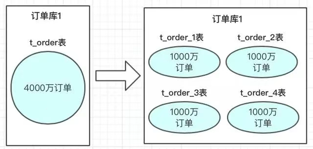
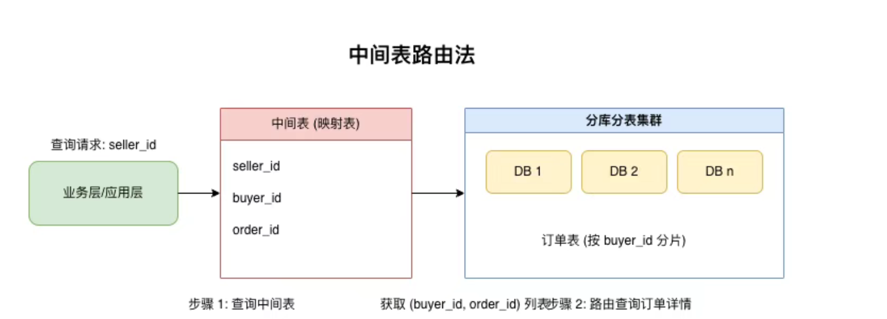
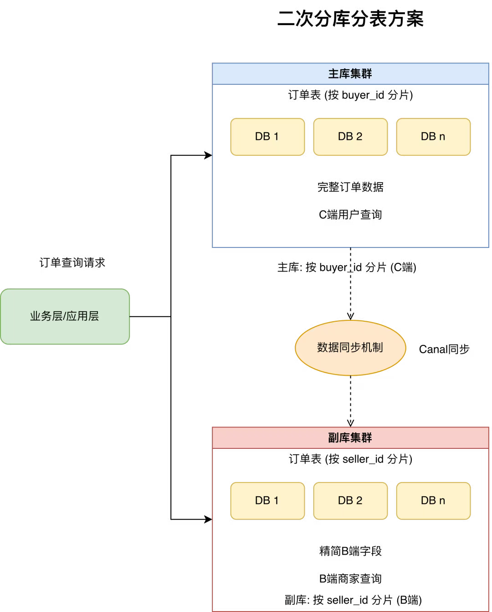
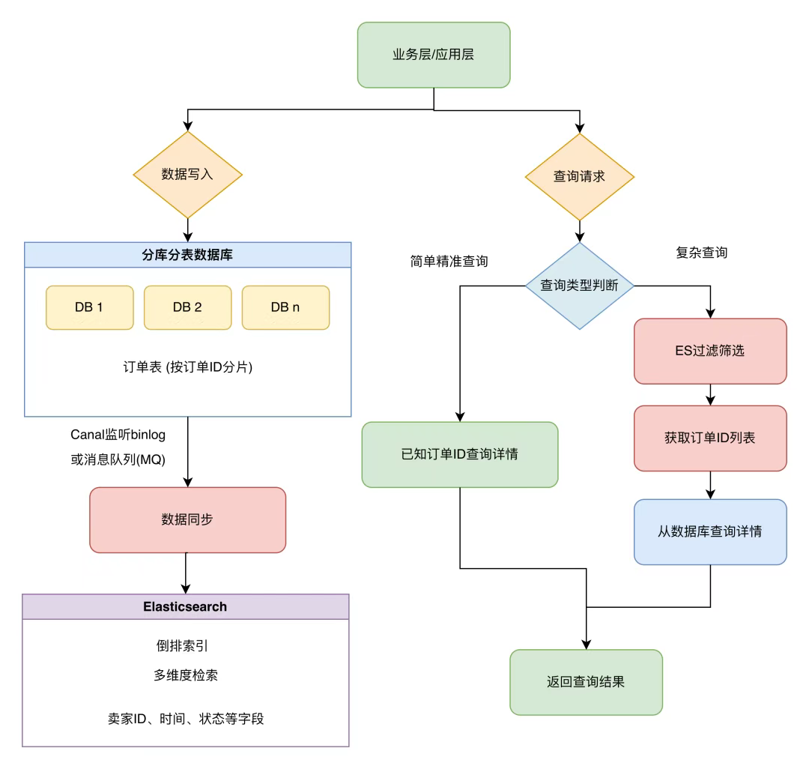
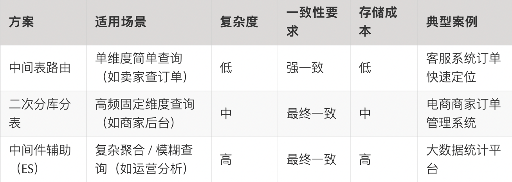

# 1.前言
> 电商、金融等数据密集型场景面临着数据量呈指数级增长的挑战。为了解决单库性能瓶颈，分库分表成为了一种常用的手段

# 案例
>> 以电商领域的订单表为例，假设我们按照买家 ID 进行分库分表

>> 这样，当买家查询自身订单时，就如同在特定书架的特定格子中查找书籍，效率大幅提升。  
> > 但这种看似完美的策略，却留下了一些难以察觉的「查询盲区」

>> 1.商家视角：商家需要快速查询旗下所有订单，然而订单是按买家 ID 分库分表的，商家 ID 并非分表键，这就好比要在不同书架的随机格子中寻找特定商家的订单，难度可想而知

>> 2.客服困境：客服在通过订单号或用户手机号定位数据时，同样面临分表键不匹配的问题。订单号和手机号与分表所依据的买家 ID 并无直接关联，使得精准定位数据变得异常困难

>> 3.运营挑战：运营人员在按时间范围或商品维度进行统计分析时，分表键也无法提供有效的帮助。例如，统计某段时间内所有商品的销售数据，由于时间和商品维度与分表键不一致，数据分散在各个库表中，统计过程变得复杂且低效

>> 这些场景的共性在于，查询条件与分库分表所依赖的分表键不一致 ，导致传统基于分表键的路由策略失效

>> 在这种情况下，如何高效地查询数据，成为了摆在开发者面前的一道难题。接下来，本文将从实战角度出发，深入解析四大核心方案，帮助大家突破分库分表后的查询瓶颈

- 主流分库分表方案解析
>> 订单表是按照买家 ID 来进行分库分表的之后，如果卖家要查询 ID 应该怎么办？
>> 目前来说主流的就是引入中间表路由、二次分库分表或者使用其他中间件、以及兜底广播方案

> 1.中间表路由法，用索引表打通查询壁垒

>> 在分库分表的复杂架构中，中间表路由法如同搭建了一座桥梁，巧妙地连接起无分表键查询与目标数据。  
> > 这种方案通过建立一个中间表，专门用于记录「分库分表键」与「非分库分表键」之间的映射关系，从而将看似棘手的无分表键查询，拆解为两个相对简单的查询步骤。  
> > 以电商订单系统为例，假设订单表按照买家 ID 进行分库分表，而商家需要通过自己的 ID 查询旗下所有订单。此时，我们可以创建一个「商家 - 订单中间表」，表结构如下

>> 当业务层接收到通过 seller_id 查询订单的请求时，查询流程如下：
>> 1. 第一步：查询中间表：根据传入的 seller_id，在「商家 - 订单中间表」中查询，获取对应的 (buyer_id, order_id) 列表。这一步就像是在一本索引册中，通过商家 ID 这个 “索引”，找到与之关联的买家 ID 和订单 ID 信息
> > 2. 第二步：路由查询订单详情：根据第一步获取的 buyer_id，按照既定的分库分表规则计算出目标库表的路由信息，然后批量查询订单详情。这就如同根据索引册中的指引，准确地找到存放订单详情的 “书架” 和 “格子”

>> 优点：中间表路由法最大的优势在于其轻量级特性，它不依赖任何第三方组件，实现相对简单，对于一些简单的查询场景能够快速搭建并运行 。并且，在设计上可以结合主键生成策略进行优化。例如，订单 ID 生成时可以嵌入买家 ID 信息，这样在中间表中就可以减少 buyer_id 字段的存储，进一步节省空间，提升查询效率

>> 缺点:在写入性能方面，由于中间表无法进行分库分表，当业务量增大，写入操作频繁时，中间表很容易成为整个系统的性能瓶颈，就像一条狭窄的通道，车辆一多就会造成拥堵。  
> > 同时，其灵活性较差，一旦业务需求发生变化，需要新增查询维度，比如增加通过 shop_id（店铺 ID）查询订单，就不得不修改中间表结构，新增相关列，这在实际业务中可能会带来一系列的数据迁移和兼容性问题

>> 建议：为了更好地发挥中间表路由法的优势，在使用时应尽量仅在中间表中存储不变字段，如各类 ID 信息，避免同步高频变更字段，如订单状态。因为高频变更字段不仅会增加中间表的更新压力，还可能因为数据不一致问题导致查询结果不准确。

> 2.二次分库分表

>> 二次分库分表方案则是针对高频出现的非分表键查询维度，如卖家 ID、客服 ID 等，单独构建一套分库分表体系 。  
> > 这套体系就像是为特定的查询需求打造的 “专属通道”，通过存储核心业务数据的副本，实现多维度的数据隔离，大大提升了查询效率

>> 同样以订单表为例，在主库集群中，我们按照买家 ID 进行分库分表，以满足 C 端用户查询自身订单的需求。  
> > 表结构包含了完整的订单数据，从基本的订单信息到详细的商品列表、物流信息等一应俱全，路由键为 buyer_id。  
> > 而在副库集群，我们则另辟蹊径，按照卖家 ID 进行分库分表，专门服务于 B 端商家查询订单的场景。  
> > 这里的表结构会相对精简，仅保留 B 端查询所需的字段，如订单编号、买家信息、订单金额、订单状态等，去除了一些 C 端特有的字段，以减少存储空间占用，提高查询性能，路由键为 seller_id
>> 为了保证数据的一致性，在数据同步方面，我们可以采用异步双写或利用 Canal 监听主库 binlog 的方式。  
> > 异步双写即在业务数据写入主库的同时，异步地将数据写入副库；Canal 则是模拟 MySQL 从库的交互协议，监听主库的二进制日志（binlog），实时获取数据变更信息，并将这些变更同步到副库中，确保副库的数据与主库保持实时更新

> 适用场景
>> 二次分库分表方案适用于那些非分表键查询频率高，且查询条件相对稳定的场景。  
> > 比如，电商平台中卖家经常需要按照订单状态筛选订单，统计已完成订单、待发货订单等，由于卖家 ID 是固定的查询维度，这种方案就能很好地发挥作用，快速返回查询结果

> 一致性该怎么解决？

>> 数据一致性是二次分库分表面临的首要挑战。在异步双写或 binlog 同步过程中，可能会因为网络波动、系统故障等原因导致双写失败或数据副本滞后，  
> > 这就需要我们建立完善的重试机制，以及采用最终一致性的保障策略，确保在一定时间内数据能够达到一致状态。  
> > 此外，存储成本也是不容忽视的问题。随着分表维度的增加，数据冗余度也会随之上升，我们需要在查询性能提升与存储开销之间进行谨慎权衡，根据业务的实际需求和预算，合理规划分库分表的规模和数据存储策略。

> 3.中间件 Elasticsearch + 数据库协同查询

>> 对于复杂查询场景，如模糊搜索、聚合统计等，引入中间件进行协同查询成为了一种高效的解决方案
>> 其中，Elasticsearch（ES）与数据库的协同组合，充分发挥了 ES 强大的多维度检索能力和数据库稳定的数据存储优势 ，实现了读写分离，提升了系统整体的查询性能和灵活性

> 写入阶段
>> 当业务数据产生并写入数据库后，系统会通过 Canal 或者消息队列（MQ）将数据异步同步到 Elasticsearch 中。  
> > Canal 通过监听数据库的 binlog，捕获数据变更事件，然后将这些事件发送给 ES；  
> > MQ 则作为数据传输的通道，将数据库的变更数据以消息的形式发送给 ES，确保 ES 中的数据与数据库保持实时更新

> 查询阶段
>> 根据查询类型的不同，系统会采用不同的查询路径。  
> > 对于简单精准查询，如已知订单 ID 查询订单详情，由于订单 ID 是数据库分库分表的路由键，直接通过数据库的分库分表路由即可快速定位到目标数据，就像在有序的书架上直接找到特定编号的书籍。  
> > 而对于复杂查询，以 “卖家 A 近 30 天状态为‘已完成’的订单，按支付金额排序” 为例，查询流程如下

>> 1.ES 过滤筛选：首先在 ES 中根据卖家 ID、时间范围（近 30 天）、订单状态（已完成）等条件进行过滤查询。  
> > ES 利用其倒排索引结构，能够快速定位到符合条件的订单 ID 列表，这一步就像是在一个装满书籍摘要的索引库中，根据多个关键词快速筛选出相关书籍的编号。

> > 2.数据库查询详情：获取到订单 ID 列表后，再通过订单 ID 批量查询数据库，获取完整的订单详情。  
> > 因为数据库中存储了完整的业务数据，所以能够提供详细的订单信息，如商品明细、买家信息、物流信息等，完成最终的查询需求，就像根据书籍编号从书架上取出完整的书籍进行阅读。

> 技术难点

>> 数据同步延迟
> > 由于数据同步是异步进行的，不可避免地会出现数据同步延迟问题。  
> > 为了将延迟控制在可接受范围内，我们可以通过消息队列进行削峰填谷，平衡数据传输的流量，避免瞬间大量数据涌入 ES 导致处理延迟。  
> > 同时，结合 ES 自身的实时索引能力，尽可能快地将同步过来的数据建立索引，使数据能够及时被查询到，一般可以将延迟控制在秒级

>> 聚合性能优化
>> 对于常用的聚合查询，如统计不同订单状态的数量、计算订单总金额等，ES 可以预先对这些聚合字段进行处理，将结果存储起来。  
> > 这样在查询时，就无需实时计算，直接返回预处理的结果，大大减轻了实时计算的压力，提高了查询响应速度

> 一致性保障
>> 为了确保数据库和 ES 之间的数据一致性，采用 “数据库事务 + ES 异步重试” 机制。  
> > 在数据写入时，先确保数据库事务的成功提交，然后异步将数据同步到 ES。  
> > 如果同步过程中出现失败，通过重试机制进行多次尝试，对于仍然失败的场景，通过定时任务进行数据对账，人工干预修复，保证数据的最终一致性

> 方案选型与建议

