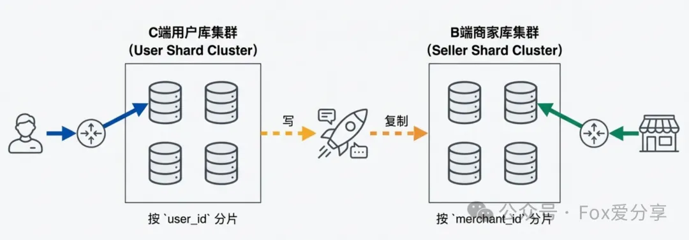
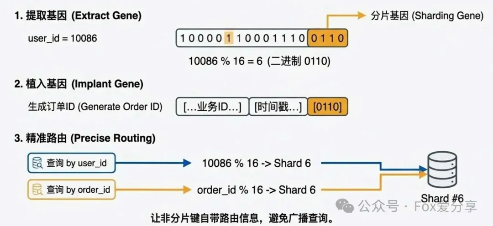
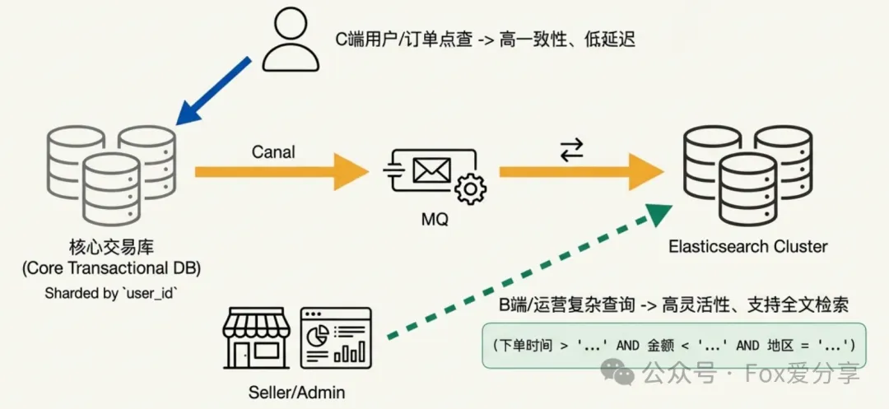

# 一、问题
>> 公司的订单表有 2 亿数据，怎么做的分库分表?
> > 按用户 ID（user_id）取模，分了 16 个库，每个库 64 张表，一共 1024 张表
>> 商家（Seller）要查自己店铺的订单列表怎么办?

# 二、多维查询难题

> 解法1：异构索引表（双写冗余）—— 最通用的解法

>> C 端（用户视角）：主库依然按 user_id % 16 分片。用户查订单，快如闪电。

>> B 端（商家视角）：再搞一套“商家库”，数据按 merchant_id % 16 分片。

>> 同步机制：用户下单写入“用户库”成功后，异步把数据同步一份到“商家库”

- 高阶避坑（双写一致性）：
>> “如果消息发送失败，或者消费者挂了，商家库岂不是一直少订单？

>> 满分补丁：
>> “为了保证最终一致性，我们通常采用 RocketMQ 事务消息 或 本地事务表 + 定时轮询 模式

> > > > 事务消息：利用 MQ 的半消息机制，确保‘本地订单入库’和‘消息发送’要么同时成功，要么同时失败

>>>>>  兜底重试：配合定时任务扫描未确认的消息，确保 At Least Once（至少投递一次），保证商家库绝对不会丢单

> 解法 2：基因法（Gene Sharding）—— 解决 ID 查询痛点

>> 很多同学会忽略一个场景：用户输入“订单 ID”查询订单详情。

> > 如果只按 user_id 分片，系统拿到 order_id 后根本不知道去哪个库查，只能 广播查询（全库扫描），效率极低。

>> 这时候要用 “基因法”。

- 逻辑实操：
>> 假设我们分了 16 个库（需要 4 bit 二进制来定位

>>>> 提取基因：假设用户 ID 是 10086，二进制最后 4 位是 0110（即十进制 6

>> 植入基因：生成订单 ID 时，不要随机生成，而是把这 0110 强行拼接 到订单 ID 的最后 4 位

- 路由规则：
>> 查用户：user_id % 16 -> 结果是 6

>> 查订单：order_id % 16 -> 因为末尾植入了基因，结果也是 6

>> 效果：这样，用户查自己（带 user_id）和查具体订单（带 order_id），都会稳稳地落在同一个库

>> 注意：基因法 解决不了商家查询（因为商家 ID 和用户 ID 的基因不同），它专门用于优化 非分片键（Order ID） 的点查性能

> 解法 3：大宽表 + ES（搜索神器）—— 终极兜底
>> 如果运营人员要按“下单时间”、“金额”、“地区”等奇葩条件筛选，MySQL 分库分表就彻底歇菜了

>> 逻辑：
>>>> MySQL 只负责核心交易链路（存、取、改状态），按 user_id 分片。

>>>> 把数据通过 Canal + MQ 实时同步到 Elasticsearch (ES)。

>>>> 商家查询、运营后台查询、复杂报表，全部走 ES

>> 生产级兜底（降级策略）：
>>>> ES 不是实时强一致的（通常有 1 秒延迟）。如果商家刚收到新订单通知，点进去却在 ES 查不到，怎么办？

>>>> 答：“我们在代码层做了 降级逻辑。当 ES 查不到结果（或数据明显滞后）时，系统会自动降级回 MySQL 的商家异构库进行点查。虽然后端压力大一点，但保证了用户体验的闭环。

# 三、 最后的“防杠”指南（避坑专用）
> 分库分表后，原本简单的 SQL 会变成大坑，这三个点必须防守住：

>> Q1：分表后的全局 ID 怎么生成？
>> 答：“绝对不能用自增主键。面试时推荐答 美团 Leaf 的号段模式。  
> > 相比于雪花算法（Snowflake），它不强依赖机器时钟，不会因为时钟回拨导致 ID 重复，更适合严谨的金融级业务

>> Q2：分表后，怎么做深分页（Limit 10000, 10）？
>> 答：“这是分布式数据库的‘内存杀手’。中间件需要去每个分片取前 10010 条，聚合排序，性能极差。
>> 解决方案有三：
>>>> 业务规避：禁止跳页，只允许‘下一页’。

>>>> Seek 游标法：利用 WHERE id < last_id LIMIT 10 的方式查询，利用索引避开 Offset 扫描。

>>>> ES Scroll：如果是极其复杂的深分页，直接走 ES。”

>> Q3：扩容怎么办？原本 16 个库不够用了，要扩到 32 个？
>> 答：“采用 2 倍扩容（Scale Out），且必须配合 在线数据迁移：

>>>> 全量同步：将旧库数据全量搬运到新库。

>>>> 增量追平：利用 Canal/DTS 追平迁移期间产生的增量数据。

>>>> 数据校验：全量比对一致后。

>>>> 切流：短暂切断写入（秒级），更新路由规则，将流量切到新库

# 四、 面试标准答案模板
>> 下次被问到“如何设计分库分表”，直接按这个逻辑输出：

>> “设计分库分表，我的核心原则是 ‘业务驱动，读写分离’：

>>>> 1. 分片策略：针对 C 端订单系统，我优先选择 UserID 作为分片键，并利用 基因法 生成 OrderID，保证用户查询和订单号点查的高效路由。

>>>> 2. 多维查询难题：对于 B 端商家，我采用 ‘异构索引’方案。利用 RocketMQ 事务消息 实现数据的最终一致性同步，构建一套商家维度的分片库。

>>>> 3. 复杂搜索：对于复杂的运营查询，直接引入 Elasticsearch，并设计了 MySQL 降级策略 应对 ES 的同步延迟。

>>>> 4. ID与扩容：底层配合 Leaf 号段模式 生成全局 ID，并预留了 2 倍扩容 的方案，确保系统在未来 3 年内不需要伤筋动骨。”

