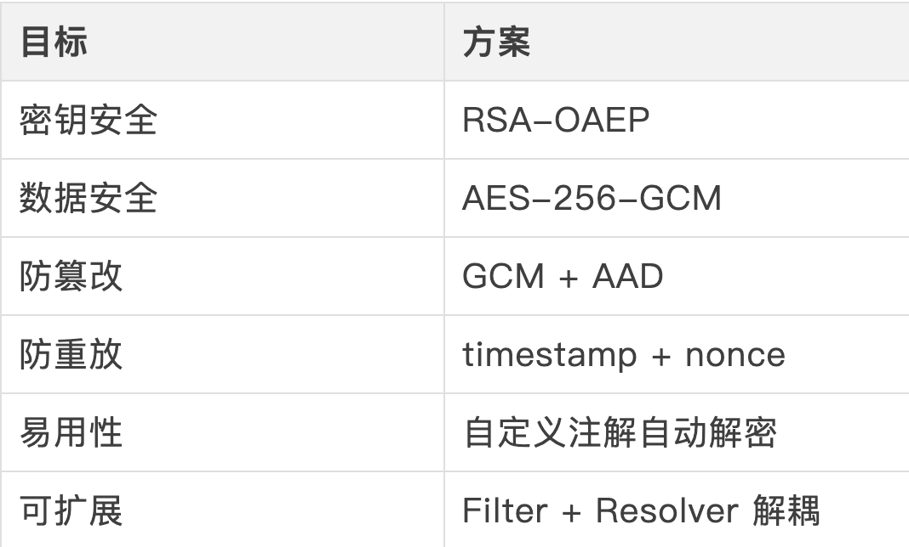
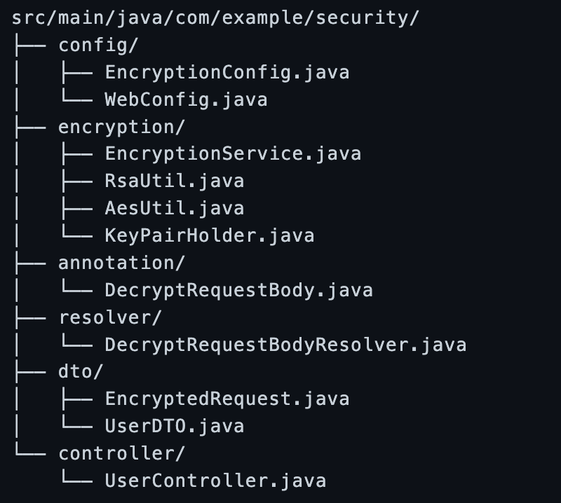
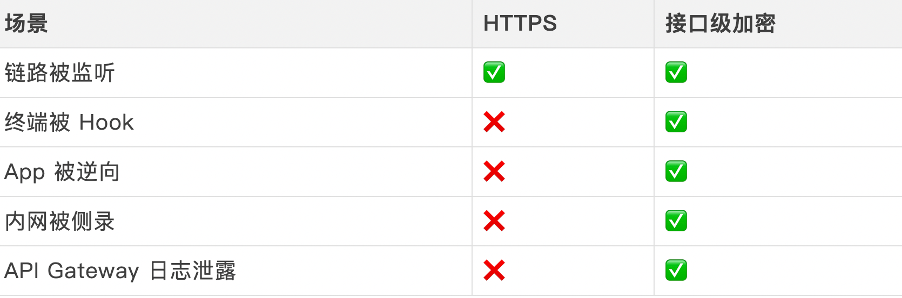
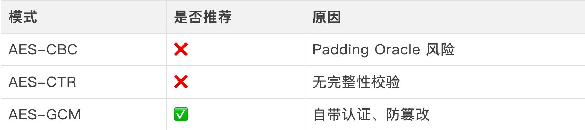

# Spring Boot 实现 RSA + AES 接口自动解密（生产级方案）

>> 在对外 API、前后端分离、App 接口、高敏感数据场景中，仅依赖 HTTPS 并不足以覆盖所有安全威胁
> >
> > 本文将实现一套 可直接落地生产 的方案：
> >
> > 1.RSA-OAEP 非对称加密：安全传输 AES 密钥
> >
> > 2.AES-GCM 对称加密：高性能加密业务数据
> >
> > 3.接口自动解密：零侵入 Controller
> >
> > 4.防重放 / 防篡改：timestamp + nonce + AAD
> >
> > 5.工程级设计：而非 Demo


## 一、整体设计思路
>> 1.1 核心原则


## 二、整体时序流程


## 三、项目结构


## 四、核心实现
>> 4.1 RSA：统一为 OAEP
> >❌ 问题说明（很多文章都会踩）
>>
> > • Java 默认：RSA/ECB/PKCS1Padding
> >
> > • WebCrypto：RSA-OAEP + SHA-256
>>
> > • 两端不兼容

>> 正确做法：统一 RSA-OAEP
```
// RsaUtil.java
@Component
public class RsaUtil {

    private static final String RSA_ALGORITHM =
        "RSA/ECB/OAEPWithSHA-256AndMGF1Padding";

    public String encrypt(String data, Key publicKey) throws Exception {
        Cipher cipher = Cipher.getInstance(RSA_ALGORITHM);
        cipher.init(Cipher.ENCRYPT_MODE, publicKey);
        return Base64.getEncoder()
                .encodeToString(cipher.doFinal(data.getBytes(StandardCharsets.UTF_8)));
    }

    public String decrypt(String encrypted, Key privateKey) throws Exception {
        Cipher cipher = Cipher.getInstance(RSA_ALGORITHM);
        cipher.init(Cipher.DECRYPT_MODE, privateKey);
        byte[] decoded = Base64.getDecoder().decode(encrypted);
        return new String(cipher.doFinal(decoded), StandardCharsets.UTF_8);
    }
}
```
>>  生产必须使用 OAEP，PKCS1Padding 已不推荐

> 4.2 AES-GCM + AAD（防篡改升级）
> >
> > 关键点:
> >
> > 1.AES-GCM ≠ 只加密
> >
> >2. AAD 参与认证但不加密
>>
> > 3. timestamp / nonce 被篡改 → 解密直接失败

```
// AesUtil.java
@Component
public class AesUtil {

    private static final String ALGO = "AES/GCM/NoPadding";
    private static final int IV_LEN = 12;
    private static final int TAG_LEN = 128;

    public String encrypt(String data, String base64Key, String aad) throws Exception {
        SecretKeySpec key = new SecretKeySpec(
                Base64.getDecoder().decode(base64Key), "AES");

        byte[] iv = SecureRandom.getInstanceStrong().generateSeed(IV_LEN);

        Cipher cipher = Cipher.getInstance(ALGO);
        cipher.init(Cipher.ENCRYPT_MODE, key, new GCMParameterSpec(TAG_LEN, iv));
        cipher.updateAAD(aad.getBytes(StandardCharsets.UTF_8));

        byte[] encrypted = cipher.doFinal(data.getBytes(StandardCharsets.UTF_8));

        return Base64.getEncoder().encodeToString(
                ByteBuffer.allocate(iv.length + encrypted.length)
                        .put(iv).put(encrypted).array()
        );
    }

    public String decrypt(String encrypted, String base64Key, String aad) throws Exception {
        byte[] raw = Base64.getDecoder().decode(encrypted);
        byte[] iv = Arrays.copyOfRange(raw, 0, IV_LEN);
        byte[] body = Arrays.copyOfRange(raw, IV_LEN, raw.length);

        Cipher cipher = Cipher.getInstance(ALGO);
        cipher.init(Cipher.DECRYPT_MODE,
                new SecretKeySpec(Base64.getDecoder().decode(base64Key), "AES"),
                new GCMParameterSpec(TAG_LEN, iv));

        cipher.updateAAD(aad.getBytes(StandardCharsets.UTF_8));
        return new String(cipher.doFinal(body), StandardCharsets.UTF_8);
    }
}
```

> 4.3 EncryptedRequest（结构升级）
> >
```
@Data
@Builder
@NoArgsConstructor
@AllArgsConstructor
public class EncryptedRequest {
    private String encryptedKey;
    private String encryptedData;
    private Long timestamp;
    private String nonce;
}
```

> 4.4 EncryptionService（核心调度）
> >
```
@Service
@RequiredArgsConstructor
public class EncryptionService {

    private final KeyPairHolder keyPairHolder;
    private final RsaUtil rsaUtil;
    private final AesUtil aesUtil;
    private final ObjectMapper objectMapper;
    private final RedisTemplate<String, String> redisTemplate;

    public <T> T decrypt(EncryptedRequest req, Class<T> clazz) throws Exception {

        // 防重放（nonce）
        Boolean first = redisTemplate.opsForValue()
                .setIfAbsent("nonce:" + req.getNonce(), "1", 5, TimeUnit.MINUTES);

        if (Boolean.FALSE.equals(first)) {
            throw new SecurityException("重复请求");
        }

        // 时间戳校验
        if (Math.abs(System.currentTimeMillis() - req.getTimestamp()) > 300_000) {
            throw new SecurityException("请求过期");
        }

        String aesKey = rsaUtil.decrypt(
                req.getEncryptedKey(), keyPairHolder.getPrivateKey());

        String aad = req.getTimestamp() + ":" + req.getNonce();

        String json = aesUtil.decrypt(
                req.getEncryptedData(), aesKey, aad);

        return objectMapper.readValue(json, clazz);
    }
}
```

> 4.5 自动解密注解
> >
```
@Target(ElementType.PARAMETER)
@Retention(RetentionPolicy.RUNTIME)
public @interface DecryptRequestBody {
}
```

> 4.6 参数解析器（Controller 无感知）
> >
```
@RequiredArgsConstructor
public class DecryptRequestBodyResolver implements HandlerMethodArgumentResolver {

    private final EncryptionService encryptionService;
    private final ObjectMapper mapper;

    @Override
    public boolean supportsParameter(MethodParameter parameter) {
        return parameter.hasParameterAnnotation(DecryptRequestBody.class);
    }

    @Override
    public Object resolveArgument(
            MethodParameter parameter,
            ModelAndViewContainer container,
            NativeWebRequest request,
            WebDataBinderFactory factory) throws Exception {

        HttpServletRequest req = request.getNativeRequest(HttpServletRequest.class);
        EncryptedRequest encrypted =
                mapper.readValue(req.getInputStream(), EncryptedRequest.class);

        return encryptionService.decrypt(encrypted, parameter.getParameterType());
    }
}
```

> 4.7 Controller（真正零侵入）
> >
```
@PostMapping("/register")
public ResponseEntity<?> register(@DecryptRequestBody UserDTO user) {
    return ResponseEntity.ok(Map.of(
            "msg", "注册成功",
            "user", user.getUsername()
    ));
}
```


## 五、客户端（WebCrypto 对齐 OAEP）

```
RSA-OAEP + AES-GCM
hash: SHA-256
iv: 12 bytes
```
>> 与后端 100% 算法对齐

## 六、安全性说明（非常重要）
>> 6.1 加密 ≠ 认证
> >
> >  本方案解决 数据安全
> >
> > 不替代：
> >
> > 1. JWT
> >
> > 2. OAuth2
> >
> > 3.Session

>  6.2 HTTPS 仍然必须
>>
> > 应用层加密是“加固”，HTTPS 是“地基”

## 七、适用 & 不适用场景
>>  适合:
> >
> > 高敏感字段接口
> >
> > App / 小程序
> >
> > 内网但不可信链路
>>
> > 不适合:
> >
> > 大文件
> >
> > 日志采集
> >
> > 已有 mTLS 的微服务通信


## 八. 为什么 HTTPS 之上，还要做接口级加密？



## 九. AES 模式选型说明（为什么选 GCM）



>> AES-GCM 的核心优势：
> >
> > 1.加密 + 完整性校验一步完成
> >
> > 2.性能高（CPU 有指令集加速）
> >
> > 3. 天然支持 AAD


## 十. 常见生产问题与排查思路
>>
>> 解密失败 AEADBadTagException
>>
>> 可能原因：
>>
>> 1.AAD 不一致（timestamp / nonce 顺序不同）
>>
>> 2.Base64 被多 decode 一次
>>
>> 3.字符集不统一（UTF-8）
>>
>> 排查方法：
>>
>> 1. 打印 AAD 明文
>>
>> 2. 校验 IV 长度是否 12 字节
>>
>> RSA 解密失败:
>>
>> 可能原因：
>>
>> 1.客户端用了 PKCS1Padding
>>
>> 2.服务端是 OAEP
>>
>> 3.公钥缓存未更新
>>
>> 重放被误判
>>
>> 可能原因：
>>
>> 1.nonce 太短
>>
>> 2.Redis TTL 设置过短
>>
>> 3.客户端重试未换 nonce


