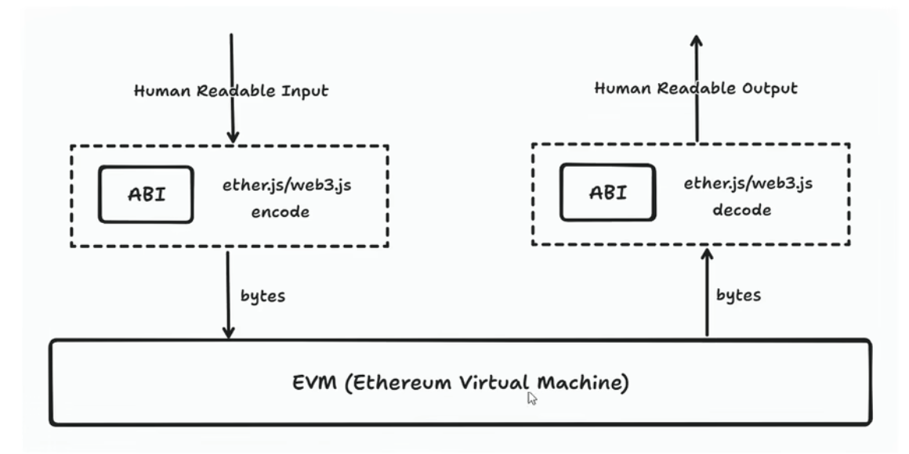
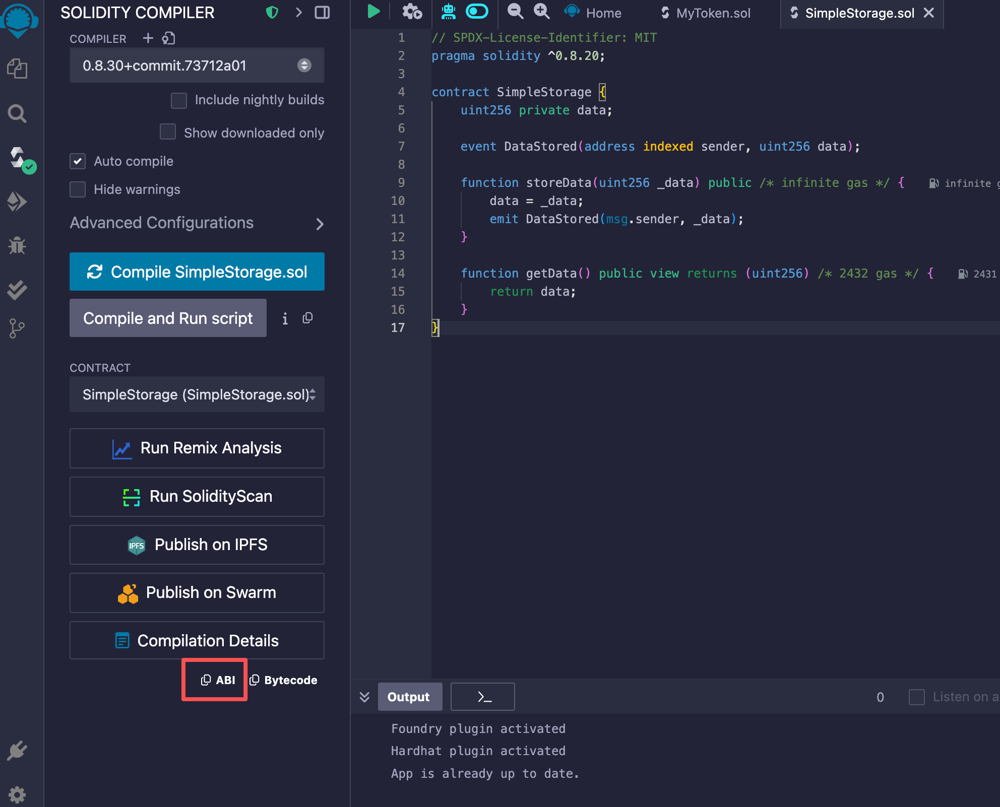
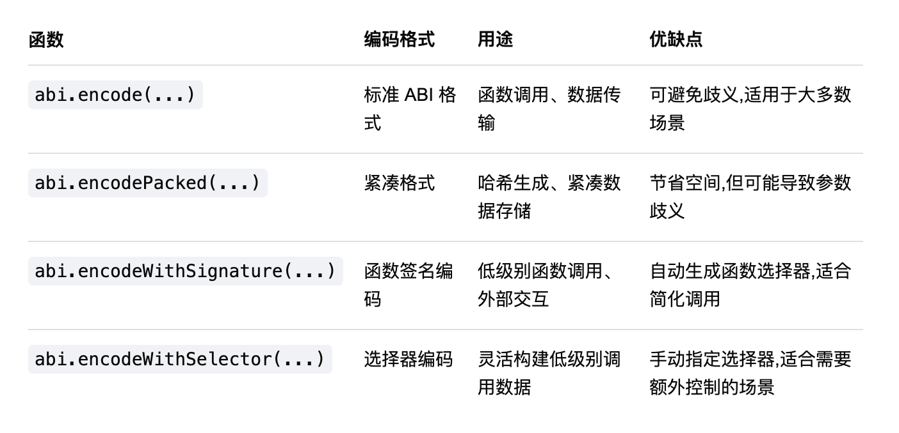
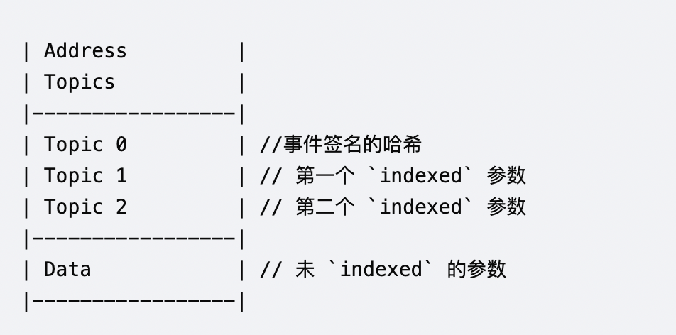
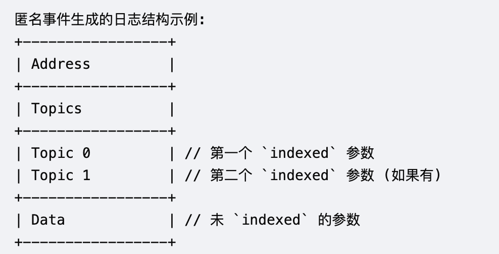
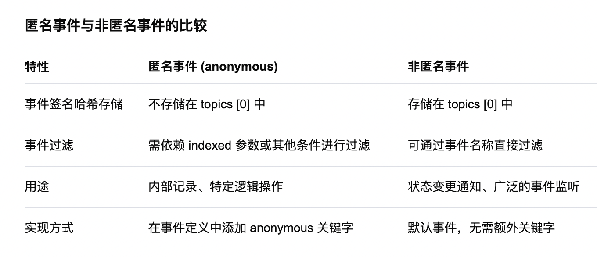
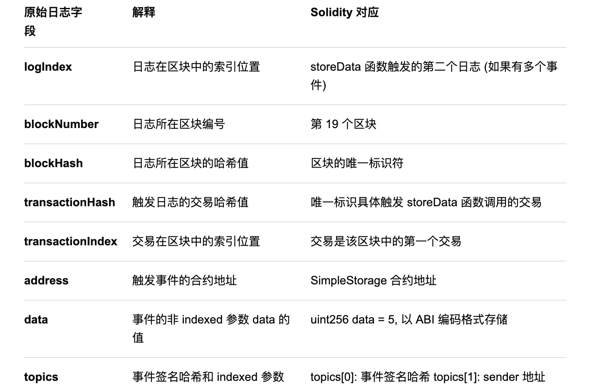
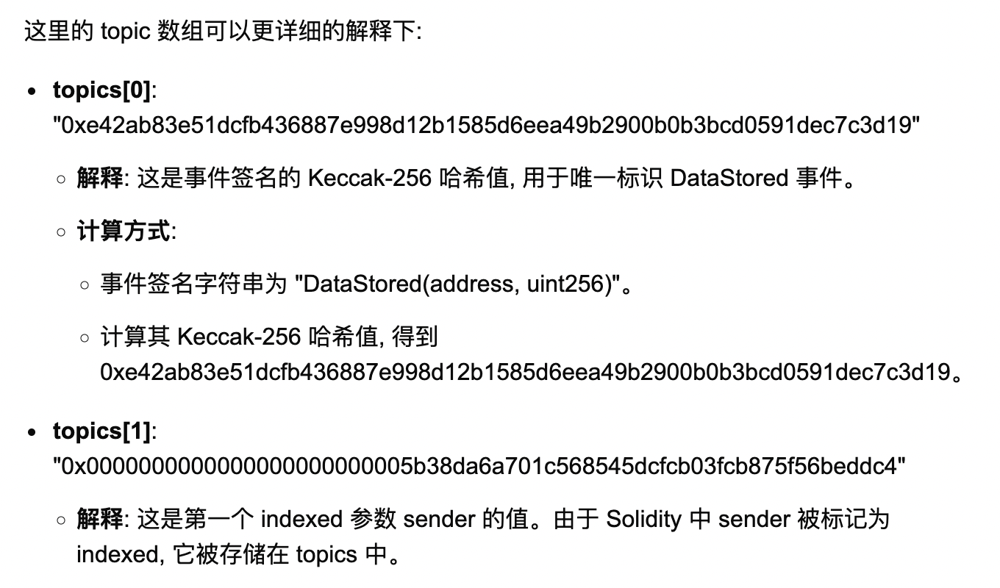
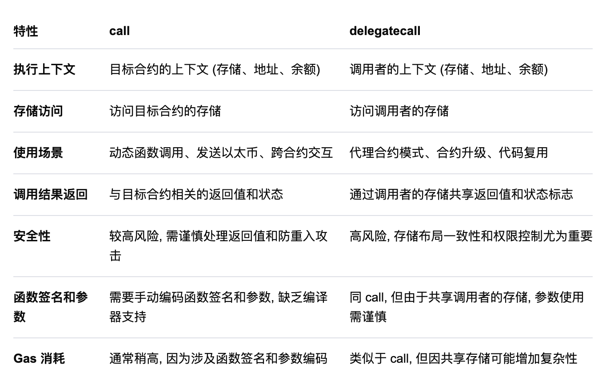

### solidity进阶用法

> ABI

>> 在以太坊生态系统中, ABI (Application Binary Interface, 应用二进制接口) 是连接智能合约与外部应用 (如前端 DApp) 的关键桥梁。对于刚接触区块链和 Solidity 的初学者来说, 理解 ABI 的概念和作用至关重要。

> 什么是 ABI?

> > ABI, 全称为 Application Binary Interface, 即应用二进制接口。它定义了合约中的函数和事件如何与外部系统进行交互。换句话说, ABI 描述了合约的接口, 包括函数的名称、参数类型、返回值以及事件的结构等信息。
智能合约部署到以太坊区块链后, 其源代码对外不可见, 外部应用需要一种方式与合约进行交互。ABI 就是这种桥梁, 它让外部应用知道如何调用合约的函数、如何解码合约返回的数据以及如何监听合约的事件。

> ABI 的组成

> > 一个标准的 Solidity ABI 是一个 JSON (JavaScript Object Notation) 数组, 每个数组元素描述了合约中的一个函数、构造函数或事件。每个元素包含以下字段:

> > >> type: 描述类型, 如 function、constructor、event。

> > > > name: 函数或事件的名称。

> > > > inputs: 输入参数的详细信息, 包括类型和名称。

> > > > outputs: (仅限函数) 输出参数的详细信息。

> > > > stateMutability: 函数的状态可变性, 如 view (只读)、nonpayable (不接受以太币) 等。

> > > > anonymous: (仅限事件) 是否为匿名事件

> ABI 的作用

> > 1.函数调用: ABI 描述了如何编码函数调用的参数,并解码合约返回的数据。外部应用通过ABI知道如何与合约的函数进行交互。

> > 2.事件监听: ABI 定义了事件的结构,外部应用可以根据ABI监听和解析合约触发的事件。

> > 3.接口兼容性: ABI使得不同编程语言和工具能够一致地与合约进行交互,确保兼容性和互操作性。

当我们要调用一个函数时,使用ABI JSON 的规范的要求,进行编码,传给EVM,同时在EVM层生成的字节数据(如时间日志等),ABI JSON 的规范进行解码。



> 合约ABI示例
>> 假设有以下简单Solidity合约

```
// SPDX-License-Identifier: MIT
pragma solidity ^0.8.0;

contract SimpleStorage {
    uint256 private data;

    event DataStored(address indexed sender, uint256 data);

    function storeData(uint256 _data) public {
        data = _data;
        emit DataStored(msg.sender, _data);
    }

    function getData() public view returns (uint256) {
        return data;
    }
}
```

> 在编写 Solidity 合约后,编译工具(如 Solidity Compiler 或 Remix IDE)会自动生成ABI。


> 对应的ABI如下：

```
[
    {
        "anonymous": false,
        "inputs": [
            {
                "indexed": true,
                "internalType": "address",
                "name": "sender",
                "type": "address"
            },
            {
                "indexed": false,
                "internalType": "uint256",
                "name": "data",
                "type": "uint256"
            }
        ],
        "name": "DataStored",
        "type": "event"
    },
    {
        "inputs": [],
        "name": "getData",
        "outputs": [
            {
                "internalType": "uint256",
                "name": "",
                "type": "uint256"
            }
        ],
        "stateMutability": "view",
        "type": "function"
    },
    {
        "inputs": [
            {
                "internalType": "uint256",
                "name": "_data",
                "type": "uint256"
            }
        ],
        "name": "storeData",
        "outputs": [],
        "stateMutability": "nonpayable",
        "type": "function"
    }
]
```

> 编码函数
>> Solidity 提供了一组内置的编码函数,用于将不同类型的数据打包成二进制格式,以便于在合约内部或与外部系统 (如前端应用、其他合约) 进行交互



> abi.encode()
>> 功能: 按照 Solidity 的标准 ABI 编码规则,将输入的参数编码为紧凑的字节数组

>> 用途:
>> 1.构建函数调用的数据负载。

>> 2.在合约内部传递复杂的数据结构。

>> 示例:

```
pragma solidity ^0.8.0;

contract EncoderExample {
    function encodeData(uint256 _num, address _addr) public pure returns (bytes memory) {
        return abi.encode(_num, _addr);
    }
}
```
>> 解释:
>> 调用 encodePackedData(123, 0xAbC...) 会返回一个更紧凑的字节数组,与 abi.encode 相比,减少了填充字节

>> abi.encodeWithSignature(...)

>> 功能: 根据给定的函数签名,将参数编码为 ABI 格式的字节数组,通常用于构建低级别的函数调用数据

>> 用途:

>> 在合约间进行低级别的函数调用 (如通过 call)。

>> 与外部应用程序 (如前端、脚本) 进行交互,构建函数调用数据

>> 示例:
```
pragma solidity ^0.8.0;

contract WithSignatureExample {
    function getData(bytes memory _encoded) public pure returns (bytes32) {
        return keccak256(_encoded);
    }
}
```

>> 前端构建调用数据:

```
const { ethers } = require("ethers");

const abi = [
    "function storeData(uint256 _data) public",
];
const iface = new ethers.utils.Interface(abi);
const data = iface.encodeFunctionData("storeData", [123]);
// data = "0x<function_selector><encoded_parameters>"
```

>> 解释：
>> encodeFunctionData 内部使用 abi.encodeWithSignature 来生成函数调用的数据

>> 生成的数据包括函数选择器和编码后的参数,适用于合约的低级别调用

> abi.encodeWithSelector(...)

>> 功能：根据给定的函数选择器,将参数编码为ABI格式的字节数组

>> 用途：

>> 类似于 abi.encodeWithSignature, 但更灵活,可以手动指定函数选择器

>> 在合约内部进行低级别调用时使用

>> 示例：

```
pragma solidity ^0.8.0;

contract WithSelectorExample {
    function getData(bytes4 _selector, uint256 _num) public pure returns (bytes memory) {
        return abi.encodeWithSelector(_selector, _num);
    }
}
```

>> 调用 getData(bytes4(keccak256("storeData(uint256)")), 123) 会返回编码后的字节数组,包含指定的函数选择器和参数

> 合约间低级别调用

>> 假设有两个合约: Caller 和 Callee。Caller 需调用 Callee 的 storeData 函数,但使用低级别的 call

>> Callee 合约:
```
pragma solidity ^0.8.0;

contract Callee {
    uint256 public data;
    event DataStored(address indexed sender, uint256 data);

    function storeData(uint256 _data) public {
        data = _data;
        emit DataStored(msg.sender, _data);
    }
}
```

>> Caller 合约:
```
pragma solidity ^0.8.0;

contract Caller {
    function callStoreData(address _callee, uint256 _data) public returns (bool, bytes memory) {
        // 使用 abi.encodeWithSignature
        bytes memory payload = abi.encodeWithSignature("storeData(uint256)", _data);
        (bool success, bytes memory returnData) = _callee.call(payload);
        return (success, returnData);
    }

    function callStoreDataWithSelector(address _callee, uint256 _data) public returns (bool, bytes memory) {
        // 手动构建选择器
        bytes4 selector = bytes4(keccak256("storeData(uint256)"));
        bytes memory payload = abi.encodeWithSelector(selector, _data);
        (bool success, bytes memory returnData) = _callee.call(payload);
        return (success, returnData);
    }
}
```

> 解释:
>> Caller 合约通过 abi.encodeWithSignature 和 abi.encodeWithSelector 构建调用 Callee 合约的 storeData 函数的数据负载

>> 使用低级别的 call 方法执行函数调用,捕获返回值和执行状态

> 前端与合约交互

>> 使用 Ethers.js 构建函数调用数据,并通过低级别调用与合约交互

```
const { ethers } = require("ethers");

// 合约ABI和地址
const contractABI = [
    "function storeData(uint256 _data) public",
];
const contractAddress = "0xC2eF4Beb82626190C6E80605e9f95CD3aC555838";

// 创建接口
const iface = new ethers.utils.Interface(contractABI);

// 编码函数调用数据
const data = iface.encodeFunctionData("storeData", [123]);
// 结果: "0x<function_selector><encoded_parameters>"

// 发送交易
const provider = new ethers.providers.JsonRpcProvider("https://sepolia.infura.io/v3/YOUR_INFURA_PROJECT_ID");
const signer = provider.getSigner();

const tx = {
    to: contractAddress,
    data: data,
};

signer.sendTransaction(tx).then((transaction) => {
    console.log("Transaction sent:", transaction.hash);
});
```
>> 使用 Ethers.js 的 Interface 对象，简化函数调用数据的编码过程

>> encodeFunctionData 自动处理函数选择器和参数编码，生成适用于交易的数据字段

#### 事件与日志

> 事件概述

>> 事件是智能合约与外部世界交互的重要机制，广泛应用于以下场景

>> 1.状态变更通知: 当合约状态发生变化时，通过事件通知外部应用。例如，代币转账事件

>> 2.调试与记录: 开发者可以使用事件来记录合约执行过程中的关键信息，便于调试和审计

>> 3.触发前端更新: 前端应用可以监听特定事件，以动态更新界面或执行特定操作

> 事件与日志的关系

>> 在以太坊生态系统中，事件和日志是紧密相连的概念。日志 (Logs) 是存储在以太坊区块链上的数据结构，用于记录智能合约中触发的事件。在 Solidity 中，事件是通过日志 (Logs) 来实现的。  
> > 当合约中的事件被触发时，相应的日志条目会被创建并添加到当前的区块中。日志具有如下几个重要特点:

>> 1.不可修改性: 一旦日志被记录到区块链上，它们就变成了不可更改或删除的记录。这保证了事件数据的完整性和可信度

>> 2.低成本: 相比于将数据存储在合约的状态变量中，记录日志的 gas 成本要低得多。这使得事件成为一种经济高效的数据存储方式，特别是对于不需要直接被合约访问的数据

>> 3.可查询性: 外部应用可以方便地查询和订阅这些日志，从而获取合约中发生的重要事件信息

>> 4.特殊的数据结构: 日志不存储在区块链的全局状态中，而是作为元数据附加在区块上。这种设计使得日志的存储和检索更加高效


> 事件的结构与特性

>> 事件的定义和使用涉及几个关键概念: 签名、主题和索引参数。理解这些概念对于有效使用事件至关重要

>> 每个事件都有一个唯一的签名，它包括事件名称和参数类型。例如，一个事件 Transfer(address indexed from, address indexed to, uint256 value)，它带有 address 类型的 from 和 to 参数，以及 uint256 类型的 value 参数，其签名就是 Transfer(address, address, uint256)

>> 事件签名经过 Keccak-256 哈希运算后，得到的哈希值被称为事件的主题 (Topic)。这个主题用于在区块链上唯一标识该事件，使得外部应用能够快速定位和过滤特定类型的事件

>> Solidity 允许使用 indexed 关键字标记事件参数。这些被标记的参数称为索引参数，它们具有特殊的属性:

>> 1.索引参数允许外部应用基于这些参数值高效地过滤和查询相关事件

>> 2.每个事件最多可以有三个索引参数

>> 3.索引参数的值被存储在日志的主题部分,而不是数据部分,这使得它们更容易被检索

>> 4. 日志的结构可以概括如下:



>> topics[0]: 始终存储事件签名的 Keccak-256 哈希值,用于唯一标识事件类型

>> topics[1..3]: 存储被标记为 indexed 的参数。每个 indexed 参数占用一个 topic 索引位置,最多支持三个 indexed 参数

>> data: 存储所有未被标记为 indexed 的参数,按照 ABI 编码格式打包存储

> 匿名事件
>> 匿名事件通过在事件定义中添加 anonymous 关键字实现。默认情况下,事件是非匿名的,即事件签名的哈希值会自动作为第一个主题 (topics[0]) 存储在日志中。而将事件标记为 anonymous 后,事件签名的哈希值将不被存储在 topics [0] 中

>> 以下是如何定义一个匿名事件的示例：

```
pragma solidity ^0.8.0;

contract AnonymousEventExample {
    //定义一个匿名事件
    event AnonymousDataStored(address indexed sender, uint256 data) anonymous;

    function storeData(uint256 _data) public {
        emit AnonymousDataStored(msg.sender, _data);
    }
}
```

>> 匿名事件的特性

>> 1.不存储事件签名哈希：

>> 匿名事件不会将事件签名的 Keccak-256 哈希值存储在 topics[0] 中。这意味着外部应用在监听和过滤事件时,无法通过事件名称直接过滤匿名事件

>> 2.主题位置

>> 由于事件签名哈希不作为 topics[0] 存储,匿名事件的 topics 数组通常从 topics[0] 开始存储被标记为 indexed 的参数。

>> 3.用途限制

>> 匿名事件适用于那些不需要通过事件名称过滤的场景,如内部逻辑记录或特定的链上操作记录

>> 由于缺少事件签名哈希,匿名事件在被外部应用强制过滤时不如非匿名事件直观和高效

>> 匿名事件生成的日志结构示例：



>> topics[0]: 不包含事件签名哈希,而是直接存储第一个 indexed 参数的值

>> topics[1..n]: 继续存储其他 indexed 参数的值。

>> data: 存储所有未被标记为 indexed 的参数,按照 ABI 编码格式打包

>> 使用注意事项:

>> 1.事件过滤困难:

>> 由于匿名事件不包含事件签名哈希，无法通过事件名称进行过滤。外部应用需要依赖 indexed 参数或其他条件来筛选感兴趣的事件

>> 2.参数过滤

>> 可以通过监听特定的 indexed 参数值来间接过滤事件。例如，监听特定地址发送的匿名事件

>> 3.限制 indexed 参数数量

>> 匿名事件仍然遵循每个事件最多三个 indexed 参数的限制

>> 4.用途场景

>> 适用于不需要基于事件名称过滤事件的内部记录或特定逻辑操作记录

>> 适用于只有一个事件的合约。监听合约中的所有事件是有意义的，因为只有这一个事件将出现在事件日志中



>> 下面是一个简单的Solidity 合约示例,展示如何定义和触发事件,以及如何在函数中使用它们

```
// SPDX-License-Identifier: MIT
pragma solidity 0.8.0;

contract SimpleStorage {
    //定义一个名为 DataStored 的事件
    event DataStored(address indexed sender, uint256 data);
    uint256 private data;

    //存储数据并触发事件
    function storeData(uint256 _data) public {
        data = _data;
        emit DataStored(msg.sender, _data); //触发事件
    }

    // 读取数据
    function getData() public view returns (uint256) {
        return data;
    }
}
```

>> 在这个合约中,我们定义了一个DataStored 事件,它有两个参数:一个索引的 sender 地址和一个非索引的data值。每当 storeData 函数被调用时,这个事件就会被触发

>> 当我们调用 storeData(5)时,会生成如下的日志

```
[
  {
    "logIndex": "0x1",
    "blockNumber": "0x13",
    "blockHash": "0xe1d6fc3a880e206bd50af0b3dd60f00b6e99a2a20f436c84f7ca717310d941db",
    "transactionHash": "0xe772082aa1798e9676858d0925fb1a2b3d4ad3c25013acd795613da8f0e475c2",
    "transactionIndex": "0xe",
    "address": "0xaE036c65C649172b43ef7156b009c6221859688b",
    "topics": [
      "0xe42ab83e51dcfb436887e998d12b1585d6eea49b2900b0b3bcd0591dec7c3d19",
      "0x0000000000000000000000005b38da6a701c568545dcfcb03fcb875f56beddc4"
    ],
    "data": "0x0000000000000000000000000000000000000000000000000000000000000005"
  }
]
```

>> 日志具体对应关系如下具体对应关系





>> 前端事件监听

>> 在前端应用中,可以使用 Web3.js 或 Ethers.js 等库来监听合约事件。以下是使用 Ethers.js 的简单示例

```
function ContractListener() {
  const [events, setEvents] = useState([]);

  useEffect(() => {
    const provider = new ethers.JsonRpcProvider("https://sepolia.infura.io/v3/YOUR_INFURA_PROJECT_ID");
    const contract = new ethers.Contract(contractAddress, contractABI, provider);
    const filter = contract.filters.DataStored();

    const handleEvent = (sender, data, event) => {
      setEvents(prev => [...prev, { sender, data: data.toString(), txHash: event.transactionHash }]);
    };

    // 实时监听新事件
    contract.on(filter, handleEvent);

    //查询过去的事件
    contract.queryFilter(filter, 1000, "latest").then(pastEvents => {
      pastEvents.forEach(event => {
        const { sender, data } = event.args;
        setEvents(prev => [...prev, { sender, data: data.toString(), txHash: event.transactionHash }]);
      });
    });

    // 清理函数
    return () => {
      contract.off(filter, handleEvent);
    };
  }, []);

  //渲染事件列表的JSX...
}
```

>> 1.连接 Provider: 通过 Infura 连接到 Sepolia 测试网

>> 2.创建合约实例: 使用合约地址和 ABI 创建 Ethers.js 合约实例

>> 3.监听事件:
>>>> 使用 contract.on 监听 DataStored 事件

>>>> 当事件触发时,将事件数据添加到 events 状态中

>> 4.查询历史事件

>>>> 使用 queryFilter 查询过去 1000 个区块内的 DataStored 事件,并添加到 events 状态中

#### Call 与 Delegatecall

> 在 Solidity 中,合约之间的交互不仅可以通过接口和继承实现,还可以利用低级别的函数调用机制,如 call 和 delegatecall

>> call: 一种低级别的函数调用方式,允许合约调用另一个合约的函数,同时可以发送以太币。调用目标合约的代码在目标合约的上下文中执行,拥有自己的存储、以太币余额和地址

>> delegatecall: 类似于 call, 但在调用过程中保持调用者 (当前合约) 的上下文。目标合约的代码在调用者的上下文中执行,因此它们共享相同的存储、以太币余额和地址

-  Call
>> call 是 Solidity 提供的低级别函数调用方法,允许一个合约调用另一个合约的函数。它的基本语法如下

```
(bool success, bytes memory data) address(target).call{value: amount}(abi.encodeWithSignature("functionName(type1 Copy

```

>> address(target).call{value: amount}(...): 目标地址执行 call, 并可选择发送一定的以太币。

>> abi.encodeWithSignature: 对函数名和参数进行编码,构建调用数据

>> 返回值包括:

>> success: 调用是否成功的布尔值

>> data: 返回的数据,以字节数组形式存储

>> 使用示例

>> 假设有两个合约: Caller 和 Callee, Caller 通过 call 调用 Callee 的 storeData函数

```
// SPDX-License-Identifier: MIT
pragma solidity ^0.8.0;

contract Callee {
    uint256 public data;
    event DataStored(address indexed sender, uint256 data);

    function storeData (uint256 _data) public payable {
        data = _data;
        emit DataStored(msg.sender, _data);
    }
}

contract Caller {
    event CallResult (bool success, bytes data);

    function callStoreData(address _callee, uint256 _data) public payable {
        (bool success, bytes memory returnData) = _callee.call{value: msg.value}(
            abi.encodeWithSignature("storeData(uint256)", _data)
        );
        emit CallResult(success, returnData);
    }
}
```

>> 优点：

>> 1.灵活性高:可以动态调用任何合约的任何函数,无需预先知道目标合约的具体接口。

>> 2.支持以太币发送:可以在调用过程中发送以太币给目标合约

>> 缺点:

>> 1.缺乏类型检查:由于是低级调用,编译器无法对函数选择器和参数进行类型检查,容易导致调用失败或意外行为

>> 2.返回数据处理复杂:需要手动解码返回的数据,增加了代码复杂性

>> 3.安全风险高:未正确处理 call 的返回值和重入攻击等安全问题,可能导致合约被攻击


- Delegatecall
>> delegatecall 是 Solidity 提供的一个低级别函数,用于在当前合约的上下文中调用另一个合约的代码。  
> > 与普通的 call 不同, delegatecall 会保持调用者 (当前合约) 的存储、地址和余额,而目标合约的代码将在调用者的上下文中执行。这使得 delegatecall 成为实现代理合约和可升级合约的重要工具

>> 当执行 delegatecall 时,以下几点尤为重要:

>> 1.上下文保持: delegatecall 保持调用者的上下文,包括 msg.sender 和 msg.value, 而目标合约在调用者的存储中操作

>> 2.存储访问: 目标合约的代码会读取和修改调用者合约的存储,而不是目标合约自己的存储

>> 3.函数执行: 目标合约的函数通过调用者的地址和存储进行执行

```
(bool success, bytes memory returnData) = implementation.delegatecall(msg.data);
require(success, "Delegatecall failed");
```

>> implementation: 目标合约的地址。

>>msg.data:

> > 调用数据,包含以下部分:

> > >> i. 函数选择器 (Function Selector): 前4个字节, 用于识别要调用的函数。

> > > > ii. 参数编码 (Encoded Parameters): 函数参数按 ABI 编码规则打包的字节数据

>> 使用示例
>> 假设有两个合约: Proxy 和 Implementation。Proxy 通过 delegatecall 调用 Implementation 的 storeData 函数

```
// SPDX-License-Identifier: MIT
pragma solidity ^0.8.0;

contract Implementation {
    uint256 public data;

    event DataStored(address indexed sender, uint256 data);

    function storeData(uint256 _data) public {
        data = _data;
        emit DataStored(msg.sender, _data);
    }
}

contract Proxy {
    uint256 public data;
    address public implementation;

    constructor(address _implementation) {
        implementation = _implementation;
    }

    fallback() external payable {
        (bool success, ) = implementation.delegatecall(msg.data);
        require(success, "Delegatecall failed");
    }
}
```

>> 调用流程示例

>> 1.部署合约

>> 部署 Implementation 合约,获得其地址,例如 0xImplAddress

>> 部署 Proxy 合约,初始化 _implementation 为 0xImplAddress,获得代理合约地址 0xProxyAddress

>> 2.调用代理合约的 storeData 函数

>> 前端或用户通过 Proxy 地址调用 storeData(uint256),例如传入 42

>> 调用数据 msg.data 包含函数选择器 0x6d4ce63c (假设是 storeData(uint256) 的选择器)和参数 42 的 ABI 编码

>> 3.代理合约执行 delegatecall:

>> Proxy 合约的 fallback 函数被触发,执行 implementation.delegatecall(msg.data)

>> delegatecall 解析 msg.data,找到函数选择器对应的 storeData 函数,并在 Proxy 的上下文中执行

>> 4.状态更新

>> storeData 函数在 Proxy 合约的存储中更新 data 变量,而不是 Implementation 合约

>> 事件 DataStored 也是在 Proxy 触发,因为 msg.sender 是原始调用者

>> 5.事件日志

>> 事件日志记录在 Proxy 合约的地址下, data 值为 42

- 存储冲突
>> 存储冲突发生在代理合约和实现合约使用相同的存储槽存储不同的变量或数据时, 导致数据被覆盖或混淆

>> 原因:

>> 1.存储槽重叠:

>> 如果 Proxy 合约和 Implementation 合约在相同的存储槽中定义了不同的变量, 执行 delegatecall 时会导致变量值被错误地覆盖

>> 2.不一致的存储布局

>> 代理合约和实现合约的状态变量声明顺序和类型不一致, 导致变量在同一存储槽中的映射错误

>> 具体示例解析

>> 错误示例: 存储槽冲突导致的实现地址被覆盖
```
// SPDX-License-Identifier: MIT
pragma solidity ^0.8.0;

contract Implementation {
    string public female;
    string public male;

    function setFemaleName(string memory _name) public {
        female = _name;
    }

    function setMaleName(string memory _name) public {
        male = _name;
    }
}

contract Proxy {
    string public male;
    string public female;
    address public implementation;

    constructor(address _implementation) {
        implementation = _implementation;
    }

    fallback() external payable {
        (bool success, ) = implementation.delegatecall(msg.data);
        require(success, "Delegatecall failed");
    }

    receive() external payable {}
}
```

>> 1.Proxy 合约:

>>>> 槽0: string public male;

>>>> 槽1: string public female;

>>>> 槽2: address public implementation;

>> 2.Implementation 合约

>>>> 槽0: string public female;

>>>> 槽1: string public male;

>> 执行过程

>>>> 用户通过 Proxy 调用 setFemaleName("Alice")

>>>> delegatecall 将调用转发到 Implementation 合约

>>>> Implementation 的 setFemaleName 函数在 Proxy 合约的上下文中执行: female "Alice" 被写入 Proxy 合约的槽0, 而不是槽1

>> 后果

>>>> Proxy 合约的 male 变量 (槽0) 被错误地设置为 "Alice"

>>>> Proxy 合约的 female 变量 (槽1) 保持不变

>>>> 状态变量 female 被错误地存储在 Proxy 合约的 male 位置, 导致数据不一致

>> 潜在问题

>>>> 存储布局不匹配导致数据存储位置错误

>>>> 后续对 male 和 female 变量的读取将返回不正确的值

>>>> 可能引发意外的行为和数据混淆

>> 比较



> 代理合约

>> 代理合约是一种智能合约,其主要职责是将调用转发到另一个逻辑合约(通常称为实现合约)。通过这种方式,代理合约本身保持不变,而实现合约可以根据需要进行升级或修改,实现合约逻辑的可升级性

>> 为什么需要代理合约?

>> 智能合约一旦部署到区块链上,就无法修改。随着时间的推移,可能会发现合约存在漏洞、需要添加新功能或优化性能。在这种情况下,代理合约提供了一种解决方案,使得开发者可以升级合约逻辑而无需更改合约地址,从而保持与用户和其他合约的兼容性

>> 代理合约的工作原理

>> 代理合约通过委托调用(delegatecall) 机制,将函数调用和数据转发到实现合约。delegatecall 允许代理合约在自己的存储空间中执行实现合约的代码,这意味着实现合约的代码可以操作代理合约的状态变量

>> 透明代理 是最常见的代理模式,由OpenZeppelin 实现。其主要特点是:

>>>> 权限控制:代理合约有一个管理员账户,仅管理员可以升级实现合约

>>>> 透明性:对普通用户来说,代理合约看起来与实现合约相同,但管理员与普通用户的接口不同,避免调用冲突

>> 实现特点:

>>>> 存储实现合约地址的槽(通常使用EIP-1967标准)

>>>> fallback 函数中使用 delegatecall 转发调用

>> 以下是透明代理模式的简单实现示例:

>> 实现合约

```
// SPDX-License-Identifier: MIT
pragma solidity ^0.8.0;

contract LogicV1 {
    uint256 public data;

    event DataStored(address indexed sender, uint256 data);

    function storeData(uint256 _data) public {
        data = _data;
        emit DataStored(msg.sender, _data);
    }
}
```

>> 代理合约

```
// SPDX-License-Identifier: MIT
pragma solidity ^0.8.0;

contract Proxy {
    // EIP-1967 Slots
    bytes32 private constant IMPLEMENTATION_SLOT =
        keccak256("eip1967.proxy.implementation") - 1;
    bytes32 private constant ADMIN_SLOT = keccak256("eip1967.proxy.admin") - 1;

    constructor(address _implementation) {
        _setAdmin(msg.sender);
        _setImplementation(_implementation);
    }

    modifier onlyAdmin() {
        require(msg.sender == getAdmin(), "Proxy: Not admin");
        _;
    }

    function getAdmin() internal view returns (address admin) {
        bytes32 slot = ADMIN_SLOT;
        assembly {
            admin := sload(slot)
        }
    }

    function _setAdmin(address _admin) internal {
        bytes32 slot = ADMIN_SLOT;
        assembly {
            sstore(slot, _admin)
        }
    }

    function _getImplementation() internal view returns (address impl) {
        bytes32 slot = IMPLEMENTATION_SLOT;
        assembly {
            impl := sload(slot)
        }
    }

    function _setImplementation(address _impl) internal {
        bytes32 slot = IMPLEMENTATION_SLOT;
        assembly {
            sstore(slot, _impl)
        }
    }

    function upgradeTo(address _newImplementation) external onlyAdmin {
        _setImplementation(_newImplementation);
    }

    function upgradeTo(address _newImplementation) external onlyAdmin {
        _setImplementation(_newImplementation);
    }

    fallback() external payable {
        _delegate(_getImplementation());
    }

    receive() external payable {
        _delegate(_getImplementation());
    }

    function _delegate(address _impl) internal virtual {
        assembly {
            //将输入复制到内存
            calldatacopy(0, 0, calldatasize())
            // 执行 delegatecall
            let result := delegatecall(gas(), _impl, 0, calldatasize(), 0, 0)
            //获取返回数据
            returndatacopy(0, 0, returndatasize())
            // 根据结果决定是否回退
            switch result
            case 0 {
                revert(0, returndatasize())
            }
            default {
                return(0, returndatasize())
            }
        }
    }
}
```
> 可升级合约
>> UUPS Proxy (Universal Upgradeable Proxy Standard) 是一种轻量级且高效的代理模式,允许智能合约在部署后进行逻辑升级

>> 与传统的透明代理 (Transparent Proxy) 不同, UUPS Proxy 的升级逻辑由实现合约自身管理, 而不是由代理合约处理。这种设计减少了代理合约的复杂性和存储需求, 提高了灵活性和效率

>> 为什么选择 UUPS Proxy?

>> 节省存储空间: 由于升级逻辑在实现合约中, 代理合约本身更为简洁, 节省了存储空间

>> 降低 Gas 成本: 更简洁的代理合约意味着部署和交互时的 Gas 成本更低

>> 灵活性高: 升级逻辑集中在实现合约, 便于管理和扩展

>> UUPS Proxy 的工作流程可以分为三个主要阶段: 部署、调用和升级。以下将详细解释每个阶段

>> 1.部署阶段

>> 部署实现合约 (Implementation Contract)

>> 实现合约包含实际的业务逻辑

>> 使用 OpenZeppelin 的 UUPSUpgradeable 和 OwnableUpgradeable 基类, 确保安全的升级机制

```
// SPDX-License-Identifier: MIT
pragma solidity ^0.8.0;
import "@openzeppelin/contracts-upgradeable/proxy/utils/UUPSUpgradeable.sol";
import "@openzeppelin/contracts-upgradeable/access/OwnableUpgradeable.sol";

contract ImplementationV1 is UUPSUpgradeable, OwnableUpgradeable {
    uint256 public data;
    event DataStored (address indexed sender, uint256 data);

    function initialize() initializer public { // infinite gas
        _Ownable_init(msg.sender);
        _UUPSUpgradeable_init();
    }

    function storeData(uint256 _data) public { // infinite gas
        data = _data;
        emit DataStored(msg.sender, _data);
    }

    function _authorizeUpgrade (address newImplementation) internal override onlyOwner {}

    receive() external payable { } // undefined gas
}
```

```
// SPDX-License-Identifier: MIT
pragma solidity ^0.8.0;

import "@openzeppelin/contracts/proxy/ERC1967/ERC1967Proxy.sol";

contract ProxyUUPS is ERC1967Proxy {
    uint256 public data;
    constructor(address _logic, bytes memory _data) ERC1967Proxy(_logic, _data) {}
    receive() external payable {
    }
    // undefined gas
}
```


