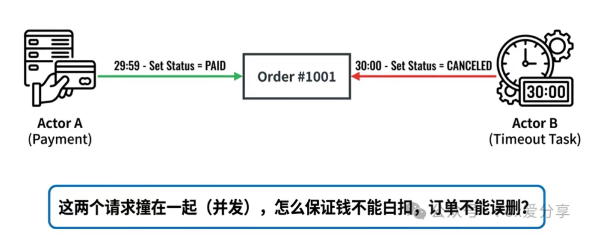
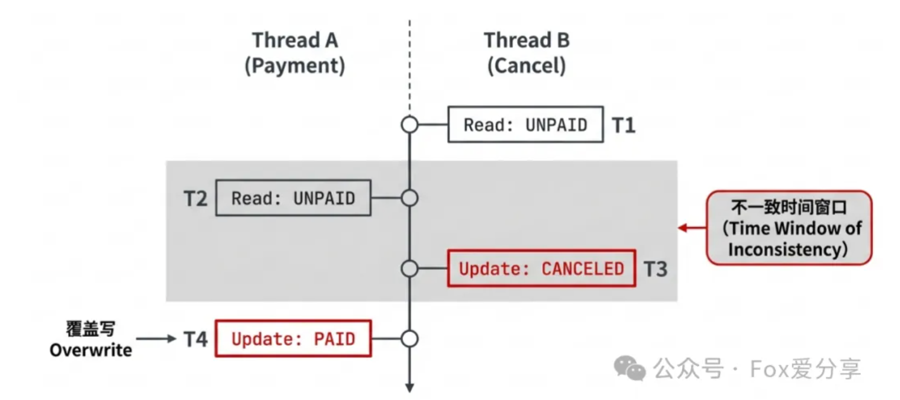
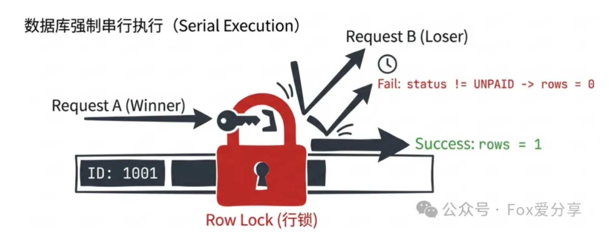
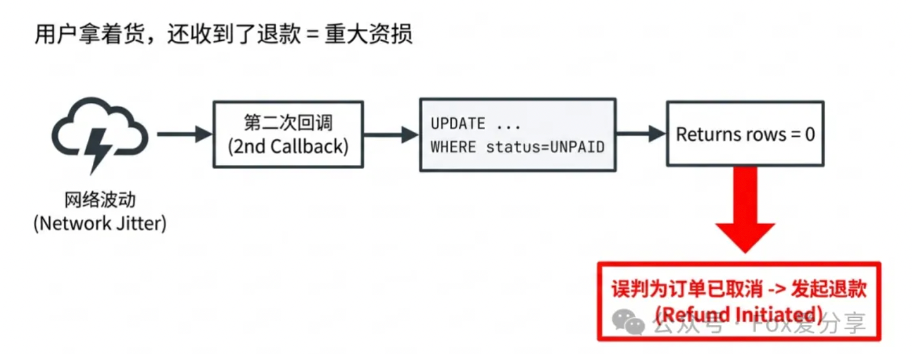
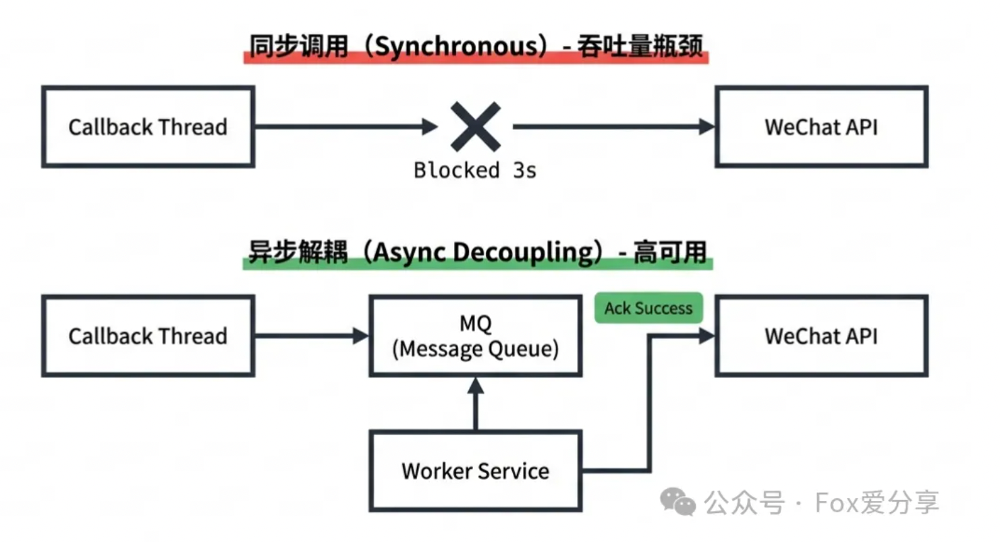
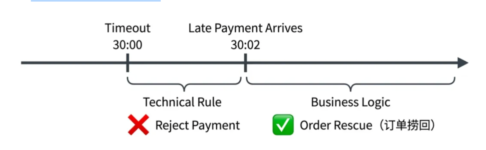
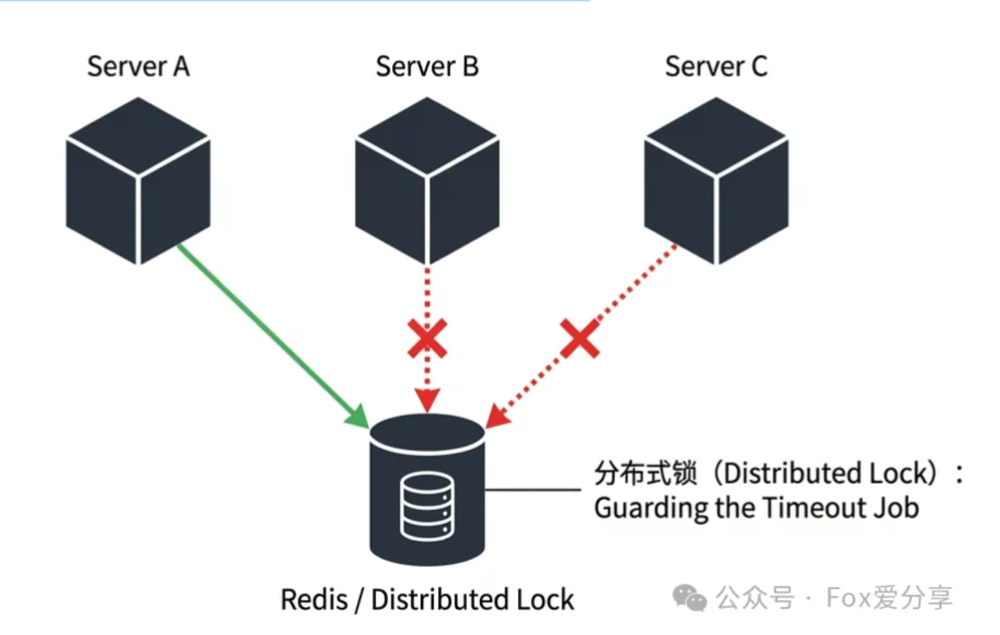

### 用户付了钱，订单却被取消

>> 面试官： “我们的订单系统设置了 30 分钟未支付自动取消。现在有个极端情况： 用户在第 29 分 59 秒 支付成功了，支付宝回调刚好到了。 同时，第 30 分 00 秒 的‘超时取消定时任务’也触发了。 这两个请求撞在一起（并发），你的代码怎么写才能保证——钱不能白扣，订单不能误删？
> >



>> 这位兄弟自信满满地写了一段伪代码：“先查一下订单状态，如果是‘未支付’，就更新状态。哪个先到就执行哪个呗

>> 面试官看了一眼代码，摇了摇头说：“回去等通知吧。按你这个写法，支付宝重试回调时你会误退款，并发时你会掉单。京东一天得产生几万次资损事故。

> 一、 还原“车祸现场”：消失的那 0.01 秒

>> 面试官担心的，到底是什么？

>> 场景还原： 假设订单 ID 为 1001，状态为 OrderStatus.UNPAID（未支付）。

>> 线程 A（支付回调）： 拿着支付宝的成功通知，准备把订单改成 PAID。
>> 线程 B（定时任务）： 发现订单已过 30 分钟，准备把订单改成 CANCELED。

>> 这时候，两个线程在服务器里疯狂赛跑。
> >
> > 惨案发生： 如果线程 B（取消）稍微快了那么 1 毫秒，先把数据库状态改成了 CANCELED。 紧接着线程 A（支付）进来了，如果你的代码逻辑不够严谨（比如发生了覆盖写）
> >
> > 结局： 你的数据库里出现了一个 “已支付” 但业务逻辑上 “已取消” 的幽灵订单，或者一个 “已取消” 但用户 “已付钱” 的冤案
> >
> > 这在电商里叫“掉单”，在金融里叫“资损”
> >

> 二、 错误示范：90% 程序员都在写的“自杀式代码”
> 那位兄弟在面试时写的代码，大概长这样（伪代码）

```
// 线程A（支付回调）或 线程B（超时取消）都在执行这段逻辑
Order order = orderMapper.selectById(orderId); // 1. 先查

if (order.getStatus() == OrderStatus.UNPAID) {  // 2. 内存判断
    order.setStatus(newStatus);                  // 3. 改状态
    orderMapper.updateById(order);               // 4. 写回数据库
}
```
>> 这就是典型的 Check-Then-Act（先检查后执行） 陷阱！

>> 为什么会炸？ 因为步骤 1 和 步骤 4 之间，不是原子的！ 有一个极其微小的时间窗口。

>> T1： 线程 B（取消任务）查到了 UNPAID。

> > T2： 线程 A（支付回调）也查到了 UNPAID。

> > T3： 线程 B 执行 update，数据库变成了 CANCELED。

> > T4： 线程 A 随后执行 update，强行把数据库覆盖成 PAID



>> 结果： 订单变成了“已支付”，但超时任务认为自己取消成功了，可能已经释放了库存。用户收不到货，客服电话被打爆

> 三、 破局：资深架构师的「数据库乐观锁」

>> 要解决这个问题，不需要引入 Redis 分布式锁（太重，引入外部依赖），也不需要数据库悲观锁 for update（太慢，影响吞吐）

>> 最优雅的解法是：数据库乐观锁（基于行锁的条件更新，类 CAS 范式）

>> 补充：这里的“类 CAS”是数据库乐观锁的实现范式，和 JVM 的 CAS（原子类、Unsafe）底层实现不同，但核心思想一致——「比较原值，符合才更新」。

>> 正确写法（MyBatis）：

>> 1. 支付回调的 SQL

```
UPDATE orders 
SET status = #{paidStatus}, pay_time = now() 
WHERE id = #{orderId} 
  AND status = #{unpaidStatus};  -- 关键！利用数据库行锁做原子校验
```

>> 2. 超时取消的 SQL

```
UPDATE orders 
SET status = #{canceledStatus}, close_time = now() 
WHERE id = #{orderId} 
  AND status = #{unpaidStatus};  -- 关键！
```

>> 逻辑推演： 无论线程 A 和 线程 B 怎么并发，数据库的 行锁（Row Lock） 会保证这两条 UPDATE 串行执行。  
> > 谁先抢到锁，谁先执行；另一个后执行的，因为条件 status = UNPAID 不满足，返回的影响行数（rows）为 0



> 四、 致命细节：你考虑「幂等性」了吗？

>> 面试时，很多同学写到上面那一步就觉得完美了。 且慢！这里藏着一个会导致资损的 P0 级 Bug。

>> 如果你在代码里这样写：

```
int rows = orderMapper.paySuccess(orderId);
if (rows == 0) {
    // 认为更新失败就是被取消了，直接自动退款
    refundService.autoRefund(orderId); // ❌ 致命错误！！！
}
```

>> 为什么错了？ 别忘了，支付宝/微信的回调是有重试机制的！ 如果第一次回调由于网络波动超时了，但实际上数据库已经更新为 PAID 了。 几秒后，支付宝发起第二次重试回调

>> SQL 执行 UPDATE ... WHERE status = UNPAID。

> > 此时状态已是 PAID，更新失败，rows 返回 0。

> > 你的代码进入 else 分支，给用户发起退款！



>> 结果： 用户没申请退款，订单也是成功的，你却把钱退给人家了？重大资损！

>> 示例代码：

```
// 1. 原子更新：类CAS乐观锁更新支付状态
int rows = orderMapper.paySuccess(orderId, OrderStatus.UNPAID, OrderStatus.PAID);

if (rows == 1) {
    // 抢锁成功，处理正常发货、扣减库存等业务逻辑
    return success();
}

// 2. 抢锁失败，必须二次查库判断原因（防重试、防并发）
Order order = orderMapper.selectById(orderId);

// 情况A：幂等处理（重复回调）
if (order.getStatus() == OrderStatus.PAID) {
    log.info("订单已支付，忽略重复回调，orderId:{}", orderId);
    return success();
} 

// 情况B：真正的竞态（被超时任务抢先取消了）
if (order.getStatus() == OrderStatus.CANCELED) {
    log.warn("订单超时后才支付成功，触发冲突处理流程，orderId:{}", orderId);

    // 进入后续业务决策（退款 或 订单捞回），禁止同步调用退款API
    processConflict(orderId); 
    return success();
}

// 其他异常状态（如关闭、退款中），直接返回成功，避免重复处理
log.warn("订单状态异常，忽略回调，orderId:{}, status:{}", orderId, order.getStatus());
return success();
```

>> 这才是大厂要的逻辑：原子性更新 + 二次确认（Double Check） + 全场景幂等处理。


> 五、 工程化兜底
>> 如果你把上面的方案答出来，面试官已经会给你打 S 级了。但如果你想冲击 SSP offer，可以再补充两点工程化思考

>> 1.拒绝同步退款（性能地雷）

>> 在回调接口里直接调用微信/支付宝的退款 API 是大忌！

>>>> 风险： 第三方接口万一卡顿（比如响应 3 秒），你的回调线程就会被阻塞，导致服务吞吐量雪崩，甚至引发级联故障
>>>>
>>>> 解法：异步解耦。发布一个 RefundEvent 消息到 MQ，或者将订单标记为 PENDING_REFUND，由后台定时任务慢慢处理退款，不阻塞主线程



>> 2. 业务容错（温度 > 规则）
>> 如果用户确实在第 29 分 59 秒付了钱，只是回调晚到了 2 秒。

>> 技术视角： “超时了就是超时了，退款！” —— 这样会被用户骂死，流失核心用户。

>> 业务视角： 判断 pay_time（支付时间）是否在 30 分钟有效期内。如果是，执行 「订单捞回」 逻辑（将 CANCELED 逆向流转回 PAID，重新扣库存、触发发货）。 毕竟，把钱收进来，永远比推出去更重要



>> 3. 分布式定时任务兜底

>> 微服务多实例部署时，超时取消任务会被多节点重复执行。需给定时任务加分布式锁（如 Redisson），防止多节点同时触发取消逻辑，减少无效竞态




> 六、 核心总结
>> 对于“订单超时”这种场景：

>> Redis ZSet / 时间轮 / xxl-job 解决的是「怎么发现超时」；
> >
> > 数据库乐观锁（类 CAS） 解决的是「怎么安全地关闭订单，避免竞态」；
> >
> > 二次查库 + 幂等处理 解决的是「第三方回调重试，避免资损」。


