### 千万级订单对账，怎么保证“一分钱不错”

>> 字节三面：千万级订单对账，怎么保证“一分钱不错”？答不出“流式比对+缓冲池”，基本就挂了

> 写在开头

>> 上一篇我们聊了“支付回调并发”，那是交易链路中的防守。今天我们聊聊交易发生后的“最后一道防线”——对账系统（Reconciliation System）

>> 前几天有个兄弟去 字节跳动 面某支付部门，二面过了，三面总监问了一个直击灵魂的问题：
> >
> > “你的代码逻辑再严谨，也无法避免网络丢包、数据库宕机或支付宝内部故障。如果支付宝扣了用户 100 块，但你的系统里订单还是‘未支付’，这笔钱去哪了？你怎么发现？怎么追回？
> >
> > 兄弟答：“靠客服投诉……” 总监笑了：“等用户投诉？那我们公司早破产了。我们需要的是一套自动化、系统级的对账机制。现在每天 1000 万订单，你具体讲讲怎么设计？
> >
> > 很多开发以为对账就是“写个 SQL 查一下”，但在千万级单量的场景下，海量数据加载 OOM、跨日订单的时间差、优惠券导致的金额不平，每一个都是深坑。
> >

> 一、 为什么要对账？（不仅仅是找 Bug）
> > 在分布式系统中，“一致性”是相对的，“不一致”才是绝对的。

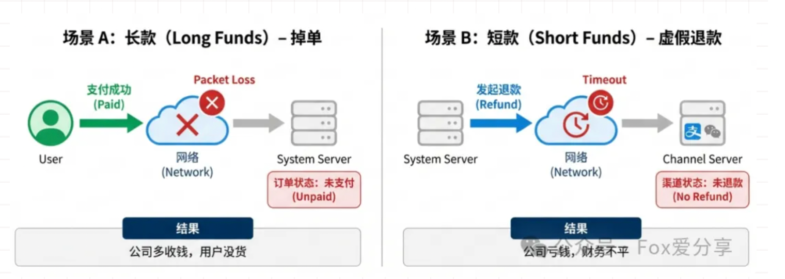

>> 场景 A（长款 - 掉单）： 用户在微信付了钱，微信回调你的系统，但你的网关挂了，没收到回调。结果： 微信有账，你没账。（公司多收了钱，用户没拿到货，导致客诉）
>>
>> 场景 B（短款 - 虚假退款）： 你发起了退款，你的系统把订单改成了“已退款”，但发给微信的退款请求超时了，其实没退成功。结果： 你有账，微信没账。（公司亏了钱，财务平不了账）

>> 代码写得再好，管不了网络超时。 所以，必须有一个独立的系统，在每天凌晨（T+1）把我们的账单和第三方的账单拉出来，逐笔 PK。
> >

> 二、 架构设计：标准对账四步走

>> 一个工业级的对账系统，核心流程只有四步：数据获取 -> 标准化 -> 比对 -> 差错处理。

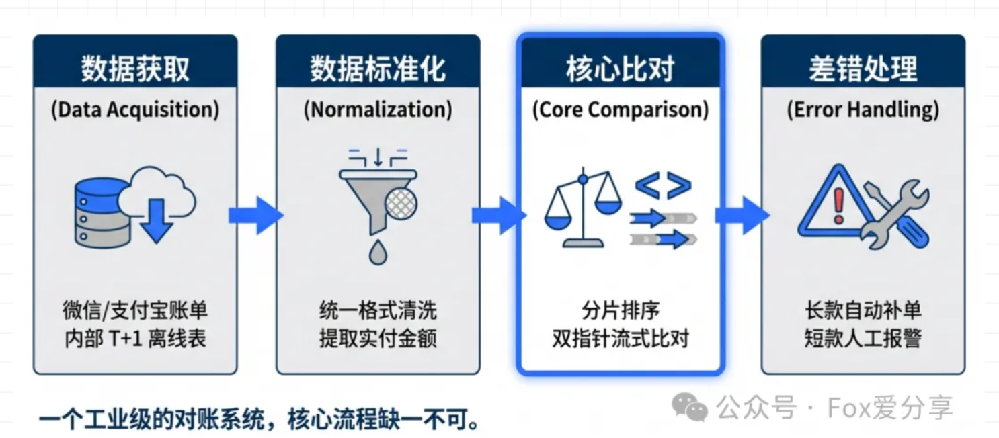

>> 1. 数据获取（File Download）
>> 支付宝/微信会在每天上午 9:00 生成前一天的对账单（CSV 或 Excel）

>> 坑点： 文件可能巨大（几百 MB 甚至 GB），且严禁直连生产主库（Master）拉取我方订单（会把线上交易拖垮）。
>>
>> 解法： 渠道账单使用流式读取（BufferedReader）；我方数据应读取 备库（Slave） 或 Hive 数仓 的 T+1 离线表

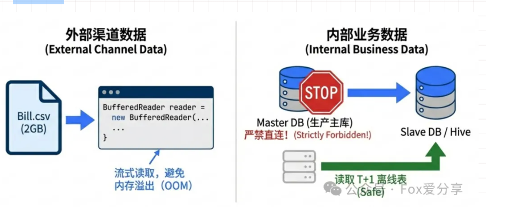

>> 2. 数据标准化（Normalization）

>> 外部数据千奇百怪，特别是“金额”的坑最大。
>>
> > 坑点： 你的订单是 100 元，用户用了 1 元红包，支付宝账单上写的是“实付 99 元”。直接比对会报错。

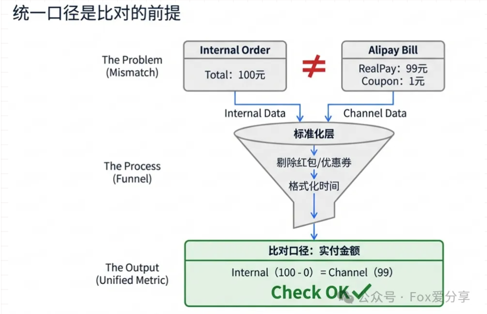

>> 解法： 清洗时必须统一口径，提取 “实付金额（Real Pay Amount）” 参与比对。

```
class StandardBill {
    String tradeNo;   // 渠道交易号
    String orderId;   // 我方订单号
    BigDecimal amount;// 实付金额（排除优惠券干扰）
    String status;    // SUCCESS / REFUND
    Date tradeTime;   // 交易时间
}
```

>> 3. 核心比对（Core Matching）

>> 这是对账的引擎。千万级数据不能傻傻地用 SQL Join，容易把数据库打挂
> >
> > 策略： 采用 “分片排序 + 双指针流式比对”（具体算法在下文“核心难点”章节详细拆解）
> >
> > 目标： 找出两边的差异——长款（渠道有，我方没有）和短款（我方有，渠道没有）
> >


>> 4. 差错处理（Exception Handling）
>> 比对出差异后，不能只报错，要分级处理：
> >
> > 自动平账： 针对“长款”（掉单），先校验库存，若正常则自动补单，将订单修正为“已支付”
> >
> > 缓冲复核： 针对“跨日差异”，放入缓冲池等待次日二次核对（详见下文“跨日对账”章节）。
> >
> > 人工介入： 针对“金额不一致”或“短款”，直接触发报警，由财务/运营人工介入。
> >

> 三、 核心难点：千万级数据怎么比？（流式比对）
> > 这是最关键的一步。面试官问的就是这里：两边都是 1000 万条数据，你怎么找出不一样的？

>> 土法（面试秒挂）：SELECT * FROM wechat_bills WHERE order_id NOT IN (SELECT id FROM my_orders)结果： 笛卡尔积运算，数据量一过百万，数据库 CPU 直接 100%，DBA 提刀来见。
> >
> > 分片 + 排序 + 双指针流式比对： 这其实利用了 MapReduce 的思想，完全不需要依赖数据库 Join
> >

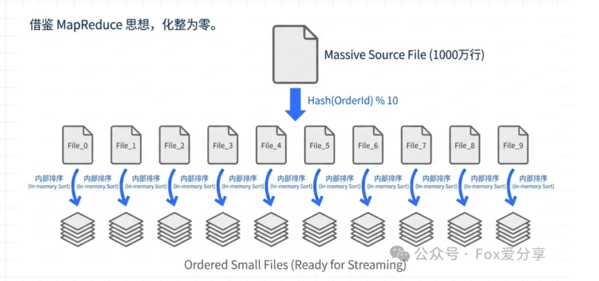

> > 1.分片（Sharding）： 将两边的单据按 orderId 哈希取模，切分为 10 个小文件（File_0 ~ File_9）
> >
>> 2.排序（Sorting）： 对每个小文件按 orderId 进行排序。
> >
> > 3.流式比对（Streaming）： 就像合并两个有序链表，内存消耗极低，速度极快。
> >

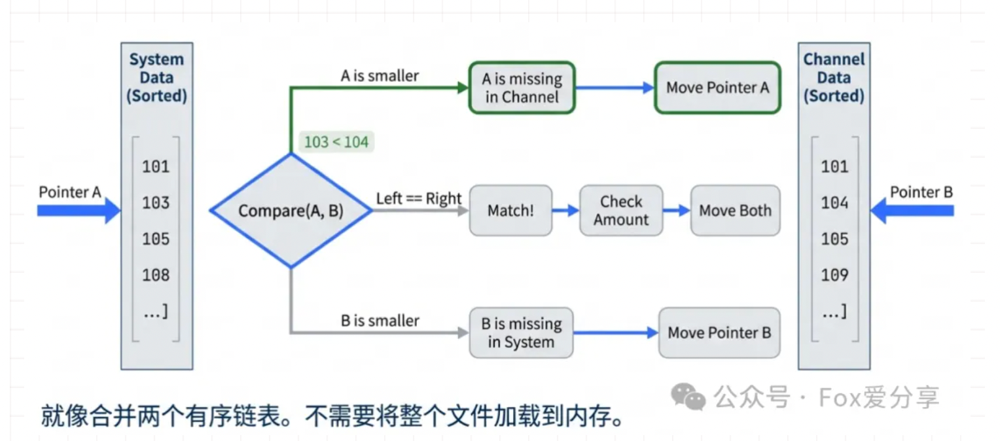

>> 注：虽然排序的复杂度是 O(N log N)，但相比 Join 的 O(N²)，性能提升巨大，且通过流式处理将内存占用控制在常量级。

>> 伪代码演示（双指针）：

```
// 两个游标，分别指向 我方账单(sys) 和 渠道账单(channel)
while (sysLog != null && channelLog != null) {
    // 1. ID 匹配：检查金额和状态
    if (sysLog.orderId.equals(channelLog.orderId)) {
        // 使用 compareTo 避免精度问题
        if (sysLog.amount.compareTo(channelLog.amount) != 0) {
            recordError("金额不一致", sysLog, channelLog);
        }
        sysLog = nextSys();
        channelLog = nextChannel();
    } 
        // 2. 我方 ID 小：说明我方有，渠道没有 -> 短款
    elseif (sysLog.orderId < channelLog.orderId) {
        recordError("平台单边账", sysLog, null);
        sysLog = nextSys();
    } 
        // 3. 渠道 ID 小：说明渠道有，我方没有 -> 长款
    else {
        // 【注意】这里不能直接报错！可能是跨日订单（见下文缓冲池）
        checkBufferOrRecordError("渠道单边账", null, channelLog);
        channelLog = nextChannel();
    }
}
```

>> 优势： 无论数据量是 1 千万还是 1 亿，服务器内存占用极低，稳如泰山。

> 四、 生产环境的“隐形杀手”：跨日对账（智能缓冲）

>> 面试官最喜欢问的坑来了
>>
> > “支付宝账单是按 00:00 切分的。如果用户在 23:59:59 支付，你的系统落库时间可能是次日 00:00:01。这时候 T+1 对账，两边日期对不上，会报错吗？
> >

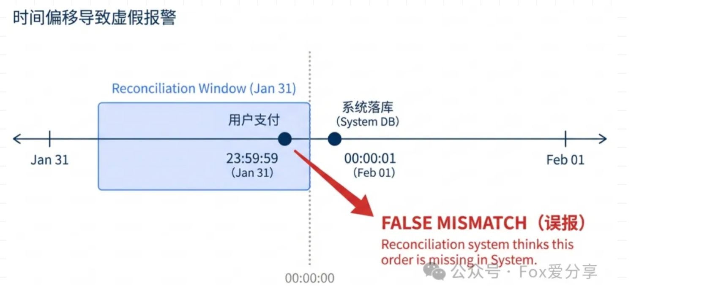

>> 这就是经典的“时间偏移（Time Skew）”问题。 如果你只拉 2 月 1 号的数据去比对，这笔订单会被误判为“差异帐”（渠道有，我方没有）
> >
> > 解决方案：宽表加载 + 智能缓冲池

> >>> 1. 加载阶段：宽表策略
> > > >
> > > > 从数仓/备库拉取数据时，往前推 5 分钟，往后推 5 分钟（即 1月31日 23:55 ~ 2月2日 00:05）。 这样能直接在内存里匹配上 99% 的跨日订单，避免不必要的报错。
> > > >
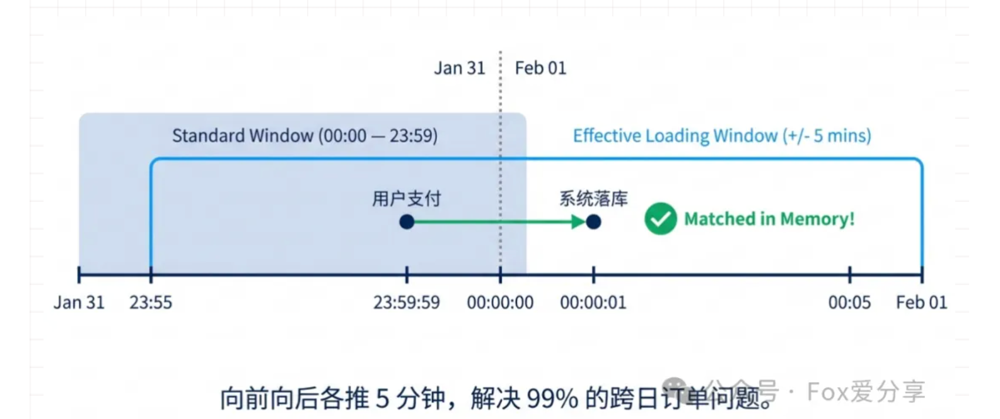

>>>> 2. 比对阶段：智能缓冲
> > > >
> > > > 如果还是没匹配上（比如渠道有，我方没有），不要立刻报警！要分情况讨论：
> > > >
> > > > 情况 A（边缘时间）： 交易时间在 23:55 ~ 00:05 之间。
> > > > 操作： 这大概率是跨日延迟，存入“缓冲池（Next Day Buffer）”。
> > > > 复核： 等明天对账（T+2）时，优先拿缓冲池的数据来比。如果匹配上，消除差异；如果两天还没匹配上，再报警
> > > >
> > > > 情况 B（非边缘时间）： 交易时间在 中午 12:00。
> > > >
> > > > 操作： 别缓冲了！这就是实锤的 Bug（掉单），立即报警，人工介入！
> > > >

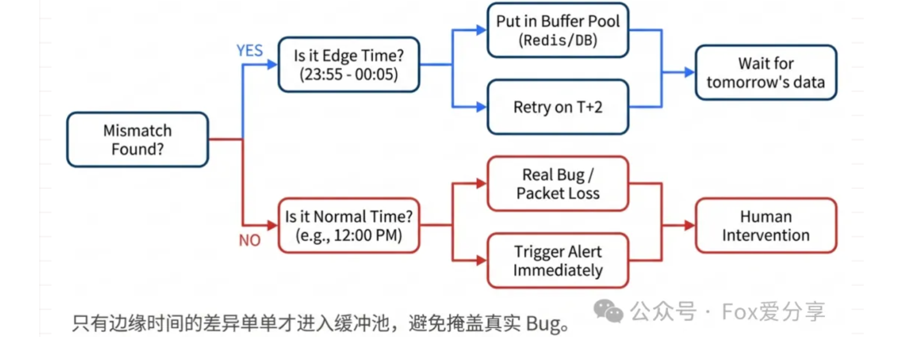

> 五、 面试标准回答模板（建议背诵）
> > 下次面试被问到：“怎么设计一个高可用的对账系统？”，请按这个逻辑回答
>> “面试官，对账系统是保证资金安全的最后一道防线。我的设计思路是 ‘全量 T+1 核对 + 智能缓冲机制’
>> >> 1.流程设计： 采用 ETL 架构。拉取渠道账单，结合 Hive 数仓 的内部订单，统一实付金额口径后进行比对。
> > > >
> > > > 2.性能优化： 针对千万级数据，我放弃了数据库 Join，而是采用 ‘分片排序 + 双指针流式比对’。虽然排序有成本，但内存占用极低，适合海量数据处理
> > > >
> > > > 3.难点攻克： 针对跨日问题，我采用了 ‘宽窗口加载 + 智能缓冲’ 策略。只有边缘时间的差异单才进入缓冲池等待次日复核，避免虚假报警
> > > >
> > > > 4.差错处理： 发现长款时，先校验库存和订单状态，再决定是否自动补单；发现短款直接报警。”

> 六、 架构视角的“降维打击”
>> 如果你想让面试官眼前一亮，最后可以补一句：
>>
> > 1. 实时准对账（Real-time Check）
>> “T+1 对账太慢了。对于高敏业务，我们还做了‘实时准对账’。利用 Flink 实时消费支付成功的 MQ 消息，和渠道的实时查询接口做抽样核对。能将 90% 的资损拦截在事故发生后的 5 分钟内。”

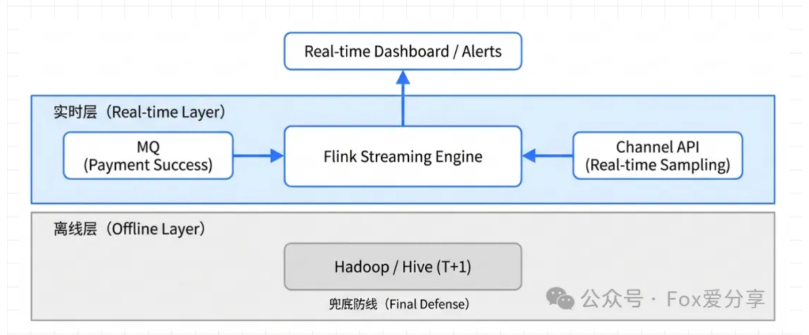

>> 2. 自动补单的“库存陷阱”
>> “很多系统做自动平账（长款补单）时会忽略库存。如果用户昨天中午付了钱，但库存已经被释放卖给别人了，此时绝对不能盲目改为已支付，否则会造成超卖。正确的逻辑是：先校验库存，有库存则补单，无库存则触发人工退款流程

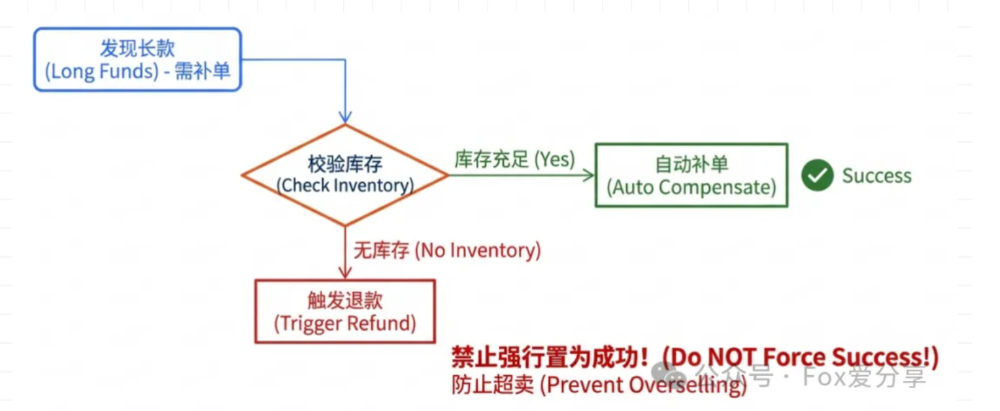

> 写在最后
>> 对账系统就像汽车的安全气囊。 平时你感觉不到它的存在，老板也觉得它不产生 GMV。 但当生产环境真的出现“金额不一致”或“支付渠道故障”时，它是唯一能救你命（和救公司钱）的东西。

> > 敬畏每一行代码，特别是和钱有关的那一行。


