### 扛住每秒10W+数据冲击，实时对账系统的设计与实践

> 背景
>> 随着业务发展，货拉拉资金交易规模日渐增长，日单量峰值超百万级，在线系统超过500个。这样的交易量采用传统的对账方式，很难在短时间内完成对账操作。  
> > 并且在复杂的系统交互中由于微服务间数据不一致或者业务逻辑问题导致的资损问题频发。且资损问题存在隐蔽性强，难以主动发现，难以实时洞察的特点，事后发现问题很难补救。  
> > 因此我们急需实时对账平台，主动实时发现资损问题，实现更健壮可靠的资金履约

>> 分布式系统问题
>> 分布式系统无法在保证了可用性（Availability）和分区容忍性（Partition）之后，很难保证强一致性（Consistency）
> >
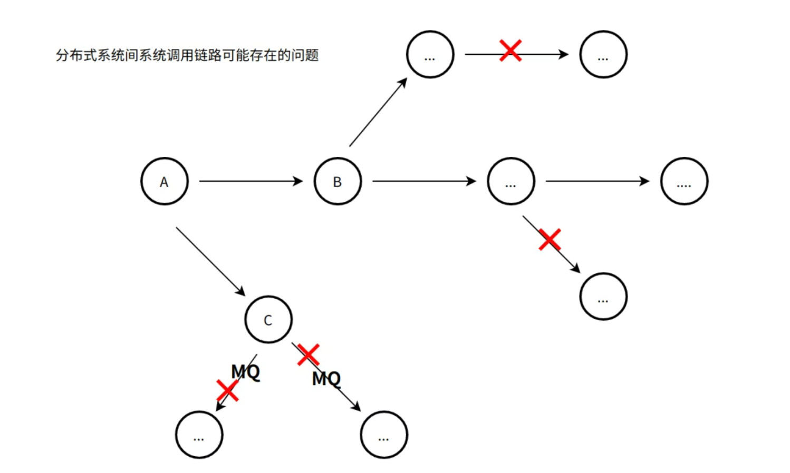

>> 分布式系统之间的网络调用必然存在着长或短的数据不一致问题。并且系统调用过程的数据合理性，准确性也是影响资金流转的重要因素，有可能产生错账的实时场景众多，根据对历史资损事故分析，总结下来有以下几个大类：

>>>> 上下游一致
> > > >
> > > > 上下游幂等
> > > >
> > > > 配置合理性
> > > >
> > > > 单据状态准确性
> > > >
> > > > 业务规则合理性

>> 这几类问题任何一项发生都可能带来不可逆转的业务问题或者资损。实时发现并处理这些问题至关重要

- 一、方案
>  1、设计思路
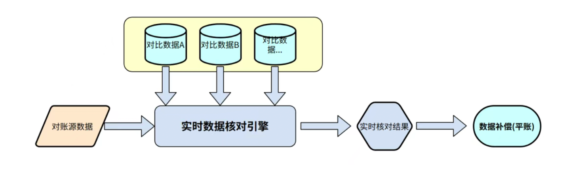

>> 根据对以上问题的分析，凡资损问题一定伴随着数据的“错”与“乱”，因此我们从数据本源入手，将实时源数据与对比数据进行核对，或者逻辑处理，判定源数据的准确定与合理性。  
> > 且在资金流转的各节点，各中间数据均可成为“源数据”，秉承凡数据皆可核对的理念进行实时对账系统的构建

>> 中间件分区容错
>> 构建实时对账系统将要面临的是公司所有资金相关的实时数据流，数据规模可达每秒几十万甚至上百万。并且系统面向的对象是各领域的开发人员，承载各个系统的对账逻辑，平台的安全性与易用性也将面临巨大挑战。总结下来难点主要有以下几点：

>> 难点一：海量实时数据吞吐量问题。
>> 海量数据带来的冲击的不仅是对账平台，还有对账平台依赖的中间件，云资源，对比数据源，第三方接口等，为了提高系统可用性，需要对所有依赖资源进行加固或者保护

>> 解决方案：
>> 对依赖的中间件进行分区容错，通过动态热分区的方式将风险转移
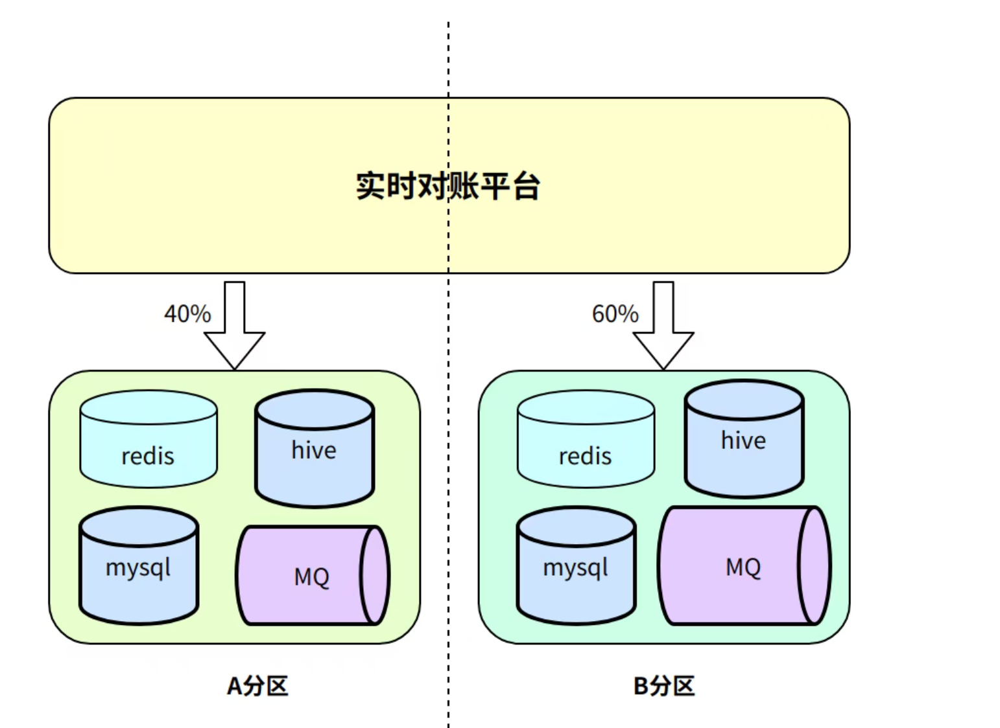

>> 高吞吐量数据池化，可将对比数据源进行池化复用，大大降低第三方数据的查询量，降低对三方系统的压力

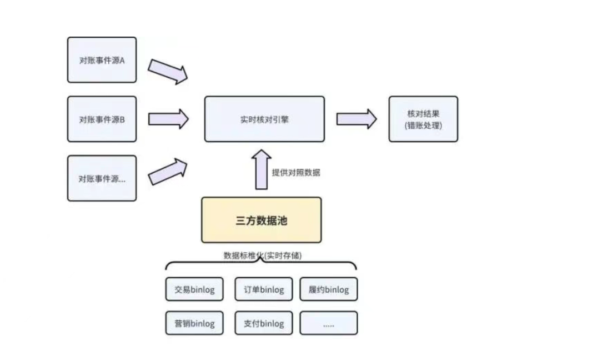

>> 动态自适应集群
>> 难点二：算力资源平衡分配与利用问题
>> 平台面对的是每秒数十万的数据，数百个数据源事件，每个事件源数据量不同，数千个实时对账任务，每个对账任务需要的算力不同，将充足的算力资源分配到各个实时对账任务才能保证对账任务执行的实时性。
>> 并且对于高优的对账任务要有高优的资源保障，“将鸡蛋放到不同的篮子”才能保障平台的高可用
>> 动态集群划拨，将云资源划拨到不同的集群，每个集群负责指定的对账任务，且集群具备动态调整能力，对于高优集群给予高优资源保障
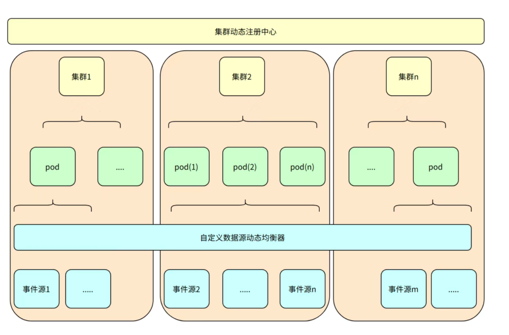

>> 集群内加权负载均衡，通过定时计算各个脚本的算力需求，将对账事件源与算力之间进行重平衡，保证集群内每个云资源节点负载相近，避免过度压榨或过度浪费

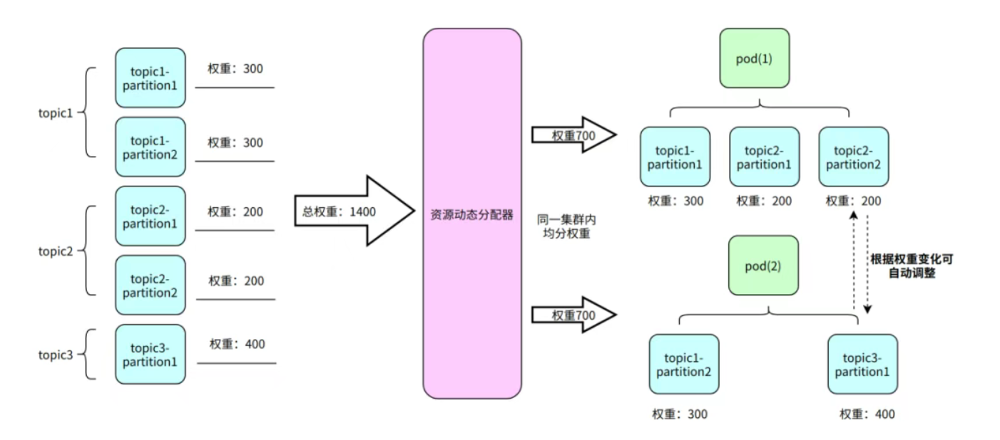

>> 集群算力buffer预留，结合HPA策略，在每个子集群预留算力buffer，当流量突增造成算力不足，HPA扩容的机器根据优先级自动分配到高优集群，自动补充算力不足的集群

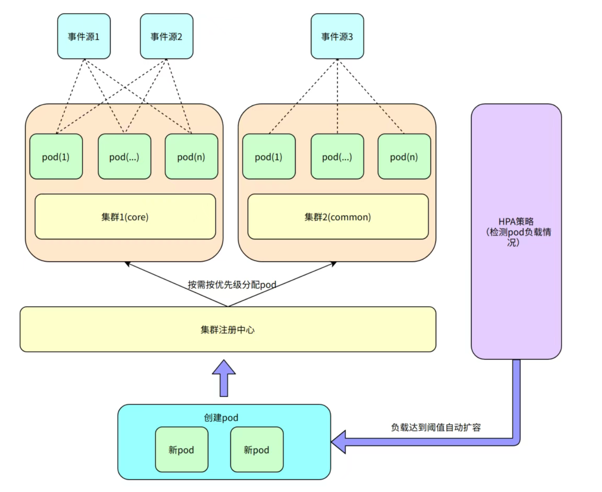

>> 系统安全性保障
>> 难点三：平台与相关系统安全性问题。

>> 平台在面对线上流量时存在很大的不确定性，突发的流量高峰会对系统与相关依赖造成不必要冲击。用户在进行对账任务开发时，错误的任务脚本也会对平台造成冲击因此需要强有力的安全性保障，提高系统可用性

>> 流量过载保护，在进行对账事件源处理，对账任务执行，查询三方数据过程中进行逐级限流，对线上系统做兜底保护

>> 异常任务自动熔断，异常线程可查杀，系统可自愈，可监控。系统可以根据对账任务成功率进行对账任务自动熔断，同时对账相关数据自动录制，恢复后可重新进行数据回放，重新核对，保证重要对账任务数据不丢失

>> 对账任务之间线程池隔离，防止任务之间资源挤兑，对账任务之间相互影响

>> 对账任务编译时非法语法识别，禁止在平台使用高危语句

> 2、对账流程

>> 实时对账系统核心流程可以分为三大节点：事件接入，数据核对，结果处理，接下来将介绍每个节点的详细设计

>> 2.1 事件接入

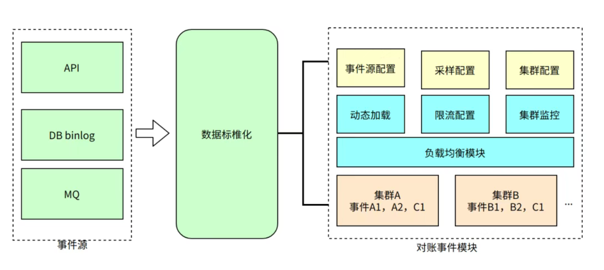

>> 事件接入可以根据业务特点选择接入方式，支持DBbinlog，MQ消息与API方式进行接入，所有接入形式都采用配置化，方便快捷
> >
>> 支持事件采样率设置，灰度放量
> >
>> 支持限流配置，保护线上数据源。
> >
> > 重写了MQ动态加载策略以及rebalance策略，使得配置数据可以动态生效。
> >
> > 动态集群划拨能力，支持不同对账事件物理资源隔离
> >
> > 集群内动态资源平衡，根据对账脚本负载划拨资源数量，使同集群内资源合理利用

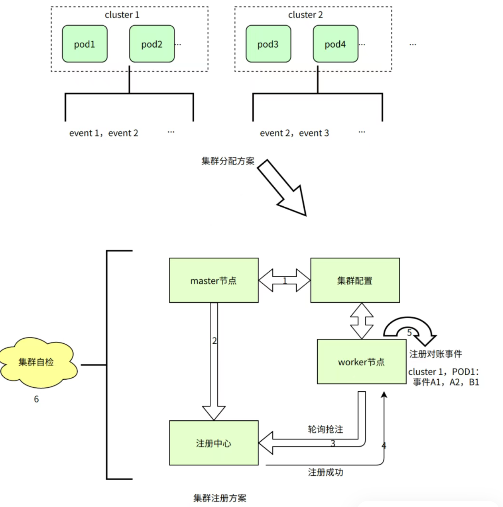

>> 2.2 数据核对
>>
> > 数据核对是实时对账的核心流程，事件数据经过配置解析，路由分发到对应的对账引擎与延时中心，经过过滤脚本过滤无效信息，最终流转到对账脚本执行引擎。  
> > 执行引擎可以调用公共函数，三方数据源获取对比数据，最终按照脚本进行核对，核对结果流转到结果处理模块

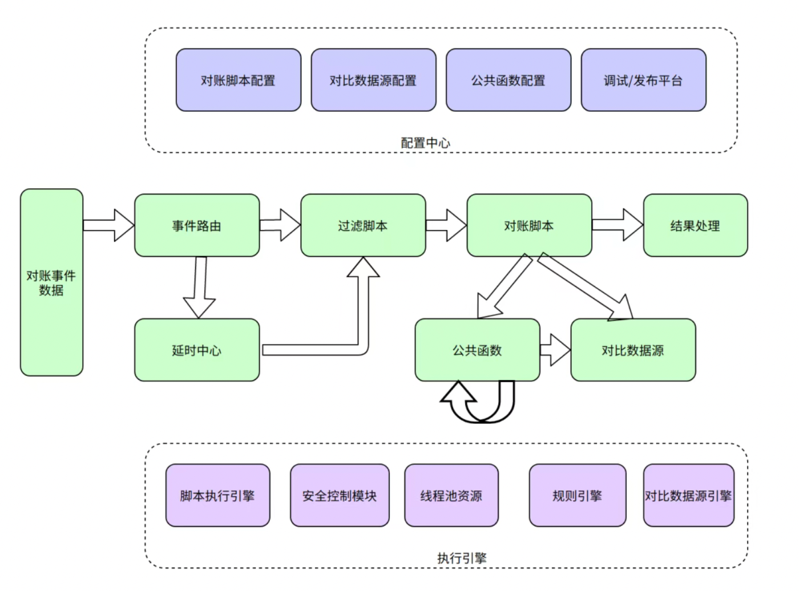

>> grovy脚本语言配置事件过滤，数据核对，配置灵活
> >
> > 支持对比数据源配置化接入，支持泛化RPC调用与对账数据池调用
> >
> > 支持公共函数编写与配置，减少重复代码开发
> >
> > 支持在线调试、草稿箱、热部署、一键回滚、一键多环境拷贝
> >
> > 支持延迟对账。
> >
> > 安全管控，支持脚本黑名单，脚本异常熔断

>> 2.3 结果处理
>> 对账结果处理是实时对账流程的最后一个节点，核心对账结果可进行自主打标，持久化，使核心对账数据轨迹可追踪。完整展现一条数据完整的对账链路与生命周期。错账结果的需要有以下几种处理措施

>>>> 错账数据，中间对账流程持久化，错误原因可追溯
> > > >
> > > > 错账支持自动重试平账，消除因系统问题带来的噪声
> > > >
> > > > 错账数据分级告警，降噪
> > > >
> > > > 错账重放，即支持批量手动差错处理
> > > >
> > > > 错账支持与线上系统联动，主动线上平账，或根据业务阻断流程
> > > >
>>>> 除此之外，实时对账结果可以帮助业务系统发现自身不足，做出系统健康度与数据健康度评价

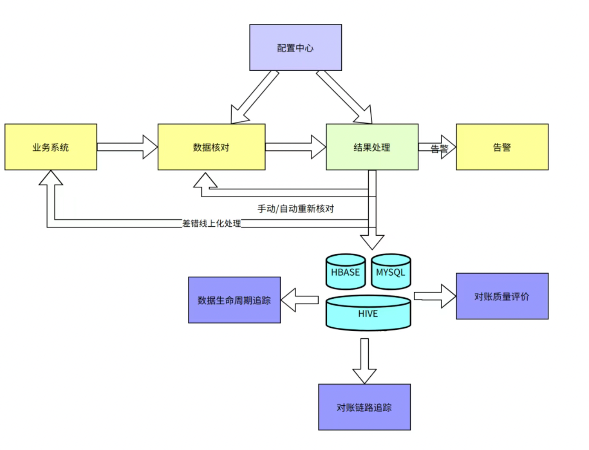

> 3 总体方案设计
> 实时对账系统总体设计方案如下：

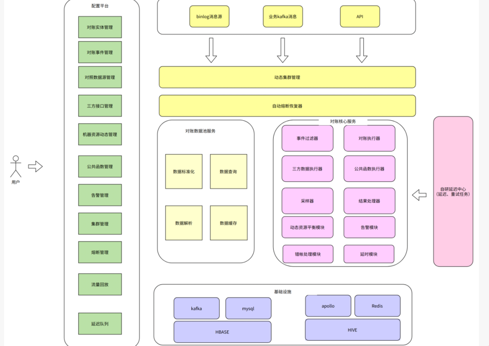

>> 配置平台负责在线配置，调试，发布，集群管理，同时也作为master节点负责集群分配与集群自检
> >
> > 对账数据池负责对比数据配置解析，数据标准化，解析，缓存与查询，负责海量三方数据池化处理
> >
> > 对账核心服务是实时核对平台的核心引擎，负责对账事件核对，延迟，重试，结果处理等，最终将结果数据持久化，同时核心服务作为worker节点，根据配置平台进行自主集群划分，做到对账事件物理资源隔离，对账脚本线程池隔离

### 二、使用情况

>> 接入算盘的领域覆盖交易，计价，支付，履约，营销，会员等全业务场景
> >
> > 目前共接入对账消息源491个，峰值数据吞吐量8W+TPS
> >
> > 目前共接入对照消息源124个，峰值数据吞吐量2W+TPS
> >
> > 在线对账脚本数840+，峰值对账任务20W+QPS
> >
> > 延时对账6K+ QPS
> >
> > 目前在线用户自定义公共函数超过160个
> >
> > 目前动态管理6个分区集群，可实时扩展
> >
> > 自定义配置外部接口440+个
> >
> > 帮助资金内控专项实现司机D+0自动提现
> >

> 结语:
>> 经过两年多的建设，我们从0-1建设了货拉拉实时对账系统（算盘），实现了秒级对账能力，填补了货拉拉在此领域的空白。
> >
> > 在功能性，易用性，稳定性上可以对标互联网大厂，数据吞吐方面我们可以按需扩充集群资源，扛住每秒10万+数据冲击。
> >
> > 我们会不断提升系统能力，与业务方携手共建，打造货拉拉资金安全屏障

