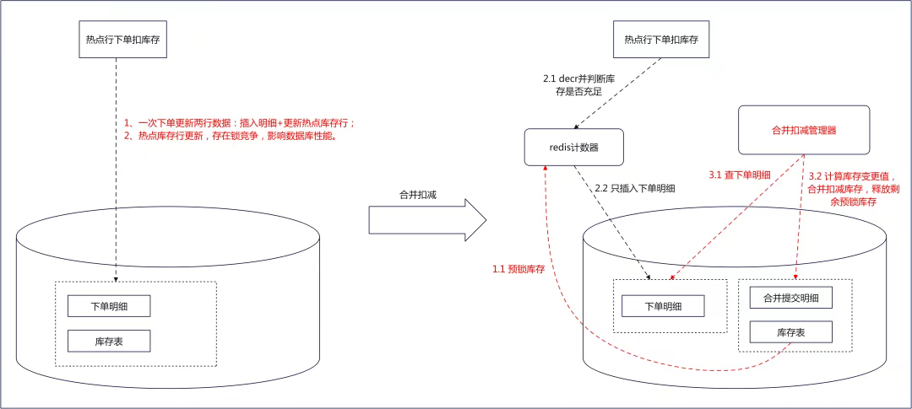
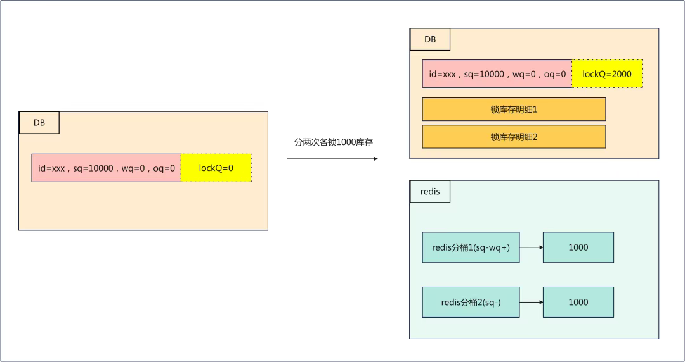
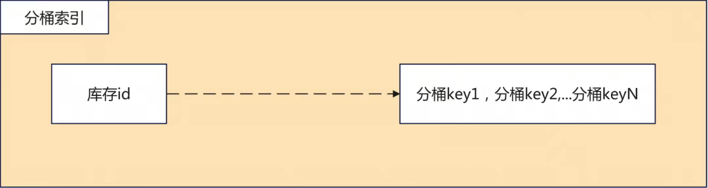
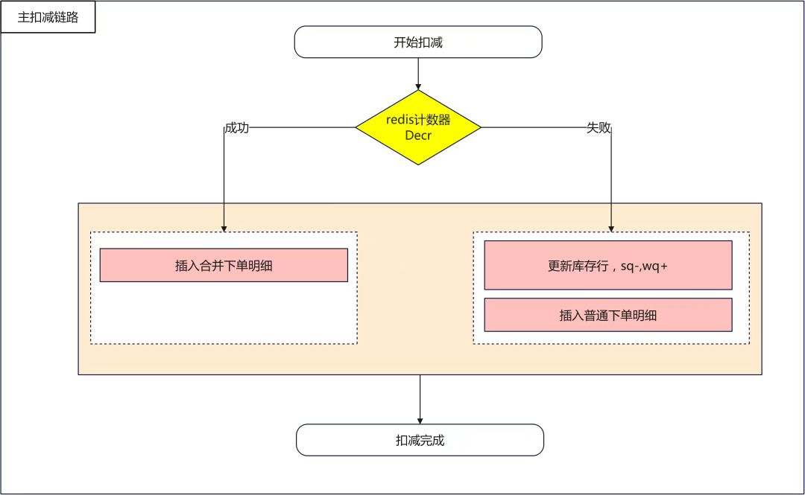
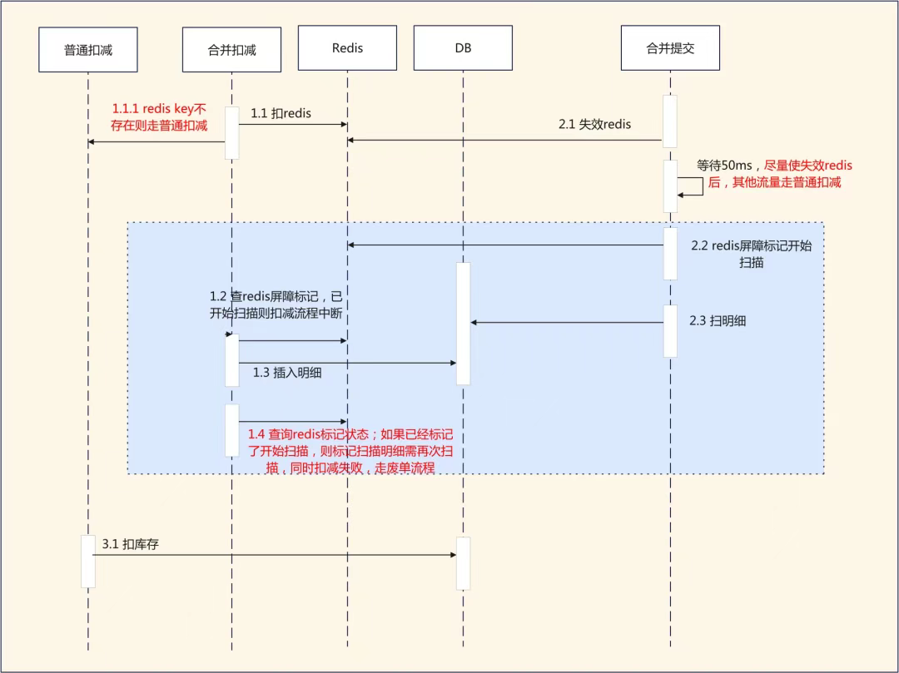

# 库存合并扣减：一种基于分布式缓存的强一致性热点库存扣减方案

> 1.前言

>> 本文主要介绍了针对热点深库存下单抢购场景，库存团队设计并实现的一种基于Redis分桶扣减计数和合并提交扣减DB的方案；  
> > 该方案基于分布式缓存实现，但也能做到不超卖不少卖，在保证扣减强一致性的同时，也提升了库存热点扣减TPS和扣减稳定性。

> 2.背景介绍

>> 自库存团队成立以来，随着业务的不断发展，库存扣减性能优化一直是库存团队不断面临的挑战；  
> > 近几年，库存和数据库团队一起，从数据库内核优化、到应用层优化、再到扣减架构升级，持续的提升库存DB扣减的性能。  
> > 在前述优化的基础上，库存数据库的整体性能得到了很好的提升。然而随着直播业务的发展，热点扣减的场景越来越频繁，  
> > 对于深库存热点扣减的场景，日常我们只能通过限流的方式来保护DB，库存合并扣减就是在这样的背景下提出的，我们希望继续优化热点扣减的性能，使库存扣减不成为热点下单链路的瓶颈所在

> 3.方案调研

>> 传统的提高热点扣减的方案都是通过分布式缓存实现，该类方案通过将库存从 MySQL 划分到多个Redis分桶，扣减的时候直接走Redis进行扣减，分析此类方案，我们会发现

> > 1. 该类基于缓存的扣减方案确实能够大幅提升扣减的性能

>> 2.但是这个库存扣减方案在实际应用中也会存在一些问题：

> > 2.1 无法避免库存少卖：针对Redis失败（如超时）的场景，应用层实际并不知道Redis库存是操作成功还是操作失败。  
> > 为了避免库存超卖，对于扣减超时的场景，应用层只能默认当做失败处理；对于库存回补的场景，应用层只能默认当做成功处理。此时整体是业务有损的，所以Redis分桶扣减方案一般是用在卖家限购、权益这类非实物类库存扣减的场景，这类场景业务接受少卖

>> 2.2 对于稍微复杂的库存扣减模型无法支持：Redis库存扣减方案中使用incr和decr实现库存的加减，利用lowBound防止库存减到负数，  
> > value即是剩余的库存数量；这个方案只支持库存记录仅包含一个数值的库存模式， 对于sq- 同时wq+ 这种模式无法支持

>> 2.3 库存扣减完全依赖Redis：当前扣减方案需要强保障Redis的稳定性，如果Redis异常则整个扣减链路异常

>> 我们想利用Redis提升扣减性能，但是我们的库存扣减模型相对更加复杂、同时我们的业务场景对于库存数据准确性要求更高，绝对不允许超卖少卖；传统的基于redis分桶扣减的方案并不完全适合我们的业务场景

> 4.合并扣减方案

>> 介绍合并扣减详细方案之前，先简单说明下库存域的几个基本概念，方便大家更好理解后续的内容。

>> 4.1 库存核心字段：
>> 可售库存：sq，实际可售的库存数量；

> > 预扣库存：wq，用户下单后，库存sq转向wq；

>> 占用库存：oq，货品仓库存模式，付款之后，库存从wq转向oq。

>> 4.2  库存扣减明细（也叫单据）：是库存扣减的快照，明细是不可或缺的。明细的作用:

>> 记录扣减信息：下单是交易会告诉我们扣多少库存，后续付款或者订单取消时，上游不用关心库存的回补数量，库存内部从明细恢复；

>> 用于分布式系统交互过程中的幂等实现：同一个单据调了两次扣减；单据回补超时，重试可幂等

>> 负责库存扣减生命周期状态流转

> 5.整体思路

>> 我们既想利用分布式缓存（Redis）提升扣减性能，但同时又不能直接依赖Redis作为库存存储介质；  
>> 因此我们的方案里面，Redis只用来做扣减计数以防止超卖，实际扣减是否成功以库存扣减明细为准。 整体思路如下

>> 1. DB行的库存提前预留（锁）一部分，锁的这个库存还在DB行上，同时也初始化到redis里面用于扣减计数；

>> 2. 合并扣减下单过程中，先扣减redis库存，redis库存够扣的情况下，再往DB插入扣减明细，明细插入成功最终才算扣减成功

>> 3. 应用层的合并扣减管理模块，热点下单延迟1s后，通过扫描扣减明细，计算实际应该扣减的数量，一次提交库存变更到DB

- 锁库存模块

>> 1. 锁库存模块将DB行库存从sq字段（可售）锁到lq字段（预锁库存），同时锁库存单据

>> 2.锁库存核心实现，不是通过将sq减去然后加到lq，而是sq不动，锁库存直接加到lq；DB扣减时通过 where sq-lq>0 控制最终sq的数量不能小于lq。  
> > 这个设计使得锁库存之后，库存展示链路完全不受影响，查询可售库存时也完全不需要关心锁的库存值，大大的降低整个链路上的复杂性，这是一个非常重要的设计

>> 3. 每次锁定的lq数量，初始化到Redis里进行扣减计数。

>> 多个redis分桶通过redis分桶缓存进行索引：

> 下单扣减模块

>> 先扣redis分桶库存，成功则继续插入DB明细；失败则兼容走老的DB扣减流程：

> 合并提交模块

>> 1. 先失效合并提交对应的redis分桶，防止后续继续有交易流量扣减此redis分桶

>> 2. 根据分桶key扫描此分桶关联的所有扣减明细，计算库存扣减数量，合并扣减DB
>>>> 实际Redis分桶扣减的库存数量，以合并下单明细为准，通过扫描明细上的扣减库存总和得到

>>>> 这里我们针对数据库明细表，设计了覆盖索引（invId，lockOrderId，quantity），  
> > > > 通过sum(quantity) 走索引就能直接得到每个Redis分桶实际扣减的库存；压测和线上效果都表明，此扫描单据的SQL对DB热点扣减的性能影响非常小

> 自动锁库存模块

>> 通过热点识别能力，感知交易相关系统的热点品库存查询，提前将满足条件的商品库存进行自动锁库存；  
> > 只要一开始提前锁了任意数量的库存，后续下单扣减过程中，则会继续自动触发锁库存

> 性能优化效果

>> 接下来我们看下合并扣减的效果：

- 压测效果
>> 从压测效果上看，单行热点扣减场景下，非合并扣减tps峰值约1.4w，合并扣减峰值3.2w；整体提升1倍以上扣减性能（实际线上场景，由于入口做了限流，所以线上达不到压测的流量峰值）

