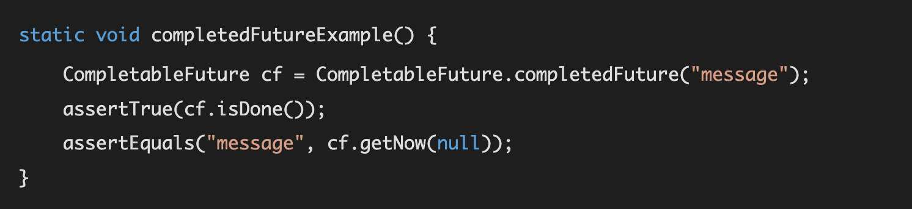
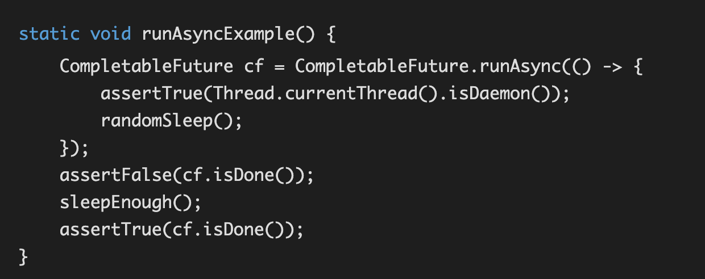
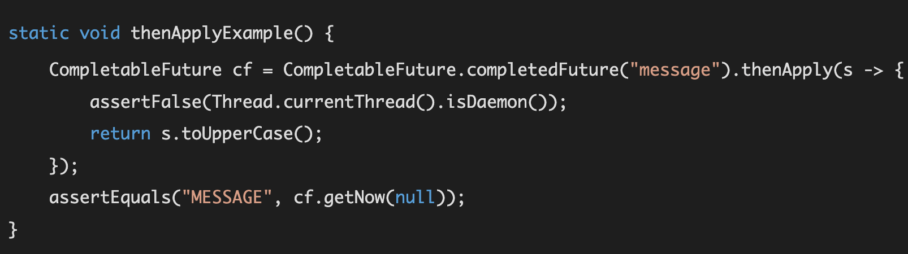
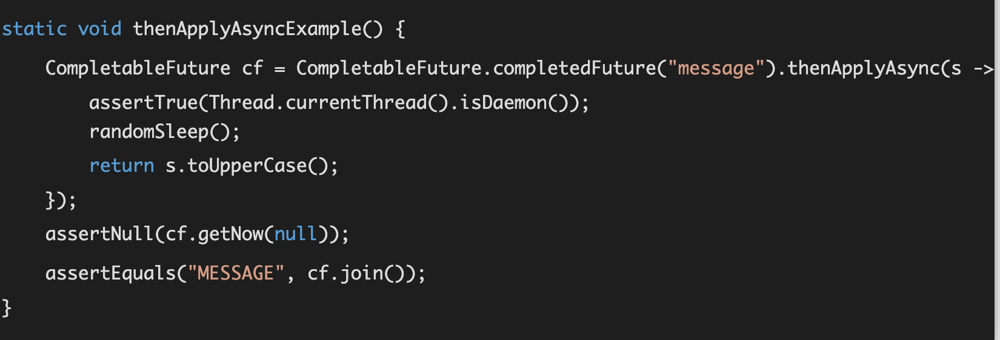
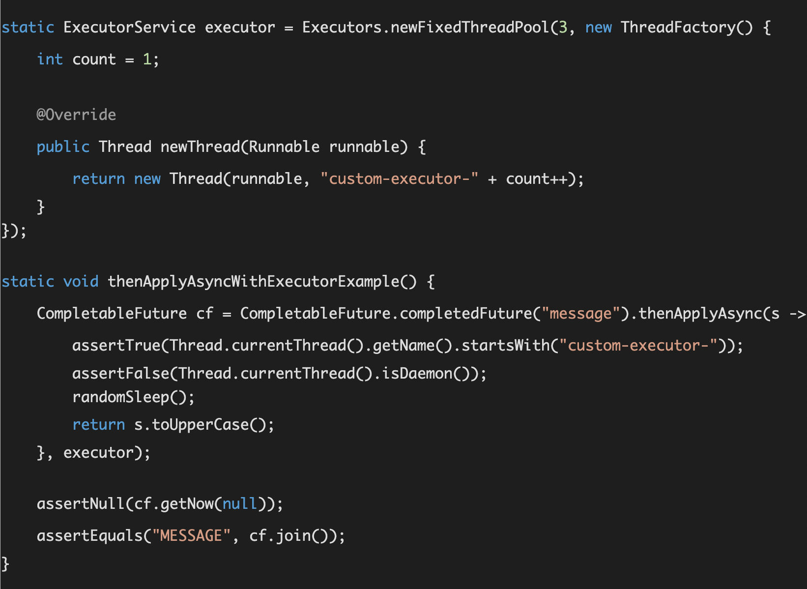
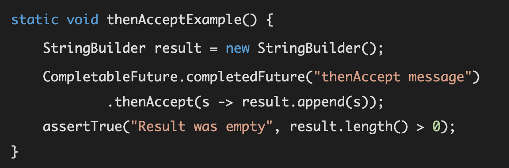

### 1.创建一个完成的CompletableFuture
>>  CompletableFuture类实现了CompletionStage接口，首先我们需要理解这个接口的契约。  
> > 它代表了一个特定的计算的阶段，可以同步或者异步的被完成。你可以把它看成一个计算流水线上的一个单元，最终会产生一个最终结果，  
> > 这意味着几个CompletionStage可以串联起来，一个完成的阶段可以触发下一阶段的执行，接着触发下一次
> > 除了实现CompletionStage接口， CompletableFuture也实现了future接口, 代表一个未完成的异步事件。  
> > CompletableFuture提供了方法，能够显式地完成这个future,所以它叫CompletableFuture



>> getNow(null)方法在future完成的情况下会返回结果，就比如上面这个例子，否则返回null (传入的参数)

### 2.运行一个简单的异步阶段


>> CompletableFuture的方法如果以Async结尾，它会异步的执行(没有指定executor的情况下)， 异步执行通过ForkJoinPool实现， 它使用守护线程去执行任务。  
> > 注意这是CompletableFuture的特性， 其它CompletionStage可以override这个默认的行为

### 3.在前一个阶段上应用函数
>> 下面这个例子使用前面 #1 的完成的CompletableFuture，
> > #1返回结果为字符串message,然后应用一个函数把它变成大写字母


>> 注意thenApply方法名称代表的行为, then意味着这个阶段的动作发生当前的阶段正常完成之后。本例中，当前节点完成，返回字符串message
> > Apply意味着返回的阶段将会对结果前一阶段的结果应用一个函数, 函数的执行会被阻塞 ，这意味着getNow()只有打斜操作被完成后才返回


### 4.在前一个阶段上异步应用函数
>> 通过调用异步方法(方法后边加Async后缀)，串联起来的CompletableFuture可以异步地执行（使用ForkJoinPool.commonPool()



### 5.使用定制的Executor在前一个阶段上异步应用函数
>> 异步方法一个非常有用的特性就是能够提供一个Executor来异步地执行CompletableFuture。这个例子演示了如何使用一个固定大小的线程池来应用大写函数



### 6.消费前一阶段的结果
>> 如果下一阶段接收了当前阶段的结果，但是在计算的时候不需要返回值(它的返回类型是void)， 那么它可以不应用一个函数，而是一个消费者， 调用方法也变成了thenAccept


>> 本例中消费者同步地执行，所以我们不需要在CompletableFuture调用join方法

### 7.异步地消费迁移阶段的结果
>> 同样，可以使用thenAcceptAsync方法， 串联的CompletableFuture可以异步地执行


### 8.完成计算异常
>> 现在我们来看一下异步操作如何显式地返回异常，用来指示计算失败。我们简化这个例子，操作处理一个字符串，把它转换成答谢，我们模拟延迟一秒。

>> 我们使用thenApplyAsync(Function, Executor)方法，第一个参数传入大写函数， executor是一个delayed executor,在执行前会延迟一秒

```
static void completeExceptionallyExample() {
    CompletableFuture cf = CompletableFuture.completedFuture("message").thenApplyAsync(String::toUpperCase,
            CompletableFuture.delayedExecutor(1, TimeUnit.SECONDS));
    CompletableFuture exceptionHandler = cf.handle((s, th) -> { return (th != null) ? "message upon cancel" : ""; });
    cf.completeExceptionally(new RuntimeException("completed exceptionally"));
assertTrue("Was not completed exceptionally", cf.isCompletedExceptionally());
    try {
        cf.join();
        fail("Should have thrown an exception");
    } catch(CompletionException ex) { // just for testing
        assertEquals("completed exceptionally", ex.getCause().getMessage());
    }

    assertEquals("message upon cancel", exceptionHandler.join());
}
```

### 9.取消计算
>> 和完成异常类似，我们可以调用cancel(boolean mayInterruptIfRunning)取消计算。对于CompletableFuture类，布尔参数并没有被使用，  
> > 这是因为它并没有使用中断去取消操作， 相反，cancel等价于completeExceptionally(new CancellationException())
```java
static void cancelExample() {
    CompletableFuture cf = CompletableFuture.completedFuture("message").thenApplyAsync(String::toUpperCase,
            CompletableFuture.delayedExecutor(1, TimeUnit.SECONDS));
    CompletableFuture cf2 = cf.exceptionally(throwable -> "canceled message");
    assertTrue("Was not canceled", cf.cancel(true));
    assertTrue("Was not completed exceptionally", cf.isCompletedExceptionally());
    assertEquals("canceled message", cf2.join());
} 
```

### 10、在两个完成的阶段其中之一上应用函数
>> 下面的例子创建了CompletableFuture, applyToEither处理两个阶段， 在其中之一上应用函数(包保证哪一个被执行)。  
> > 本例中的两个阶段一个是应用大写转换在原始的字符串上， 另一个阶段是应用小些转换
```
static void applyToEitherExample() {
    String original = "Message";
    CompletableFuture cf1 = CompletableFuture.completedFuture(original)
            .thenApplyAsync(s -> delayedUpperCase(s));
    CompletableFuture cf2 = cf1.applyToEither(
            CompletableFuture.completedFuture(original).thenApplyAsync(s -> delayedLowerCase(s)),
            s -> s + " from applyToEither");
    assertTrue(cf2.join().endsWith(" from applyToEither"));
}
```

### 11、在两个完成的阶段其中之一上调用消费函数
>> 和前一个例子很类似了，只不过我们调用的是消费者函数 (Function变成Consumer)
```
static void acceptEitherExample() {
    String original = "Message";
    StringBuilder result = new StringBuilder();
    CompletableFuture cf = CompletableFuture.completedFuture(original)
            .thenApplyAsync(s -> delayedUpperCase(s))
            .acceptEither(CompletableFuture.completedFuture(original).thenApplyAsync(s -> delayedLowerCase(s)),
                    s -> result.append(s).append("acceptEither"));
    cf.join();
    assertTrue("Result was empty", result.toString().endsWith("acceptEither"));
}
```
### 12、在两个阶段都执行完后运行一个 Runnable
>> 这个例子演示了依赖的CompletableFuture如果等待两个阶段完成后执行了一个Runnable。  
> > 注意下面所有的阶段都是同步执行的，第一个阶段执行大写转换，第二个阶段执行小写转换
```
static void runAfterBothExample() {
    String original = "Message";
    StringBuilder result = new StringBuilder();
    CompletableFuture.completedFuture(original).thenApply(String::toUpperCase).runAfterBoth(
            CompletableFuture.completedFuture(original).thenApply(String::toLowerCase),
            () -> result.append("done"));
    assertTrue("Result was empty", result.length() > 0);
```


### 13、 使用BiConsumer处理两个阶段的结果
>> 上面的例子还可以通过BiConsumer来实现:
```
static void thenAcceptBothExample() {
    String original = "Message";
    StringBuilder result = new StringBuilder();
    CompletableFuture.completedFuture(original).thenApply(String::toUpperCase).thenAcceptBoth(
            CompletableFuture.completedFuture(original).thenApply(String::toLowerCase),
            (s1, s2) -> result.append(s1 + s2));
    assertEquals("MESSAGEmessage", result.toString());
}
```

### 14、使用BiFunction处理两个阶段的结果
>> 如果CompletableFuture依赖两个前面阶段的结果， 它复合两个阶段的结果再返回一个结果，我们就可以使用thenCombine()函数。  
> > 整个流水线是同步的，所以getNow()会得到最终的结果，它把大写和小写字符串连接起来
```
static void thenCombineExample() {
    String original = "Message";
    CompletableFuture cf = CompletableFuture.completedFuture(original).thenApply(s -> delayedUpperCase(s))
            .thenCombine(CompletableFuture.completedFuture(original).thenApply(s -> delayedLowerCase(s)),
                    (s1, s2) -> s1 + s2);
    assertEquals("MESSAGEmessage", cf.getNow(null));
}
```

### 15、异步使用BiFunction处理两个阶段的结果
>> 类似上面的例子，但是有一点不同： 依赖的前两个阶段异步地执行，所以thenCombine()也异步地执行，即时它没有Async后缀。

```
static void thenCombineAsyncExample() {
    String original = "Message";
    CompletableFuture cf = CompletableFuture.completedFuture(original)
            .thenApplyAsync(s -> delayedUpperCase(s))
            .thenCombine(CompletableFuture.completedFuture(original).thenApplyAsync(s -> delayedLowerCase(s)),
                    (s1, s2) -> s1 + s2);
    assertEquals("MESSAGEmessage", cf.join());
}
```


### 16、组合 CompletableFuture
>> 我们可以使用thenCompose()完成上面两个例子。这个方法等待第一个阶段的完成(大写转换)，  
> > 它的结果传给一个指定的返回CompletableFuture函数，它的结果就是返回的CompletableFuture的结果
```
static void thenComposeExample() {
    String original = "Message";
    CompletableFuture cf = CompletableFuture.completedFuture(original).thenApply(s -> delayedUpperCase(s))
            .thenCompose(upper -> CompletableFuture.completedFuture(original).thenApply(s -> delayedLowerCase(s))
                    .thenApply(s -> upper + s));
    assertEquals("MESSAGEmessage", cf.join());
}
```
### 17、当几个阶段中的一个完成，创建一个完成的阶段
>> 下面的例子演示了当任意一个CompletableFuture完成后， 创建一个完成的CompletableFuture.
>> 待处理的阶段首先创建， 每个阶段都是转换一个字符串为大写。因为本例中这些阶段都是同步地执行(thenApply),  
> > 从anyOf中创建的CompletableFuture会立即完成，这样所有的阶段都已完成，我们使用whenComplete(BiConsumer<? super Object, ? super Throwable> action)处理完成的结果

```
static void anyOfExample() {
    StringBuilder result = new StringBuilder();
    List messages = Arrays.asList("a", "b", "c");
    List<CompletableFuture> futures = messages.stream()
            .map(msg -> CompletableFuture.completedFuture(msg).thenApply(s -> delayedUpperCase(s)))
            .collect(Collectors.toList());
    CompletableFuture.anyOf(futures.toArray(new CompletableFuture[futures.size()])).whenComplete((res, th) -> {
        if(th == null) {
            assertTrue(isUpperCase((String) res));
            result.append(res);
        }
    });
    assertTrue("Result was empty", result.length() > 0);
}
```
### 18、当所有的阶段都完成后创建一个阶段
>> 上一个例子是当任意一个阶段完成后接着处理，接下来的两个例子演示当所有的阶段完成后才继续处理, 同步地方式和异步地方式两种
```
static void allOfExample() {
    StringBuilder result = new StringBuilder();
    List messages = Arrays.asList("a", "b", "c");
    List<CompletableFuture> futures = messages.stream()
            .map(msg -> CompletableFuture.completedFuture(msg).thenApply(s -> delayedUpperCase(s)))
            .collect(Collectors.toList());
    CompletableFuture.allOf(futures.toArray(new CompletableFuture[futures.size()])).whenComplete((v, th) -> {
        futures.forEach(cf -> assertTrue(isUpperCase(cf.getNow(null))));
        result.append("done");
    });
    assertTrue("Result was empty", result.length() > 0);
}
```

### 19、当所有的阶段都完成后异步地创建一个阶段
>> 使用thenApplyAsync()替换那些单个的CompletableFutures的方法，allOf()会在通用池中的线程中异步地执行。所以我们需要调用join方法等待它完成
```
static void allOfAsyncExample() {
    StringBuilder result = new StringBuilder();
    List messages = Arrays.asList("a", "b", "c");
    List<CompletableFuture> futures = messages.stream()
            .map(msg -> CompletableFuture.completedFuture(msg).thenApplyAsync(s -> delayedUpperCase(s)))
            .collect(Collectors.toList());
    CompletableFuture allOf = CompletableFuture.allOf(futures.toArray(new CompletableFuture[futures.size()]))
            .whenComplete((v, th) -> {
                futures.forEach(cf -> assertTrue(isUpperCase(cf.getNow(null))));
                result.append("done");
            });
    allOf.join();
    assertTrue("Result was empty", result.length() > 0);
}
```

### 20、真实的例子
>> 现在你已经了解了CompletionStage 和 CompletableFuture 的一些函数的功能，下面的例子是一个实践场景：
>>1.首先异步调用cars方法获得Car的列表，它返回CompletionStage场景。cars消费一个远程的REST API。
>>2.然后我们复合一个CompletionStage填写每个汽车的评分，通过rating(manufacturerId)返回一个CompletionStage, 它会异步地获取汽车的评分(可能又是一个REST API调用)
>>3.当所有的汽车填好评分后，我们结束这个列表，所以我们调用allOf得到最终的阶段， 它在前面阶段所有阶段完成后才完成。
>>4.在最终的阶段调用whenComplete(),我们打印出每个汽车和它的评分。
```
cars().thenCompose(cars -> {
    List<CompletionStage> updatedCars = cars.stream()
            .map(car -> rating(car.manufacturerId).thenApply(r -> {
                car.setRating(r);
                return car;
            })).collect(Collectors.toList());

    CompletableFuture done = CompletableFuture
            .allOf(updatedCars.toArray(new CompletableFuture[updatedCars.size()]));
    return done.thenApply(v -> updatedCars.stream().map(CompletionStage::toCompletableFuture)
            .map(CompletableFuture::join).collect(Collectors.toList()));
}).whenComplete((cars, th) -> {
    if (th == null) {
        cars.forEach(System.out::println);
    } else {
        throw new RuntimeException(th);
    }
}).toCompletableFuture().join();
```