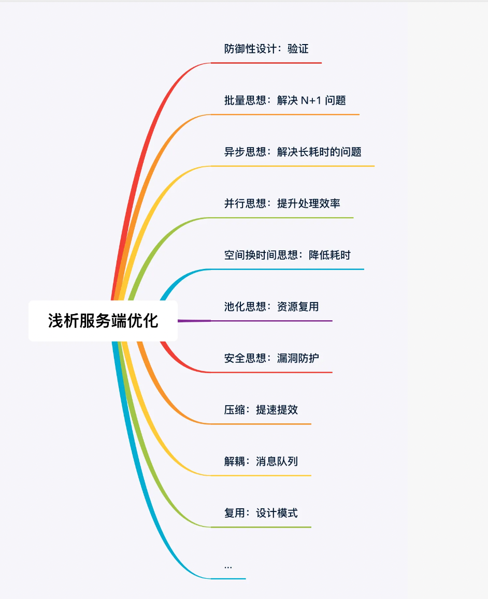
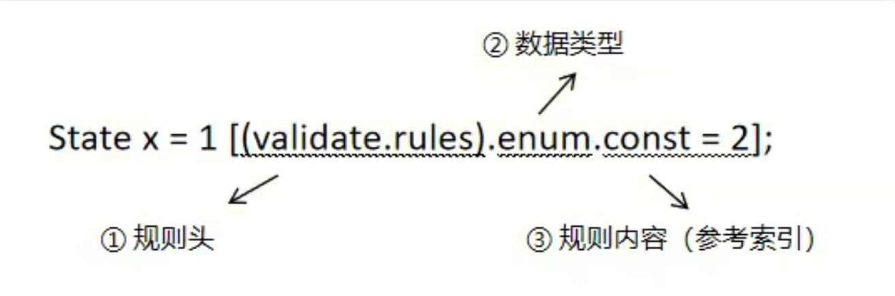
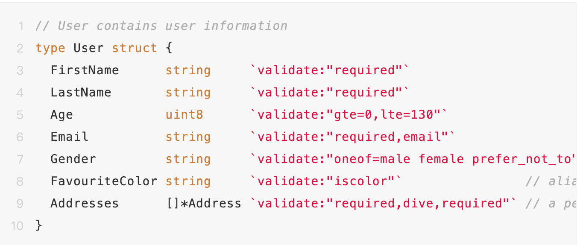
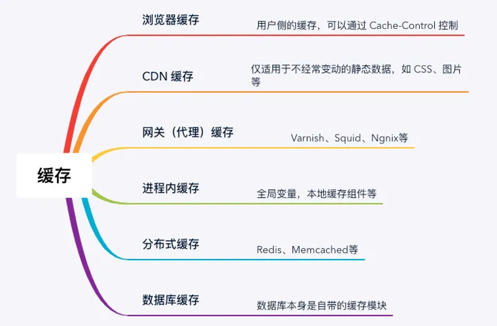
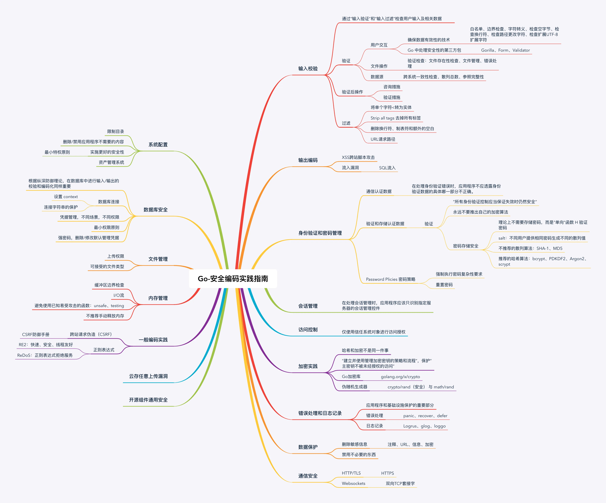

# 架构师必备10大接口性能优化秘技

## 1 写在前面
>> 性能优化是软件项目开发过程中的一个永恒话题。
>> 随着功能迭代，复杂度不断增加，同时伴随着流量、数据不断增长，接口性能可能会逐渐下降，尤其是在高并发场景，性能问题就更容易暴露出来。  
> > 这时，我们也不能闲着。开始翻古书、找资料、访道友，不断提升，慢慢练成属于自己的七十二绝技。
>> 本文主要总结了日常开发中一些通用的优化手段，以期对日后的开发有所裨益




## 2 防御性设计：验证

> 2.1 业务场景
>> 在日常开发中，尤其是在 web 应用开发中，我们经常需要对数据的合法性进行验证。  
> > 为了实现这一目的，我们通常会对参数进行一些前置验证。这些验证规则可以包括必填项、范围、格式、正则表达式、安全性以及自定义规则等。
>> 通常，为简化业务逻辑，我们会借助一些第三方工具来进行这些通用性的检测

> 2.2 案例
>> 2.2.1 Protocol Buffer Validation
> > > > 如果是基于 pb 协议，可以启用 protoc-gen-validate (PGV) 自动化数据校验插件。配置规则如


>> 强校验 title 字段长度在 1 ～ 100 个字符：
```
string title = 1 [(validate.rules).string = {min_len: 1, max_len: 100 }];
```
>> 一般地，保存数据库之前，为防止溢出，可对其长度做前置检查
>>《约束规则》支持的类型有 Numerics、Bools、Strings、Bytes、Enums、Messages、Repeated、Maps 等

>> 2.2.2 Go Struct and Field validation
>>>> 对于非 pb 定义的结构，也有一些类似的组件实现自动化校验。如 Go Struct and Field validation ，基本用法如下：


>>>> 详细参考 《常用的验证》。如果预置的 valadator 不满足需求，也可以自定义 validator。https://github.com/go-playground/validator?tab=readme-ov-file#baked-in-validations

>> 谚云：防御不到位，上线跑断腿
>> 防御性设计是考虑使用者可能会错误使用的情况，从设计上避免错误使用，或是降低错误使用的机会。  
> > 防御性设计可以让软件更安全、可靠，更方便地找到使用者的错误

## 3 批量思想：解决 N+1 问题
> 3.1 业务场景
> > N+1 查询问题指的是当查询一个对象的列表数据的时候，会首先查询列表中的对象的 ID，然后循环生成单独的 SQL/RPC 去查询对象的详细数据。这会导致 SQL/RPC 查询过多问题
>> 在一个循环内多次执行 RPC 调用或者数据库操作。数据量小的时候问题不大，能跑起来。随着业务的发展，数据量越来越大，或者要查询的 id 越来越多（特别是未加限制的时候），耗时部题可想而知，长尾会越来越多

> 3.2案例
>> 循环中的 RPC: 读取多条记录时在 for 循环中去分别读取单行
```
for _, id := range ids {    
    record := GetDetail(id)    
    // do something ...
}
```

>> 解决方案：改批量（一次从存储中取出所有 id 的结果）
```
records := GetDetails(ids)
// do something ...
```

> 3.3 小结
> > 上述场景是一个典型的 N+1 问题，不限于读取，写入亦然。它可能导致性能问题和增加数据库负载。
>> 为了解决 N+1 问题，开发人员可以使用一些技术，如批量加载（batch loading)、批量更新（Bulk Updates），从而减少请求次数。通过优化数据库查询和加载策略，开发人员可以避免 N+1 问题，并提高应用程序的效率

## 4 异步思想：解决长耗时问题
> 异步思想是一种解决长耗时问题的方法，它通过将耗时的操作放在后台进行，不阻塞主线程或其他任务的执行，从而提高系统的响应性能和并发处理能力

> 异步在数据库、消息队列的应用
>> 异步处理在数据库中同样应用广泛，例如  Redis  的 bgsave，bgrewriteof 就是分别用来异步保存 RDB 跟 AOF 文件的命令，bgsave 执行后会立刻返回成功，  
> > 主线程 fork 出一个线程用来将内存中数据生成快照保存到磁盘，而主线程继续执行客户端命令；Redis  删除 key 的方式有 del 跟 unlink 两种，对于 del 命令是同步删除，  
> > 直接释放内存，当遇到大 key 时，删除操作会让  Redis  出现卡顿的问题，而 unlink 是异步删除的方式，执行后对于 key 只做不可达的标识，对于内存的回收由异步线程回收，不阻塞主线程
>> MySQL  的主从同步支持异步复制、同步复制跟半同步复制。异步复制是指主库执行完提交的事务后立刻将结果返回给客户端，并不关心从库是否已经同步了数据；同步复制是指主库执行完提交的事务，  
> > 所有的从库都执行了该事务才将结果返回给客户端；半同步复制指主库执行完后，至少一个从库接收并执行了事务才返回给客户端。有多种主要是因为异步复制客户端写入性能高，但是存在丢数据的风险，  
> > 在数据一致性要求不高的场景下可以采用，同步方式写入性能差，适合在数据一致性要求高的场景使用。
>> 此外，对 Kafka 的生产者跟消费者都可以采用异步的方式进行发送跟消费消息，但是采用异步的方式有可能会导致出现丢消息的问题。对于异步发送消息可以采用带有回调函数的方式，当发送失败后通过回调函数进行感知，后续进行消息补偿

> 常见的异步编程方式有：


>> 优点：
> > >> 1.提高系统的响应性能：异步编程可以避免长耗时操作阻塞主线程或其他任务的执行，从而提高系统的响应速度和用户体验。通过将耗时操作放在后台进行，主线程可以继续执行其他任务，不必等待操作的完成。  
> > > > 2.提高并发处理能力：异步编程可以与其他任务并发执行，充分利用系统资源，提高系统的并发处理能力。通过将多个任务同时进行，可以减少总体的处理时间，提高系统的吞吐量。  
> > > > 3.节省资源消耗：异步编程可以减少不必要的资源消耗。通过将耗时操作放在后台进行，可以避免占用过多的 CPU 时间和内存资源，提高系统的资源利用率。  
> > > > 4.提高代码的可读性和维护性：异步编程可以使代码更加简洁和易于理解。通过使用异步/等待或 Promise 等编程模式，可以以同步的方式编写异步代码，提高代码的可读性和维护性。  
> > > > 5.支持并行计算和分布式处理：异步编程可以支持并行计算和分布式处理。通过将任务分解为多个子任务，并使用多线程、分布式计算或 GPU 并行计算等技术，可以实现高效的并行计算和数据处理。  
> > > > 6.提高系统的可扩展性：异步编程可以提高系统的可扩展性。通过将任务分发给多个处理单元或节点进行并行处理，可以实现分布式的并发处理和负载均衡，提高系统的可扩展性和性能。

>> 缺点：
> > >> 1.复杂性增加：异步编程涉及到回调函数、Promise、异步/等待等概念和技术，对于初学者来说可能会增加学习和理解的难度。  
> > > > 2.错误处理复杂：异步编程中的错误处理可能会更加复杂，需要处理回调函数中的错误、Promise 链中的异常等情况，增加了代码的复杂性。  
> > > > 3.可能引发竞态条件：在并发环境下，异步编程可能会引发竞态条件（Race Condition）和数据一致性的问题，需要额外的并发控制和数据同步机制来解决。  
> > > > 4.调试困难：由于异步编程中任务的执行顺序和时间不确定，调试异步代码可能会更加困难，需要使用适当的调试工具和技术。  
> > > > 5.可能导致回调地狱：在复杂的异步操作中，使用回调函数可能会导致回调地狱（Callback Hell），使代码难以理解和维护。这可以通过使用 Promise、异步/等待等技术来缓解。

## 5 并行思想：提升处理效率

## 6 空间换时间思想：降低耗时
> 缓存优化是性能优化中的一个重要环节，它可以显著提高系统的响应速度和吞吐量。常见的应用有


## 7 连接池：资源复用

## 8 安全思想：漏洞防护
> 8.1 业务场景
>> 安全思想是指在设计、开发和维护计算机系统和网络时，将安全性作为首要考虑的原则和理念。  
> > 它强调在整个系统生命周期中，从设计阶段到实施和运行阶段，都要考虑安全性，并采取相应的措施来保护系统免受恶意攻击和数据泄露的威胁

> 8.2 案例
>> Go 安全编码实践指南



## 9 压缩：提速提效
> > 在数据量稍大些的场景中，传输时间往往占耗时的大头。  
> > 压缩算法在数据存储、数据传输和用户体验等方面都具有重要的作用，可以提高效率、节省资源和改善用户体验。


## 10 解耦：消息队列

## 11 复用：设计模式