# 一、核心架构原则

## 1、垂直缩放与水平缩放
>> 垂直扩展是指升级单台机器，例如增加 CPU、内存或更快的存储设备。
> >> 垂直方向的制作更容易，但会受到硬件限制，而且成本很高
> >
>> 横向扩展是指增加更多机器并将工作分配到这些机器上
> >> 横向扩展更难，因为需要负载均衡、无状态服务和共享存储

## 2、CAP定理
> CAP定理指出，在网络分区的情况下，分布式系统必须在一致性和可用性之间做出选择。一致性意味着每个用户在同一时间看到相同的数据

### 3、PACELC 定理
> PACELC扩展了 CAP，并规定：如果存在分区，则选择可用性或一致性；否则，选择延迟或一致性

>> 即使网络状况良好，你仍然需要在速度慢但读取稳定，和速度快但读取最终不一致之间进行权衡。跨区域同步的系统，通常会以牺牲延迟为代价来保持高度一致性

### 4、ACID vs BASE
> ACID原则强调严格可靠的交易:
>>
> > 原子性 (Atomicity)
> >
> > 一致性 (Consistency)
> >
> > 隔离性 (Sociliation)
> >
> > 持久性 (Durability)
> >

> BASE代表基本可用、软状态、最终一致性，用于需要保持运行并快速响应的大型分布式系统
>> BASE系统可能会出现暂时的不一致情况，但随着时间的推移会自行修复

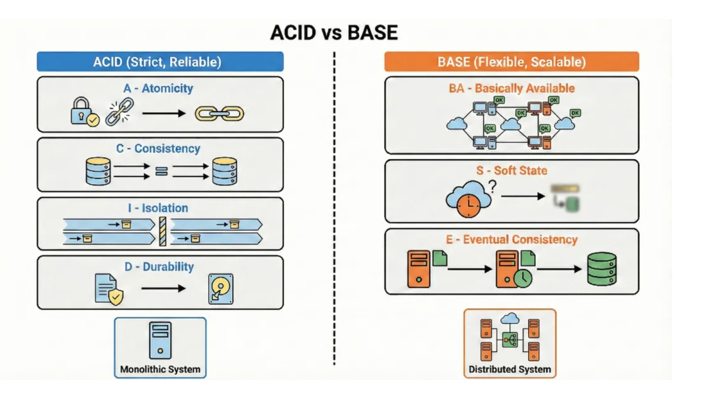

>> 实际上，许多架构将两者结合起来，使用 ACID 处理核心资金流，使用 BASE 处理诸如信息流和分析之类的事情

### 5、吞吐量与延迟

>> 吞吐量(Throughput)是指系统每秒可以处理的请求数量。
> >
> > 延迟(Latency)是指单个请求从开始到结束所需的时间

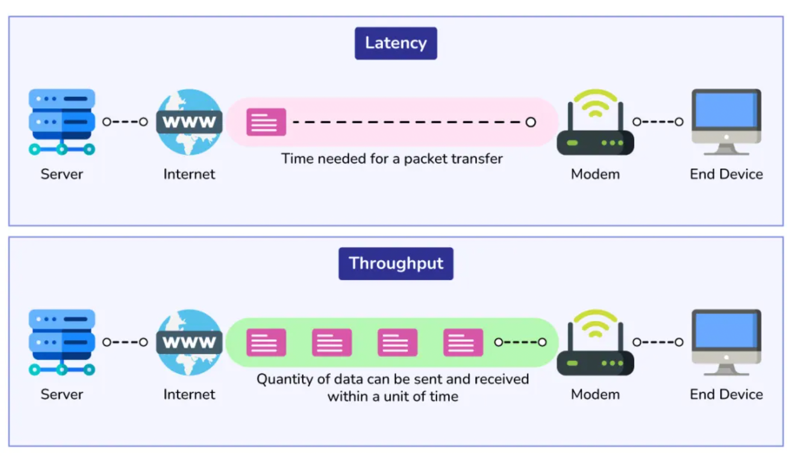

>> 通常可以通过并行处理更多工作来提高吞吐量，但如果队列积压，则可能会增加延迟

>> 想象一下，一家餐厅同时接收很多订单，却让顾客等待更长时间。好的系统设计力求在这两者之间取得平衡：既要保证足够的吞吐量以应对高峰负载，又要保证低延迟以提供流畅的用户体验

### 6、阿姆达尔定律
>> 阿姆达尔定律指出，并行化带来的加速效果受限于无法并行化的部分
> >
> > 如果你的系统有 20% 的运算始终是顺序执行的，那么再多的机器也无法解决这个瓶颈问题
> >
> > 如果你的请求总是需要访问同一个主数据库，那么这个主数据库就会限制你的性能。这条定律提醒你，应该先找出性能瓶颈，而不是简单地增加服务器数量

### 7、强一致性与最终一致性
>>
>> 强一致性意味着所有用户在写入数据后立即看到相同的数据。
>>> 强一致性更容易推理，但通常速度较慢，并且在出现故障时可用性较低
>>
>> 最终一致性意味着更新会随着时间的推移而分散，节点之间可能会出现短暂的分歧
>>> 最终一致性非常适合时间线或计数器等大规模系统，因为在这些系统中，完美的实时性并非至关重要

### 8、有状态架构与无状态架构
>>
>> 有状态服务会在请求之间记住用户上下文，通常会将会话数据存储在本地
>> > 有状态系统虽然编码更简单，但负载均衡和故障转移更难实现
>>
>> 无状态服务将每个请求都视为新的请求，其状态依赖于缓存或数据库等外部存储
>>> 无状态服务更容易进行水平扩展，因为任何实例都可以处理任何请求

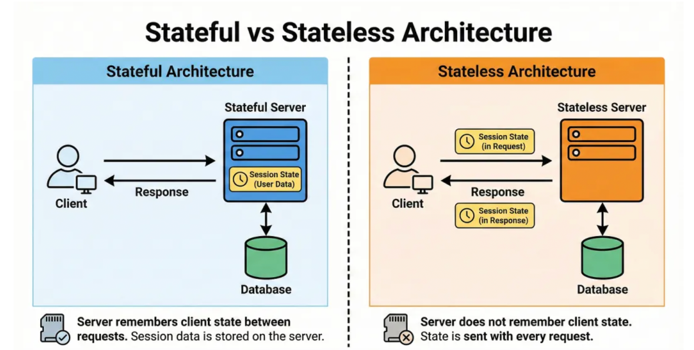

>> 在现代云系统中，我们尽量将状态推送到数据库中，并保持服务尽可能无状态

### 9、微服务架构 vs 单体架构
>>
>> 单体应用是指将多个功能集成到一个可部署单元中的单个应用程序
>>
>> 微服务将功能拆分成独立的服务，这些服务通过网络进行通信。
>>
>> 微服务帮助团队独立工作并分别扩展不同的部分，但同时也带来了沟通、调试和数据一致性方面的复杂性

### 10、无服务器架构
>>
>> 无服务器架构能让你在云端运行小型函数，而无需直接管理服务器。您只需在代码运行时付费，平台会为您处理扩展和基础设施
>>
>> 它非常适合事件驱动型工作负载，例如 webhook、后台作业或流量波动较大的轻量级 API
>>
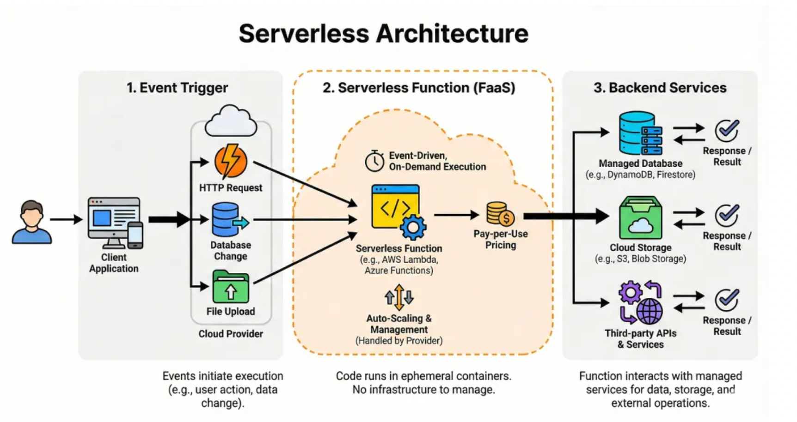

>> 缺点是：对长时间运行的任务控制较少，冷启动速度较慢，而且在大批量生产时成本有时会更高
> >
> > 可以将无服务器架构视为“函数即服务”，它非常适合用于粘合代码和轻量级服务

# 二、网络与通信
### 1、负载均衡
>> 负载均衡将传入流量分散到多个服务器上，从而避免单个服务器过载。它提高了可靠性和性能，因为单个服务器的故障不会导致整个系统崩溃
> >
> > 负载均衡器可以是硬件设备或软件服务。它们通常支持健康检查，以便停止将流量发送到不健康的实例

### 2、负载均衡算法
> 常见的负载均衡算法包括轮询、最少连接数和 IP 哈希
>>
>> 轮询调度算法按顺序轮询服务器，实现起来很简单
> >
> > 最少连接数将流量发送到活动连接数最少的服务器，这有助于处理长度不一的请求
> >
> > IP 哈希使用客户端 IP 的哈希值，因此同一用户通常会连接到同一服务器，这有助于简单的会话保持
> >
> > 选择合适的算法会影响公平性、资源利用率和用户体验

### 3、反向代理与正向代理
>> 反向代理(Reverse Proxy)位于服务器前端，并将服务器信息传递给客户端。它隐藏了内部拓扑结构，可以执行 TLS 终止、缓存、压缩和路由等操作
> >
> > 前向代理(Forward Proxy)位于客户端前面，代表客户端与外部世界进行交互，通常用于安全、缓存或内容过滤

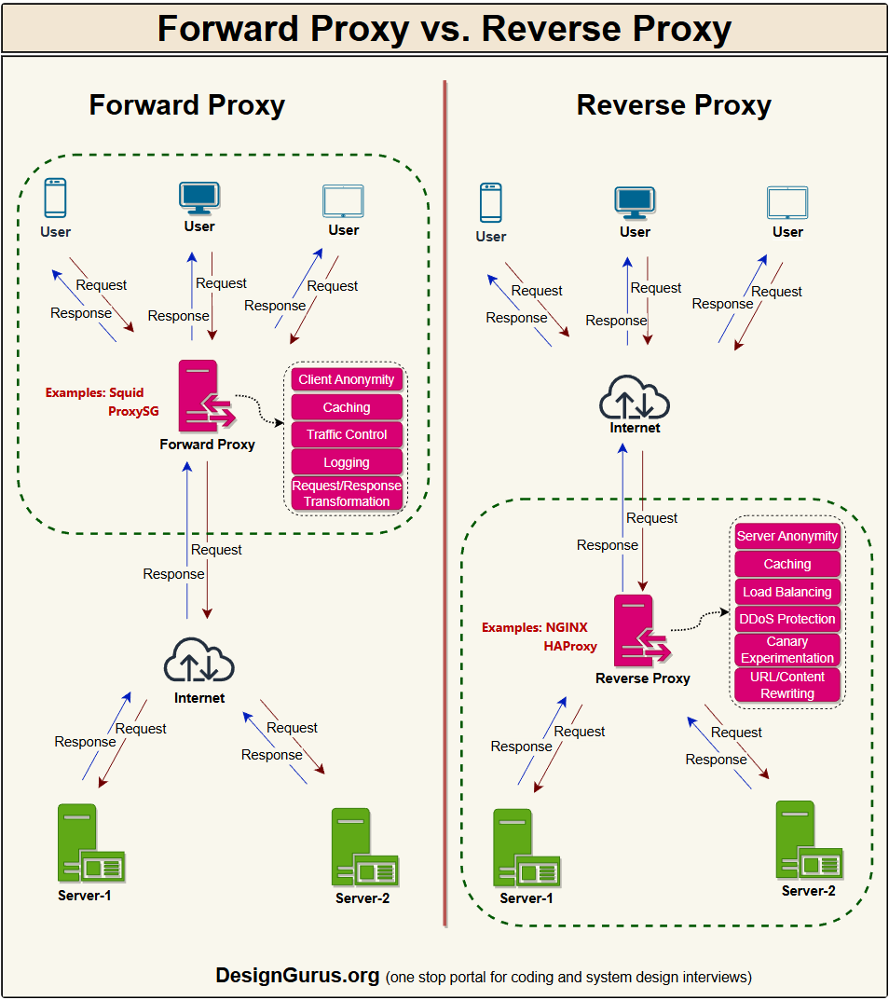

>> 可以将反向代理想象成公司的前台，它隐藏了所有内部房间；而将正向代理想象成笔记本电脑连接到互联网必须经过的网关
> >
> > 了解它们之间的区别，有助于你理解 API 网关和企业代理

### 4、API 网关
>> API网关是一种特殊的反向代理，它充当微服务系统中所有 API 调用的单一入口点。它负责将请求路由到正确的服务、速率限制、身份验证、日志记录，有时还负责响应整形

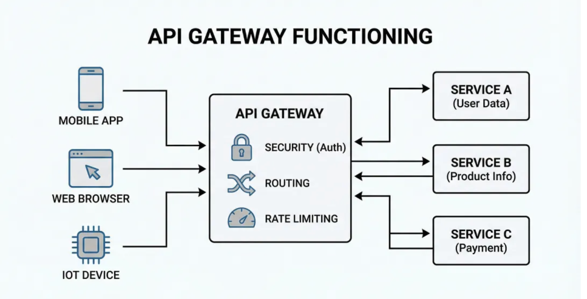

>> 这样就降低了客户端的复杂性，因为客户端只需要与一个端点通信
> >
> > 如果网关中逻辑过多，它可能会成为瓶颈，或者变成一个独立的微型庞然大物。好的设计应该保持网关功能集中且精简
> >

### 5、CDN（内容分发网络）
>>
>> CDN是一个由地理位置分散的服务器组成的网络，它将静态内容（如图像、视频和脚本）缓存到更靠近用户的位置
>>
>> 当用户请求内容时，请求会被路由到最近的 CDN 节点，从而大幅降低延迟。这还能减轻源服务器的流量压力，提高可扩展性和弹性

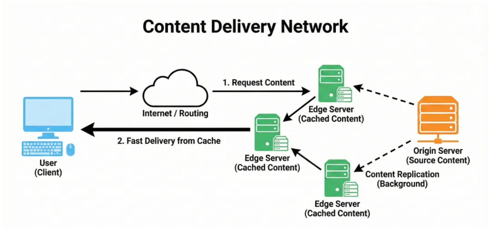

>> CDN对于全球应用和前端性能至关重要

### 6、DNS（域名系统）
>>
>> DNS将人类可读的域名映射到 IP 地址
>>
>> 当你输入网站名称时，你的设备会查询 DNS 以查找服务器的数字地址。
>>
>> 它采用多层缓存机制，因此首次查找后响应速度很快。它还可以通过为同一名称返回不同的 IP 地址来实现简单的负载均衡

### 7、TCP 与 UDP
>> TCP是一种可靠的、面向连接的协议。它通过确认和重试机制来保证有序、错误检查后的数据传输
> >
> > UDP是无连接的，不保证交付或顺序，这使得它速度更快、重量更轻
> >
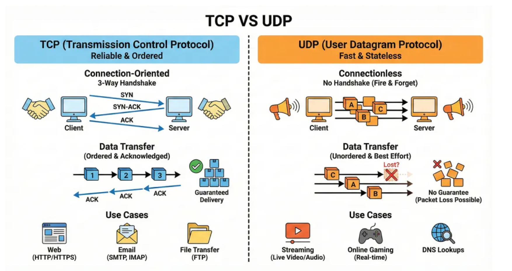

>> TCP 适用于 API、网页和文件传输等对精度要求较高的场景
> >
> > UDP 非常适合视频通话或游戏等实时应用，因为偶尔的丢包是可以接受的
> >

### 8、HTTP/2 和 HTTP/3 (QUIC)

>> HTTP/2引入了多路复用技术，允许多个请求共享单个 TCP 连接，从而降低开销。它还带来了诸如头部压缩和服务器推送等特性
> >
> > HTTP/3基于 QUIC 协议运行，QUIC 协议又基于 UDP 协议，它能缩短连接建立时间，并提升在不可靠网络上的性能。这些版本的主要目标是降低延迟，更好地利用现代网络环境
> >
> > 对于工程师而言，关键在于：减少连接设置，更好地利用单个连接

### 9、gRPC 与 REST
>> REST通常使用 HTTP 和 JSON，并专注于资源（例如/usersURL 或 GET /orders）。它简单易读，被广泛用于公共 API
> >
> > gRPC使用 HTTP/2 和二进制编码消息（protobuf），这种格式的消息体积更小，传输速度更快。它还支持双向流和强类型

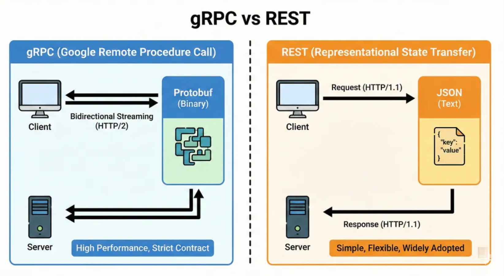

>> 在微服务中，gRPC 通常用于服务间的调用，而 REST 则常用于外部客户端
> >
> > 当可读性和兼容性至关重要时，请使用 REST；当性能和契约至关重要时，请使用 gRPC

### 10、WebSocket 和服务器发送事件 (SSE)
>> WebSocket创建一个全双工连接，客户端和服务器可以随时互相发送消息
> >
> > SSE允许服务器通过 HTTP 单向通道将事件推送给客户端
> >
> > WebSocket 非常适合聊天、多人游戏和实时协作
> >
> > SSE 更简单，适用于实时比分更新或通知等情况，只需要服务器推送更新即可

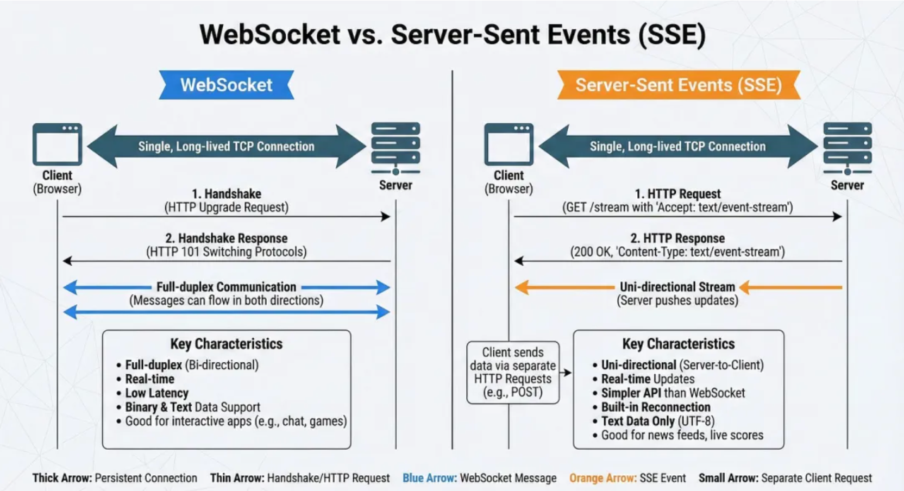

>> 两者都能解决普通 HTTP 无法很好地处理的实时通信问题

### 11、长投票
>> 长轮询是一种客户端发送请求，服务器保持连接打开状态，直到有新数据或超时为止的技术
> >
> > 当收到响应后，客户端立即发起另一个请求。这样就模拟了通过纯 HTTP 协议实现实时更新，而无需使用特殊协议
> >
> > 它不如 WebSocket 高效，但更容易实现，并且可以穿透大多数代理和防火墙
> >
> >

# 三、数据库和存储内部结构
###  1、分片（数据分区）
> > 分片将数据分散存储在多台机器上，每台机器保存一部分数据。常见的分片策略包括基于范围的分片、基于哈希的分片和基于目录的分片
>>
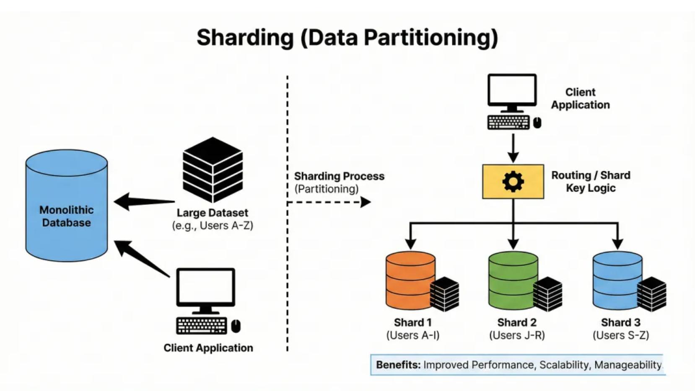

>> 难点在于选择合适的分片键，避免出现流量热点，即某个分片承载了大部分流量。分片完成后，在分片之间迁移数据（重新分片）就成为一项重要的运维挑战

###  2、复制模式（主从，主主）
>> 数据复制是指在不同的节点上保存多份数据副本

>> 在主从（或主副本）架构中，一个节点处理写入操作并将更改复制到其他节点，由其他节点提供读取服务
> >
> > 在主主（多主）架构中，多个节点接受写入操作并解决冲突
> >
> > 复制可以提高读取性能和可用性，但会使一致性更难保证，尤其是在写入操作要到多个节点时

### 3、一致性哈希
>> 一致性哈希是一种将键分布在各个节点上的技术，它可以在添加或删除节点时最大限度地减少数据移动
> >
> > 键和节点放置在一个逻辑环上，每个键都属于环上的下一个节点
> >
> > 当节点加入或离开时，只需要移动一小部分键。这一特性在分布式缓存和数据库中非常有用
> >
> > 你可以把它想象成一个平滑的映射，即使集群大小发生变化，它也不会变得混乱

### 4、数据库索引（B树、LSM树）
>> 索引通过以允许快速查找的方式组织数据来加快查询速度
> >
> > B 树是一种平衡树，它能保持数据有序，并能高效地查找范围，这在关系数据库中很常见
> >
> > LSM 树将数据批量写入内存，并定期将其刷新到磁盘，这使得写入速度非常快，但读取操作更加复杂
> >
> > 权衡之处在于写入密集型工作负载与读取密集型工作负载之间的取舍
> >
> > 关键在于索引是一个独立的结构，每次写入时都必须更新，这就是为什么索引过多会影响插入性能的原因
> >

### 5、预写式日志（WAL）
>> 预写式日志记录会在将更改应用到主数据库之前，先将更改记录到日志中
> >
> > 如果在事务处理过程中发生崩溃，系统可以重放日志以恢复一致状态。WAL（预写式日志）确保事务的持久性和原子性。它还支持从日志流复制等技术。让我来解释一下它为何如此重要
> >
> > 如果没有 WAL，崩溃可能会导致您的数据处于半更新、损坏的状态
> >

### 6、规范化与非规范化
>> 规范化将数据组织成表格，遵循第一范式、第二范式等规则，从而减少冗余和依赖关系。这可以避免更新和插入操作出现异常
> >
> > 非规范化是指有意复制数据以加快读取速度并减少连接操作。在高规模系统中，非规范化通常用于读取密集型路径，例如将用户名与帖子一起存储，而不是每次都进行连接
> >
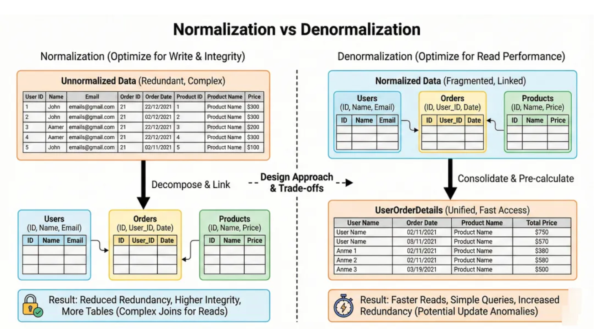

>> 真正的技巧在于知道在不破坏一致性的前提下，可以在哪些方面安全地打破常规。

### 7、多语言持久性
>> 多语言持久性是指在同一个系统中使用多种类型的数据库，每种数据库都因其最擅长的领域而被选中。  
> > 例如，可以使用关系型数据库处理事务，使用文档型数据库存储日志，使用键值型数据库进行缓存，以及使用图数据库来存储关系
> >
> > 与其将所有数据强行导入一个数据库，不如为每个任务选择合适的工具
> >
> > 这样做的代价是操作更加复杂，对团队的知识要求也更高

### 8、布隆过滤器
>> 布隆过滤器是一种空间利用率高的数据结构，它能快速判断“这个元素是否在集合中？”，虽然可能出现误报，但不会漏报。它使用多个哈希函数在插入元素时设置位数组中的相应位
> >
> > 要检查成员资格，您需要测试相同的位；如果任何一位为零，则该项肯定不存在。
> >
> > 数据库和缓存使用布隆过滤器来避免不必要的磁盘查找或缓存未命中。
> >
> > 你可以把它们想象成快速的守门人，它们会说“绝对不行”或“也许可以”

### 9、向量数据库
>> 向量数据库存储和查询向量，向量是对文本、图像或音频等数据的数值表示。这些向量来自嵌入等模型，并支持相似性搜索，例如“查找与此文档最相似的文档”
> >
> > 它们并非进行精确的相等性比较，而是使用余弦相似度或欧氏距离等距离度量。这对于现代搜索、推荐和人工智能助手系统至关重要
> >
> > 在面试中，只需知道向量数据库支持对高维数据进行最近邻搜索即可

### 四、可靠性和容错性
>> 1、速率限制
> >
> > 速率限制控制用户、IP 地址或 API 密钥在给定时间窗口内可以发出的请求数量。它可以保护您的系统免受滥用、意外流量高峰和失控循环的影响
> >
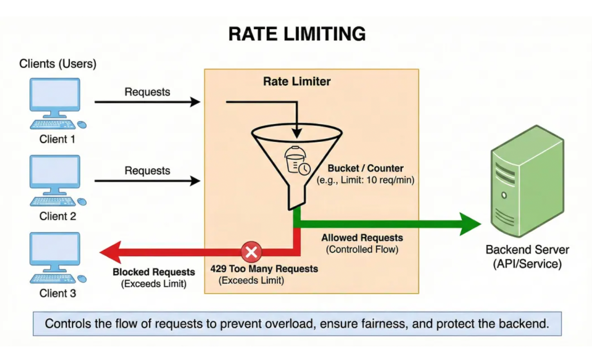

>> 常用策略包括固定窗口、滑动窗口和令牌桶。
> >
> > 速率限制通常在 API 网关或负载均衡器处强制执行
> >
> > 可以把它们看作是安全刹车，防止共享资源不堪重负

>> 2、断路器模式
>>
>> 断路器监控对远程服务的调用，如果故障过多，则会“断开”
> >
> > 打开时，它会立即拒绝新的请求，而不是再次尝试处理损坏的服务
> >
> > 经过一段时间的冷却后，系统会进行几次试探性调用，以检查服务是否已恢复，如果成功则关闭服务。
> >
> > 这种模式可以防止级联故障，避免一个运行缓慢的服务拖垮整个系统
> >
> > 这里有个棘手的问题：断路器必须仔细调校，以免跳闸过猛或过晚
> >

>> 3、隔板模式
> >
> > 隔板模式将系统的不同部分隔离开来，这样一来，一个区域的故障就不会影响整个系统。这可能意味着为不同的功能使用独立的连接池、线程池，甚至是整个服务集群
> >
> > 如果一个隔墙被车辆堵塞，其他隔墙仍可继续通行
> >
> > 这个名称来源于船舶隔舱，它可以防止海水涌入一个舱室
> >
> > 在设计讨论中，使用隔板表明你在考虑故障隔离和爆炸半径

>> 4、重试模式和指数退避
> >
> > 重试有助于从网络超时或临时过载等瞬态错误中恢复
> >
> > 指数退避是指每次重试的等待时间都比前一次更长，例如 1 秒、2 秒、4 秒等等。这可以防止客户端对已经不堪重负的服务造成过大的访问压力
> >
> > 好的重试策略还会使用抖动（小的随机性）来避免群体过大
> >
> > 不采取退避措施的重试可能会使故障情况更加恶化，而不是有所帮助
> >

>> 5、幂等性
>>
> > 如果多次执行某个操作与执行一次该操作的效果相同，则称该操作是幂等的
> >
> > 例如，“将用户状态设置为活跃”是幂等的，而“将账户余额增加 10”则不是幂等的。
>>
>> 当系统使用重试机制时，幂等性至关重要，因为同一个请求可能会被发送多次。
> >
>>API 通常要求支付等操作使用幂等键，以避免重复收费。
> >
> > 在面试中，谈到至少一次交付或重试时，一定要提到幂等性

>> 6、心跳
>> 心跳信号是由服务或节点发送的周期性信号，用于表明其处于运行状态且健康。
>> 监控系统或协调器监听心跳。
>>
> > 如果它们停止接收这些节点，它们会将节点标记为宕机，并触发故障转移或扩展操作。
> >
> > 心跳是简单而强大的活体检测工具。可以把它想象成系统的“脉搏检查”

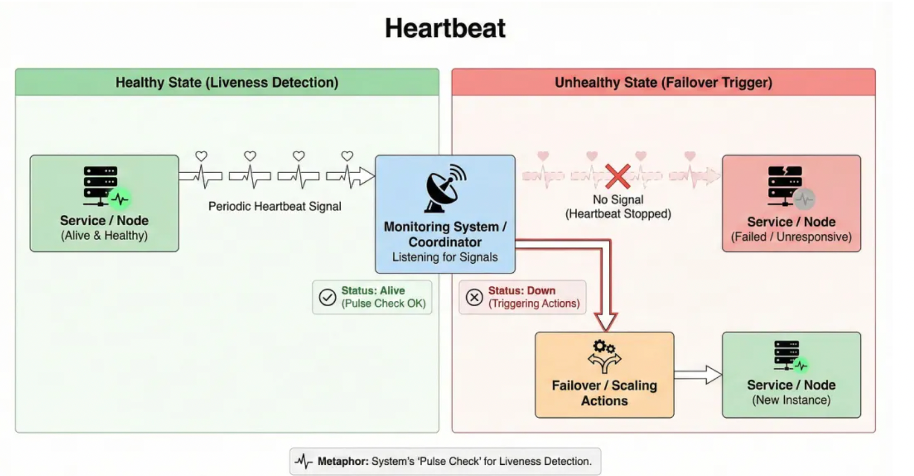

>> 7、领导人选举（Paxos, Raft）
>> 领导者选举是指从众多节点中选择一个节点作为协调者的过程
> >
> > Paxos 和 Raft 等算法确保只选出一个领导者，并且所有节点最终都同意由谁来担任领导者
> >
> > 领导者负责处理诸如分配工作、管理元数据或安排写入操作等任务。如果领导者失效，系统会自动选举新的领导者
> >
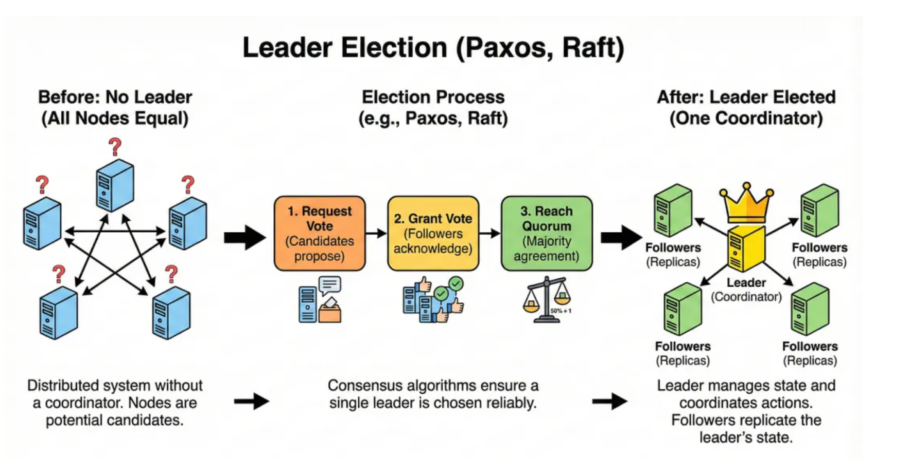

>> 8、分布式事务（SAGA 模式）
> >
> > 分布式事务跨越多个服务或数据库。
> >
> > SAGA模式将此类事务建模为一系列本地步骤，并具有用于回滚的补偿操作
> >
> > 这种方式并非像单一的 ACID 事务那样锁定所有操作，而是每个服务执行其部分并发布一个事件。如果出现故障，补偿步骤会尝试撤销之前的更改。这与微服务和最终一致性自然契合
> >
> > 这样做的代价是逻辑更加复杂，并且可能出现部分故障，需要妥善处理

>> 9、两阶段承诺 (2PC)
>> 两阶段提交协议旨在提供跨多个节点的原子交易。
> >
> > 在第一阶段，协调员会询问所有参与者是否能够做出承诺
> >
> > 在第二阶段，如果所有人都同意，它会告诉他们做出承诺；否则，它会告诉他们撤回决定
> >
> > 2PC 提供了强大的保证，但如果协调器发生故障，则可能会阻塞，并且由于锁定，大规模应用成本很高
> >
> > 在现代云系统中，对于高吞吐量路径，通常会避免使用 2PC，而是采用 SAGA 等模式来代替

### 五、缓存和消息传递
> 1、缓存
>> 缓存将频繁访问的数据存储在快速存储层（通常是内存）中，以减少延迟和后端负载
> >
> > 常见的缓存层包括进程内缓存、外部键值存储和内容分发网络 (CDN)。缓存对于读取密集型工作负载和高成本计算尤其有效
> >
> > 这里有个棘手的问题。过时的数据和失效机制使得缓存比乍看起来要难得多
> >

> 2、缓存策略（旁路缓存、通写缓存等）
> >
> > 旁路缓存（Cache aside）：应用程序直接从缓存读取数据，未命中时则从数据库加载并写入缓存
> >
> > 通写缓存（Write through）：同步写入缓存与数据库，确保缓存与数据源始终保持一致
> >
> > 回写缓存（Write back）：优先写入缓存，后续再回刷至数据库。这种方式速度快，但若缓存失效则存在数据丢失风险
> >

> 3、缓存驱逐策略（LRU、LFU）
> > 缓存驱逐策略决定了当缓存已满时要删除哪些项目
> >
> > LRU （最近最少使用）算法会移除最近未访问过的项目，因为该算法假设最近访问过的项目更有可能再次被使用
> >
> > LFU （最不常用）会移除很少被访问的物品，重点关注长期受欢迎程度
> >
> > 有些系统使用随机算法、先进先出算法或高级算法
> >
> > 关键在于缓存空间有限，因此要将最有价值的项目保存在内存中

> 4、消息队列（点对点）
> > 消息队列允许一个组件向另一个组件发送消息，而无需两者同时在线
> >
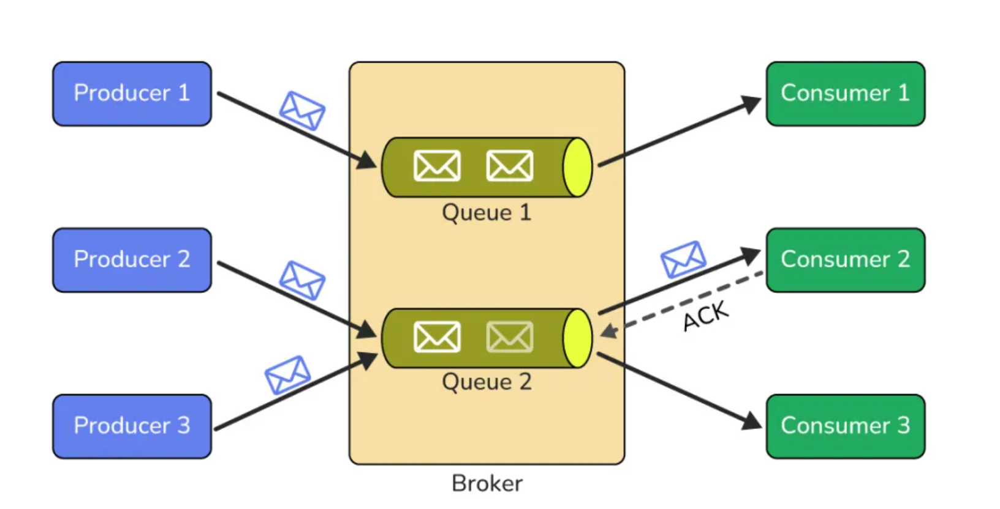

>> 在点对点模型中，队列中的消息由一个接收器消费后即被移除。这使得发送方和接收器解耦，从而使它们能够独立扩展和应对故障
> >
> > 队列非常适合后台作业、电子邮件发送和异步处理繁重任务
> >

> 5、发布订阅（PubSub）
>> 在pub sub 中，发布者向主题发送消息，而不是直接向消费者发送消息
> >
> > 订阅者可以收听自己感兴趣的话题，并接收相关信息。这实现了广播式的沟通方式，并降低了生产者和消费者之间的联系
> >
> > 多个服务可以对同一事件做出不同的反应，例如日志记录、分析和通知
> >
> > 在访谈中，pub sub 经常出现在事件驱动型设计中，例如活动信息流或事件来源

> 6、死信队列
>>
> > 死信队列用于存储多次尝试后仍无法成功处理的消息
> >
> > 这些消息不会被无限重试并阻塞主队列，而是会被移到一边
> >
> > 工程师可以检查死信队列来调试问题、修复数据或稍后重放消息。这种模式提高了系统的弹性，并防止系统因“毒信”而陷入困境
> >

### 六、可观测性和安全性
> 1、分布式追踪
>> 分布式追踪会跟踪单个请求在多个服务间的流转过程。每个服务都会添加一个追踪 ID 和跨度信息，以便您可以重构请求的完整路径。这在调试微服务架构中的响应缓慢或故障时非常有用
> >
> > 如果没有追踪功能，你只能看到孤立的错误。有了追踪功能，你就能看到服务、队列和数据库中的完整情况
> >

> 2、SLA vs SLO vs SLI
>> 服务级别协议 (SLA )是对客户的外部承诺，例如“每月 99.9% 的正常运行时间”
> >
> > 服务级别目标 (SLO )是工程师力求达到的内部目标，通常比服务级别协议 (SLA) 更为严格
> >
> > 服务级别指标 ( SLI ) 则是实际测量的指标，例如实际正常运行时间或请求成功率
> >
> > 可以将 SLA 看作合同，SLO 看作目标，SLI 看作记分牌

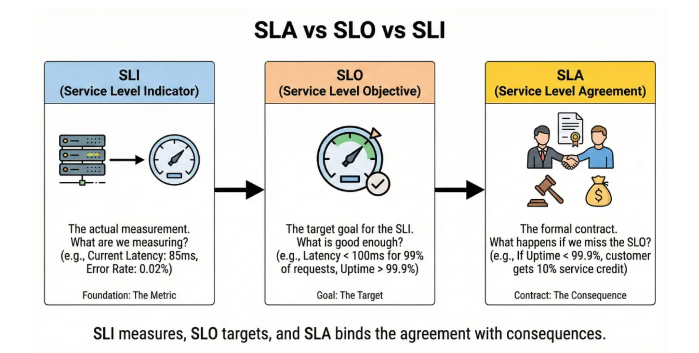

> 3、OAuth 2.0 和 OIDC
> >
> > OAuth 2.0是一个委托授权框架。它允许用户在不共享密码的情况下，授予应用程序对其资源的有限访问权限
> >
> > OIDC （OpenID Connect）基于 OAuth 2.0 构建，增加了身份验证功能，允许客户端验证用户身份并获取用户身份信息。这是许多“使用 X 登录”流程的基础
> >
> > 其核心思想是授权服务器颁发客户端和 API 可以信任的令牌

> 4、TLS/SSL握手
>>
> > TLS/SSL通过加密传输中的数据来保护客户端和服务器之间的通信
> >
> > 在握手过程中，客户端和服务器协商加密算法，安全地交换密钥，并验证证书
> >
> > 握手完成后，所有后续数据都会被加密，防止被窃听。这就是为什么你的浏览器中会出现小锁图标的原因
> >
> > 如果没有 TLS，网络上的任何人都可以读取或修改敏感流量

> 5、零信任安全
>>
> > 零信任是一种安全模型，其核心思想是：“永远不要相信，一定要核实。”它假设威胁可能存在于网络外部，也可能存在于网络内部
> >
> > 即使请求来自您的数据中心或 VPC 内部，也必须经过身份验证、授权和加密。访问权限的授予基于身份、设备状态和上下文，而不仅仅是“位于防火墙内部
> >
> > 在现代架构中，零信任正成为安全系统设计的默认方法

