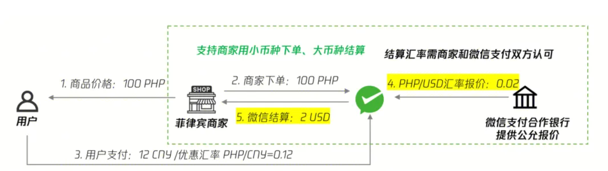
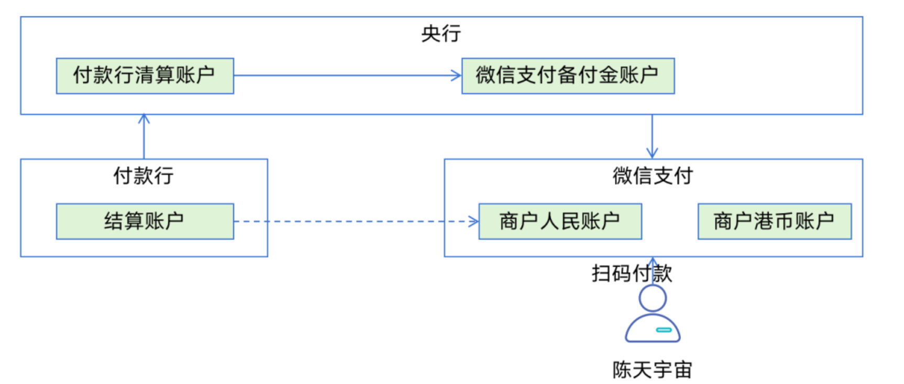
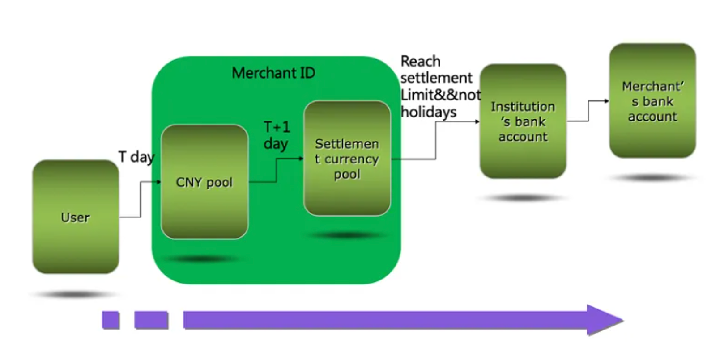
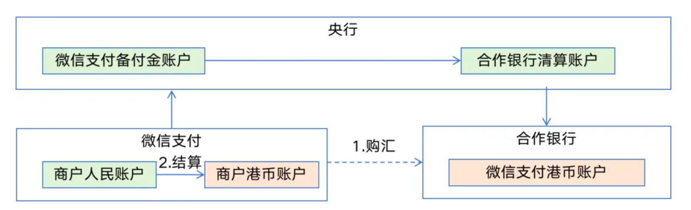
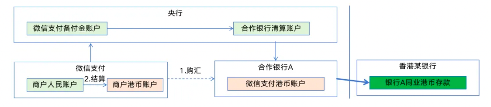
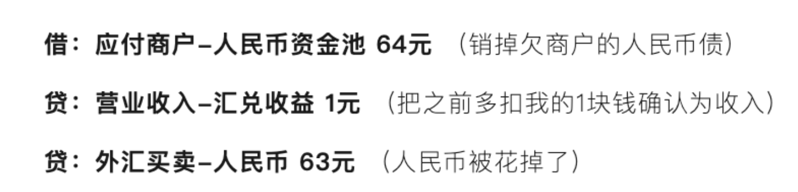
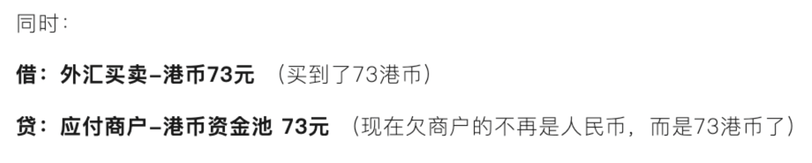
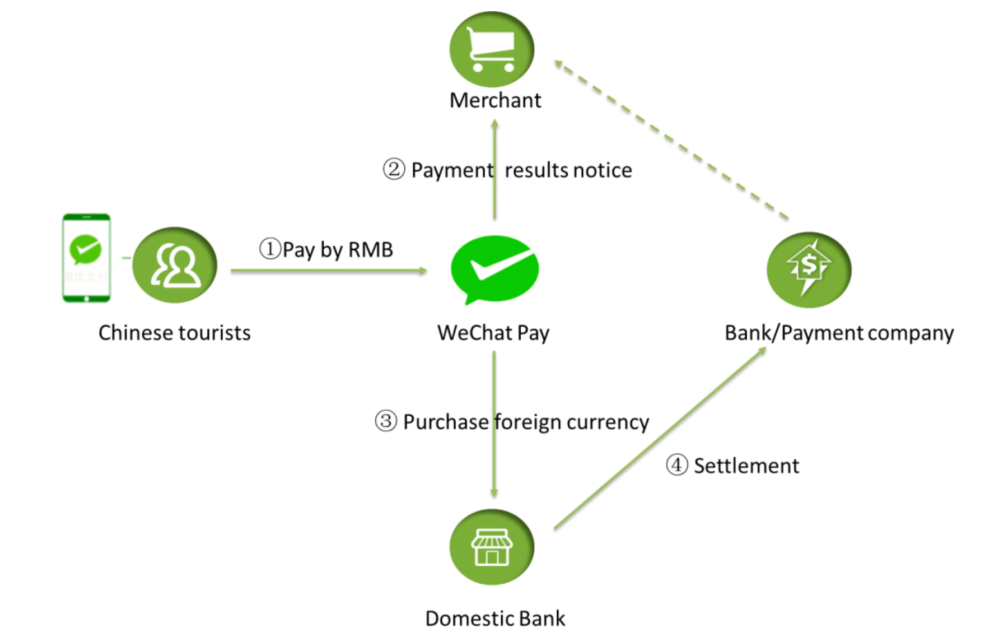

# 我付人民币，商户收港币，底层是怎么清算的？

>> 掏出手机扫了微信付款码。滴的一声，手机上显示“已扣款人民币64.61元”，老板看了一眼他的手机，冲我喊了一句“得啦，73港币收到了！”
> >
> > 人在香港，钱扣的是内地的人民币，老板收的是本地港币，咋实现的?

>> 参与者列出来:
> >
> > 1.我：人在香港，钱包里的是人民币，微信绑定的是内地的银行卡。
> >
> > 2. 香港XIAO NOODLES（商户）：只收港币，他的银行账户开在中银香港
> >
> > 3. 微信支付：支付中间人，管理我的钱包，也要管理商户的收单账户
> >
> > 4.央行：终极裁判，所有的钱最终都要在它眼皮底下过
>>
> > 5.合作银行：执行换汇及付款的银行，比如中银内地、汇丰中国等
> >
> > 你可能会问：就这么一笔64港币的小买卖，至于惊动这么多支付大佬们吗
> >
> > 至于。而且比你想象的还要复杂一百倍
> >
> > 关键的汇率问题来了：
> >
> > 我消费的那一刻（T日），微信给我看的汇率是0.88（1港币=0.88人民币）。所以你的银行卡被扣了64元人民币。逻辑如下图：

>>
>> 但是第二天（T+1日），微信实际去银行换汇时，拿到的汇率可能是0.87，可能因为市场波动，或者银行给微信的结算价不同。所以微信实际只花了63元人民币就换到了这73港币
>>
>> 等等！这里就出现了1块钱的差额！这1块钱去哪了？
>>
>> 别急，这正是微信支付的小心机：汇差收益。
>>
>> 只要汇率波动对平台有利，这多出来的1块钱就成了平台的营业收入。当然，如果汇率反过来，平台也得自己贴钱。这就是做支付中间商的风险和收益
>>
>> 但这不是重点，重点是：钱到底是怎么从人民币结给商户港币的？
>>
>> 第一天（T日）：我的钱还在境内
>>
>> 我们先画一张图，看看支付成功后结算给商户前，这笔钱到底躺在哪里。

>> 当我支付成功的那一瞬间，资金的第一个动作是这样的：
> >
> > 我这边：我的银行卡或微信余额被扣掉了64元人民币。
> >
> > 微信这边：微信支付收到了这笔钱的扣账成功通知。但它并没有立刻把这64元人民币换成港币，更没有立刻付给香港商户
> >
> > 那么，这64块钱去哪了？
> >
> > 真正的钱躺在了微信支付在央行监管下的“人民币备付金账户”里。
> >
> > 这个“备付金账户”是个什么东西？简单说，就是央行给所有持牌支付机构开的一个“大钱包”。你在微信里的每一分钱，最终都要老老实实躺在这个大钱包里，谁也不能挪用
> >
> > 从会计的角度看，微信的内部账本上多了这么一笔记录：
> >
> > 借:备付金-央行 64元 (表示微信支付在央行存了一笔钱)
> >
> > 贷：应付商户-人民币资金池 64 (表示微信欠香港商户64元，但这笔债是人民币)
> >
> > 这里要侧重说明一下，当一个商户入驻成功，拿到商户号后，该商户号在微信支付侧其实是对应了两个资金池：人民币资金池和结算币种资金池，如下图

>> 看到了吗？在T日，钱并没有出境。它只是从我的口袋里，转移到了央行监管下的一个大池子里。微信在账本上给香港商户记了一笔账：“我欠你64块钱，明天再处理
> >
> > 这就是第一层真相：我付了钱，但商户没收到钱；钱离开了我，但没离开我国内地
> >
> > 第二天（T+1日）：换汇与出境
> >
> > 时间来到第二天T+1的凌晨。当我还在酒店呼呼大睡的时候，微信支付的系统可没闲着
> >
> > 它把T日所有像我这样的消费者、所有像香港XIAO NOODLES这样的商户的交易数据全部打包，准备干一件大事：集中购汇
> >

>> 这一步极其关键。
> >
> > 很多人以为，我消费的时候，微信就实时帮我换汇了。错！一般是“事后算总账”
> >
> > 锁定人民币：系统把人民币资金池里属于香港商户的那64元人民币（其实是汇总所有商户的）全部锁定。
> >
> > 找银行购汇：微信支付发起系统指令给它的合作银行，比如中银内地。注意，这里是中银内地，不是中银香港！这是两个完全不同的法人实体
> >
> > 以我的名义：还记得我第一次使用微信支付境外消费时，弹出一长串协议，我勾选了同意才能支付，那个协议叫《财付通代理购结汇协议》。协议中说明，跨境支付线下交易的总交易金额不会超过人民币300,000元
> >
> > 好了，关键操作来了：
> >
> > 微信支付把63元人民币（不是64元哦，因为实际汇率可能是0.87）从备付金账户划给了中银内地
> >
> > 中银内地收到人民币后，执行购汇操作，在它的系统里，微信支付的港币账户上多了73港币
> >
> > 此时，钱还在中银内地的账上，还没到香港。但是，中银内地账上的这73港币，对应的是真实存在的钱吗？它对应的是中银内地存在中银香港的港币存款
> >

>> 在微信的内部账本上，这一天的记录是这样的：

>> 至此，资金完成了双币种结算，从人民币变成了港币。但它依然在我国内地，在中银内地的账户里

>> 第三天（T+N日）：跨境结算打款
> >
> > 商户的待结算资金变成港币后，并不是立刻结往香港商户签约的开户银行
> >
> > 微信支付还有一个规则：它不逐笔打款，而是凑够一定金额才打
> >
> > 这微信支付的官方文档里是这么描述的：当外币结算资金池达到800美金（或等值其他币种）时，并且当天是工作日，微信才会触发打款操作
> >
> > 为什么要设800美金这个门槛？
> >
> > 因为银行跨境划转是有手续费的，哪怕只转1港币，固定成本摆在那儿。为了降低成本，微信会把所有小额的交易攒起来，凑成一个大额再付款
> >
> > 假设T+N这天，加上我的这73港币，微信的“商户港币资金池”里刚好凑够了6240港币，约800美金。而且当天是周三，工作日。系统将执行打款处理
> >
> > 这时，真正的资金跨境才会发生：
> >
> > 中银内地通过跨境支付系统，可能是传统的代理行模式，也可能是最新的跨境支付通系统，把这6240港币从内地的港币账户，划转到了中银香港的港币账户上
> >
> > 这笔钱终于从内地付到了香港
> >
> > 紧接着，中银香港根据微信支付的付款指令，把这6240港币分配到各个商户账上。其中，香港XIAO NOODLES分到了我的那73港币
> >
> > 此时，香港XIAO NOODLES的老板打开手机银行，看到余额增加了73港币。整个交易，从我扫码到老板收款，可能经历了一到两天甚至更久的清算处理过程
> >
> > 整体来说，清算关系如下图所示
> >

>> 下面我们继续深挖几个更底层的东西，跨境支付资金流动的最本质的东西
>>
> > 中银内地和中银香港，能内部划转吗？
> >
> > 整个链条里，如果微信支付的合作银行是中银内地，而香港XIAO NOODLES的收款行是中银香港。这两个银行虽然都是中银，但在金融监管的眼里，它们完全是两码事
> >
> > 中银内地，是注册在内地、受我国央行和金管局监管的法人银行
> >
> > 中银香港，是注册在香港、受香港金管局监管的法人银行，并且是香港的三家发钞行之一
> >
> > 它们是两个独立的法人实体，资产负债表是分开的，监管报表是分开的，资本充足率也是分开算的
> >
> > 所以，当微信支付在中银内地的港币要转给中银香港时，绝对不能内部记账了事
> >
> > 为什么？因为这笔资金跨越了两个司法管辖区
> >
> > 必须进行真正的资金划转
> >
> > 要么通过银行间的代理行关系，要么通过央行跨境支付系统。更重要的是，每一笔从内地到香港的资金划转，都必须向外汇管理局进行国际收支统计申报
> >
> >

