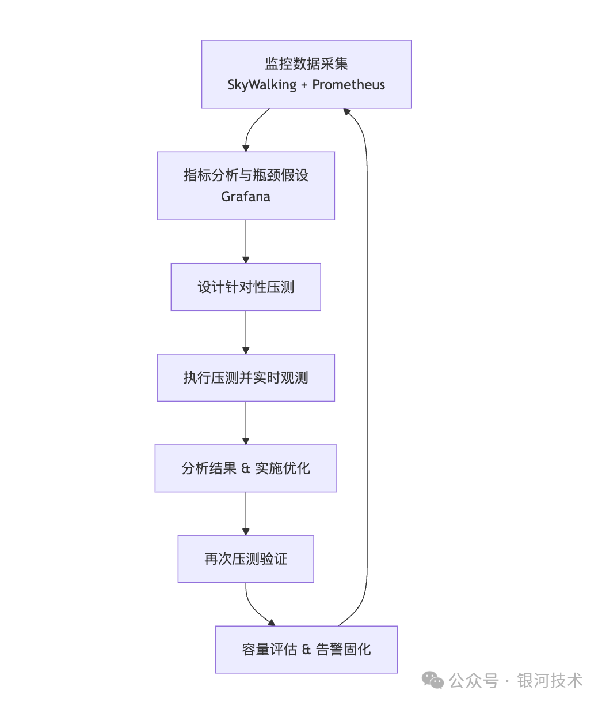

# 基于 Spring Boot + SkyWalking + Prometheus 的性能工程闭环实战

## 从监控到压测，再到容量评估的工程化落地

>> 真正的性能工程不是“跑一次压测看看QPS”，而是建立一条可持续运转的工程闭环:
> >
> > 监控数据采集 → 性能瓶颈洞察 → 针对性压测 → 优化验证 → 容量评估 → 告警固化 → 持续回归
> >
> > 1. SkyWalking 负责 “看链路”
> >
> > 2. Prometheus 负责 “看资源和业务指标”
> >
> > 3. Grafana 负责 “统一表达事实”
>>
> > 4. 压测工具负责 “制造问题”
> >
> > 组合起来，才能构成完整的性能工程体系

> 一、性能工程闭环总体架构
> >


> 二、监控体系搭建
>>
> > 1. Docker Compose 部署
```
version: '3.8'
services:
  prometheus:
    image: prom/prometheus
    ports:
      - "9090:9090"
    volumes:
      - ./prometheus.yml:/etc/prometheus/prometheus.yml

  grafana:
    image: grafana/grafana
    ports:
      - "3000:3000"
    environment:
      - GF_SECURITY_ADMIN_PASSWORD=admin

  skywalking-oap:
    image: apache/skywalking-oap-server
    environment:
      - SW_STORAGE=elasticsearch
    ports:
      - "11800:11800"
      - "12800:12800"

  skywalking-ui:
    image: apache/skywalking-ui
    environment:
      - SW_OAP_ADDRESS=http://skywalking-oap:12800
    ports:
      - "8080:8080"

  elasticsearch:
    image: elasticsearch:7.10.0
    environment:
      - discovery.type=single-node
```

> 三、Spring Boot 集成
>> 1. SkyWalking Agent
```
java -javaagent:/opt/skywalking/agent/skywalking-agent.jar \
 -Dskywalking.agent.service_name=order-service \
 -jar app.jar
```


>> 2. Prometheus 指标暴露（Micrometer）
```
<dependency>
  <groupId>io.micrometer</groupId>
  <artifactId>micrometer-registry-prometheus</artifactId>
</dependency>
```

```
management:
  endpoints:
    web:
      exposure:
        include: prometheus,health,info
  metrics:
    export:
      prometheus:
        enabled: true
```
>> 访问: http://localhost:8080/actuator/prometheus

> 四、Prometheus 抓取配置
>>
```
global:
  scrape_interval: 5s

scrape_configs:
  - job_name: 'springboot'
    metrics_path: '/actuator/prometheus'
    static_configs:
      - targets: ['host.docker.internal:8080']

  - job_name: 'skywalking'
    static_configs:
      - targets: ['skywalking-oap:1234']
```

> 五、Grafana 核心监控指标体系
>>
> > RED 指标（服务质量）

| 指标   | PromQL                                                                                                               |
|:------|:---------------------------------------------------------------------------------------------------------------------|
| QPS   | rate(http_server_requests_seconds_count[1m])                                                                         |
| P99   | histogram_quantile(0.99, sum(rate(http_server_requests_seconds_bucket[5m])) by (le))                                 |
| 错误率 | sum(rate(http_server_requests_seconds_count{status=~"5.."}[1m])) / sum(rate(http_server_requests_seconds_count[1m])) |

>> JVM & 系统资源
> >
```
# CPU
process_cpu_usage

# JVM 内存
jvm_memory_used_bytes{area="heap"}

# GC
rate(jvm_gc_pause_seconds_count[1m])
```


> 六、从监控驱动压测
> >
> >压测目标不是“跑多大”，而是验证瓶颈假设：

| 发现               | 假设      |
|:------------------|:---------|
| P99 高            | 代码热点   |
| CPU 低但 QPS 上不去 | 线程池瓶颈 |
| DB 连接池满         | 数据库瓶颈 |
| GC 激增                  |   内存问题       |

> 七、压测执行示例（k6）
>>
```
import http from 'k6/http';
import { sleep } from 'k6';

export let options = {
  stages: [
    { duration: '1m', target: 50 },
    { duration: '2m', target: 200 },
    { duration: '2m', target: 500 },
  ],
};

export default function () {
  http.get('http://localhost:8080/api/order/create');
  sleep(1);
}
```

> 八、瓶颈归因标准化

| 现象       | SkyWalking     | Prometheus      | 结论        |
|:----------|:----------------|:---------------|:------------|
| QPS 不增长 | Trace 正常      | 线程池 active=满 | 并发模型瓶颈  |
| 延迟突增   | Span 某节点占比高 | CPU 低          | 代码热点     |
| 错误率升高  | 下游调用异常      | DB 连接池满      | 数据库瓶颈   |
| 延迟抖动   | Trace 离散       | GC 次数高       | JVM 内存问题 |

> 九、容量评估模型（性能工程核心）
>> 定义单节点安全容量：
```
在以下条件同时满足下的最大 QPS：
- P99 < SLA（例如 500ms）
- 错误率 < 0.1%
- CPU < 70%
- DB 连接池 < 70%
- 线程池队列无堆积
```
>> 假设：

| 指标         | 数值  |
|:------------|:-----|
| 单节点安全QPS | 1800 |
| 副本数       | 4    |

>> 集群容量：

```
总容量 ≈ 1800 × 4 × 0.8 ≈ 5760 QPS
```

>> 0.8 是冗余与故障缓冲系数。

> 十、压测场景资产化

| 场景名        | 用途          |
|:-------------|:-------------|
| baseline-qps | 建立性能基线   |
| hotspot-api  | 压热点接口     |
| order-link   | 核心链路       |
| peak-traffic | 峰值能力       |
| soak-test    | 稳定性（1~2h） |

>> 形成流程：
```
代码变更 → 跑标准场景 → 对比 Grafana → 判断是否回归
```

> 十一、从压测反推生产告警

| 指标      | 压测安全值 | 告警阈值 |
|:---------|:---------|:-------|
| P99      | 500ms    | 800ms  |
| CPU      | 65%      | 75%    |
| 错误率    | 0.05%    | 0.1%    |
| DB 连接池 | 60%      | 75%     |

>> Prometheus 告警示例：
```
- alert: HighApiLatency
  expr: histogram_quantile(0.99, rate(http_server_requests_seconds_bucket[5m])) > 0.8
  for: 1m
  labels:
    severity: warning
  annotations:
    summary: "API P99 latency too high"
```

> 十二、性能工程标准作业流程（SOP）
```
1. 监控发现异常
2. 提出瓶颈假设
3. 设计压测场景
4. 执行压测 + 监控联动
5. 归因分析
6. 实施优化
7. 再压测验证
8. 更新容量模型
9. 固化告警阈值
```

> 十三、最终价值
>> 你这套体系的真正成果不是：
```
“系统能跑多少 QPS”
```

>>而是：
```
“系统在当前资源规模下，安全、可预期、可扩展的承载能力是多少。”
```


