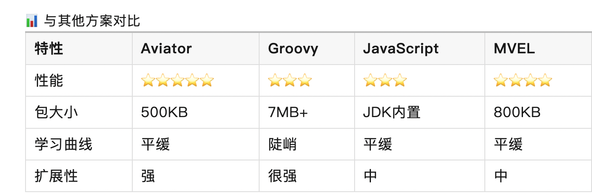
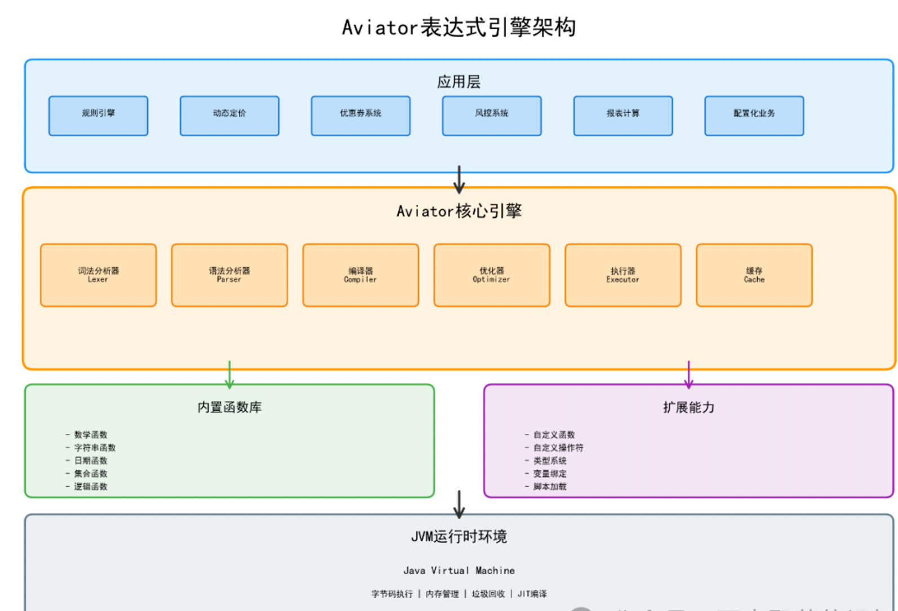
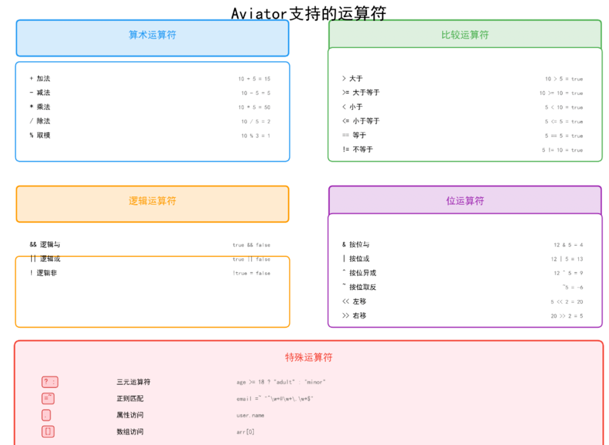
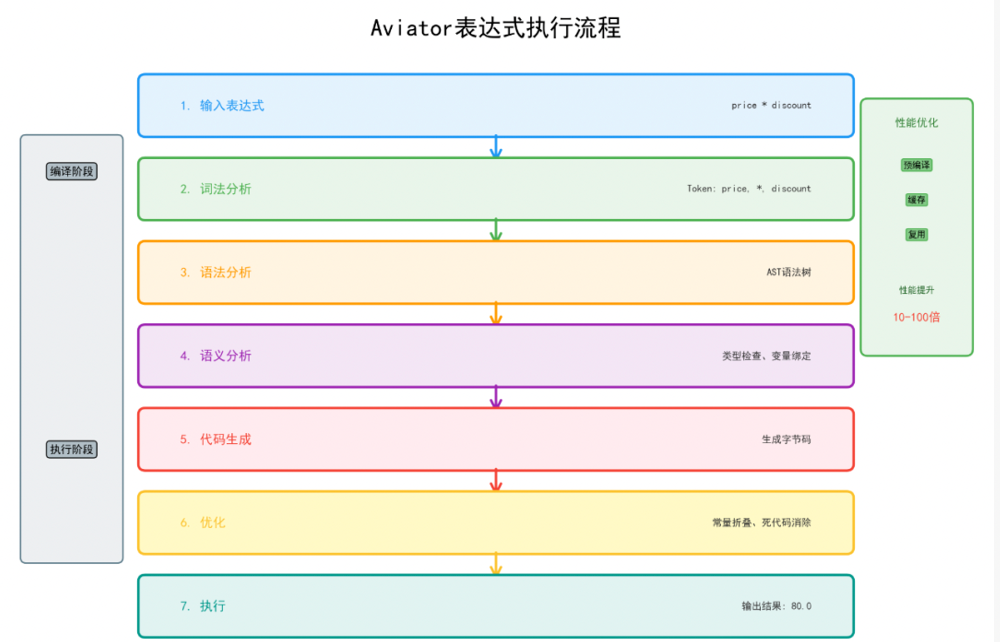
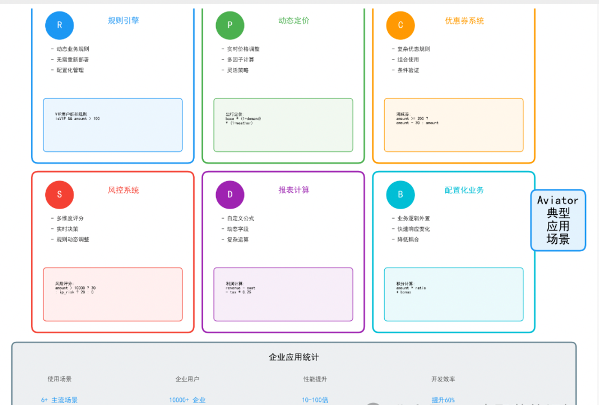
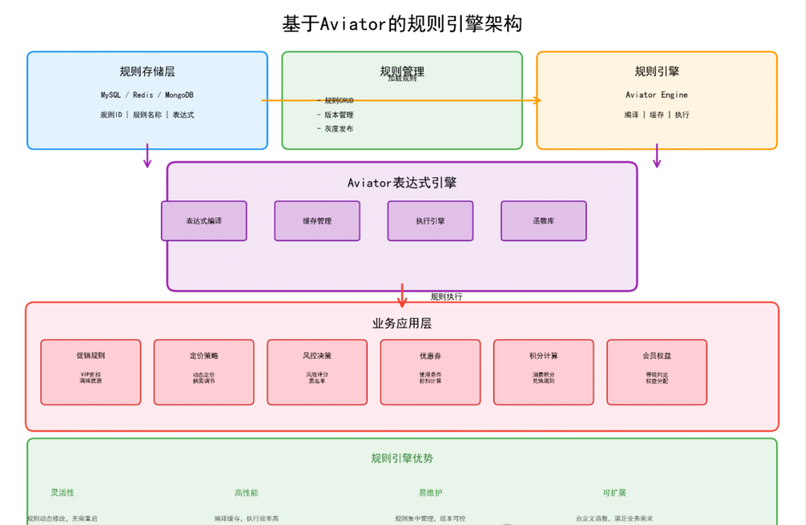
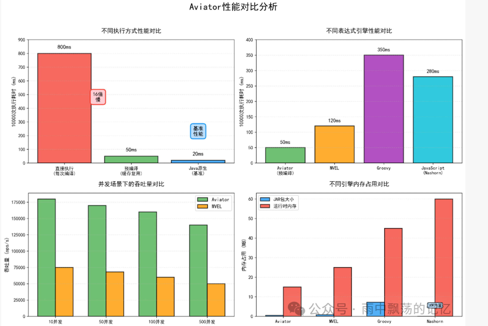
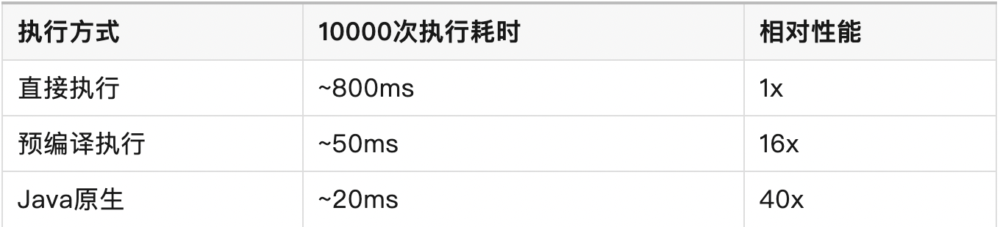
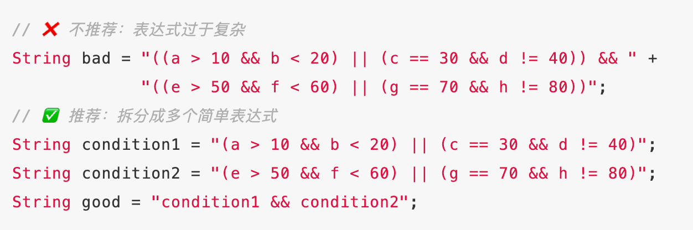

# Aviator表达式引擎实战

## 前言
>> 💡 需要频繁修改业务规则，但每次都要重新编译部署？  
> > 💡 电商促销规则复杂多变，硬编码难以维护？  
> > 💡 需要支持用户自定义计算公式？  
> > 💡 动态定价策略需要灵活配置？

## Aviator是什么
> Aviator是一个轻量级的Java表达式求值引擎，主要特性包括：
> > ✅轻量级 - JAR包仅500KB左右，零依赖  
> > ✅ 高性能 - 编译执行，性能接近Java原生代码  
> > ✅ 功能丰富 - 支持算术运算、逻辑运算、正则表达式、函数调用  
> > ✅ 易扩展 - 支持自定义函数、自定义操作符  
> > ✅ 类型安全 - 支持强类型检查  
> > ✅ 大数运算 - 原生支持BigInteger和BigDecimal





## 快速开始
```
<dependency>    
    <groupId>com.googlecode.aviator</groupId>    
    <artifactId>aviator</artifactId>    
    <version>5.3.3</version>
</dependency>
```

```
import com.googlecode.aviator.AviatorEvaluator;
import java.util.HashMap;
import java.util.Map;
public class AviatorQuickStart {    
    public static void main(String[] args) {        
    // 1. 简单表达式        
    Long result = (Long) AviatorEvaluator.execute("1 + 2 + 3");        
    System.out.println("1 + 2 + 3 = " + result); // 6        
    
    // 2. 带变量的表达式        
    Map<String, Object> env = new HashMap<>();        
    env.put("price", 100);        
    env.put("discount", 0.8);        
    Double finalPrice = (Double) AviatorEvaluator.execute("price * discount", env);        
    System.out.println("最终价格：" + finalPrice); // 80.0       
        
    // 3. 字符串操作        
    env.put("name", "Aviator");        
    String greeting = (String) AviatorEvaluator.execute("'Hello, ' + name + '!'", env);       
    System.out.println(greeting); // Hello, Aviator!        
    
    // 4. 逻辑判断        
    env.put("age", 25);        
    Boolean isAdult = (Boolean) AviatorEvaluator.execute("age >= 18", env);        
    System.out.println("是否成年：" + isAdult); // true    
    }
}
```

## 核心功能详解
> 支持的运算符


>> 算术运算符：+-*/%  
> > 比较运算符：> >= < <= == !=  
> > 逻辑运算符：&& || !  
> > 位运算符：&|^~<<>>  
> > 三元运算符：? :  
> > 正则匹配：=

```
public class OperatorExample {   
     public static void main(String[] args) {        
         Map<String, Object> env = new HashMap<>();        
         // 算术运算        
         System.out.println(AviatorEvaluator.execute("10 + 20 * 3")); // 70        
         
         // 逻辑运算        
         env.put("score", 85);        
         System.out.println(AviatorEvaluator.execute("score >= 60 && score < 90", env)); // true        
         
         // 三元运算符        
         String level = (String) AviatorEvaluator.execute("score >= 90 ? 'A' : score >= 60 ? 'B' : 'C'", env);        System.out.println("等级：" + level); // B        // 正则表达式        env.put("email", "test@example.com");        Boolean isValid = (Boolean) AviatorEvaluator.execute(            "email =~ '^[a-zA-Z0-9]+@[a-zA-Z0-9]+\\.[a-zA-Z]+$'", env);        System.out.println("邮箱格式正确：" + isValid); // true    }}
```

## 内置函数
>> Aviator提供了丰富的内置函数：
```
public class BuiltinFunctionExample {    
    public static void main(String[] args) {        
        Map<String, Object> env = new HashMap<>();        
        // 数学函数       
       System.out.println(AviatorEvaluator.execute("math.abs(-10)")); // 10        
       System.out.println(AviatorEvaluator.execute("math.sqrt(16)")); // 4.0        
       System.out.println(AviatorEvaluator.execute("math.pow(2, 3)")); // 8.0        
       
       // 字符串函数        
       env.put("str", "  Hello World  ");        
       System.out.println(AviatorEvaluator.execute("string.length(str)", env)); // 15        
       System.out.println(AviatorEvaluator.execute("string.trim(str)", env)); // "Hello World"       
        
       // 日期函数        
       env.put("date", new java.util.Date());        
       System.out.println(AviatorEvaluator.execute("date_to_string(date, 'yyyy-MM-dd')", env));        
       
       // 集合函数        
       env.put("list", java.util.Arrays.asList(1, 2, 3, 4, 5));        
       System.out.println(AviatorEvaluator.execute("count(list)", env)); // 5        
       System.out.println(AviatorEvaluator.execute("reduce(list, +, 0)", env)); // 15    
    }
}
```

> 自定义函数
```
import com.googlecode.aviator.runtime.function.AbstractFunction;
import com.googlecode.aviator.runtime.function.FunctionUtils;
import com.googlecode.aviator.runtime.type.AviatorDouble;
import com.googlecode.aviator.runtime.type.AviatorObject;

// 自定义函数：计算圆的面积
public class CircleAreaFunction extends AbstractFunction {    
    @Override public String getName() {        
        return "circleArea";    
    }    
    
    @Override    
    public AviatorObject call(Map<String, Object> env, AviatorObject arg1) {        
        Number radius = FunctionUtils.getNumberValue(arg1, env);        
        double area = Math.PI * radius.doubleValue() * radius.doubleValue();        
        return new AviatorDouble(area);    
    }
}

// 使用自定义函数
public class CustomFunctionExample {    
    public static void main(String[] args) {        
        // 注册自定义函数        
        AviatorEvaluator.addFunction(new CircleAreaFunction());        
        // 调用自定义函数        
        Double area = (Double) AviatorEvaluator.execute("circleArea(5)");        
        System.out.println("半径为5的圆面积：" + area);    
    }
}
```



## 实战应用场景
> 场景1：电商促销规则引擎
> > 在电商系统中，促销规则经常变化。使用Aviator可以将规则配置化，无需修改代码

```
/** * 促销规则引擎 */
public class PromotionRuleEngine {    
    // 规则定义（可从数据库或配置文件读取）    
    private static final Map<String, String> RULES = new HashMap<String, String>() {{        
        put("满减", "totalAmount >= 200 ? totalAmount - 50 : totalAmount");        
        put("折扣", "totalAmount * 0.8");        
        put("会员专享", "isMember && totalAmount >= 100 ? totalAmount * 0.85 : totalAmount");        
        put("新人优惠", "isNewUser ? totalAmount - 20 : totalAmount");        
        put("组合优惠", "totalAmount >= 300 ? (totalAmount - 100) * 0.9 : totalAmount >= 200 ? totalAmount - 50 : totalAmount");    
    }};    
    
    /**     * 计算优惠后价格     */    
    public static double calculate(String ruleName, Map<String, Object> context) {        
        String expression = RULES.get(ruleName);        
        if (expression == null) {            
            return (Double) context.get("totalAmount");        
        }        
        
        return (Double) AviatorEvaluator.execute(expression, context);    
    }    
    
    public static void main(String[] args) {        
        Map<String, Object> context = new HashMap<>();        
        context.put("totalAmount", 250.0);        
        context.put("isMember", true);        
        context.put("isNewUser", false);        
        System.out.println("原价：" + context.get("totalAmount"));        
        System.out.println("满减后：" + calculate("满减", context)); // 200.0        
        System.out.println("会员价：" + calculate("会员专享", context)); // 212.5    
    }}
```

> 场景2：动态定价系统
```
/** * 动态定价引擎 */
public class DynamicPricingEngine {    
    /**     * 定价公式：基础价格 + 供需调整 + 时段调整 + 天气调整     */    
    private static final String PRICING_FORMULA = "basePrice * (1 + demandFactor) * (1 + timeFactor) * (1 + weatherFactor)";   
     
    /**     * 计算实时价格     */    
    public static double calculatePrice(            
        double basePrice,      // 基础价格            
        double demandFactor,   // 供需系数 (-0.3 ~ 0.5)            
        double timeFactor,    // 时段系数 (-0.2 ~ 0.3)            
        double weatherFactor // 天气系数 (-0.1 ~ 0.2)    
    ) {        
         Map<String, Object> env = new HashMap<>();        
         env.put("basePrice", basePrice);        
         env.put("demandFactor", demandFactor);        
         env.put("timeFactor", timeFactor);        
         env.put("weatherFactor", weatherFactor);        
         return (Double) AviatorEvaluator.execute(PRICING_FORMULA, env);    
    }    
    
    public static void main(String[] args) {        
        // 场景1：高峰期 + 高需求 + 好天气        
        double price1 = calculatePrice(100, 0.4, 0.3, 0.1);        
        System.out.println("高峰期价格：" + price1); // 约180元        
        
        // 场景2：低峰期 + 低需求 + 坏天气        
        double price2 = calculatePrice(100, -0.2, -0.15, -0.05);        
        System.out.println("低峰期价格：" + price2); // 约65元    
      }
    }
```


> 场景3：优惠券系统
```
/** * 优惠券规则验证器 */
public class CouponValidator {    
    /**     * 优惠券规则定义     */    
    static class CouponRule {        
        String id;        
        String name;        
        String condition;  // 使用条件        
        String discount;   // 优惠计算        
        
        public CouponRule(String id, String name, String condition, String discount) {            
            this.id = id;            
            this.name = name;            
            this.condition = condition;            
            this.discount = discount;        
          }    
        }    
        
        // 预定义优惠券规则    
        private static final List<CouponRule> COUPON_RULES = Arrays.asList(        
            new CouponRule("C001", "新人专享券", "isNewUser && totalAmount >= 50", "totalAmount - 10"),        
            new CouponRule("C002", "满200减30", "totalAmount >= 200", "totalAmount - 30"),        
            new CouponRule("C003", "会员8折券", "isMember && totalAmount >= 100", "totalAmount * 0.8")    
        );    
        
        /**     * 验证优惠券是否可用     */    
        public static boolean canUse(String couponId, Map<String, Object> context) {        
            CouponRule rule = COUPON_RULES.stream().filter(r -> r.id.equals(couponId)).findFirst().orElse(null);
            if (rule == null) return false;        
            return (Boolean) AviatorEvaluator.execute(rule.condition, context);    
          }
        }
        
```

> 场景4：风控规则引擎
```
/** * 风控规则引擎 */
public class RiskControlEngine {    
    /**     * 风险规则定义     */    
    static class RiskRule {        
        String name;        
        String condition;        
        int riskScore;        
        public RiskRule(String name, String condition, int riskScore) {            
            this.name = name;            
            this.condition = condition;            
            this.riskScore = riskScore;        
          }    
       }    
        
      // 风险规则列表    
      private static final List<RiskRule> RISK_RULES = Arrays.asList(        
          new RiskRule("高额交易", "amount > 10000", 30),        
          new RiskRule("异地登录", "ipCity != userCity", 20),        
          new RiskRule("频繁操作", "todayTransCount > 10", 25),        
          new RiskRule("夜间交易", "hour >= 23 || hour <= 6", 15),        
          new RiskRule("新设备", "isNewDevice == true", 10),        
          new RiskRule("异常IP", "isBlacklistIP == true", 50)    
        );    
          
          /**     * 计算风险评分     */    
          public static int calculateRiskScore(Map<String, Object> context) {        
              int totalScore = 0;        
              for (RiskRule rule : RISK_RULES) {            
                  try {               
                       Boolean matched = (Boolean) AviatorEvaluator.execute(rule.condition, context);                
                       if (matched) {                    
                           totalScore += rule.riskScore;                    
                           System.out.println("触发规则：" + rule.name + " (+" + rule.riskScore + "分)");                
                         }            
                      } catch (Exception e) {                
                          // 规则执行异常，记录日志            
                      }        
                  }        
                  return totalScore;    
              }    
              
              /**     * 判断风险等级     */    
              public static String getRiskLevel(int score) {        
                 if (score >= 60) return "高风险";        
                 if (score >= 30) return "中风险";        
                 return "低风险";    
               }
             }
```



## 性能优化
>> Aviator支持表达式编译，编译后的表达式可以重复使用，大幅提升性能
```
import com.googlecode.aviator.Expression;

public class CompileCacheExample {    
    public static void main(String[] args) {        
        // 方式1：直接执行（每次都解析和编译）        
        long start1 = System.currentTimeMillis();        
        for (int i = 0; i < 10000; i++) {            
            AviatorEvaluator.execute("a + b + c", createEnv(i, i+1, i+2));        
        }        
        
        long time1 = System.currentTimeMillis() - start1;        
        System.out.println("直接执行耗时：" + time1 + "ms");        
        
        // 方式2：预编译（只编译一次，重复使用）        
        Expression exp = AviatorEvaluator.compile("a + b + c");        
        long start2 = System.currentTimeMillis();        
        for (int i = 0; i < 10000; i++) {            
            exp.execute(createEnv(i, i+1, i+2));        
        }        
        
        long time2 = System.currentTimeMillis() - start2;        
        System.out.println("预编译执行耗时：" + time2 + "ms");        
        System.out.println("性能提升：" + (time1 * 100 / time2) + "%");    
      }
    }
```





> 优化建议
> > ✅ 对于重复使用的表达式，务必预编译  
> > ✅ 使用缓存存储编译后的Expression对象  
> > ✅ 避免在循环中重复编译相同表达式  
> > ✅ 复杂表达式考虑拆分成多个简单表达式

##  最佳实践
>> 表达式设计原则


> 异常建议
```
public class ExceptionHandling {    
    public static Object safeExecute(String expression, Map<String, Object> env) {        
        try {            
            return AviatorEvaluator.execute(expression, env);        
        } catch (ExpressionSyntaxErrorException e) {            
            System.err.println("表达式语法错误：" + e.getMessage());            
            return null;        
        } catch (ExpressionRuntimeException e) {            
            System.err.println("表达式运行时错误：" + e.getMessage());            
            return null;        
        } catch (Exception e) {            
            System.err.println("未知错误：" + e.getMessage());            
            return null;        
        }    
      }
    }
```

> 与Spring集成
```
@Configurationpublic 
class AviatorConfig {    
    @Bean    
    public AviatorEvaluatorInstance aviatorEvaluator() {        
        AviatorEvaluatorInstance instance = AviatorEvaluator.newInstance();        
        // 配置选项        
        instance.setOption(Options.OPTIMIZE_LEVEL, AviatorEvaluator.EVAL);        
        instance.setOption(Options.TRACE_EVAL, false);        
        // 注册自定义函数        
        instance.addFunction(new CircleAreaFunction());        
        return instance;    
      }
    }
    
    @Service
    public class RuleService {    
        @Autowired    
        private AviatorEvaluatorInstance aviator;  
          
        public Object executeRule(String expression, Map<String, Object> context) {        
            return aviator.execute(expression, context);    
          }
        }
```

## 总结
>Aviator表达式引擎是一个功能强大、性能优秀的工具，特别适合以下场景：
>>  ✅ 规则引擎 - 将业务规则配置化  
> > ✅ 动态计算 - 支持运行时修改计算公式  
> > ✅ 表达式求值 - 替代复杂的if-else逻辑  
> > ✅ 脚本执行 - 轻量级脚本引擎


