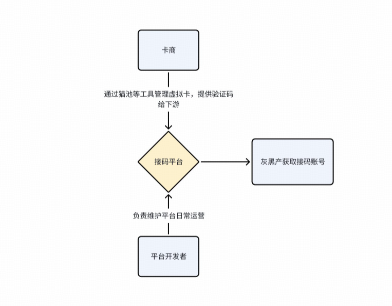
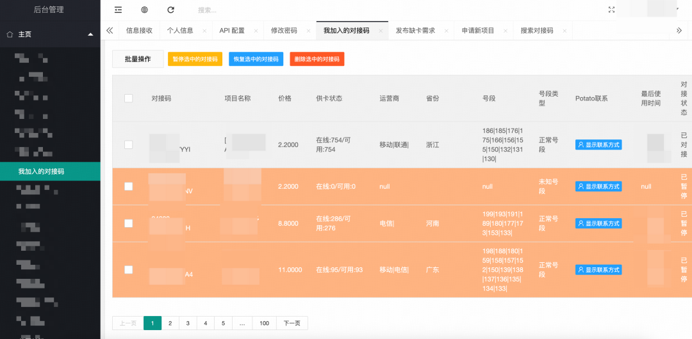
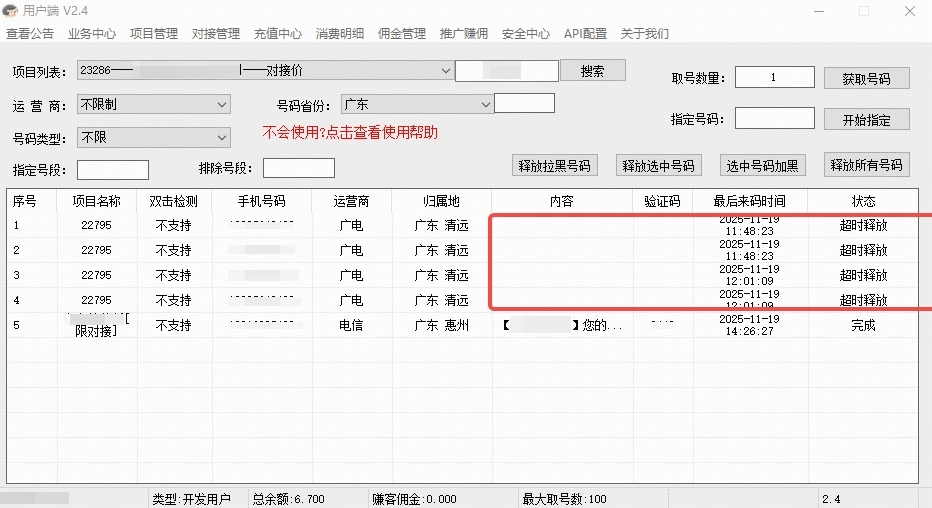
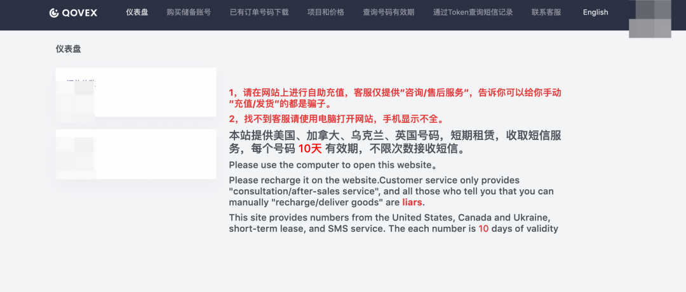
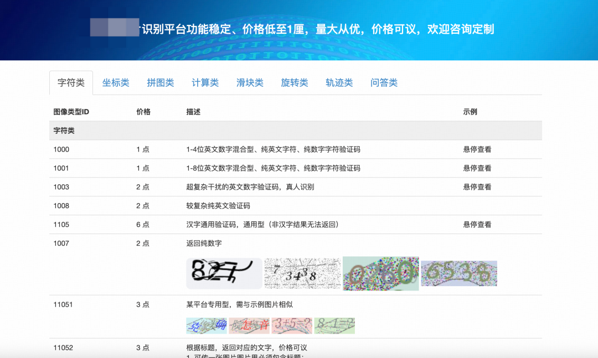
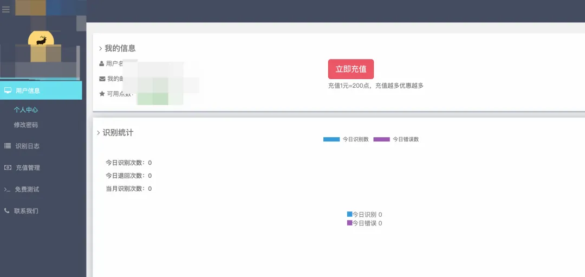
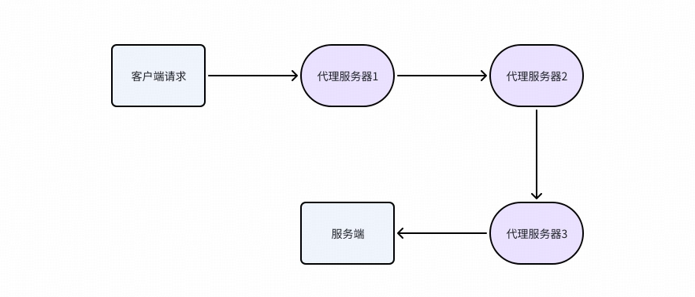
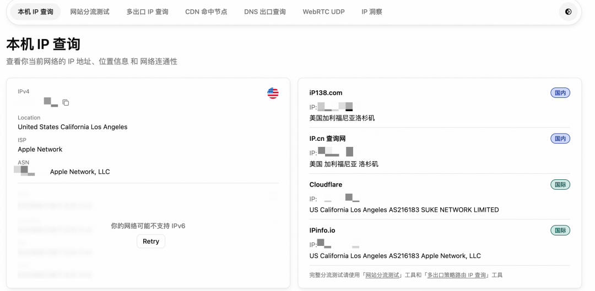

# 风控基建实战：灰黑产常用工具实测

> 1. 前言
>> 平台风控团队不仅要打击现有灰黑产行为，更要持续监测其技术演进，掌握攻击手段与工具特征，才能在攻防对抗中占据主动，实现长效治理。  
> > 本文将聚焦灰黑产链路中常用工具，进行部分实测并给出防控方法

> 2.接码平台
>> 场景解析:
>> 电商场景，薅羊毛行为始于“垃圾注册”，接码平台的核心原理是为卡商和需求方提供交易与技术服务，卡商在此出售接码号，需求方可通过平台获取；  
> > 同时平台提供自动化验证码接收与分发功能，形成无需绑定本人实名手机号的验证闭环，进而绕开电商平台的手机号核验机制

>> 接码号存在多种类型，本文仅选取两类介绍：实卡接码号指的是通过实体SIM卡接收短信验证码的服务，常用于网络平台账号注册等场景。  
> > 这类服务通常由接码平台提供，平台会对接多家运营商的实卡资源，用户可按需获取临时手机号接收验证码；  
> > 虚拟接码号，通过在线平台提供的临时或虚拟手机号码，主要用于接收短信验证码，以替代真实手机号码进行在线服务注册、身份验证等操作

>> 灰黑产通过接码平台大量获取接码号后，进行批量注册平台账号，进而获取平台新人优惠，参与各类营销活动，获取商品或优惠权益后再进行变现

>> 1.价格对比：海外接码号价格一般低于国内接码号

>> 2.注册成功率：接码号在电商平台注册/登录成功率一般在10%-20%

>> 3.易用度：各平台基本可完成自助化使用接码号，上手难度低

> 防控方法:
> > 1.通过情报识别：风险手机号画像、风险IP、高风险设备等

>> 2.注册识别策略：通过离线/实时策略，识别高危注册风险

>> 3.通过模型识别：通过聚类算法、图算法等识别团伙注册

> 3. 打码平台
>> 场景解析
>> 打码平台是一种基于云计算技术的在线服务系统，主要功能是识别和破解验证码（CAPTCHA），以协助自动化程序绕过人机验证机制。其核心工作原理是接收验证码图片或数据，通过分布式计算资源（包括人工智能算法和人工校正团队）进行快速识别，并将结果返回给用户

>> 这类平台一般为付费或会员制，用户按识别次数付费，部分平台还提供开发者分成计划以吸引集成者。行业竞争促使技术不断迭代，AI的发展也为打码平台提供便利，通过引入人工智能（如图像识别、神经网络）提升机器打码准确率，对于电商平台的安全性带来更大的风险，对抗手段也升级成AI对抗AI

>> 实测分析:

>> 打码成功率：打码平台验证码成功率一般在50%-60%左右

>> 平台成功率：可通过市面上较多平台的验证码

>> 防控方法:
>>>> 1.升级验证码类型：周期性升级验证码样式类型，滑动式、旋转式、拖动式等

>>>> 2.更新图库：借助AI能力，定期更换验证码图片样式

>>>> 3.借助AI模型识别风险：通过AI模型识别过验轨迹，识别是否真人

> 4.代理IP
>> 场景解析
> > 代理是一种很常见的网络技术，各种形式的代理在今天的电商场景发挥着重要作用。

>> 隐藏真实IP地址：通过使用代理IP，可以隐藏真实的网络请求来源，保护用户隐私。

>> 绕过网络限制：一些地区或网络环境可能存在访问限制，通过使用代理IP可以绕过这些限制，例如访问被屏蔽的网站

>> 加速网络访问：一些代理服务器可能具有缓存功能，可以加速对某些资源的访问速度，节省带宽和时间

>> 数据挖掘：在进行大规模数据爬取时，使用代理IP可以避免被目标网站封禁或反爬虫机制限制，从而更好地获取所需数据

>> 灰黑产为了突破平台的各类风控限制策略（例如IP黑名单、IP频控等），经常会使用代理IP，通过代理IP伪造请求IP头，使得平台无法锁定自己的攻击意图，从而在平台发现自己之前完成获利行为

>> 国内代理以国内VPN
>> 利用国外VPN，伪造IP地址，通常可能用于欺诈等场景

>> 防控方法
> > 建立风险IP库：各场景风险汇总，建立平台IP风险库，完善IP风险画像

> 5.群控设备
>> 场景解析
>> 群控是一种通过一台计算机控制多部手机，实现同步操作的技术。其核心在于使用真实手机或模拟环境，借助脚本软件自动化模拟用户行为，达到吸粉、引流、广告、薅羊毛等目的

>> 早期的群控系统主要应用于微信营销，为微商服务；随着电商app拉新、营销、直播的业务发展，越来越多的灰黑产使用真机群控来薅羊毛、刷单、刷流量等作弊行为，近似达成一个操作人员模拟上百人的行为目的

>> 防控方法:
>> 增强端防能力：识别异常设备特征，准确识别群控设备

>  写到最后
>> 随着AI及模型的技术发展，业务架构与交易链路不断复杂化，客观上也为灰黑产提供了更隐蔽的获利空间。唯有持续推进风控与检测技术的同步迭代，构建前置化、体系化的风险别与响应能力，才能在风险暴露前实现有效拦截，真正做到风险可控、防患于未然

