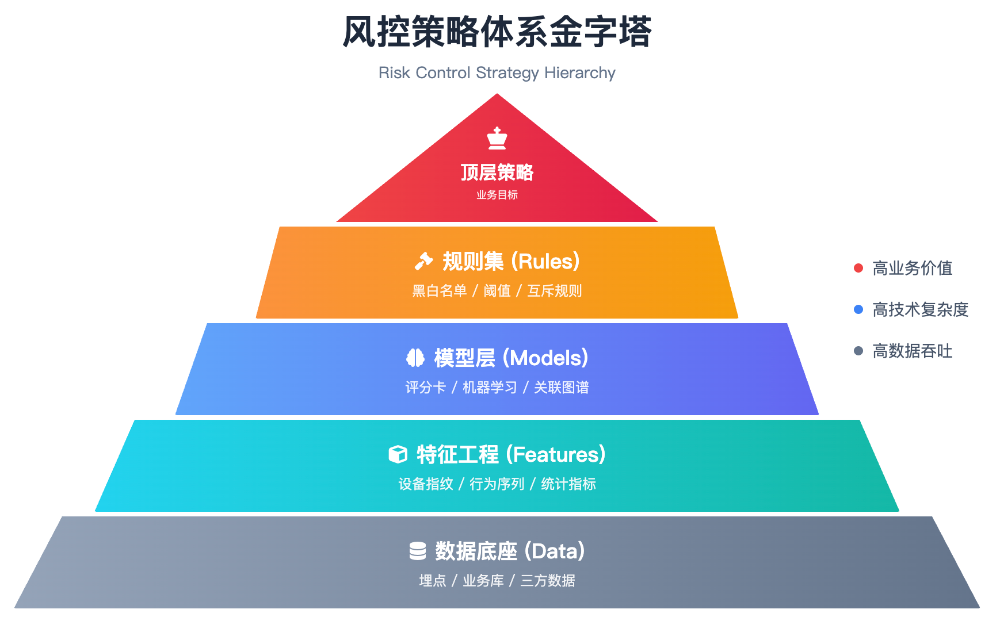
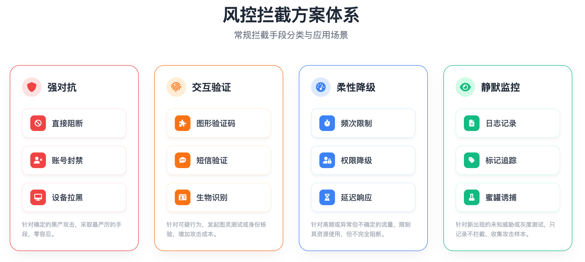
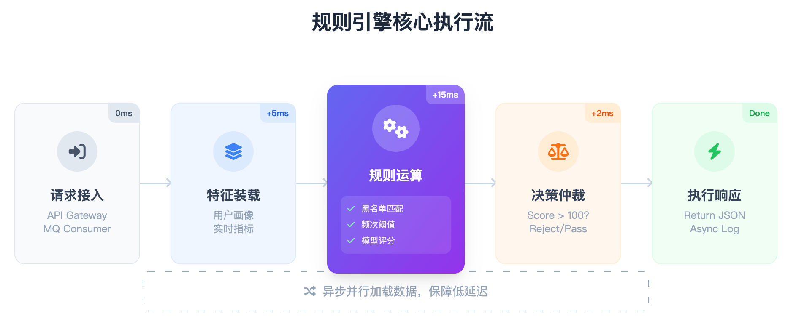
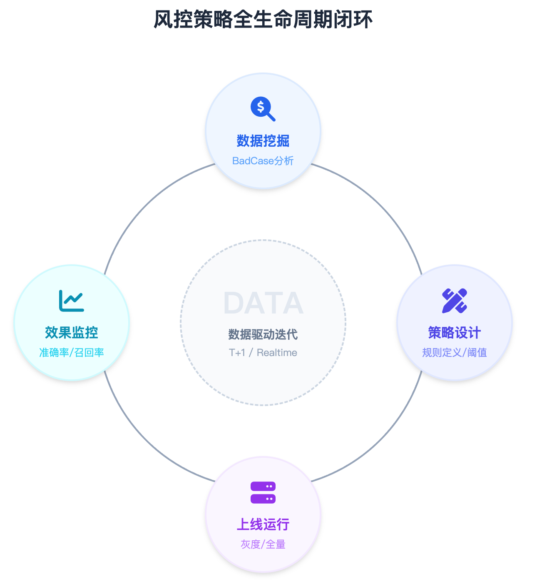

# 风控的策略与规则设计

>> 风控的本质，是与黑产争夺时间
> >
> > 黑产秒级攻击，代码发布却是天级。硬编码的逻辑是枷锁。必须实现策略与规则的动态编排
> >

> 1.策略设计
> >
> > 策略不是凭空想象的，它源于对业务场景的深度解构，遵循从宏观意图到微观特征的推演逻辑
> >
> > 场景定义:
> >
> > 第一步永远是明确坏人想干什么。攻击者的目的不同，行为模式就完全不同
> >
> > 如果是为了薅羊毛，他们会批量注册新号，领取优惠券；如果是为了撞库，他们会使用泄露的密码库，对大量账号进行高频尝试；如果是为了爬数据，他们会遍历接口，抓取核心资产
> >
> > 只有定义了场景，防御才能有的放矢
> >
> > 特征锚点:
> >
> > 坏人也是人，或者是由人控制的机器。只要是作恶，必有痕迹。我们要做的，就是找到那个异于常人的点
> >
> > 频率：正常人一分钟登录 1 次，他登录 100 次。
> >
> > 聚集：正常用户分布在全国各地，这批用户全在同一个 IP 段或使用同一款设备型号
> >
> > 偏离：正常用户在白天活跃，他只在凌晨 3 点批量操作；正常用户购买日用品，他只买黄金等硬通货
> >


>> 拦截逻辑:
> >
> > 找到特征后，必须制定拦截策略。 如果是撞库，核心是验；如果是爬虫，核心是限。 策略指明了方向，但具体拿什么去拦？这就需要设计对应的拦截方案
> >
> > 拦截方案:
> >
> > 策略是找目标，方案是选武器。 面对千变万化的攻击，我们将拦截体系分为四个层级
> >
> > 1.风控拦截方案



>> 1.1 强对抗
> >
> > 对确定的坏人，零容忍
> >
> > > 手段：直接阻断、账号封禁、设备拉黑。
> > >
> > > 核心：黑名单体系
>>
> > 1.2 交互验证
> > 对可疑的请求，发起挑战
> >
> > > 手段：图形验证码、短信验证、人脸识别
> > >
> > > 核心：图灵测试
>>
> > 1.3 柔性降级
> >
> > 对高频但未定性的流量，限制资源
> > > 手段：频次限制、权限降级、延迟响应
> > >
> > > 核心：滑动窗口
>>
>> 1.4 静默监控
> >
> > 对未知的新型威胁，暗中观察
> > > 手段：日志记录、标记追踪、蜜罐诱捕
> > >
> > > 核心：数据积累

>> 2.规则三要素
>>
> > 方案是宏观的战术，规则是微观的执行
> >
> > 所有的拦截方案，最终都要落地为一条条具体的规则。一条完整的规则，由变量、逻辑、阈值三部分组成
> >
> > 2.1 变量
> >
> > 静态数据只是皮毛，动态指标才是灵魂
> >
> > 核心利器是滑动窗口
> >
> > > 对象：IP、设备、账号。
> > >
> > > 窗口：1 分钟、1 小时、1 天
> > >
> > > 动作：注册、登录、交易
> > >
>  >
> > 组合起来，就是 1 小时内同一 IP 的注册次数。这就是变量
>>
> > 2.2 逻辑
> >
> > 有了变量，必须通过逻辑进行编排。 不要硬编码。硬编码是死胡同，改一次发一次版，黄花菜都凉了。
> >
> > 要用规则引擎。 通过 Drools 或 Aviator，把业务逻辑变成配置项。 运营人员在后台点一点，规则秒级生效

```
// Drools 规则示例
rule "IP_High_Freq"
    when
        // 过去 1 小时内，该 IP 的注册次数 > 50
        $count : Long( intValue > 50 ) from accumulate (
            RegistrationEvent( ip == $ip ) over window:time( 1h ),
            count(1)
        )
    then
        // 命中规则，执行阻断
        RiskContext.block($evt, "IP_HIGH_FREQ");
end
```

>> 风控规则引擎执行流程



>> 2.3 阈值 (Thresholds)
> >
> > 逻辑决定方向，阈值决定生死。 那个50是怎么来的？绝不是拍脑袋。
> >
> > 它需要通过历史数据的反复回溯，以及线上灰度的长期观察，才能找到那个既能拦截黑产、又不误伤用户的完美平衡点
> >
> > 2.4 策略迭代
> >
> > 规则不是写完就结束了，这只是开始。 黑产在变，策略必须跟着变。 需要建立一套完整的动态闭环体系
>>
> > 风控策略全生命周期闭环


>> 3.离线回溯
> >
> > 上线前，把规则扔进历史数据里跑一遍
> >
> >目的：评估如果昨天上了这条规则，会拦住多少人？
> >
> > 产出：规则的基准阈值
> >

>> 4.灰度观察
> >
> > 上线初，开启只报警不拦截模式
> >
> > 目的：验证准确率和召回率
> >
> > 产出：确认无误伤的置信度


>> 5.正式拦截
> >
> > 数据达标后，开启拦截模式
> >
> > 目的：实时阻断攻击
> >
> > 产出：拦截日志与黑名单

>> 6.效果评估
> >
> > 持续监控 BadCase（漏拦与误拦）
> >
> > 目的：发现新特征或调整旧阈值
> >
> > 动作：进入下一轮循环

> 写在最后
> >
> > 规则是消耗品。黑产一变，规则就得扔
> >
> > 在这个战场上，唯一增值的资产，是对业务的理解
> >
> > 其他的，都是成本


